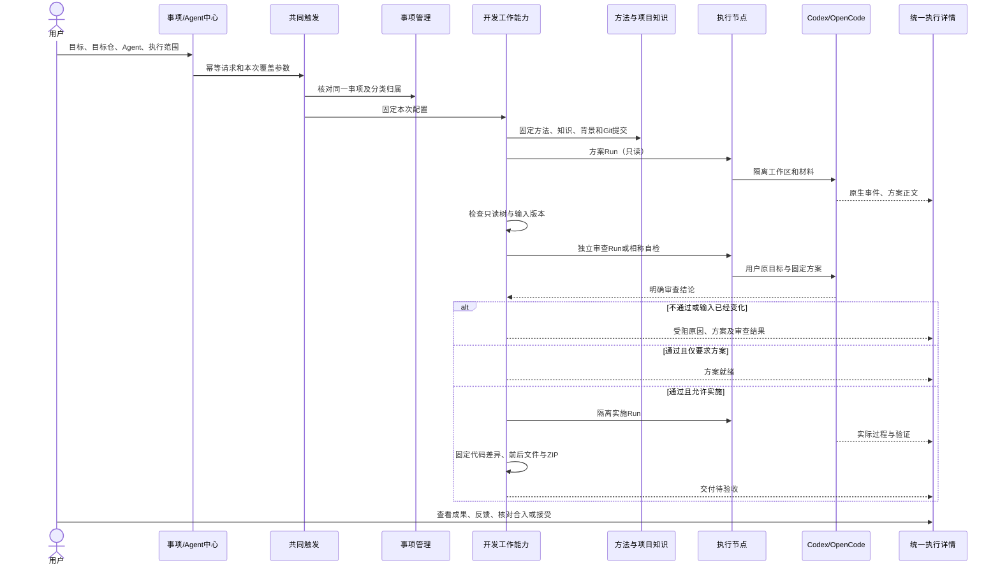
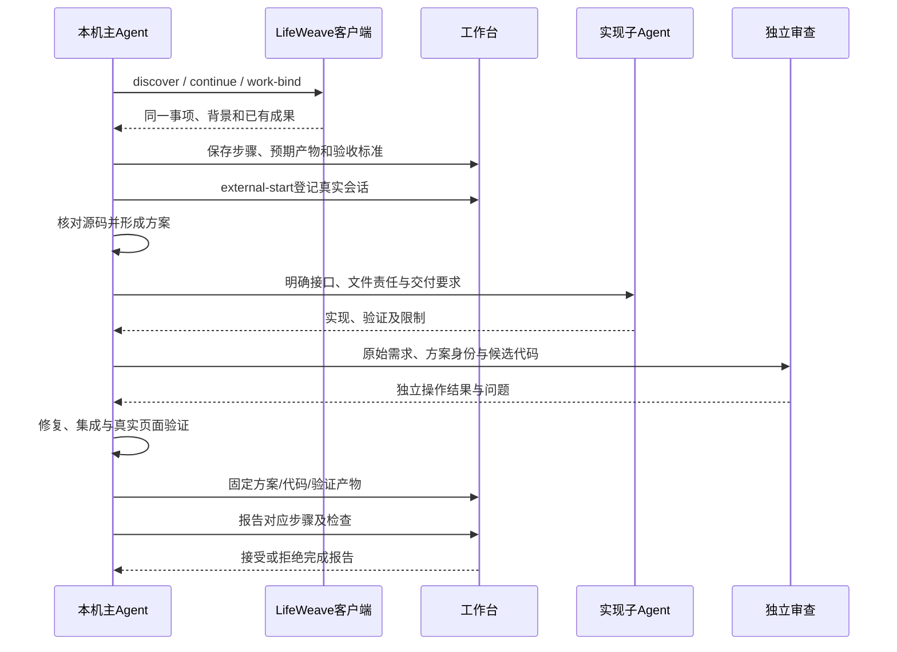

# Agent 怎样承接、执行和交付一件事

LifeWeave 的 Agent 是一套可触发的工作配置：它选择已有能力、方法和运行环境。事项保存用户目标；步骤计划说明如何推进；一次执行记录这次实际用了什么、做了什么和交付了什么。把这几层分开，才能让同一事项在网页或本机接续，也能换模型而不丢失目标与成果。

本文以当前工程为依据。Agent 中心与事项整理已落地；本轮验证及独立审查证据在[本轮方案与交付](../workspaces/reviews/item-stewardship-and-agent-center/review.md)。

## 上一轮究竟是谁做的

“事项工作区：统一步骤图与成果阅读”（`item-7547b65b4f704829`）由当前本机 Codex 对话组织并调用子 Agent 实施，随后通过正式客户端登记阶段、固定代码包与验证证据。2026-09-28 查证该事项没有受管开发委托、没有平台 Run；有三个外部会话登记、29 条主动阶段报告，当前没有 Hook 元事件。

这些记录关联了 `development` 身份和 `lifeweave-development` 方法版本，但关联标签与已加载方法不是“平台开发 Agent 全程调度”的证明。它们能证明具体报告、Git 观察和固定产物，不能重建未采集的全部操作。之前“开发 Agent 双入口与 Notion 知识联动”另有真实受管开发委托；不能把那个事项的验证套在这次工作区改造上。

本轮同样由主 Agent 负责设计、集成与交付，GPT-6 Sol 极高思考负责三个明确的实现包。它是一条实际登记到平台的外部开发流程。另有独立的真实平台验证：从 Agent 中心发起小仓 README 修改，经过方案、独立审阅、隔离实施和固定 ZIP，处于待用户审阅；这项验证不能倒推本轮整个平台代码都由受管 Agent 执行。新增中心将受管任务和外部工作放到同一个查询入口，保留各自来源和控制边界。

## 每个对象负责什么

| 对象 | 回答的问题 | 正式落点 |
|---|---|---|
| 事项 | 为什么做，目标是什么，属于哪个专题/领域或父目标 | item、context、relation |
| 步骤计划 | 本次有哪几步，每步交付什么，怎样判断完成 | 版本化 workPlan、step report |
| Agent 配置 | 使用什么能力、方法、默认执行器和模型 | Agent registry，引用既有插件和方法 |
| 能力插件 | 实际完成哪一类行为，调用了哪些组件 | PluginRegistry / PluginHost |
| 方法 | 执行应该遵守什么步骤与要求 | TaskSources 固定版本的 SKILL.md 和支持文件 |
| 运行时 | 用 Codex 或 OpenCode 怎样启动工具循环 | executor、worker、隔离目录 |
| 一次执行 | 这一次的参数、状态、事件、输入和结果是什么 | 受管开发委托及 Run，或外部 session，或整理操作 |
| 固定产物 | 当时具体交付了什么，后来还能不能读到同一版 | 固定成果、文件目录、ZIP、证据 |

Agent 名称不是新的模型协议，也不是每个 Agent 一份完整后端。注册新 Agent 时绑定已有可执行能力；新的业务能力本身仍需通过插件实现和验证。运行时的认证信息不进入 Agent 普通配置。

## 网页受管开发的实际顺序

开发能力的业务编排在 `DevelopmentService.create/_stage_run/advance`。方案阶段要求写清用户看到的行为、模块与接口、实施顺序、风险、验证和知识变化。复杂任务用独立审查 Run，明确 `REVIEW_DECISION: PASS` 才继续；轻量改动可以自检。只读阶段结束后还检查隔离树没有被改动，并核对输入版本没有漂移。OpenCode 目前正因为该边界尚未通过而暂停受管开发，不能仅凭 CLI 已安装就启用。

实施运行在目标提交建立的隔离工作区中，不自动包含原仓未提交改动。代码变更需形成固定交付包；交付包生成失败是失败状态，不因模型返回成功就显示完成。交付默认待用户审阅，隔离代码还需要核对并合入正式仓；Run 成功、代码已合入、证据已接受、事项完成是不同事实。

## 当前 Codex 对话怎样按同一流程工作

这条路径不会再拉起一个受管模型进程来冒充正在说话的主 Agent。主 Agent 必须实际读取方法、开展相称方案审查、登记代码与验证；工作台检查步骤报告是否带有同事项、固定可读且类型相符的必需产物。旧计划版本和无产物的“完成”只留作尝试，不能覆盖当前进展。

外部会话是接入协议，不是远程控制器。未接入的外部 Agent 无法被自动发现。支持且受信任的 Hook 可以补充元事件，但没有原始命令和工具输出时，页面必须说明。接入者自称“检查通过”仍需要实际证据，平台不能凭文字独立验证全部开发质量。

## 从哪里选择 Agent、运行时和模型

当前入口是 **Agent 中心 → Agents**：查看内置与注册配置、默认方法、运行时和模型，修改后持久保存。派发时先选已有事项，再选择 Agent，可对本次执行覆盖参数。事项里的委托入口调用同一个触发组件与服务；开发配置保留专项方案、审查、目标仓和交付控制。

**Agent 中心 → 执行记录** 汇总开发组合、独立 Run、外部会话和事项整理操作。开发的方案/审查/实施 Run 嵌在同一组合里，避免在列表重复出现三项。详情显示固定配置、输入、事件、成果和错误，进行中的状态自动刷新；历史默认值改变不会改写旧执行。

目前 Codex 采用本机已有 CLI 登录；OpenCode 配置和认证仍由对应本机 CLI 管理。连接页的执行设置显示真实就绪状态与限制。Agent 的 `model` 字段只选择模型，不是 API Key；不得把密钥贴入指令、Agent 描述、普通 JSON 或工作记录。当前没有任意提供商 API Key 的通用网页保险库，页面不能声称已经保存或配置不存在的连接。

## 所有 Agent 怎样组织事项

建项和组织由共同服务维护，不靠每个前端复制关系。入口先决定接续、子项或独立新目标；子项继承父项的专题/领域，明确分类优先。已有匹配规则只在适用范围给出分类，不能因标题相似就把两个工作静默合并。

Agent 可以读取现有事项/分类，结合目标提交带理由的建议。组织服务保存前后差异，验证空间、版本、唯一父级和无环关系，再原子应用。聚合会创建共同目标，把原事项作为子项保留；它不是删除旧数据。后续撤销只撤销本次组织关系，不能覆盖新成果和新进展。

语义判断仍由实际调用者或模型负责；规则继承只是确定性能力。这一版不会假称规则可以理解任意人生事项，也不会在用户无感时修改人工确定的归属。

## 设计已覆盖什么，仍有什么差距

| 问题 | 当前可依赖的机制 | 仍需实际验证或后续建设 |
|---|---|---|
| 不知道谁在做 | 固定 Agent 配置、真实执行来源与共同目录 | 完全未接入的外部 Agent 不能自动发现 |
| 不知道用了什么上下文 | 事项背景、方法、知识与Git提交快照 | 快照存在不能证明模型实际使用每条材料 |
| 不知道是否走方案与审查 | 受管开发按状态编排，失败守卫；外部按相同业务步骤报告 | 外部进程不能仅靠登记被强制约束全部工具行为 |
| 步骤说完成但没产物 | 必需产物类型、归属、版本及检查门禁 | 平台不能自动理解并证明全部业务结论正确 |
| 历史日志淹没结果 | 默认当前有效交付，事件按需下钻，完整已采集轨迹保留 | 历史未采集内容不能重建 |
| 事项越来越乱 | 公共归属、继承、规则和有理由的可撤销整理 | 全自动语义发现/长期定时整理由后续真实使用驱动 |
| 不同Agent选型不清 | 配置与每次覆盖分离，运行环境就绪提示 | 第二条受管开发执行路径仍受OpenCode边界限制 |

本轮建设不等于平台已经成为无需监督的全能开发者。它把现有能执行的能力变得可选择、可看见、可接续，也把尚未实现或无法观测的部分放到准确位置。

## 本轮真实开发验证与模型配置边界

新中心在正式本机服务创建了“Agent 中心真实开发链验证”，继承本轮父事项的专题与领域。首次在派发中指定 `gpt-6-sol`，本机 Codex CLI 的 ChatGPT 账号返回“不支持该模型”并停止方案阶段；失败保留可查。再次留空模型，使用本机配置，完成三个真实阶段和固定交付：只修改小仓 README 的运行说明，主 Agent 另行运行 `python hello.py` 核对输出，ZIP 哈希与服务记录一致。原仓和 `hello.py` 均未修改，没有替用户点击接受。

此处运行环境记录的 effectiveModel 为 `gpt-6-astra`、CLI 为 `codex-cli 0.154.0`；这是传给执行器的配置证据，不是上游返回的模型身份认证。主会话调用的 Sol 子 Agent 与产品中的本机 CLI 使用不同调用入口，不能从前者可用推断后者账号必然支持同名模型。[官方 Codex 模型说明](https://developers.openai.com/codex/models/)可用于配置参考；本轮账号可用范围以保留的真实运行结果为准。

这次真实重试还发现自动三阶段计划会把新方案和审阅误挂到实施节点。现已用真实成功 Run 的固定产物，通过正式步骤报告接口补正显示，旧失败和旧报告保留；自动绑定已修复并经过失败重试与用户自定义步骤的独立数据库回归。

验证只覆盖有界小仓任务，不证明任意复杂工程都能自主完成。任务入口、固定输入、阶段结果、差异包和失败均可在 Agent 中心及所属事项读取；详情长输入和原始事件按需展开，历史未采集内容不能补造。
