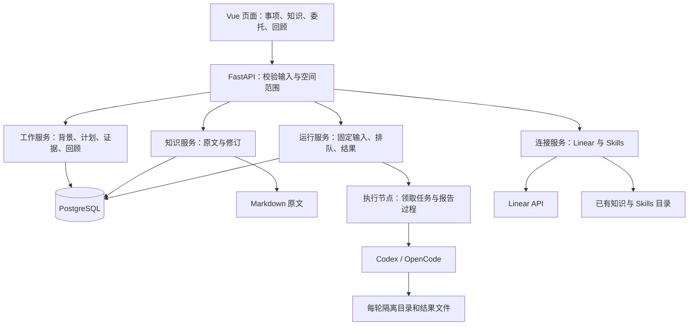
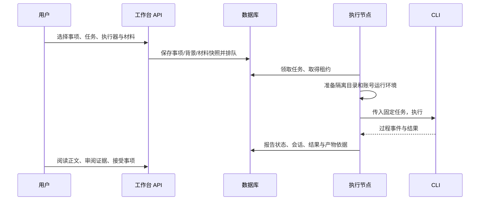

# 架构与关键实现

## 系统怎样分工

LifeWeave 是一个独立的模块化单体：Vue 页面处理交互，FastAPI 接收操作并协调业务模块，PostgreSQL 保存工作事实，Markdown 保存知识正文，本机执行节点调用已经安装的 CLI。启动应用不需要运行 Omni-Brain 或连接质检数据库。

程序集成入口在 [src/api/app.py](../src/api/app.py)。它创建数据库连接、工作服务、知识服务、执行器和外部连接；启动时恢复过期租约并启动已启用的本机节点，退出时关闭节点和连接池。生产构建的 Vue 静态文件也由这个进程提供。

当前 Python、Vue、数据库与执行材料统一使用 LifeWeave 命名；历史入口兼容见 [命名说明](naming.md)。

| 职责 | 主要代码入口 |
| --- | --- |
| 页面路由与整体导航 | [router/index.ts](../web/src/app/router/index.ts)、[LifeWeaveShell.vue](../web/src/features/lifeweave/components/LifeWeaveShell.vue) |
| 跨页面工作状态和操作 | [useLifeWeaveWorkspace.ts](../web/src/features/lifeweave/composables/useLifeWeaveWorkspace.ts)、[API 客户端](../web/src/features/lifeweave/api/lifeweave.ts) |
| 工作规则与数据库读写 | [工作服务](../src/lifeweave/service.py)、[工作 Repository](../src/lifeweave/repository.py)、[请求模型](../src/lifeweave/models.py) |
| 知识全文与候选修改 | [library.py](../src/lifeweave_knowledge/library.py)、[KnowledgePage.vue](../web/src/features/lifeweave/pages/KnowledgePage.vue) |
| 委托创建、重试和记录 | [运行服务](../src/lifeweave_runtime/service.py)、[运行 Repository](../src/lifeweave_runtime/repository.py) |
| 本机节点与 CLI 执行 | [local_workers.py](../src/lifeweave_runtime/local_workers.py)、[worker.py](../src/lifeweave_runtime/worker.py)、[执行器接口](../src/agent_runtime/executor.py) |
| 方法材料与 Linear | [task_sources.py](../src/integrations/task_sources.py)、[linear.py](../src/integrations/linear.py) |

## 数据分别保存在哪里

PostgreSQL 的 `workbench` schema 保存以下对象。完整字段以 [migrations](../migrations) 为准；此表解释职责，不复制所有列。

| 数据组 | 保存内容 | 事实边界 |
| --- | --- | --- |
| item / entity / relation | 事项、想法、专题、资源、成果及关联 | 事项保存执行安排；资料可以被引用，不必变成事项 |
| context / context_version / context_proposal | 当前背景指针、背景版本、修改提案 | 当前指针指向已接受版本；候选不是当前事实 |
| evidence / discussion / activity | 核验依据、讨论、进展记录 | 证据接受与事项完成分开，保留原因和来源 |
| meeting / snapshot / note / preference | 回顾配置、冻结内容、会议记录、偏好 | 冻结内容用于解释历史，不随当前背景更新 |
| machine / run / run_event | 执行节点、输入快照、尝试、事件、结果 | 运行状态是技术事实，不自动替代业务接受 |
| document_revision / library_source | Markdown 候选、源指纹、外部目录登记 | 正式知识原文仍在文件中 |
| linear_binding / linear_publication | 来源关联、远端快照、发送预览和核对状态 | 本地事项和 Linear 状态不做自动覆盖 |
| capability / capability_verification | 已复用的能力候选与验证记录 | 属于维护中心的能力治理入口，不代表所有 Skills 已验证 |

`.runtime/knowledge/{personal,team}` 保存本机知识原文；外部资料仍留在登记目录。`.runtime/executions/{space}/{run}/` 保存该轮工作目录、账号运行副本和产物。方法连接配置、本机节点设置、Linear 连接配置也在 `.runtime/`，不会提交到 Git。

结构化业务对象常用 JSONB 保存有差异的内容，避免为每种学习或生活事项提前设计独立表。代价是字段语义主要由 Service 和页面适配器约束；扩展公共字段时需要同时检查输入校验、持久化与多个页面，不能只改显示名称。

## 一次事项修改怎样生效

页面通过共享 API 客户端发送明确空间和对象 ID。Router 用 Pydantic 校验请求，Service 检查业务规则，Repository 执行 SQL。普通编辑带当前版本，数据库更新使用期望版本条件；版本过时返回冲突，而不是覆盖新内容。

背景修订另有提案流程。接受提案时更新版本和当前指针，之后列表、详情及实时回顾加载已接受内容。列表不能只读取事项初始 `payload`，否则新目标只在详情显示；这曾是实际发现并修复的问题。回顾会把当前目标、范围等放入阅读投影，冻结则保存当次投影。

子事项的委托背景从 [current_context_snapshot](../src/lifeweave/service.py) 组装，包含共享背景与本次局部目标。修改这个方法时，必须检查根事项和子事项，防止 AI 只得到父目标或只得到孤立的子标题。

## 一次 AI 委托怎样完成

创建委托时，[运行服务](../src/lifeweave_runtime/service.py) 读取事项的当前背景，把输入固定到运行记录。不指定工程时使用空白任务目录；指定工程时读取 Git 提交身份，执行节点创建独立 worktree，未提交修改不会自动进入。改动产物也不会自动合并回原仓。

一次可显式选择一项 Skill 和最多 10 篇知识。`TaskSources` 固定正文、来源指纹和方法支持文件；重试时保留这些已选输入。方法及支持文件合计最多 100 个文件、1 MB，选定材料主正文（含 Skill 主文件）合计最多 2 MB；具体限制和失败提示见 [snapshot 实现](../src/integrations/task_sources.py)。这与维护中心的能力发布机制是两个来源入口，运行时共同形成材料快照。

执行节点按租约领取任务，记录心跳、事件序号和报告。执行器适配层把统一请求转为 Codex/OpenCode CLI 参数，解析过程与结果。本机两空间各有可选节点；团队使用当前本机账号必须显式启用。远程/Docker 协议存在，但本机部署没有提供已经验收的远程集群。

失败、取消和不可用状态保存到同一运行记录。界面的“按当前背景再试”建立关联的新尝试，并取当前背景；它不是恢复原生 CLI 会话。运行的原生会话 ID 用于追溯。源码链接只读取该轮受控目录内允许类型的文本文件，不把任意路径开放给浏览器。

## 知识修改为什么不会静默替换正文

[Library](../src/lifeweave_knowledge/library.py) 每次读取实际文件并计算指纹。提出修改时保存基准指纹、原文、候选正文和原因，页面显示差异；接受时锁定修订记录，重新核对文件指纹，再替换文件并更新状态。若用户已在编辑器里修改了源文件，接受会报冲突。

本机受管原文使用临时文件和原子替换；数据库操作发生 Python 异常时尝试恢复原文。文件系统与数据库不是同一个事务，进程或机器恰在两者之间崩溃的恢复仍有限，不能宣称分布式原子提交。外部来源的修订可以下载，但不能通过该入口覆盖原仓。

路径读取会核验所属空间、登记来源和根目录，拒绝越界及不允许的隐藏/raw 路径。页面用 Marked 渲染、DOMPurify 清理 HTML，并对中文相对 Markdown 链接做一次解码和根范围校验；源码行号链接先转换成受控读取地址，再清理 HTML。

## Linear 的读写怎样保持可解释

首次引入用空间与远端 ID 计算稳定本地 ID，在事务内创建事项、初始背景和来源关联。重复引入只更新远端快照，保留本地编辑与安排。

发送结果先保存固定正文预览，真正发送时使用固定评论 ID。成功后回读正文比对；若网络返回不确定，下一次先核对同一评论，不盲目再发一条。不能确认时保留不确定状态并让用户核查。此发送路径有模拟远端测试，尚没有真实发送证据。

## 当前架构的适用范围

接口按空间检查数据，应用校验本机 Host 和写入 Origin，凭证不回传到页面；这不构成多人身份认证。默认只监听本机。CLI 的权限模式与隔离目录也不等于已经验证的多租户安全沙箱。

这种结构优先让单机使用和调试简单，并保留未来拆出执行节点的接口。真正引入多用户、远程访问或高并发前，需要增加相应身份、权限、调度、存储和故障验证，不能仅把监听地址改成公网。

## 新会话接续、材料推荐与纠偏

`src/lifeweave/continuation.py` 从事项、已接受背景、待审提案、讨论、证据和所有分页运行记录生成当前接续输出；不把输出保存成另一份规范正文。`scripts/lifeweave.py` 是正式本机客户端，网页与它共用业务 API；宿主 Agent 理解自然表达，产品保存和读取事实。

`TaskSources.recommend` 使用可解释文本匹配返回候选、命中理由和版本。网页预选最多一个方法、十篇知识并允许调整；CLI 提供推荐、全文阅读与显式委托。创建运行时再次计算当前推荐，记录在 `environment_snapshot.inputRecommendations`，实际选择保存在 `selectedInputs`，实际内容以 `capability_snapshot` 为准。重试固定原材料和原推荐，并标明来自旧运行；不把来源更新后的推荐版本冒充原材料版本。worker 的 `materializedCapabilities` 证明材料写入，实际步骤仍需执行事件支持。

纠偏复用 discussion，明确保存类型、原文、上下文版本与可选 run/内容位置。请求身份去重，错用同一身份提交不同内容报 409。新建或重试从同一事项读取纠偏，并固定到 prompt 与 `environment_snapshot.feedbackSnapshot`；已有输入不变。普通讨论不自动成为纠偏，纠偏也不自动采纳为新目标；旧历史讨论保持原分类。

源码与默认数据库都已使用 LifeWeave 命名。SQL 005 只原位改标识，外键和数据身份保持；迁移总账在应用迁移前由 `src.cli` 改名。安装级数据库/角色通过私有集群专用脚本原位迁移，命令与回退边界见开发说明。
