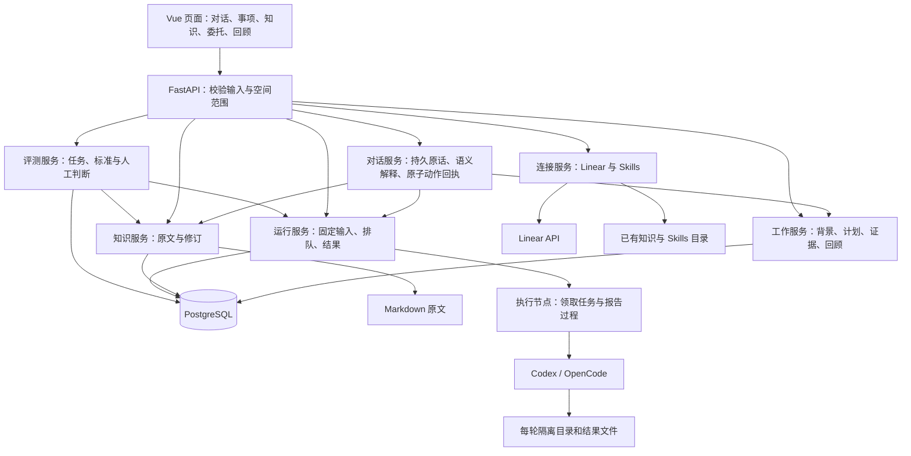
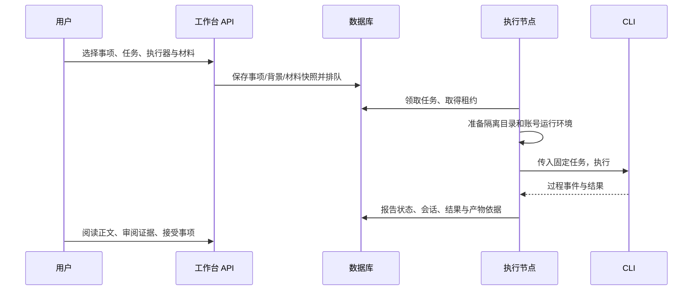
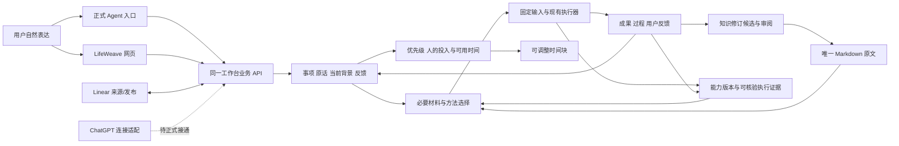
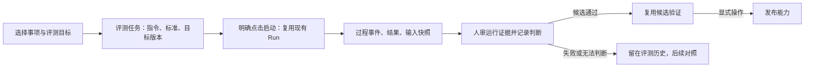

<a id="complete-guide"></a>
# LifeWeave：完整项目说明

这是一份可连续阅读的完整汇编：前半部分是当前产品、架构、状态和使用维护说明，后半部分是历史授权、交付与验证文字附录。

范围为项目根 README、产品定义与本轮原始讨论、docs/ 下全部 Markdown（不含本汇编自身），以及当前建设方案，共 46 份来源。所有来源正文、表格、代码块、Mermaid 图及历史说明完整保留；重复内容也保留，不做摘要或删节。只调整标题层级、链接位置、Markdown 硬换行写法和文内导航。

源码、截图、JSON 运行记录和 API 文档保留可访问的引用，不把它们误作本次需要合并的说明正文。历史附录中的旧名称、当时状态和旧测试数量按原文保留；当前能力请以“当前完成情况”为准。

维护时先更新分篇，再执行 `python scripts/build_complete_guide.py`；`python scripts/build_complete_guide.py --check` 会逐篇检查整合版是否与当前来源一致。

## 阅读目录与来源覆盖

| 部分 | 章节 | 来源 | 原文 SHA-256 |
| --- | --- | --- | --- |
| 当前说明 | [LifeWeave](#doc-01) | `README.md` | `df6cfd4672dd68d66374211058268a07e7ce578d19b572da8b7ed9e80796ca39` |
| 当前说明 | [LifeWeave 项目文档](#doc-02) | `docs/README.md` | `eaf5ef23d10b29c88375b6de46225b0a8d20e8cf00767933e62bf49766ac577b` |
| 当前说明 | [LifeWeave：名称与适配](#doc-03) | `docs/naming.md` | `c9af16fac248971f1bd99b4a0893a3bf6d44fc9889da2b0aa96630abf0f5117c` |
| 当前说明 | [产品设计：让分散的事情接得上、推得动](#doc-04) | `docs/product.md` | `69f8cd50ac1179b40b9fc4fa4d0b1c3c1331eb86705cb2d818e0ea1abb71e396` |
| 当前说明 | [架构与关键实现](#doc-05) | `docs/architecture.md` | `c97daaf7a176fded225187cc61a4f713ab402982a089b9bedbebdcb9d6cccdc4` |
| 当前说明 | [当前完成情况](#doc-06) | `docs/status.md` | `d3adc453dfef0fb20d5204ec30d6102db41b406ca5726c47306c45df96ccdc87` |
| 当前说明 | [开发与运行维护](#doc-07) | `docs/development.md` | `72ee5f297bfda7f9d97bc98b90ac55649ba1d3eb54e009bb977ecf8a03f637e8` |
| 当前说明 | [LifeWeave · 经纬](#doc-08) | `LifeWeave_产品定义与首版迭代计划_v1.0_2026-09-19.md` | `7b39f74096b5fb75c02263b5ac4f560e62fec06475d155f9c5c049423890cc19` |
| 原始讨论 | [个人管理平台优化](#doc-09) | `个人管理平台优化.md` | `ef74ca7e6ce83b5ee29931c5706b65c34bae38a78129b391700aba24e377f54f` |
| 建设方案（含未实现范围） | [LifeWeave：可以跨任务持续使用的工作台](#doc-10) | `workspaces/reviews/lifeweave-next-stage/review.md` | `2b75e430372192a4e18aa41b7019345ced7467a598e086f4fe695b2fdb545f88` |
| 建设方案（含未实现范围） | [LifeWeave 平台演进：能力可见、任务评测与持续改进](#doc-11) | `workspaces/reviews/personal-platform-evolution/review.md` | `247156fa90a2538571b4b1c71c8ef5615cd230405b3321597757ab637874ff7d` |
| 历史与验证附录 | [原始任务与实施授权](#doc-12) | `docs/brief.md` | `b80241cd5fa2db062b7c79c6d8a7594869d89abb6d9034f3a69803984922406f` |
| 历史与验证附录 | [名称与项目文档：任务依据](#doc-13) | `docs/rename-request.md` | `7296b62ad25bd47110f9b2ce99ef799e4b67f5a5c7e383ff5308c894971849bc` |
| 历史与验证附录 | [共作独立工作台：实施与交付](#doc-14) | `docs/delivery.md` | `829e39f4cd1a2fef73fdb99801be0e91221f4477b762f954bc2cd4f8dd3af967` |
| 历史与验证附录 | [本机工作台交付证据](#doc-15) | `docs/evidence/README.md` | `55c01f63440165b78c60ab4811d14734b5694362514f13f2ba8ea02e82ff90e8` |
| 历史与验证附录 | [内部命名与工作接续验证](#doc-16) | `docs/evidence/internal-rename/README.md` | `8e6e4ad8eb1bb2fe651af3fa578f4e9ef2cca8cd59468b08f20b22919370c1a7` |
| 历史与验证附录 | [个人管理平台优化：本轮验证](#doc-17) | `docs/evidence/personal-platform-evolution/README.md` | `7de2cba6e65a37da08f6e962eb70a7fcc3fe02fd512c44d5b86100a5ad50fcfb` |
| 历史与验证附录 | [LifeWeave 改名与文档验证](#doc-18) | `docs/evidence/rename/README.md` | `5f1179f23e012ab60dae12c3aee02ea50d37849b0c0a7b83aa22bd69fac343a9` |
| 历史与验证附录 | [LifeWeave 改名独立复核](#doc-19) | `docs/evidence/rename/independent-review.md` | `aa4d1cecb3ba48d6f36d027e26bde5dc0ee085be9278cfec209c1140dfa9977c` |
| 历史与验证附录 | [研究归档与跨文章讨论验证（2026-09-19）](#doc-20) | `docs/evidence/research-archive/README.md` | `9fc3be1f25d19f1ce3cc4eb7fa65b54c599fdfe9d139d2b7434aa5dbcb1b8faa` |
| 历史与验证附录 | [独立交付复核记录](#doc-21) | `docs/evidence/research-archive/independent-review.md` | `c44711a2e562e062ddf3b699a835da69224eaed03136203296c93c0b3e5f8b14` |
| 历史与验证附录 | [网页研究可用版验证记录](#doc-22) | `docs/evidence/web-research/README.md` | `07d541cf52cdb5b17b8d48b521226edd9ace6a4a012329225d1e57c18cc9b9df` |
| 历史与验证附录 | [受控引用反例](#doc-23) | `docs/evidence/web-research/encoding-final-controlled-original.md` | `5d8ea69327ace72ec9c6c6f2236acf7e72deee05420b7bb6c7d56fbdc058272f` |
| 历史与验证附录 | [encoding-final-real-original](#doc-24) | `docs/evidence/web-research/encoding-final-real-original.md` | `5de064f9225d0e4fba0aace4fcf5e113188f326444637e66edc7c9f471533615` |
| 历史与验证附录 | [来源编码修复独立复核：032a029](#doc-25) | `docs/evidence/web-research/encoding-final-review.md` | `79dc236ce7ddb89c6420697f2cc32236f0cb2341dd9f8f058a0aa6cd463f22d8` |
| 历史与验证附录 | [G1 独立最终复核：d69b257](#doc-26) | `docs/evidence/web-research/final-recheck.md` | `557c99ee86586a47aa1f795a2aef03634b47d6552468dd4b645e56c8368dc48e` |
| 历史与验证附录 | [网页研究可用版独立交付复核](#doc-27) | `docs/evidence/web-research/independent-review.md` | `90d886d7a199cfcc8f2230fdad88e963c625961fa0da29631bbce390ce16073a` |
| 历史与验证附录 | [普通知识样本](#doc-28) | `docs/evidence/web-research/knowledge-notice-final-image-normal-accepted.md` | `ed033a8ef2ee5493cdae741d2d7a7c740cf912f91347d125b93b5506ce8ff259` |
| 历史与验证附录 | [PDF提取样本](#doc-29) | `docs/evidence/web-research/knowledge-notice-final-image-nul-accepted.md` | `88bec12ff9aa89827dbc9f0ee61c5ae3fe9b5e847411372437102c9d278650a0` |
| 历史与验证附录 | [PDF提取样本](#doc-30) | `docs/evidence/web-research/knowledge-notice-final-image-overlap-accepted.md` | `812447860eec238a2131cee94d4392620e455744445cf65379bd25df800735ac` |
| 历史与验证附录 | [PDF提取样本](#doc-31) | `docs/evidence/web-research/knowledge-notice-final-image-readable.md` | `242da7ef9252041e3febfba6e6c043f35da0111875c6f8741dac14ed13817970` |
| 历史与验证附录 | [普通知识样本](#doc-32) | `docs/evidence/web-research/knowledge-notice-final-normal-accepted.md` | `4b9d07952633ce1b369309b4e63de89b6ffee34d0c82d180ff902ee77150753d` |
| 历史与验证附录 | [PDF提取样本](#doc-33) | `docs/evidence/web-research/knowledge-notice-final-nul-accepted.md` | `64de78171e5385777791fd672435fe97403c77e481adb3e3bd7dc2232d3c49dc` |
| 历史与验证附录 | [PDF提取样本](#doc-34) | `docs/evidence/web-research/knowledge-notice-final-overlap-accepted.md` | `d619ba3edddfb2d1dfa18863954b7fab26dba2e2e10933ea2a3feff829f97a30` |
| 历史与验证附录 | [PDF提取样本](#doc-35) | `docs/evidence/web-research/knowledge-notice-final-readable.md` | `6184adc790a17d9628f05087d807e2818b501e4ab01afa06e6ac41f91c8547bc` |
| 历史与验证附录 | [知识阅读提示独立交付复核](#doc-36) | `docs/evidence/web-research/knowledge-notice-final-review.md` | `308e75a6aeee6bcb4548f100312a666d8009e9517c210e72b223acbc4f7d4d02` |
| 历史与验证附录 | [成果与知识纵切：受控验证](#doc-37) | `docs/evidence/web-research/outputs-verification.md` | `47485b16fee009ccf96bbfa57b26bf4584f62402d4cc835861e9cbb35529bb53` |
| 历史与验证附录 | [独立 PDF 阅读夹具](#doc-38) | `docs/evidence/web-research/pdf-artifact-final-accepted.md` | `6f860704445b8eb8259de78f2777e7bad04e61bbccfba4ffb185911cb62f1df9` |
| 历史与验证附录 | [PDF 字符存储与原始成果下载：独立交付复核](#doc-39) | `docs/evidence/web-research/pdf-artifact-final-review.md` | `7f9430a62512bc1a443a0e18180c6e206b6aed5de119d7eb32ef563760b4825c` |
| 历史与验证附录 | [PDF 字符存储修复独立交付复核](#doc-40) | `docs/evidence/web-research/pdf-storage-review.md` | `ba2430dafb322f4bd088640ed0f5a946a8eee566b8991271aeafced4f1dcf043` |
| 历史与验证附录 | [Qwen-Drive 首轮研究产物（未经用户接受）](#doc-41) | `docs/evidence/web-research/qwen-drive-report.md` | `6d4854793cf9fd33a2f041aa3c5f1f203efc80328149c70133999eb82595b705` |
| 历史与验证附录 | [受控引用反例](#doc-42) | `docs/evidence/web-research/reference-fresh-controlled-original.md` | `e7f849e0cb4bd41ad47bdbb6e2291334cd8c47573822c3b9d8505eceed98f6b0` |
| 历史与验证附录 | [reference-fresh-real-original](#doc-43) | `docs/evidence/web-research/reference-fresh-real-original.md` | `5de064f9225d0e4fba0aace4fcf5e113188f326444637e66edc7c9f471533615` |
| 历史与验证附录 | [G1 来源保真独立复核：cd8c709](#doc-44) | `docs/evidence/web-research/reference-fresh-review.md` | `0dafec7f93a4d2830a702bd52776deae8651d5571e6b49aa280d4ef716c83f87` |
| 历史与验证附录 | [我的周回顾](#doc-45) | `docs/evidence/weekly-review.md` | `b44e1b34eef120a755815ec38869ca16fb235a1f8d03832d3e108488b50aaf7b` |
| 历史与验证附录 | [研究成果归档、离线阅读与跨文章讨论](#doc-46) | `docs/research-archive.md` | `1bea339c10ca2ad5a5746312080da2a0ab6821da0693e8ad2ed0bddb31b00a3b` |

---

<a id="doc-01"></a>
<!-- source-begin: README.md -->
<a id="doc-01-line-1"></a>

## LifeWeave

**工作与生活，有序展开。**

LifeWeave 希望把工作、学习、爱好和生活中的想法、计划、行动与积累连接起来。当前以 LifeWeave 为暂用英文产品名，不再使用中文产品名；工程标识仍为 `lifeweave`。当前可用的是本机 AI 工作台：管理事项与背景、阅读和修订知识、委托 AI、审阅成果及回顾进展。

这是独立的本机应用与 Git 仓库。数据、依赖和进程都由本目录管理，不启动 Omni-Brain 或质检平台。部分工作模型与执行代码来自 Omni-Brain，来源和本轮交付范围见 [交付记录](#doc-14)。

<a id="doc-01-line-9"></a>

### 理解项目

想连续阅读全文，可直接阅读 [完整项目说明（整合版）](#complete-guide)：包含下列说明全文及历史交付、验证文字附录。

第一次接触项目，按下面顺序阅读：

1. [产品设计](#doc-04)：为谁解决什么问题、日常怎样使用、为什么这样组织。
2. [架构与关键实现](#doc-05)：数据由谁维护，用户动作怎样穿过前后端，代码从哪里读起。
3. [当前完成情况](#doc-06)：已经能用、实现但未实测、尚未实现的能力及证据。
4. [开发与运行维护](#doc-07)：本地启动、配置、验证、改名兼容和排障。

[文档导航](#doc-02) 区分当前说明与历史证据；[命名说明](#doc-03) 解释名称与适配边界。

[个人管理平台优化讨论与演进方案](#doc-11) 完整追踪本轮原始讨论、设计取舍和已实现范围。

<a id="doc-01-line-24"></a>

### 开始使用

需要 Linux / WSL、Python 3.10+、Node.js 22+、npm，以及 PostgreSQL 16 的服务端命令。默认 PostgreSQL 命令目录为 `/usr/lib/postgresql/16/bin`，可用 `LIFEWEAVE_PG_BIN` 指定。AI 功能需要已安装并登录的 Codex 或 OpenCode CLI。

```bash
cd /home/yyh/project/lifeweave
python scripts/workbench.py setup
python scripts/workbench.py start
```

打开 **http://127.0.0.1:8010**。在 WSL 中可使用 Windows 浏览器访问该地址。默认进入个人空间；左上角可以切换团队空间。

1. 默认打开“对话”。直接提问、说出研究委托，或选“只记录”保存想法；历史对话可刷新后继续。左侧可保存明确的方向与偏好。
2. 在“计划”中安排优先级、日期和阶段。事项详情保存背景、讨论、关联材料与修改提案。
   “我的日常”可点“调整首页”，通过勾选、位置和上下移动配置卡片；个人与团队分别保存。
3. 点“委托 AI”，写清这次希望得到什么。可选择执行器、项目目录、工作方法与知识。不选项目时使用空白任务目录；选 Git 项目时使用固定提交的独立 worktree，未提交修改不会自动带入。
4. 在对话和事项页阅读完整成果，查看公式与本轮图片，选择历史版本、下载纯正文，或点“下载完整包（含图片）”取得可离线阅读的 ZIP。选中段落可保存定位反馈，再让对话继续修订。运行成功不会自动完成事项。
5. 从成果提出知识候选，或在“知识与材料”写笔记。阅读差异后接受或拒绝；当前原文变化会阻止覆盖。已接受知识可供后续对话和研究读取。
   打开一篇知识后，可在正文下查看它引用的同源 Markdown 和反向引用；断链会提示，不能误当成已有材料。
6. 在“周回顾 / 组会”配置关注内容、冻结当次内容、记录讨论并导出 Markdown。
7. 在“维护中心 → 评测任务”选择已有事项，写本次任务和通过标准；开始时可选 Git 仓库、方法与知识，所选输入固定到实际 Run。不选仓库时在空隔离目录运行。结束后查看过程、接受证据并记录判断，或把问题关联成改进建议。在“能力与成长”打开候选，可以看它及明确前任的工作样例、失败历史和运行。评测候选通过后进入已验证状态；当前候选及明确记录的前任候选若有失败，须沿原标准再评通过，才能显式发布。

“就地讨论”会打开关联当前事项的 AI 对话；展开“附带其他研究成果”，可明确选入其他论文。已有知识另按问题匹配读取，实际来源及版本显示在回复下方。

在“设置与连接 → 研究成果自动归档”启用后，新成功报告会自动写入 GitHub 的 `research-archive` 分支及 Linear 项目文档。失败保留本地并重试；以前的成果可点“立即归档 / 重试”。[当前两篇远端归档](https://github.com/pokemonAndCodeMaster/Life-Weave/tree/research-archive)在本机关机后仍能访问。代码在同仓 `main`；归档范围是成果与引用材料，不是整套运行数据库或自动采纳正式知识。详见 [归档与跨文章讨论](#doc-46)。

本机首次交付已实际跑通 Codex。OpenCode 可建立会话，但当前配置下的真实调用连续返回执行器内部错误，暂建议选 Codex；具体记录见交付说明。重试是关联到原委托的新尝试，不是恢复原生 CLI 会话。

本轮已通过工作台完成 [Qwen-Drive 第一轮研究](http://127.0.0.1:8010/lifeweave/personal/items/item-810217743bbb4be2/outputs)。该入口属于当前本机安装；新安装不会预置这份个人事项。研究可用版的证据、明确边界和后续日常 Alpha 计划见 [当前完成情况](#doc-06)。

<a id="doc-01-line-54"></a>

### 连接已有积累

“设置与连接”可以添加已有 Markdown 知识目录、包含各个 `SKILL.md` 子目录的 Skills 根目录，以及 Linear 连接。

- 外部知识只读；修订可下载，交回原仓库处理。工作台管理的知识默认写入 `.runtime/knowledge/{personal,team}`。
- 委托时按需选择一套 Skill 和最多 10 篇知识，固定正文与方法支持文件。重试保留已选择资料的快照；要使用更新后的资料，创建新委托。Skills 需要适用于目标工程；引用原仓库专有脚本的方法仍可能需要调整。
- Linear 使用个人 API Key 或本机权限为 `600` 的凭证文件。凭证保存在 `.runtime/linear.json`，不进入 Git，也不回传到页面。
- Linear 页面分页读取分配给当前账号的事项。导入创建本地工作；再次导入更新远端快照，保留本地标题、目标、安排和进展。
- 向 Linear 事项发送评论时，先准备固定正文预览，再点发送。系统回读评论核对；网络结果不确定时优先核对已有评论，不自动重复发送。本地事项与 Linear 状态独立维护。

<a id="doc-01-line-64"></a>

### 数据与运行

```bash
python scripts/workbench.py status
python scripts/workbench.py stop
python scripts/workbench.py backup
python scripts/workbench.py start
```

备份位于 `.runtime/backups/`，包括 PostgreSQL dump 和工作台知识压缩包。外部知识、CLI 账号凭证、方法连接配置和运行目录需按需另行备份。不要把包含个人数据或凭证的 `.runtime/` 提交到仓库。

恢复时先停止应用，将 dump 用 `pg_restore` 恢复到一个**新的数据库**，将知识包解压到新的知识目录，再用 `LIFEWEAVE_DB_NAME` 和 `LIFEWEAVE_PERSONAL_KNOWLEDGE_ROOT` / `LIFEWEAVE_TEAM_KNOWLEDGE_ROOT` 指向它们。先检查恢复结果，再切换日常使用环境；不覆盖现用数据库。

数据库仅监听本项目私有 Unix socket，目录 `.runtime/postgres/`，端口参数 `55440`，默认数据库和角色均为 `lifeweave`。服务日志为 `.runtime/server.log`；AI 的隔离目录、私有账号副本与产物位于 `.runtime/executions/`，运行记录保存在数据库。不要在 AI 正在执行时停止服务。

本机服务只监听 `127.0.0.1:8010`。当前身份是本机单用户，个人/团队是内容空间，**没有多人登录与成员权限系统**。不应直接暴露到公网。团队执行机和 Docker 协议保留，但默认启动个人空间的本机 worker；团队空间可以在设置中明确选择使用本机账号启用执行。远程执行需要另行部署与验证。

<a id="doc-01-line-81"></a>

### 开发与验证

后端 FastAPI + PostgreSQL，前端 Vue 3 + TypeScript。前端开发服务器为 `127.0.0.1:5180`，代理到 `8010`。

```bash
.venv/bin/pytest
LIFEWEAVE_TEST_DB=1 .venv/bin/pytest tests/test_live_database.py
cd web
npm run type-check
npm test
npm run build
```

数据库集成测试在本项目 PostgreSQL 中创建随机命名的临时数据库，完成后删除；不会清空使用中的工作台数据库。实际浏览器与 AI 验证记录见 [交付记录](#doc-14)。

API 文档：<http://127.0.0.1:8010/docs>，当前接口前缀 `/api/lifeweave/`，页面前缀 `/lifeweave/`。旧页面仍会跳转；旧 API 客户端须跟随 308，或改用新前缀。配置读取范围见 [运行维护](#doc-07-line-29)。数据库变更新增到 `migrations/`，启动时按摘要校验并只应用新版本。

<a id="doc-01-line-98"></a>

### 在新的本机 Agent 会话接续

当前支持本机 Codex/OpenCode 等可运行命令的会话，使用同一工作台 API；不依赖开发者聊天记录。先让 Agent 阅读本节或运行帮助：

```bash
python scripts/lifeweave.py --help
python scripts/lifeweave.py discover '想继续的目标'
python scripts/lifeweave.py continue item-实际编号
python scripts/lifeweave.py recommend item-实际编号
python scripts/lifeweave.py read-knowledge 'local:知识路径.md'
python scripts/lifeweave.py read-method method-实际编号
python scripts/lifeweave.py runs
python scripts/lifeweave.py capture '先记一个生活想法，暂时不推进'
python scripts/lifeweave.py feedback item-实际编号 '重点理解错了，先讨论适用范围'
```

`capture`、`create`、`discuss`、`feedback` 只保存，不启动 AI。`run` 是显式委托，会采用文本匹配推荐的输入；先查看 `recommend` 的依据，无匹配时不捏造方法，复杂适用性仍由 Agent 判断。网页的“委托 AI”也会预选推荐，可手动调整。推荐、实际输入快照与执行步骤是不同证据。

事项概览的“接着推进”可查看当前记录、下载接续 JSON、保存针对事项或具体运行的纠偏。新的运行/重试会自动固定这些反馈，已有运行保持原输入；反馈不会自动改变已接受目标。重复发送相同反馈可使用同一 `--request-id`；其他创建动作遇到超时须先读取确认，不自动重发。

命令读取本机服务，失败返回非零；`--workspace team` 切换空间。ChatGPT 远程连接、自然语言自动排程、自动发布方法改进尚未完成。完整研发方案见 [下一阶段产品方案](#doc-10)。
<!-- source-end: README.md -->

---

<a id="doc-02"></a>
<!-- source-begin: docs/README.md -->
<a id="doc-02-line-1"></a>

## LifeWeave 项目文档

LifeWeave 希望帮助个人与协作中的人，把工作、学习、爱好和生活中的事情有序推进。当前提供本机工作台；愿景中的所有生活管理和多人能力尚未完成。

**一次读完整个项目：[完整项目说明（整合版）](#complete-guide)。** 整合版收录当前分篇说明全文，当前建设方案全文，以及本目录下的历史交付和验证文字；原分篇仍是维护入口。更新分篇后运行 `python scripts/build_complete_guide.py`，用 `python scripts/build_complete_guide.py --check` 检查整合版是否同步。

| 读者想知道什么 | 阅读入口 |
| --- | --- |
| 为什么做、准备怎样解决问题 | [产品设计](#doc-04) |
| 本轮批准的行为与首版验收 | [产品定义与首版迭代计划 v1.0](#doc-08) |
| 完整产品能力如何分批建设 | [下一阶段产品方案](#doc-10) |
| 个人管理平台新讨论如何进入产品 | [原始讨论与演进方案](#doc-11) |
| 本轮评测、知识关联与首页实际验证 | [平台演进证据](#doc-17) |
| 用户动作如何实现、数据放在哪里 | [架构与关键实现](#doc-05) |
| 现在能做什么、哪些还不能依赖 | [当前完成情况](#doc-06) |
| 怎样启动、修改、验证和维护 | [开发与运行维护](#doc-07) |
| 为什么叫 LifeWeave、哪些名称已适配 | [命名与兼容](#doc-03) |
| 亲自打开应用并完成第一项工作 | [项目首页与使用步骤](#doc-01) |

当前说明以本仓源码、迁移和运行结果为依据。修改功能时，应同步受影响的产品说明、实现说明或状态；精确字段仍以源码和运行中的 [API 文档](http://127.0.0.1:8010/docs) 为准，不在文档里维护逐函数副本。

历史材料单独保留：[初始授权](#doc-12)、[首次交付](#doc-14)、[首轮证据](#doc-15)、[此次改名要求](#doc-13)。其中旧名称、旧路径、截图、运行 ID 和原始输入应按当时事实理解，不能因为改名而重写成新的验证证据。

[研究归档与跨文章讨论](#doc-46)：云端入口、ZIP 使用、自动触发及恢复范围。
<!-- source-end: docs/README.md -->

---

<a id="doc-03"></a>
<!-- source-begin: docs/naming.md -->
<a id="doc-03-line-1"></a>

## LifeWeave：名称与适配

<a id="doc-03-line-3"></a>

### 名称表达什么

用户希望管理的不是一种工作，而是人长期面对的工作、爱好和生活。**LifeWeave** 由 Life（生活整体）和 Weave（编织）组成：把分散的事情、资料、人与行动连接成自己能够掌握的整体。用户在后续命名讨论中明确决定不再使用中文产品名；LifeWeave 是尚可继续讨论的英文名称，当前界面只展示它。

相比以“工作”为范围的旧名，它可以容纳学习、游戏研究、家庭安排、个人创作和团队交付。它也没有预设所有事情都必须变成项目、审批或 AI 任务。

命名取舍：只用 Order 容易把产品理解为排程工具；只用 Work 会缩窄生活与爱好；使用 LifeWeave 保留了关联和长期积累的含义。英文新名尚未定稿；没有进行商标、域名或应用商店名称排他性认定。

<a id="doc-03-line-11"></a>

### 统一约定

| 场合 | 使用名称 |
| --- | --- |
| 当前产品显示名 | LifeWeave（英文新名待定） |
| 中文产品名 | 不使用 |
| 当前英文名与工程标识 | LifeWeave |
| 项目目录与 Python 包分发名 | `lifeweave` |
| 前端包名 | `lifeweave-web` |
| 页面、API | `/lifeweave/…`、`/api/lifeweave/…` |
| 应用环境变量 | `LIFEWEAVE_*`；CLI 自身的 `CODEX_*`、`OPENCODE_*`、`LINEAR_*` 保持其原有含义 |

图标沿用两组相互穿插的线，源文件为 [favicon.svg](../web/public/favicon.svg)。页面标题、导航、API 标题、错误提示和新生成文案使用 LifeWeave；历史成果不改写。

<a id="doc-03-line-25"></a>

### 为什么仍能看到旧名称

改名需要保持已有工作可接续。当前实际目录是 `/home/yyh/project/lifeweave`；旧 `/home/yyh/project/gongzuo-workbench` 是指向它的符号链接，服务、数据和 Git 均只有一份。历史 AI worktree、Python 虚拟环境入口以及已保存的运行目录含旧绝对路径，兼容链接让这些记录仍可读取。

旧页面自动跳到新页面并保留查询参数与片段；旧 API 使用 HTTP 308 跳转，保留方法、请求体和查询参数。**客户端必须支持并跟随 308，或者直接改用 `/api/lifeweave/`**；例如本机 Python 3.10 的 urllib 默认会将 308 当作异常，旧 SDK 不能一概视为透明兼容。新页面和执行节点只生成新接口地址。

`GONGZUO_*` 环境变量作为安装兼容别名仍可读取；同一来源同时提供新旧变量时，新变量优先。数据库与日志的 ConfigManager 支持 `.env`，且进程环境优先；知识根、执行器与生命周期脚本只读取进程环境，详见 [配置说明](#doc-07-line-29)。

现行 Python 模块为 `src/lifeweave`、`src/lifeweave_runtime`、`src/lifeweave_knowledge`；Vue 位于 `features/lifeweave`，组件和类型使用 `LifeWeave`，CSS 使用 `lw-`。数据库和角色均为 `lifeweave`，业务表为 `t_lifeweave_*`，迁移总账为 `lifeweave_migrations`；新运行材料写入 `.lifeweave`，执行节点使用 `X-LifeWeave-*` 请求头。旧请求头仍作为兼容输入接受。

本机 23 张表通过原位重命名迁移，逐行内容哈希与迁移前一致，2 篇知识原文字节未变；见 [内部命名迁移证据](#doc-16)。既有 `gzrun-*` 等稳定 ID 和旧运行的 `.gongzuo` 路径仍指向原成果，不修改不可变运行输入。已应用 SQL 迁移 001–004 保留原内容，005 承担新名称迁移。

用户已保存的事项标题、Markdown、导出快照、AI 结果、首次交付文档和截图保留原文。搜索这些内容看到“共作”是历史来源，不应批量替换。新开发的目录、符号和存储标识都使用 LifeWeave；旧名称只用于历史材料及明确的迁移/兼容入口。
<!-- source-end: docs/naming.md -->

---

<a id="doc-04"></a>
<!-- source-begin: docs/product.md -->
<a id="doc-04-line-1"></a>

## 产品设计：让分散的事情接得上、推得动

<a id="doc-04-line-3"></a>

### 我们要解决的问题

一个人可能同时在推进工作项目、学习一门技术、研究游戏、安排旅行和照顾生活。信息分散在聊天、文档、待办和代码中；每次回来都要重新找资料、解释背景、判断做到哪里。加入 AI 之后，问题并没有自动消失：一次回答有帮助，但任务背景、执行过程和最后采纳的结果仍容易断开。

LifeWeave 的愿景，是让这些事情有清楚的入口、持续的背景、可推进的行动和能够复用的积累。AI 是其中一种执行方式，人工完成、讨论决定和暂时搁置也都是正常路径。

**当前实现重点是从网页自然交代事情，持续研究、反馈和积累知识。** 它已有个人和团队内容空间；还没有多人身份权限，也没有专门的习惯打卡、家庭账本、健康记录或日历同步。这些不能从“管理生活”的愿景推断为现成功能。完整目标与首版范围由 [产品定义 v1.0](#doc-08) 维护，本页说明实际产品行为。

<a id="doc-04-line-11"></a>

### 用户怎样使用

例如准备一次旅行，可以先记下“秋天想去徒步”的想法；确定要推进时创建个人事项，写清时间、预算和限制，关联资料。之后自己整理清单，或选择材料让 AI 给出候选路线。读完结果、补充实际核验，再保存成果。下次打开事项，不必从聊天历史重建目的与约束。

这个例子说明现有通用对象如何承载生活事务，并非已经完成旅行业务验证。首轮实际验证用的是工作台交付检查、知识笔记和团队会议议程，详见 [状态与证据](#doc-06)。

当前页面按用户动作组织：

| 入口 | 用户做什么、拿到什么 |
| --- | --- |
| 对话（默认首页） | 直接提问、只记录想法，或委托研究；查看真实动作回执，沿同一事项继续，编辑明确的方向和偏好 |
| 我的日常 / 团队工作 | 记录灵感，查看需要判断的事、正在推进的事项和 AI 委托；按空间调整首页卡片的显示、顺序与主栏/侧栏位置 |
| 工作事项 | 创建不同类型的事项，阅读目标、范围、讨论、材料与成果；可关联子事项 |
| 计划 | 安排优先级、日期和阶段；与事项详情操作同一条工作记录 |
| 灵感与讨论 | 留下尚未形成任务的想法，逐步与具体事项建立联系 |
| 知识 | 阅读和搜索 Markdown；查看同一来源内的出链、反向引用和断链；本机知识修改先比较差异再接受，外部资料保持来源 |
| AI 委托 | 查看排队、执行、失败与结果；取消或建立下一次尝试 |
| 能力与评测 | 看已登记方法和能力候选；为现有事项写任务与通过标准，启动时选择仓库、方法和知识；依据成果、过程和已接受证据判断，沿同一标准再评或形成改进建议；从候选详情回看工作样例与评测历史 |
| 周回顾 / 组会 | 选择关注内容，阅读实时进展，冻结当时内容并导出纪要 |
| 来源连接、设置 | 读取 Linear 事项，配置知识与 Skills 来源，启用本机执行 |

<a id="doc-04-line-32"></a>

### 为什么以“事项”连接工作

事项代表一件需要持续推进和判断结果的事。它可以是需求、修复、学习、个人安排、爱好或研究；类型不代表已经为每个领域构建了专用系统。

一个事项围绕以下内容展开：

- **背景**：当前目标、范围、共识、已知事实和未决问题。它帮助人和 AI 知道“为什么做、做到哪里”。
- **安排**：阶段、优先级和日期。它回答“什么时候继续、当前是否受阻”。
- **材料与讨论**：来源、参考和决策过程。资料可以被多个事项引用，不要求复制一套正文。
- **执行与成果**：人工记录或 AI 尝试及其输出。执行结束之后，仍需判断成果是否符合目的。

想法不必立即变成事项；正文阅读不必先启动 AI；人工提交成果不依赖执行器。这样工作台才可以用于学习和生活，而不把所有活动塞进软件开发流程。

<a id="doc-04-line-45"></a>

### 从对话到可继续使用的研究

例如在对话中交代“帮我研究这篇论文”，工作台保存原话，建立或关联持续事项，按目标推荐已有方法和知识，再启动真实执行。它会展示实际排队、执行、失败与成果状态。普通提问只回答；明确选择“只记录”时不调用模型、不启动委托；“仅讨论”不启动业务执行。

研究结束后，正文、公式、本轮图片与引用在网页阅读。可以选中一段留下具体反馈，再要求沿同一目标修订；新尝试固定前轮成果、反馈与明确偏好，保留旧版本。目标变化先形成提案，采纳后才成为当前目标。个人偏好由用户明确编辑，一次临时要求不会自动变成永久画像。

有价值的成果可整理为知识候选，比较差异后再接受。后续对话和研究读取已接受的知识，并标明来源；候选与模型自述不能替代接受动作。请求失败保留原话，结果不确定时按原请求身份核查；业务运行的重试是有历史关联的新尝试。

上述路径已有真实模型、数据库和网页验证，具体成功、失败与修复记录见 [当前状态](#doc-06)；它不保证模型对每篇论文的解释正确，也不代表用户已经学会论文。论文质量、用户理解和产品可接续性分别判断。

<a id="doc-04-line-55"></a>

### 三个影响可靠性的设计选择

<a id="doc-04-line-57"></a>

#### 背景变化有来路

已采纳背景是当前共同依据。改动先作为提案保存，保留原版本和来源；接受后生成下一版本。提交时检查版本，避免两个编辑动作悄悄覆盖彼此。

事项速览、详情和实时回顾读取当前已接受背景。历史运行和冻结回顾保留当时内容，所以“现在认为怎样”和“当时依据什么”可以同时解释。

<a id="doc-04-line-63"></a>

#### 运行成功与事情完成分开

AI 返回文字、命令成功退出，只能证明执行完成。用户还需要阅读结果、核对材料，审阅证据，再决定是否接受事项。人工成果使用同一审阅入口。平台不能替用户宣称“这份攻略一定正确”或“这个需求已经满足”。

<a id="doc-04-line-67"></a>

#### 知识原文有明确归属

工作台管理的知识写在本地 Markdown 文件中。数据库记录修改候选、版本指纹和审阅过程；它不维护第二套独立的“正式正文”。外部知识目录按原位置只读引用，修改候选可以下载后交回来源处理。

阅读 Markdown 时，工作台从当前可读文件整理同一来源目录内的知识链接，显示“本文引用”和“引用本文”。目标文件不存在或越过目录边界会明确标出，不假装已经纳入知识。它是可重建的阅读索引；跨来源关系、自动事实本体和大规模检索仍待真实材料验证。

Linear 也是独立来源：首次引入建立本地事项和关联，再次读取更新远端快照。当前本地安排与 Linear 状态各自维护，页面明确提示这点，不使用自动双向覆盖。

<a id="doc-04-line-75"></a>

### 个人和团队的边界

当前同一个应用中存在 personal 与 team 两个内容空间，数据查询、知识目录和执行记录按空间区分。团队使用本机账号执行需要在设置中明确启用。

首页提供不同的个人/团队卡片预设。打开“调整首页”可以点击隐藏、移动或更换主栏/侧栏，保存后只改变本空间的呈现偏好；事项、知识和运行本身不变。自然语言重排页面、任意组件画布和团队成员各自的个性化布局尚未实现。

这解决的是本机内容分区与执行选择。它不等于多人登录、组织成员管理、角色权限或可公开部署的团队 SaaS。后续团队建设应从真实共享与权限场景出发，再决定哪些数据共同维护、哪些账号和知识必须隔离。

<a id="doc-04-line-83"></a>

### 后续怎样判断产品在进步

有价值的改进应让真实使用者更容易找到背景、继续行动、读懂成果和保留积累。观察重点包括：回来后是否需要重新解释、当前依据是否一致、失败是否可以处理、知识修改是否可追溯，以及计划是否真正帮助推进。

“能力与评测”把一次工作作为可检查的案例：用户先写要做什么、怎样算通过；开始时可以选择只读 Git 仓库、工作方法和知识，系统固定本轮实际输入并创建真实委托。不选仓库时执行器处于空隔离目录，无法核验项目源码。普通事项委托也可从当前空间的可试验候选中直接选择。结果出来后可以打开运行过程、在事项中接受证据，再记录通过、失败或无法判断。候选详情直接列出关联事项、标准、判断和运行；通过的评测可作为有来源的工作样例，失败也保留在历史中。候选能力通过后进入已验证状态，但是否发布仍需用户决定；发布要求本版本至少一次显式评测通过，且不能有未完成的评测。当前候选及明确记录的前任候选若有失败或无法判断，须沿原任务与标准建立再评并通过；另外新建一个更容易的任务，即使通过，也不能覆盖原问题。没有明确前任关系的同名候选不会被系统擅自合并。评测后可把发现的问题、目标行为和下次验证方法关联成改进建议，之后仍需另行建立、验证并发布候选。这个入口管理人工判断与版本证据，不自动证明 AI 答案正确。

近期顺序是研究可用版 G1 → 立即通过工作台开展真实论文 → 个人日常 Alpha G2。G2 将继续补可用时段、休息约束、可调整时间块、受控资料发现以及有对照的研究方法改进。当前下次讨论时间只保存安排，不发提醒；第二执行器、外部日历与多人身份不阻塞第一条研究路径。具体实施与未完成项在 [同一建设方案](#doc-10) 维护。
<!-- source-end: docs/product.md -->

---

<a id="doc-05"></a>
<!-- source-begin: docs/architecture.md -->
<a id="doc-05-line-1"></a>

## 架构与关键实现

<a id="doc-05-line-3"></a>

### 系统怎样分工

LifeWeave 是一个独立的模块化单体：Vue 页面处理交互，FastAPI 接收操作并协调业务模块，PostgreSQL 保存工作事实，Markdown 保存知识正文，本机执行节点调用已经安装的 CLI。启动应用不需要运行 Omni-Brain 或连接质检数据库。



程序集成入口在 [src/api/app.py](../src/api/app.py)。它创建数据库连接、工作服务、知识服务、执行器和外部连接；启动时恢复过期租约并启动已启用的本机节点，退出时关闭节点和连接池。生产构建的 Vue 静态文件也由这个进程提供。

当前 Python、Vue、数据库与执行材料统一使用 LifeWeave 命名；历史入口兼容见 [命名说明](#doc-03)。

| 职责 | 主要代码入口 |
| --- | --- |
| 页面路由与整体导航 | [router/index.ts](../web/src/app/router/index.ts)、[LifeWeaveShell.vue](../web/src/features/lifeweave/components/LifeWeaveShell.vue) |
| 自然入口与持久对话 | [conversations.py](../src/lifeweave/conversations.py)、[conversation_interpreter.py](../src/lifeweave/conversation_interpreter.py)、[ConversationPage.vue](../web/src/features/lifeweave/pages/ConversationPage.vue) |
| 成果、定位反馈与知识来源 | [research_outputs.py](../src/lifeweave/research_outputs.py)、[research_references.py](../src/lifeweave/research_references.py)、[ResearchOutputPanel.vue](../web/src/features/lifeweave/components/ResearchOutputPanel.vue) |
| 跨页面工作状态和操作 | [useLifeWeaveWorkspace.ts](../web/src/features/lifeweave/composables/useLifeWeaveWorkspace.ts)、[API 客户端](../web/src/features/lifeweave/api/lifeweave.ts) |
| 工作规则与数据库读写 | [工作服务](../src/lifeweave/service.py)、[工作 Repository](../src/lifeweave/repository.py)、[请求模型](../src/lifeweave/models.py) |
| 知识全文与候选修改 | [library.py](../src/lifeweave_knowledge/library.py)、[KnowledgePage.vue](../web/src/features/lifeweave/pages/KnowledgePage.vue) |
| Markdown 引用与反向发现 | [links.py](../src/lifeweave_knowledge/links.py)、[KnowledgeRelations.vue](../web/src/features/lifeweave/components/KnowledgeRelations.vue) |
| 委托创建、重试和记录 | [运行服务](../src/lifeweave_runtime/service.py)、[运行 Repository](../src/lifeweave_runtime/repository.py) |
| 本机节点与 CLI 执行 | [local_workers.py](../src/lifeweave_runtime/local_workers.py)、[worker.py](../src/lifeweave_runtime/worker.py)、[执行器接口](../src/agent_runtime/executor.py) |
| 方法材料与 Linear | [task_sources.py](../src/integrations/task_sources.py)、[linear.py](../src/integrations/linear.py) |
| 评测任务、能力历史与发布门槛 | [evaluations.py](../src/lifeweave/evaluations.py)、[evaluation_repository.py](../src/lifeweave/evaluation_repository.py)、[EvaluationBoard.vue](../web/src/features/lifeweave/components/evaluations/EvaluationBoard.vue)、[CapabilityHistory.vue](../web/src/features/lifeweave/components/evaluations/CapabilityHistory.vue) |
| 首页预设与用户调整 | [homeLayout.ts](../web/src/features/lifeweave/utils/homeLayout.ts)、[HomePage.vue](../web/src/features/lifeweave/pages/HomePage.vue)、[HomeDashboardCard.vue](../web/src/features/lifeweave/components/HomeDashboardCard.vue) |

<a id="doc-05-line-52"></a>

### 数据分别保存在哪里

PostgreSQL 的 `workbench` schema 保存以下对象。完整字段以 [migrations](../migrations) 为准；此表解释职责，不复制所有列。

| 数据组 | 保存内容 | 事实边界 |
| --- | --- | --- |
| item / entity / relation | 事项、想法、专题、资源、成果及关联 | 事项保存执行安排；资料可以被引用，不必变成事项 |
| conversation / conversation_turn / personal_model | 对话、原话、解释状态、动作回执、明确方向与偏好 | 同一请求去重；对话不自动变成事项，偏好不自动推断 |
| research_knowledge_candidate | 研究运行与知识修订、运行内容版本及请求身份 | 关联现有修订，不复制第二份正式知识 |
| context / context_version / context_proposal | 当前背景指针、背景版本、修改提案 | 当前指针指向已接受版本；候选不是当前事实 |
| evidence / discussion / activity | 核验依据、讨论、进展记录 | 证据接受与事项完成分开，保留原因和来源 |
| meeting / snapshot / note / preference | 回顾配置、冻结内容、会议记录、事项视图和首页布局偏好 | 冻结内容用于解释历史；布局只保存卡片键、顺序、位置和可见性，不复制工作数据 |
| machine / run / run_event | 执行节点、输入快照、尝试、事件、结果 | 运行状态是技术事实，不自动替代业务接受 |
| document_revision / library_source | Markdown 候选、源指纹、外部目录登记 | 正式知识原文仍在文件中 |
| linear_binding / linear_publication | 来源关联、远端快照、发送预览和核对状态 | 本地事项和 Linear 状态不做自动覆盖 |
| capability / capability_verification | 已复用的能力候选与验证记录；候选可显式记录前任 ID | 不凭名称推断能力血缘；旧候选失败在前任链内参与新候选发布判断 |
| evaluation | 目标事项、评测对象与候选版本、指令、通过标准、实际 Run、人工结论和证据；同标准再评引用前一条，改进建议反链 | 评测不复制事项正文或运行事件；发布要求显式通过评测，未完成者阻断，当前及前任未通过者须在同一标准的再评链中得到通过 |

`.runtime/knowledge/{personal,team}` 保存本机知识原文；外部资料仍留在登记目录。`.runtime/executions/{space}/{run}/` 保存该轮工作目录、账号运行副本和产物。方法连接配置、本机节点设置、Linear 连接配置也在 `.runtime/`，不会提交到 Git。

结构化业务对象常用 JSONB 保存有差异的内容，避免为每种学习或生活事项提前设计独立表。代价是字段语义主要由 Service 和页面适配器约束；扩展公共字段时需要同时检查输入校验、持久化与多个页面，不能只改显示名称。

<a id="doc-05-line-74"></a>

### 一次事项修改怎样生效

页面通过共享 API 客户端发送明确空间和对象 ID。Router 用 Pydantic 校验请求，Service 检查业务规则，Repository 执行 SQL。普通编辑带当前版本，数据库更新使用期望版本条件；版本过时返回冲突，而不是覆盖新内容。

背景修订另有提案流程。接受提案时更新版本和当前指针，之后列表、详情及实时回顾加载已接受内容。列表不能只读取事项初始 `payload`，否则新目标只在详情显示；这曾是实际发现并修复的问题。回顾会把当前目标、范围等放入阅读投影，冻结则保存当次投影。

子事项的委托背景从 [current_context_snapshot](../src/lifeweave/service.py) 组装，包含共享背景与本次局部目标。修改这个方法时，必须检查根事项和子事项，防止 AI 只得到父目标或只得到孤立的子标题。

<a id="doc-05-line-82"></a>

### 一次 AI 委托怎样完成



创建委托时，[运行服务](../src/lifeweave_runtime/service.py) 读取事项的当前背景，把输入固定到运行记录。不指定工程时使用空白任务目录；指定工程时读取 Git 提交身份，执行节点创建独立 worktree，未提交修改不会自动进入。改动产物也不会自动合并回原仓。

一次可显式选择一项 Skill 和最多 10 篇知识。`TaskSources` 固定正文、来源指纹和方法支持文件；重试时保留这些已选输入。方法及支持文件合计最多 100 个文件、1 MB，选定材料主正文（含 Skill 主文件）合计最多 2 MB；具体限制和失败提示见 [snapshot 实现](../src/integrations/task_sources.py)。这与维护中心的能力发布机制是两个来源入口，运行时共同形成材料快照。

评测启动复用同一个 `create_run`，允许明确选择 Git 仓库、方法和知识。仓库提交、选中材料和实际版本随 Run 保存；评测只保存 Run 引用，不维护第二份材料快照。人工完成评测后，可以建立关联到评测、Run 和原事项的 `improvement` 实体；在维护中心它仍是原始建议，是否整理为 Skill/Agent/Harness 候选须另行决定。评测任务、判断和建议分别归属 `008_evaluations.sql` 与 `009_evaluation_improvements.sql` 的数据结构。

执行节点按租约领取任务，记录心跳、事件序号和报告。执行器适配层把统一请求转为 Codex/OpenCode CLI 参数，解析过程与结果。本机两空间各有可选节点；团队使用当前本机账号必须显式启用。远程/Docker 协议存在，但本机部署没有提供已经验收的远程集群。

失败、取消和不可用状态保存到同一运行记录。界面的“按当前背景再试”建立关联的新尝试，并取当前背景；它不是恢复原生 CLI 会话。运行的原生会话 ID 用于追溯。源码链接只读取该轮受控目录内允许类型的文本文件，不把任意路径开放给浏览器。

<a id="doc-05-line-111"></a>

### 知识修改为什么不会静默替换正文

[Library](../src/lifeweave_knowledge/library.py) 每次读取实际文件并计算指纹。提出修改时保存基准指纹、原文、候选正文和原因，页面显示差异；接受时锁定修订记录，重新核对文件指纹，再替换文件并更新状态。若用户已在编辑器里修改了源文件，接受会报冲突。

本机受管原文使用临时文件和原子替换；数据库操作发生 Python 异常时尝试恢复原文。文件系统与数据库不是同一个事务，进程或机器恰在两者之间崩溃的恢复仍有限，不能宣称分布式原子提交。外部来源的修订可以下载，但不能通过该入口覆盖原仓。

路径读取会核验所属空间、登记来源和根目录，拒绝越界及不允许的隐藏/raw 路径。页面用 Marked 渲染、DOMPurify 清理 HTML，并对中文相对 Markdown 链接做一次解码和根范围校验；源码行号链接先转换成受控读取地址，再清理 HTML。

引用关系由 `links.py` 使用 Mistune AST 从当前 Markdown 编译。它只识别同一来源内指向 `.md` 的相对链接，忽略代码块和图片；解码、规范化后再走 Library 路径边界。文件元数据相同的正文解析结果在本进程复用，出链是否存在及反向引用每次按当前可读目录重算。索引不是新的正式正文；外部文件变化通常由修改时间/大小触发重读，尚未完成海量目录容量验证。知识页读到的正文版本与关系响应一同返回，便于识别页面期间的变更。

<a id="doc-05-line-121"></a>

### Linear 的读写怎样保持可解释

首次引入用空间与远端 ID 计算稳定本地 ID，在事务内创建事项、初始背景和来源关联。重复引入只更新远端快照，保留本地编辑与安排。

发送结果先保存固定正文预览，真正发送时使用固定评论 ID。成功后回读正文比对；若网络返回不确定，下一次先核对同一评论，不盲目再发一条。不能确认时保留不确定状态并让用户核查。此发送路径有模拟远端测试，尚没有真实发送证据。

<a id="doc-05-line-127"></a>

### 当前架构的适用范围

接口按空间检查数据，应用校验本机 Host 和写入 Origin，凭证不回传到页面；这不构成多人身份认证。默认只监听本机。CLI 的权限模式与隔离目录也不等于已经验证的多租户安全沙箱。

这种结构优先让单机使用和调试简单，并保留未来拆出执行节点的接口。真正引入多用户、远程访问或高并发前，需要增加相应身份、权限、调度、存储和故障验证，不能仅把监听地址改成公网。

<a id="doc-05-line-133"></a>

### 新会话接续、材料推荐与纠偏

`src/lifeweave/continuation.py` 从事项、已接受背景、待审提案、讨论、证据和所有分页运行记录生成当前接续输出；不把输出保存成另一份规范正文。`scripts/lifeweave.py` 是正式本机客户端，网页与它共用业务 API；宿主 Agent 理解自然表达，产品保存和读取事实。

`TaskSources.recommend` 使用可解释文本匹配返回候选、命中理由和版本。网页预选最多一个方法、十篇知识并允许调整；CLI 提供推荐、全文阅读与显式委托。创建运行时再次计算当前推荐，记录在 `environment_snapshot.inputRecommendations`，实际选择保存在 `selectedInputs`，实际内容以 `capability_snapshot` 为准。重试固定原材料和原推荐，并标明来自旧运行；不把来源更新后的推荐版本冒充原材料版本。worker 的 `materializedCapabilities` 证明材料写入，实际步骤仍需执行事件支持。

纠偏复用 discussion，明确保存类型、原文、上下文版本与可选 run/内容位置。请求身份去重，错用同一身份提交不同内容报 409。新建或重试从同一事项读取纠偏，并固定到 prompt 与 `environment_snapshot.feedbackSnapshot`；已有输入不变。普通讨论不自动成为纠偏，纠偏也不自动采纳为新目标；旧历史讨论保持原分类。

源码与默认数据库都已使用 LifeWeave 命名。SQL 005 只原位改标识，外键和数据身份保持；迁移总账在应用迁移前由 `src.cli` 改名。安装级数据库/角色通过私有集群专用脚本原位迁移，命令与回退边界见开发说明。

<a id="doc-05-line-143"></a>

### 网页自然对话与研究成果

网页 `/lifeweave/{space}/conversation` 是新的默认入口。`conversation_repository.py` 保存原话、每轮状态、引用位置和请求身份；`conversation_interpreter.py` 调用一次输出结构化决定的 Codex；`conversations.py` 校验决定并调用原有业务服务。普通回答不建事项；只记录模式直接保存想法，不调用模型。讨论与执行可以沿当前目标继续，也可以明确进入新主题。目标改动形成待审提案，知识改动形成待审修订。

解释器使用隔离账号运行副本，只保留模型与 provider 配置，禁用继承的连接器、工具、规则和 Skills；它不负责实施动作。研究委托仍走原有执行节点和受控目录。团队解释沿用显式启用本机账号的门槛。这里没有新建通用 Agent 编排器，也不声称 CLI 隔离已经达到多租户安全边界。

SQL 006 增加对话、消息与明确方向/偏好；SQL 007 增加成果来源与知识候选关联。所有已有表和原始产物保留。对话动作与本轮回执在同一 PostgreSQL 事务提交；请求身份复用不会重复建事项或委托。每个对话只允许一轮未完成处理。停止解释、解释失败和启动后发现中断都会保留原话及状态，不自动重放动作；网络结果不确定时页面使用同一请求身份核对。

语义解释读取当前事项、最多20个相关候选、最近20轮历史、5次运行摘要、最多10篇知识（共40000字符，单篇20000字符）及当前偏好；记录实际版本与截断情况。这是有界上下文，不是全量记忆或语义检索。解释器另外读取当前成果及最多5篇显式选择的研究：当前最多60000字符，其他每篇最多20000字符，总预算120000字符，并为每篇选择保留额度、记录截断。运行摘要每条2000字符，对话最近20轮的提问/回复各1500字符；解释器最终还有240000字符输入上限，过量报错并保留原话。研究运行额外固定完整的前轮当前成果、明确方向/偏好和反馈，以及本轮选入的其他研究快照；worker 后续报告不能改写这些输入。模型解释期间当前背景版本变更会拒绝旧的执行/目标/知识建议。

`ResearchOutputs` 把所有运行版本及人工成果作为阅读投影，不复制一份独立可编辑报告正文。当前成果优先取最新成功运行；失败的部分结果保留在版本列表。后续修订产生新成功运行，旧版本不变。阅读组件使用 Marked、DOMPurify 和 KaTeX；本轮 PNG/JPEG/GIF/WebP 通过限定运行目录的资产接口读取并校验内容与大小。外部图保留原图入口，失效图片明确显示缺口。纯文本下载保存完整 Markdown；`research_bundle.py` 通过 Markdown AST 收集本轮安全路径下的图片与引用，生成含原文、便携正文、资产及哈希清单的 ZIP。

选段反馈保存成果运行、内容位置、原话与当前背景版本；下一轮沿同一事项读取。`ResearchOutputs.propose_from_run` 校验成功成果与事项归属，在同一事务保存知识修订及来源关联；接受、拒绝和版本冲突仍由现有 Library 负责。候选不是当前知识，后续消费者只读取已接受文件。内置 `methods/paper-research/SKILL.md` 是一套可独立加载的研究方法，和用户登记的方法一起参加现有文本匹配推荐；它要求核对论文身份、保存一手来源、解释数据与实验、交付完整正文并按反馈修订。

这里尚没有完成可用时间和休息的时间块编排、持续后台机会发现、方法版本对照回归、远程 ChatGPT 接入或双向 Linear 同步。网页研究的证据与边界由当前状态及本轮验证记录维护。

知识内的成果来源由 `research_references.py` 用 Mistune 的 Markdown AST 识别，再由既有候选关联中的运行与版本派生 `references` 阅读映射。Library 的原文与哈希不变；同一个映射供待审全文、已接受知识、解释器、研究输入和 worker 材料清单使用。普通相对知识链接、代码块字面内容和外链不改写。不同运行使用相同相对目标时不默认采用最新运行，页面提示歧义并保留各来源成果入口。知识可下载原始 Markdown，或下载使用解析后来源的 HTML 阅读版；后者的图片、来源及样式仍依赖原工作台可访问，不是完整离线资产包。


执行输出可能含 PDF 提取产生的 NUL，而 PostgreSQL 的 text/JSONB 无法保存这种字符。Runtime 的 `storage_text.py` 只在出现 NUL 时生成可读投影（显示为 `␀`），在事件 payload 或运行环境的 `_lifeweaveTextStorage` 中保留完整原始 JSON 的 base64。原始材料和执行器产物保持原样；该元数据属于技术来源证据，不是用户知识或自动接受结论。

受影响成果页解释字符替换，并提供原始执行文本入口。`/artifacts/result` 从经过当前投影一致性校验的原始记录还原正文，与执行器产物哈希相符；`/research-output/download` 返回当前阅读正文，使用该投影自己的哈希。知识候选、正式知识及其 HTML 阅读版通过同一来源映射保留提示，不将阅读投影冒充原始产物。


论文还可能用普通 Markdown 文字链接引用本轮图片。`/source` 对 PNG/JPEG/GIF/WebP 委托既有 `ResearchOutputs.asset` 校验并返回正确媒体类型，因此报告、知识映射与 HTML 阅读版共享同一读取行为；不为修链接改写原成果，也不扩大到任意二进制文件。

<a id="doc-05-line-169"></a>

### 成果的异地归档

`research_archive.py` 复用同一个便携包。每空间设置及逐运行归档状态保存在 `.runtime/research-archives`，进程间文件锁串行保护归档 checkout；后台每20秒扫描已启用空间，新成功正文进入归档，失败5分钟后重试。GitHub 用独立 checkout 写 `research-archive`，Linear 上传图片、引用材料和 ZIP，再创建关联项目的完整版本文档。每目标独立确认与重试，固定运行和正文身份避免重复创建，远端冲突不覆盖。

GitHub 以分支提交回读确认；Linear 附件校验字节 SHA-256，正文按完整解析结构核对（允许排版规范化，保留文字、代码、链接、图片、表格顺序）。Linear 不按工作台的 KaTeX 方式解释数学：发布投影将公式转为 LaTeX 代码，防止矩阵中的等号/减号被误认标题；原 Markdown 不变。确认是当次快照证明，并非持续监测人对远端的后续修改。细节、设置和恢复边界见 [归档与跨文章讨论](#doc-46)。
<!-- source-end: docs/architecture.md -->

---

<a id="doc-06"></a>
<!-- source-begin: docs/status.md -->
<a id="doc-06-line-1"></a>

## 当前完成情况

更新：2026-09-26。LifeWeave 已有可运行的本机版本，能够持续记录事项、阅读和修订知识、委托 Codex、审阅成果并导出回顾。它仍处于日常使用验证阶段，不是完整生活管理套件或多人生产系统。

<a id="doc-06-line-5"></a>

### 已经可以使用

| 能力 | 当前完成内容 | 验证依据 |
| --- | --- | --- |
| 事项与计划 | 创建事项、类型、阶段、日期、优先级、背景、讨论、关联和子事项入口 | 首轮实际页面创建、保存、刷新、提交人工证据并完成验证事项；临时库回归覆盖持久化和版本冲突 |
| 个人/团队首页呈现 | 两空间各有默认卡片顺序；可在页面隐藏、移动、改主栏/侧栏并保存 | 临时库核对偏好持久化、版本冲突和空间隔离；桌面与 390px 手机浏览器检查调整面板和卡片，没有横向溢出。暂未实现自然语言调布局或任意组件画布 |
| 当前背景与历史 | 提案、采纳、拒绝、版本历史；当前目标进入速览、详情及回顾 | 独立浏览器操作采纳后核对各入口，冻结版本保留旧目标 |
| 人工与 AI 成果 | 正文可读、下载、证据审阅及事项接受分开 | 实际人工记录与 Codex 结果留在工作台；接受操作由实施者在验证中执行，不代表用户验收整个产品 |
| Codex | 本机个人与团队委托，过程、会话、结果保存；源码引用可打开 | 两次真实 Codex 成功，分别在个人和团队空间；见 [首次交付](#doc-14) |
| 知识 | 全文阅读/搜索、本机 Markdown 候选与差异、接受更新；外部来源只读 | 两篇本机笔记实际创建和采纳；中文链接、来源冲突、拒绝、越界有独立页面或接口检查 |
| 知识引用 | 同一来源的 Markdown 出链、反向引用、失效目标和边界提示；当前文件变化后重建阅读投影 | 独立临时库 API 用中文编码路径、引用式链接、代码中的假链接、失效链接、软链接越界和更新后的反向引用验证；真实大规模目录未测 |
| 材料选择 | 登记 Skills 目录，按当前目标文本匹配预选一项方法和最多 10 篇知识，可调整并保存输入快照 | 7 项方法已登记；一次真实运行附带知识；临时库测试覆盖最大知识数量与支持文件快照 |
| 回顾 | 实时内容、关注配置、冻结当次、讨论和 Markdown 导出 | 实际导出包含目标、完成状态与快照身份；独立复核当前与冻结内容 |
| Linear 读取与成果归档 | 读取事项、刷新来源快照；显式启用后自动发布研究文档与附件 | YYH-11 引入及刷新；两篇真实论文的全文与图片 ZIP 已远端回读。旧的事项评论发送仍未实测 |
| 本机运维 | 独立安装、启动、停止、数据库与知识备份 | 已恢复到新临时数据库，检查表和实际正文；迁移只应用新文件 |
| LifeWeave 名称 | 新目录、包名、界面、图标、页面/API 和配置前缀；旧入口兼容 | 本轮类型检查、构建、路由兼容和真实数据库测试；迁移记录见 [本轮验证](#doc-18) |
| 评测任务、能力历史与改进接续 | 从现有事项建立平台整体或能力候选的任务与标准；启动时固定仓库、方法、知识，读过程、接受证据后评判；候选详情显示工作样例、失败历史及当前候选的全部关联委托；可沿原标准再评或把发现转为有来源的改进建议 | 2026-09-26 临时库 API/迁移纵切覆盖状态门槛、空间隔离、非空输入快照、同标准与并发发布阻断、显式前任候选的失败复测、候选历史与委托分页及建议去重。两次本机真实 Codex 样例均成功；第二次实际选入方法、知识和 Agent 候选，输出引用了所选原文，实施者按窄标准接受证据并评为通过。浏览器已打开该候选历史，普通委托候选选择器已能选中候选。没有发布该内部候选，也不能由此宣布跨领域模型质量或用户验收 |

首轮真实场景和截图在 [证据索引](#doc-15)。该批截图仍显示当时的旧名；本轮改名截图与指纹记录另存，不改写旧证据。

<a id="doc-06-line-25"></a>

### 已有实现，但使用时要知道边界

- **OpenCode**：CLI 能建立会话，真实模型调用连续返回内部错误，尚未取得成功结果。暂用 Codex；错误原因未确认为平台、CLI 或上游服务中的哪一层。
- **取消、重试、租约恢复**：有实现及受控测试；重试是新尝试，不是原生会话续跑。长时间断电、网络分区和跨机器恢复尚未验证。
- **远程节点与 Docker**：保留协议和适配代码，没有完成真实远程部署验收。
- **Linear 事项评论发送**：预览、固定评论身份、回读与不确定状态处理经过模拟测试；真实发送未执行，双向状态同步未实现。
- **知识与方法治理**：维护中心保留候选、验证与发布入口；尚未证明所有旧 Skills 在新工程可直接执行，也没有完成整个知识库的自动摄入与发布。
- **评测与进化**：本轮已有明确任务、真实运行关联和人工判断；自动提出 Agent、自动调优、定期回归、合并能力和跨领域评测集尚未实现。已登记方法不代表已在某次运行中使用。
- **首页定制**：当前仅限五种已有卡片的显隐、顺序和主/侧栏。个人/团队共用数据机制但各自保存偏好；同版本并发保存只接受一次，不静默覆盖；不是任意页面可插拔组件或语音调布局。
- **搜索与目录规模**：当前适合本机有限规模资料；没有语义搜索或海量目录容量验证。事项详情的运行列表当前取该事项最多 100 条，完整运行页提供分页。
- **知识关系范围**：目前只承认同一登记来源中的相对 `.md` 链接；不将文本相似、图片、外部网址或未定义的跨来源表达推断成事实关系。进程内解析缓存可重建，不是持久本体索引。

<a id="doc-06-line-37"></a>

### 尚未实现

多人登录、成员与角色权限、多人实时协作、公网部署、日历同步、周期任务/提醒、习惯打卡、财务与健康专用模块、移动端原生应用，以及 AI 代码产物自动合并回目标仓库。

这些缺口区分于“配置后可能可用”的能力，不能通过改名或把页面做成团队样式来宣称完成。

<a id="doc-06-line-43"></a>

### 验证如何解释

首轮产品有 45 项 Python 测试、12 项前端测试，并完成真实浏览器、Codex、恢复检查和两次独立审查。首轮审查发现的背景不一致、团队执行入口缺失、中文资料和源码链接问题已修复并复核。

改名与接续一轮新增旧入口保留方法/请求体/参数，以及环境变量别名、页面深链接兼容回归，当时 52 项 Python 测试与 13 项前端测试通过。测试总数不是功能完整度百分比；每次结果只支持实际被验证的行为。新命名不增加业务功能，也不把先前的成功调用算作本轮重新调用。

<a id="doc-06-line-49"></a>

### 本轮新增与后续建设

本轮内部命名统一到 Python、Vue、CSS、默认数据库/角色、表/索引和新运行材料。数据库 23 张表在静止状态逐行内容哈希一致，2 篇知识字节一致；历史迁移、旧入口兼容和已有运行原文保留。见 [内部迁移与接续证据](#doc-16)。

本机新会话可通过正式 CLI 查找事项、读取当前背景/候选/讨论/成果，查看推荐并读取知识与方法全文，保存记录和纠偏。事项页新增“接着推进”；委托按目标预选材料，两个反馈入口保存的纠偏自动进入新建/重试的固定输入。推荐是文本匹配初筛，没有语义理解或方法适用性保证；该轮由正式 Agent 负责自然语言理解，当时尚无网页聊天助手。反馈固定输入本身不证明模型实际按反馈正确改进。

改名与接续一轮只验证本机使用、临时真实数据库与浏览器入队，未新增真实模型执行成功证据。以下网页研究迭代另行记录，不追改旧验证范围。

建设顺序在 [同一产品方案](#doc-10) 维护：

1. 网页自然入口与知识候选关联按下节推进，用真实研究和另一个知识问题验证。
2. 在现有计划页加入人的投入、真实空闲、休息与可调整时间块；AI 时间单独表达。
3. 把反馈与实际加载/执行证据关联，形成有对照的能力改进、发布和回退。
4. 远程 ChatGPT 和多人使用按实际身份、共享范围与部署授权接入；不把本机 CLI 冒充云端已连接。

这些是同一完整工作台的后续建设，当前第一批能力不代表原始完整愿景已交付。

<a id="doc-06-line-66"></a>

### 网页研究迭代（产品定义 v1.0）

依据 [产品定义 v1.0](#doc-08)，当前优先交付研究可用版 G1，之后立即经产品开展真实论文，再扩展个人日常 Alpha。

代码已接通持久对话、问题/记录/讨论/委托分流、同事项反馈与前轮完整成果、明确方向/偏好、下次讨论时间、完整 Markdown/公式/本轮图片、知识候选来源及显式审阅。语义解释使用真实 Codex；记录模式不调用模型；不会自动接受目标或知识。两轮真实网页研究、选段反馈修订、目标采纳、新会话知识再用已经成功；来源编码独立复核已完成：实际图片显示、来源点击、知识和下载页面均验证。首篇真实 Qwen-Drive 研究已经从日常网页完成：8378字正文、2张实际解码的插图、14处公式与9条本地来源已在浏览器核查，原对话可读取当前成果。第一次PDF日志保存失败、网页重试和后续来源修复均保留证据。字符存储及知识说明已经新的独立复核；普通图片来源链接的相邻复核也已通过。论文为第一轮研究结果，未复现实验，也未替用户接受知识或宣布已经理解。

本轮完整回归在5993005为66项Python（含真实临时数据库）与29项前端通过，类型检查、构建通过；后续知识提示变更21项、图片来源变更7项相关回归通过，前端生产依赖审计无漏洞。图片、公式与知识操作的受控页面证据见 [本轮验证与发现](#doc-22)；受控夹具与真实模型分别记录。

G2 的可用时段/休息约束/未来时间块、受控机会发现、方法修订对照回归尚未实现。当前偏好由用户明确编辑，不自动推断永久偏好；下次讨论时间不会发提醒或占用日历。远程 ChatGPT、多人身份和双向 Linear 同步仍未接通。GSSM 身份已由用户确认，第二篇真实研究也已通过日常网页完成：主读 arXiv 2505.13556v5，复用内置论文研究方法，保存14052字符完整正文、固定源码版本、公式小算例和官方函数合成检查。实际浏览器验证1张嵌入图、87处公式及14条本地来源，下载与保存版本一致，原对话可接续。本轮未训练模型、未复现论文完整实验、未接受正式知识。见 [GSSM网页与方法复用证据](evidence/web-research/gssm-reading-verified.json)。

<a id="doc-06-line-76"></a>

### 研究归档与跨文章接续（2026-09-19）

用户已启用“每次成功生成报告后自动归档”，指定仓库 `pokemonAndCodeMaster/Life-Weave`。两篇现有报告已补归档到该仓的 `research-archive` 分支和原 Linear 项目的独立文档；主代码在 `main`。Qwen 包含11个本地引用文件、GSSM 包含28个，完整 ZIP 同时留在两端。页面下载 ZIP 后解压断网检查，正文与嵌入图片可读；GitHub 新 clone 的各文件哈希与 ZIP 一致，Linear 全文按解析结构回读及带认证下载的图片、ZIP 字节核对。Linear 已登录网页的实际显示未在本轮独立验收，公式明确以 LaTeX 代码保存；没有把 HTTP 成功当作页面显示成功。

“就地讨论”现在进入 AI 对话，自动读取当前成果；选择 Qwen-Drive 后，GSSM 讨论实测读取两份全文及存量知识，返回有来源的比较，未启动新委托或接受知识。选择和本次模式在当前浏览器的对话草稿中保留；另一个浏览器可看服务器保存的来源记录，但需重新选择下一轮附带材料。最多当前加5篇，6个附带 ID 拒绝；长文本按额度截断并明确标记。

自动归档只在服务运行、有网络与认证时推进，停机后不能产生新报告或上传；已确认的远端版本独立可读。研究快照并非正式知识，也不含所有事项状态、历史对话、凭证或数据库；双向状态同步仍未实现。详见 [使用与维护](#doc-46)、[本轮验证](#doc-20)。

本轮归档与讨论改动：75项后端（含真实临时数据库）、30项前端回归通过，类型检查与构建通过，前端生产依赖审计0漏洞；远端与离线阅读另有真实验证，不由模拟测试代替。
<!-- source-end: docs/status.md -->

---

<a id="doc-07"></a>
<!-- source-begin: docs/development.md -->
<a id="doc-07-line-1"></a>

## 开发与运行维护

<a id="doc-07-line-3"></a>

### 先把项目跑起来

实际工程：`/home/yyh/project/lifeweave`。Linux/WSL 环境需要 Python 3.10+、Node.js 22+、npm 和 PostgreSQL 16 服务端命令。

```bash
cd /home/yyh/project/lifeweave
python scripts/workbench.py setup
python scripts/workbench.py start
python scripts/workbench.py status
```

`setup` 安装本目录 Python 与前端依赖、构建页面、初始化本项目 PostgreSQL 并应用迁移。已有安装无需每次 setup。应用地址为 **http://127.0.0.1:8010**，API 文档在 `/docs`。前端单独开发可运行 `npm --prefix web run dev`，地址 `127.0.0.1:5180`，API 仍由 8010 提供。

不要在正式日常数据库运行清空或示例重建脚本。应用与 PostgreSQL 都由本目录负责，旧工程兼容链接不表示另一个安装。

<a id="doc-07-line-18"></a>

### 读代码的顺序

先读 [产品设计](#doc-04) 与 [架构](#doc-05)，再从一个操作开始：

1. 事项编辑：`ItemDetailPage.vue` / `WorkPlanEditor.vue` → API 客户端 → `src/lifeweave/router.py` → Service / Repository。
2. 委托：`LifeWeaveModalHost.vue` → `src/lifeweave_runtime/service.py` → `worker.py` → `src/agent_runtime/`。
3. 知识修订：`KnowledgePage.vue` → `library_router.py` → `library.py` → 文件与修订记录。
4. 回顾：`MeetingPage.vue` → 工作服务的投影/冻结/导出方法。

Vue 使用 TypeScript 和 Composition API；前后端输入字段主要通过模型别名转换，不能在新页面自行猜测 snake_case/camelCase。后端业务字段变化要检查多个页面和冻结快照语义；数据库迁移只能新增，不能改已应用文件。

<a id="doc-07-line-29"></a>

### 配置和凭证

数据库和日志配置由 ConfigManager 读取 [config/base.yaml](../config/base.yaml)、根目录可选 `.env` 和进程环境，进程环境优先。**知识根、执行器、节点启用选项和 `scripts/postgres.sh` 只读取进程环境，不自动加载 `.env`。** 涉及它们的配置请先 `export` 再运行启动命令；修改 PostgreSQL 参数也应使用进程环境，让数据库脚本与后端取得相同配置。

`.env` 应保持本机私有。`LIFEWEAVE_*` 是新前缀，旧 `GONGZUO_*` 仍兼容；在同一配置来源中新变量优先。`LIFEWEAVE_PG_BIN` 仅用于数据库生命周期脚本，后端不会据此启动其他数据库程序。

| 变量 | 默认 / 作用 |
| --- | --- |
| `LIFEWEAVE_DB_HOST` | `.runtime/postgres/socket`，相对工程根解析 |
| `LIFEWEAVE_DB_PORT` | `55440` |
| `LIFEWEAVE_DB_NAME` / `LIFEWEAVE_DB_USER` | 都为 `lifeweave`；本机既有数据库与角色已原位迁移 |
| `LIFEWEAVE_DB_PASSWORD` | 默认空；本机 socket 受私有目录约束 |
| `LIFEWEAVE_PG_BIN` | `/usr/lib/postgresql/16/bin` |
| `LIFEWEAVE_LOG_LEVEL` | `INFO` |
| `LIFEWEAVE_PERSONAL_KNOWLEDGE_ROOT` / `LIFEWEAVE_TEAM_KNOWLEDGE_ROOT` | `.runtime/knowledge/personal` 与 `team` |
| `LIFEWEAVE_LOCAL_WORKER` | `1`；设 `0` 使应用启动时不自动启动本机节点，用于受控测试 |
| `CODEX_COMMAND` / `OPENCODE_COMMAND` | 本机 CLI 命令，可指定路径 |
| `LINEAR_API_KEY` / `LINEAR_API_KEY_FILE` | 可选；也可在页面登记权限为 600 的凭证文件 |

远程执行节点另外支持 `LIFEWEAVE_WORKER_TOKEN`、`LIFEWEAVE_TEAM_ENV_ALLOWLIST`、`LIFEWEAVE_TEAM_CODEX_HOME` 和 `LIFEWEAVE_TEAM_OPENCODE_*`。精确参数见 `python -m src.lifeweave_runtime.worker --help`；存在这些参数不代表已经完成远程部署测试。普通本机使用应通过设置启用节点，不需要手工抄令牌。

`.runtime/` 为私有运行目录：Linear 配置、本机节点身份和 CLI 账号副本不得入 Git。原有 Skills 目录和外部知识登记是来源引用，不能假定换一台电脑仍存在这些绝对路径。

<a id="doc-07-line-52"></a>

### 运行验证

```bash
LIFEWEAVE_TEST_DB=1 .venv/bin/python -m pytest -q
npm --prefix web run type-check
npm --prefix web test
npm --prefix web run build
```

未设置 `LIFEWEAVE_TEST_DB=1` 时，真实 PostgreSQL 集成测试跳过。启用后创建随机临时数据库，测试完成删除，不使用日常数据库；测试依赖本项目默认 socket、端口和管理员角色。非默认 PostgreSQL 配置需要对应调整测试连接。

涉及页面时，用真实浏览器从新页面进入，检查请求、错误和业务结果。比如背景修订要看列表、详情、回顾与导出；改路由要同时看直接进入、刷新、旧链接和团队空间。测试 AI 调度可用合成执行器，真实账号调用应明确记录，不能混称为同一证据。

<a id="doc-07-line-65"></a>

### 备份与恢复

先等待或取消正在执行的工作，再操作：

```bash
python scripts/workbench.py stop
python scripts/workbench.py backup
python scripts/workbench.py start
```

备份生成 `.runtime/backups/lifeweave-时间.dump` 和 `knowledge-时间.tar.gz`。旧备份仍用当时文件名。备份要求应用停止，使默认数据库和默认知识目录处于静止状态。

恢复时把 dump 用 PostgreSQL `pg_restore` 导入**新的数据库**，知识包解压到另一个目录，再通过配置指向它们。验证数据后再切换，不直接覆盖现用库。首轮已实际恢复并核对正文，见 [恢复证据](evidence/backup-restore.json)。

该脚本只打包默认 `.runtime/knowledge`；自定义知识根、外部知识、连接配置、CLI 账号和运行产物目录需要另行备份。仅有数据库 dump 不能恢复所有原文和 AI worktree。

<a id="doc-07-line-81"></a>

### 常见问题从哪里查

| 现象 | 首先检查 |
| --- | --- |
| 页面打不开 | `status`、`.runtime/server.log`、8010 是否被占用；确认从本工程启动 |
| 页面接口不存在，或旧客户端报 308 | 新接口 `/api/lifeweave/…`；检查前端构建。旧 API 使用 308，客户端需跟随重定向，或直接改为新前缀；Python 3.10 urllib 默认不跟随 |
| 委托一直排队 | 设置页是否启用本空间节点、执行器是否已安装、维护中心节点状态 |
| CLI 已安装但运行失败 | 该轮错误和过程；安装检测不等于账号、模型和上游服务可用 |
| 知识修改冲突 | 源文件是否在提交候选之后被编辑；重新读取并比较，不强制覆盖 |
| 改名后旧结果文件打不开 | 检查旧目录符号链接与该轮 worktree；不要删除兼容链接 |

当前命令只停止本项目 PID，不使用按名称批量杀进程。`stop` 保留数据库进程，数据库本身的管理脚本是 `scripts/postgres.sh`。

<a id="doc-07-line-94"></a>

### 改名后的维护原则

当前目录、包名、对外路由和文案统一为 LifeWeave。当前数据库、内部模块和组件已使用新名。只有历史记录、旧路由/环境变量/请求头以及旧迁移是兼容层，不对用户原文与不可变运行输入做全仓替换。旧路径符号链接承接已有 venv、Git worktree 与运行记录，删除它之前必须逐类迁移和验证。

本轮迁移前创建了数据库/知识备份与内容指纹。产品代码可按 Git 版本回退；若要把目录退回旧名，必须先停应用和 PostgreSQL，确认新路径无占用，移除兼容链接后再移动同一目录。不要运行 `git reset --hard` 或覆盖用户数据来完成回退。

文档维护分工：行为与理由进入 `product.md` / `architecture.md`；新结果和未完成项进入 `status.md`；命令配置进入本页；真实日志和截图进入证据目录。历史证据保留版本，不在旧截图说明中伪造新的验证时间。

<a id="doc-07-line-102"></a>

### 从首版安装迁移内部名称

本机已完成迁移。另一个仍使用默认旧数据库的安装，应先在旧代码版本停止应用、备份数据库与知识，再更新代码，运行：

```bash
.venv/bin/python scripts/migrate_storage_names.py --apply
.venv/bin/python -m src.cli
python scripts/workbench.py start
```

脚本只处理本工程私有 socket 上默认旧数据库/角色，检查没有业务连接后原位重命名；重复运行无变化。自定义数据库继续由环境配置指定，SQL 005 仍迁移其内部表名。旧 `.env` 中若显式指定默认旧数据库或角色，需更新为 `LIFEWEAVE_DB_NAME=lifeweave`、`LIFEWEAVE_DB_USER=lifeweave`。回退时先停服务，将备份恢复到独立数据库，用迁移前代码验证后再切换；不能仅回退代码连接已改名的表。

<a id="doc-07-line-114"></a>

### 网页研究入口的维护

新增对话入口从 `ConversationPage.vue` → `useConversation.ts` → `conversation_router.py` → `Conversations` 读取和实施。语义解释依赖本机已登录的 Codex，使用与研究运行相同的账号来源但独立运行目录；`tomli` / `tomli-w` 用于解析并生成仅包含模型/provider设置的配置。每轮解释超时240秒，失败时原话保留；重新发送属于新的解释，不自动恢复原生会话。

成果阅读与知识关联从 `ResearchOutputPanel.vue` / `ResearchKnowledgeReview.vue` → `research_outputs.py` → 现有 Runtime / Library。公式使用 KaTeX；新增依赖需要重新安装并构建前端。服务启动会应用006/007追加迁移；升级前等待活动运行结束，停止、备份后再启动。当前部署仍是单进程本机模式，不能同时用两个应用进程指向同一日常库来做升级验证，因为启动恢复会改变未完成消息状态。

完整回归使用 `LIFEWEAVE_TEST_DB=1 .venv/bin/pytest -q`，不能仅执行旧 `test_live_database.py` 就声称新对话和成果已验证。`test_conversations.py` 使用真实数据库/HTTP但控制模型的语义决定；真正的模型和网页证据单独记录，测试数量不能代替自然交互结果。


若 PDF 工具输出触发 `\u0000 cannot be converted to text`，旧失败尝试会保留。升级到带 `storage_text.py` 的版本后，从运行页“按当前背景再试”建立新尝试。事件或运行环境中的 `_lifeweaveTextStorage.originalJsonBase64` 可按 base64 → JSON 还原受影响原数据；页面中的 `␀` 是存储投影。不要用批量删除源文控制字符或手改运行状态掩盖失败。

<a id="doc-07-line-125"></a>

### 自动归档维护

在设置页配置 GitHub HTTPS 仓地址、Linear 项目 UUID 并启用；实际 Git 传输使用本机已有 SSH 认证，须事先能非交互访问对应仓。Linear 复用现有连接。状态、上传断点与归档 checkout 在 `.runtime/research-archives/{space}`，均应随私有运行配置备份，不提交凭证。`LIFEWEAVE_ARCHIVE_WORKER=0` 可关闭后台扫描；默认跟随本机 worker 启用。停止服务会等待当前归档请求结束，先看归档状态再维护。

失败在成果页按目标显示，5分钟后自动重试或点立即归档。更换 GitHub 目标后，已有 checkout 不会自动改 remote，页面明确报错；停止服务并将该空间的 `git/` 目录移到备份位置，再启服务重试，服务会为新目标建立 checkout。不要删除逐运行的 `bundle/` 与 `state.json`。首次启用前的旧成果不批量回填，用户逐项触发；曾失败的记录启动后恢复扫描。详见 [归档与跨文章讨论](#doc-46)。
<!-- source-end: docs/development.md -->

---

<a id="doc-08"></a>
<!-- source-begin: LifeWeave_产品定义与首版迭代计划_v1.0_2026-09-19.md -->
<a id="doc-08-line-1"></a>

## LifeWeave · 经纬
<a id="doc-08-line-2"></a>

## 产品定义与首版迭代计划

**版本：1.0｜日期：2026-09-19｜用途：方案设计、研发拆解与试用验收的共同输入**

> 懂你的方向，学会你的做法，让事情持续推进，让积累改变下一次。

<a id="doc-08-line-8"></a>

### 阅读说明与决策摘要

本报告把此前分散的愿景、竞品研究、用户纠偏和界面讨论，收束为一份可以指导方案设计的产品定义。它不是历轮聊天的拼接，也不是已经完成的技术方案。全文以用户明确表达为需求依据，以现有 LifeWeave 项目说明和 Linear 当前记录为现状依据；新增范围划分、默认方案、工作包和节奏均明确作为本报告的建议。来源及适用边界见第 15 章。

**当前已清楚的方向：** 在现有 LifeWeave 上演进，以网页先承载真实使用；自然对话是总入口，用户不负责挑选和编排 Agent；系统围绕长短期方向与生活平衡安排投入；知识、经历、偏好、方法与执行反馈能够持续积累。数字分身指做事方式与成果标准适配，不是对外模仿本人。

**建议本轮交付：** 不是另做一个演示站点，也不是一次实现完整商业平台，而是得到可持续使用的个人 Web Alpha。首先交付“从自然输入到一次真实研究、反馈、知识修订与新会话接续”的完整路径；达到研究可用门槛后，立即通过产品推进用户真实的论文成果，边用边修，不等其他空间全部完善。

**是否可以进入方案设计：可以。** 产品目标与主要行为已经足够明确。下一步需要补的是当前代码的事实核对、关键交互、数据维护责任和首版验收，不是再让用户反复确认“究竟要不要做工作台”。未知技术问题由设计与短实验解决；公开部署、敏感数据外发和新增付费资源仍单独处理。

**如何看待本周额度：** 把剩余额度作为一次集中开发的资源约束，而不是把耗尽额度当目标。当前会话没有账户实际余额、重置时刻及最新仓库运行结果，不能承诺本周完整交付。建议先冻结关键路径，至少保留一部分额度用于集成、真实浏览器检查和失败修复。

<a id="doc-08-line-20"></a>

### 1. 产品愿景、定位与价值

<a id="doc-08-line-22"></a>

#### 1.1 产品定义

LifeWeave 是围绕用户认可的生活方向与目标，学习其做事方式和成果标准，主动准备有价值的下一步，并协调人和 AI 持续推进的长期协作系统。

它面向工作、学习、家庭、生活和爱好中的持续性活动。用户可以从一句模糊表达、一件明确任务、一份材料或一个已有目标进入；不需要先决定这是 Idea、Requirement、Task，或先写一份完整计划。产品应协助澄清、组织、安排、执行、审阅、沉淀和接续，但普通问答和仅保存也应是完整、正常的路径。

<a id="doc-08-line-28"></a>

#### 1.2 数字分身的准确含义

数字分身不是替用户发言、替用户回复他人或虚拟陪伴。它指 AI 逐步理解：用户怎样界定问题、看重什么依据、怎样权衡方案、什么成果算合用、何时希望讨论以及何时希望自主推进。相同任务可以因不同用户的标准而采用不同的解释与协作方式，但客观正确性、数据边界和团队有效规则不能被个人喜好覆盖。

“更懂用户”要落实为下一次行为变化，而非在回答中复述个人信息。一次“本次简短一点”不能抹去学习时要求深入推导的偏好；一次延期不能被固化成无兴趣或不自律。系统应区分用户确认、系统推断、临时例外和已失效内容，并允许检查和纠正。

<a id="doc-08-line-34"></a>

#### 1.3 要减少的真实负担

当前痛点不是缺一张表，而是用户在聊天、资料、日历与执行工具之间，反复承担恢复背景、搬运材料、分解工作、挑选工具、催进度和修正同类错误的劳动。成果即使交付，也常常不能支持下一次工作。

产品价值应以实质进展和净负担衡量：能否更容易开始、隔天接上、少重复解释、少返工、找到可用成果，并让已有知识和纠偏真正改变后续工作。生成更多文字、创建更多任务或运行更多 Agent，不直接等于价值。

<a id="doc-08-line-40"></a>

#### 1.4 定位假设与市场边界

首批验证对象建议为：同时推进多个中长期目标、已有零散资料、经常使用 AI、但不愿继续搭建和维护工具链的个人知识工作者。工程师、研究者、创作者只是候选人群；应按真实问题和使用行为筛选，而非认为同职业必然有同需求。

此前竞品研究已覆盖记忆助理、规划、知识创作和执行工具等相邻路径，因此不宣称市场空白。“知识库＋日历＋Agent”不是充分差异。需要验证的差异是：目标一致的投入、做事标准的个性化、持续交接、主动降低启动成本，以及反馈可验证地改善下一次。商业留存、付费与成本优势仍是待验证假设。[S2]

<a id="doc-08-line-46"></a>

### 2. 产品原则与边界

<a id="doc-08-line-48"></a>

#### 2.1 必须保留的产品原则

**自然表达优先，直接操作并存。** 不知道去哪时可以直接说；知道要看什么时不必先问 AI。对话与页面操作同一批真实对象。

**用户决定方向，系统承担组织。** 用户可以提出愿望、限制与纠偏，不需要画工作流、逐项选 Skill 或搬运全文。系统要让方法、进展、权限与介入点可见。

**积累影响下一次。** 资料、知识、经历、偏好和方法各有职责，保留来源与版本，避免把全部聊天写成巨型画像。

**低风险自主，关键边界受控。** 在已有授权内连续推进，不为每个步骤弹确认；新增承诺、外部发送、破坏性操作、权限提升和超预算应单独处理。

**产品能力与实例成果分别验收。** 研究报告要有质量，工作台也要可重复使用；二者不能互相冒充。

**休息与爱好是正当安排。** 它们无需证明能提高生产力，也不只是工作排完后的剩余。平衡不等于各领域平均分时，而是用户认可且可解释的取舍。

<a id="doc-08-line-62"></a>

#### 2.2 当前不做的承诺

不承诺任何事务都能完美自动完成；不承诺模型仅靠更多记录就会变聪明；不让示例论文决定整个产品结构；不将个人 CLI 凭据复制成公共 SaaS 服务；不以自动保存或自动推荐代替用户接受；不先重写 Agent 运行内核或把所有业务仓合并进工作台。

长期愿景仍保留 App、客户端、多用户、团队流程、更多工具和受控能力进化。将它们分阶段实现，不等于删去这些需求；但它们不全部属于本轮首版关闭条件。

<a id="doc-08-line-68"></a>

### 3. 当前实现基线与待核对事实

<a id="doc-08-line-70"></a>

#### 3.1 文档支持的现状

以下依据 2026-09-19 上传的《LifeWeave · 经纬：完整项目说明》，不是本轮源码复审或独立重跑的结果。[S1]

| 能力 | 已有记录支持什么 | 本轮设计应如何使用 |
| --- | --- | --- |
| 独立工程 | Vue 3、TypeScript、FastAPI、PostgreSQL、Markdown；独立启动与数据 | 原工程增量演进，不另建平行演示工程 |
| 工作事项 | 想法、事项、子事项、背景版本、讨论、关系、日期与优先级 | 复用对象和版本机制，补自然输入与统一投影 |
| Codex 委托 | 文档记录个人与团队空间的真实成功调用、输入、事件与结果 | 首版优先使用已验证的执行器；本地再做烟雾检查 |
| OpenCode | 建立会话后真实调用失败，原因未确定 | 不让第二执行器阻塞第一条用户路径 |
| 知识 | 全文与搜索、Markdown 原文、候选差异与受审修订、外部来源只读 | 复用摄入与版本保护，补检索推荐和过程候选 |
| 材料与方法 | 可显式选择一项 Skill 和最多十篇知识并冻结快照 | 现有限制是实现边界，不是最终产品要求；先自动选择适当子集 |
| Linear | 真实读取与本地引入；发送模拟测试；本地与远端状态独立 | 明确事实归属，验证一条真实写回，不假称已双向同步 |
| 运维与回顾 | 本机启动、停止、备份恢复、周回顾导出有记录 | 保留可用环境和真实证据，不重复搭建 |
| 公共产品 | 无多人登录权限、日历同步或公开部署验收 | 本轮本机个人使用，不以改监听地址替代产品化 |

<a id="doc-08-line-86"></a>

#### 3.2 进入实施前必须读取的本地事实

用户此前转述过 commit `9736a4c1af07e22c4a24de394853b16df6f16d97`。它只是当时记录，不应假定为目前 HEAD。实施 Agent 应固定当前分支、提交、未提交改动和已运行版本，读取相关 AGENTS、Skills、路由、服务、模型、迁移与测试；保护现有数据和工作改动，不做清库或强制回退。

首轮定向核对重点是：对话能否持久保存；一次委托怎样取得当前目标；反馈是否进入下一次输入；知识是否被实际读取；成果文件如何在页面中打开；本地与 Linear 谁维护当前事实；执行器和材料访问在新任务目录中是否可用。

不要先全仓重构或全库摄入。只有影响首条路径的依赖才作为开工阻塞，其余缺口保留在对应工作包中。

<a id="doc-08-line-94"></a>

### 4. 关键使用场景与完整工作链

<a id="doc-08-line-96"></a>

#### 4.1 随手记录与自然讨论

用户说“先记一个想法，暂时不做”。系统保存原话、来源和可识别的相关工作，清楚回执“已保存，未安排执行”。用户随后讨论时，接着同一目标形成当前理解与未决问题；普通问答不强制建项，存在真实歧义时只问会改变结果的问题。

<a id="doc-08-line-100"></a>

#### 4.2 一项委托持续推进

用户交代结果与限制，系统找回已有事项，选择必要知识、方法和执行器，形成可读计划。在授权内推进，返回当前成果；遇到关键选择或材料缺失时给出明确介入点。用户反馈绑定具体成果、尝试及位置，下一轮接续相关反馈，而不是要求重新粘贴全部内容。

<a id="doc-08-line-104"></a>

#### 4.3 长短期方向影响安排

用户说明近期重心和生活边界。系统结合真实约定、可用时间、预计投入、依赖与精力要求形成计划草案；能看今天、明天、周末和更远的投入窗口。用户自然调整或直接修改时，看见前后变化、固定安排被保留以及无法同时满足的条件。安排用户时间、AI 时间和外部等待时不得混算。

<a id="doc-08-line-108"></a>

#### 4.4 知识与个人理解逐步形成

研究、开发或讨论中，系统提出值得保留的知识修改，说明来源、拟更新的原文和差异。接受后进入正确原文，拒绝不改原文，源版本改变时报冲突。另一项工作能找到并使用它。经历和反馈可以形成带范围的个人理解；保存经历、允许使用、确认推断是不同决定。

<a id="doc-08-line-112"></a>

#### 4.5 主动发现并准备学习机会

依据授权关注、当前问题与知识缺口寻找材料，去重、核对来源和版本，说明新信息相对已有知识增加什么。推荐应附可开始的第一步、AI 已准备的内容和预计个人投入；允许忽略、暂缓、已掌握、调整关注或保持安静。推荐不自动成为承诺，系统读过不等于用户学会。

<a id="doc-08-line-116"></a>

#### 4.6 整体关系

方向与标准影响选事；事项请求必要知识和方法；编排分配人与 AI 的行动；运行交付成果并接收反馈；成果产生知识、经验或方法改进候选；新积累再影响下一次工作与安排。用户可从任一位置开始，不必遍历全链。

<a id="doc-08-line-120"></a>

### 5. 信息结构与用户界面定义

<a id="doc-08-line-122"></a>

#### 5.1 导航候选与职责

| 入口 | 用户问题 | 核心呈现 |
| --- | --- | --- |
| 对话 | 我有问题、想法或委托，从哪里开始？ | 自然讨论、当前范围、可操作结果、真实动作回执 |
| 安排 | 近期和未来怎样投入，是否合理？ | 议程与周视图、重心、容量、草案/已采纳状态、调整差异 |
| 进展（暂名） | 我的工作从想法推进到哪里？ | 灵感与持续事项、当前结果、下一步、阶段与筛选 |
| 方向 | 为什么做这些，哪些目标和状态值得保持？ | 长期意图、阶段目标、近期重心、生活边界及相关行动 |
| 积累 | 有哪些内容、知识与经验可以再用？ | 资料与知识、经历复盘、成果、发现候选、来源关系 |
| 了解我 | AI 正在怎样理解并适配我？ | 背景、标准、偏好、临时约束、来源、适用范围和纠正 |

“了解我”建议置于显著个人入口，并可从回答依据或积累进入，不必独立占一个高频主 Tab。“进展”及“探索与行动”、默认首页或恢复上页属于原型候选，不是已确认品牌用语。对话是总入口，不是唯一操作方式。

<a id="doc-08-line-135"></a>

#### 5.2 对话与当前内容并行

独立对话处理未指定对象和跨领域表达；随页讨论在安排、事项和知识旁打开，复用同一助理能力。显示本次范围与必要来源，不把整库无差别塞入。话题或个人/团队范围变化应可见。

一段对话可以关联多个事项，一件事可以跨多轮对话。关联相关片段及已采纳结论，不复制聊天全文作为多份当前正文。输入不等于执行授权；保存、草案、排队、失败、未同步等状态来自真实操作结果。

首版页面应能正常阅读长成果、表格、代码、公式和引用图片。图片必须通过受控资产引用加载，并检查非成功 HTTP、内容类型与浏览器实际显示。模型说“如图”或接口接受一串图片地址，不是图片验收证据。

<a id="doc-08-line-143"></a>

#### 5.3 安排不是只有今天

“今日”保留为聚焦视图；完整入口使用“安排”。近处展示时间块，远处展示目标、窗口和待定内容；已知固定约定可以提前存在。用户无需在“今日”和“未来”两个独立模块间搬任务。

计划本身是可讨论对象，保存目标、约束、容量、待定内容及修订依据。尊重锁定时间和生活边界，尽量减少无必要改动。已有预授权内可自动调整，其余变更以草案呈现。未接日历时允许采用用户给出的可用时间，不假造外部空闲；本地保存与远端同步分别显示。

<a id="doc-08-line-149"></a>

#### 5.4 同一工作，多维浏览

类型/承诺程度、推进阶段、当前状态、下一行动方、生活领域、主题类别、支持目标、优先级和时间是不同维度。讨论中的灵感可以在推进；一个事项可以服务多个方向；领域标签不是权限空间。

建议默认可扫描列表，以标题、当前结果/下一步和少量标记为主；需要时按阶段或领域单层分组，其他维度筛选。看板和时间线是同一数据的可选视图，不预建领域×阶段的深层目录树。详情先展示当前目标、完整成果、下一步，再展开方法、材料和运行历史。

<a id="doc-08-line-155"></a>

#### 5.5 积累、经历与了解我

积累中可以回看发生过的经历和具体反馈；了解我中展示正在用于个性化的理解。比如“某次研究反馈跳过推导”是经历，“学新理论时需要问题—例子—推导”是有范围的偏好，不能简化成“永远长篇回答”。

每条重要理解包含来源、场景、有效时间、用户确认或系统推断、被覆盖或停用关系。用户可以在产生个性化效果的页面就地纠正。停用与删除的作用范围必须清楚；个人经历不能自动进入团队上下文，敏感派生内容也不能因隐藏卡片而继续被使用。

<a id="doc-08-line-161"></a>

#### 5.6 多端与首次使用

本轮优先响应式网页。手机浏览器支持捕捉、短讨论和反馈，桌面支持长内容比对与审阅；原生 App、桌面壳和系统级分享后置。新用户从一件真实工作开始，不必先导入整个人生、填完整画像或配置一批工具。不得把不可用模块做成看似可点击的空壳。

<a id="doc-08-line-165"></a>

### 6. 能力需求与可观察的行为

| 编号 | 产品能力 | 最低行为要求 | 关键反例 |
| --- | --- | --- | --- |
| R01 | 自然输入和接续 | 区分问答、只记录、讨论与委托；可找已有目标；保存与回执一致 | 普通问答不自动建任务；不因新会话重复创建 |
| R02 | 共同当前记录 | 各入口读取同一已采纳目标、成果和安排；候选分开 | 旧运行不随新目标变化；写入冲突不静默覆盖 |
| R03 | 材料与能力选择 | 按任务与范围推荐必要知识、方法和执行器，保留理由与版本 | 缺来源时明确；选择、加载和实际使用不混称 |
| R04 | 持续执行与交接 | 在授权内按阶段推进，记录暂停原因、下一行动方、预算和反馈 | 执行器退出不等于完成；不可无限自动重试 |
| R05 | 长短期方向与安排 | 用真实边界生成可修改安排，区分用户投入和 AI 执行 | 休息不自动挤占；未来未精确排时不算遗忘 |
| R06 | 知识沉淀与读取 | 过程候选、来源、差异、采纳/拒绝/冲突；后续任务实际复用 | 报告生成不等于用户掌握；旧知识不无条件可信 |
| R07 | 个人工作模型 | 明确偏好影响相应任务，临时例外和长期规则分别管理 | 不能从单次行为推断人格；个人要求不扩散到所有用户 |
| R08 | 主动机会 | 围绕具体问题准备有依据的候选，并控制来源、成本和打扰 | 没值得推荐的内容时不强推；发现不自动占用时间 |
| R09 | 方法与工具扩展 | 能力有用途、版本、依赖、权限、状态；已有能力优先复用 | 不为每个动作增殖 Agent；工具未装不能装作可用 |
| R10 | 反馈与受控演进 | 反馈指向具体成果/运行；区分内容、偏好、知识、方法、工具问题 | 不能只凭自评分发布；坏版本可以回退 |
| R11 | 可读成果与资产 | 当前成果可打开、编辑、比较、导出；引用、公式和图片可检查 | 不只留失效本地路径；图片 URL 被保存不算显示成功 |
| R12 | 安全与恢复 | 身份范围、真实动作回执、取消、错误、备份与恢复 | 无权限不执行；连接失败不虚报同步成功 |

这些是产品行为要求，不要求十二个服务或十二个 Agent。具体字段与接口由方案阶段对照现有实现确定。

<a id="doc-08-line-184"></a>

### 7. 编排、知识和迭代的设计约束

<a id="doc-08-line-186"></a>

#### 7.1 编排职责

建议采用稳定约束、可调整计划和持久运行记录组合。AGENTS.md 提供适用约定与导航；Skill 提供可复用方法；Workflow 表达阶段、分支、产出与介入条件；Agent 配置表达角色与工具权限；运行层落实调用、状态、恢复和查重。文件可以合并维护，但这些职责不能消失。

团队任务应读取真实提供的 SOP/IPD 版本、角色、交付和评审条件，不从缩写推断全部流程。个体学习不套完整研发审批。AI 可调整资料次序和解释方法，但改变目标、删评审、扩大权限或突破预算不是普通优化。

<a id="doc-08-line-192"></a>

#### 7.2 事实维护责任

方案必须明确事项、目标、对话、成果、知识原文、个人理解、运行和外部发布各由谁维护。现有本地事项与 Linear 独立，不得靠最后写入覆盖伪装一致。

建议首个本地 Alpha 以 LifeWeave 维护新工作当前状态；Linear 保留既有项目与需求、外部阅读与发布入口。链接对象可按来源分配字段权威，不能同一字段两边自由改。发布副本应有来源身份、版本和同步状态。这个建议需在 W0 结合现状确认，不能实施时隐式改变旧事项归属。

外部 ChatGPT 仍是完整产品要求。本轮先打通网页内对话，是交付次序，不是用本地成功宣称 ChatGPT 已接通；外部入口连接应作为明确工作包验证。

<a id="doc-08-line-200"></a>

#### 7.3 知识与主动发现

原始材料、候选解释、受审工作知识、用户实际掌握分开。来源去重、引用与适用范围先于海量搜索；当前规模可先用结构化目录与全文检索，只有召回实测暴露问题再引入更复杂检索，不把向量库当成开工前提。

主动发现应保存服务的目标、待回答问题、来源范围、预算、通知方式和停止条件。后台订阅若未部署，界面只能标“按次发现”，不可显示持续关注已启用；若本机关闭，需显示离线和未执行，不声称持续运行。

<a id="doc-08-line-206"></a>

#### 7.4 反馈与方法演进

一次明确反馈即可修正当前成果。是否升级为个人偏好、知识修订、Skill/Workflow 或工具变更，要看证据与适用范围。通用能力、团队规则和个人适配分域维护。改动应有旧失败案例、新任务和相邻反例的比较；保存输入与方法版本，必要时回退。自动优化不能改写历史证据、降低原始验收标准或自行提升权限。

<a id="doc-08-line-210"></a>

### 8. 首版范围：先可用，再扩展

<a id="doc-08-line-212"></a>

#### 8.1 交付层次

**G0：可以安全开工。** 当前仓库、数据、执行器和首条交互已核对；核心对象的事实归属已明确；关键路径和验收锁定，低风险实现可开始。

**G1：研究可用版。** 网页自然输入能创建或继续真实事项，系统准备材料与方法，真实执行，完整展示结果，接收反馈、提出知识修订并跨会话继续。达到 G1 就开始用户的真实论文研究，不等全平台完善。

**G2：个人日常 Alpha。** 在 G1 上补方向/偏好最小管理、近期与未来计划草案、至少一类受控机会准备、日常回顾及一次方法修订回归。它能支撑有限范围的日常使用，仍不等于公共产品。

**G3：受控多人试用。** 在实际使用证据上补账号隔离、托管与成本治理、多端同步、授权撤销、审计、支持和恢复；再决定原生客户端与更大范围商业化。

<a id="doc-08-line-222"></a>

#### 8.2 能力覆盖与降级规则

| 能力 | G1 研究可用版 | G2 日常 Alpha | 后续范围 |
| --- | --- | --- | --- |
| 对话 | 网页主入口、基础随页对话、保存与接续 | 跨事项讨论与更多动作 | 外部 ChatGPT 深度连接、更多多模态入口 |
| 进展 | 一套通用事项与当前成果，少量筛选 | 多维视角、阶段和人机交接 | 复杂项目组合和团队协同 |
| 方向与了解我 | 可读取、编辑当前目标与明确偏好，影响研究 | 方向关联计划、偏好来源与临时覆盖 | 完整个性化治理及删除传播审计 |
| 安排 | 记录本项下一次讨论/审阅时间，不假造空闲 | 用户提供可用时间的周/近期计划与调整 | 外部日历、多设备与复杂重排 |
| 知识 | 自动取得必要资料；过程候选、受审修订、跨任务复用 | 经历回顾、多个来源和冲突完善 | 大规模检索及高级可视化 |
| 主动机会 | 可按次准备与当前问题有关的候选 | 一个受控主题的订阅或明确按次模式 | 更多来源、优先级与打扰优化 |
| 执行器 | 优先一个可用 Codex 路径 | 完善恢复与必要第二执行器 | 多执行机、团队容器与容量治理 |
| 方法进化 | 从第一天记录版本、反馈和证据 | 一次人工受审的修订与回归 | 自动生成与发布建议、受控升级 |

G1/G2 属于建议分期，不是把未进入早期版本的诉求删除。若资源不足，先删装饰、冗余视图和非关键连接，不删真实持久化、反馈接续、知识来源、权限和错误回执。

<a id="doc-08-line-237"></a>

#### 8.3 本轮明确后置

不新建基础模型，不先开发通用可视化编排器，不先做插件市场、无限知识图谱、全量旧库迁移或多人公网版；不因名字和目录观感做全仓替换；不为覆盖所有平台而暂停真实 Web 使用；不让 OpenCode 未解决的错误阻塞已可用执行器。

允许带明确边界的最小实现，不允许空壳按钮、假数据或开发者临时手工补状态被记成已实现能力。

<a id="doc-08-line-243"></a>

### 9. 报告之后：立即进入限时设计，不再无限澄清

<a id="doc-08-line-245"></a>

#### 9.1 已经不缺什么

无需再问用户要不要工作台、数字分身是否是虚拟人、是否需要未来安排，或论文是否等于平台。需求语义已经明确。暂未定稿的栏目名和视觉样式也不应阻塞核心工程。

<a id="doc-08-line-249"></a>

#### 9.2 还需要的五项设计输出

| 设计输出 | 要解决的问题 | 推荐方式 |
| --- | --- | --- |
| 当前实现映射 | 哪些已有，哪些缺失，改哪些入口 | 定向源码核对，标文件/符号与证据 |
| 关键路径原型 | 输入、接续、成果反馈、知识修订如何连起来 | 低保真并紧接真实页面，不另建不可复用展示站 |
| 对象与事实归属 | 当前版本、候选、运行快照与发布谁负责 | 一份责任表和最小状态转换定义 |
| 执行契约 | 材料、方法、事件、产物、权限与恢复怎样传递 | 用一轮真实委托验证，不预建全能框架 |
| 研发包与验收 | 怎么并行，如何集成，何时能开始真实使用 | 与第 10—12 章对应，失败有原对象记录 |

建议给这一轮设计设一个较小、明确的时间盒。可先用 2—4 小时作为本地核查后的调整起点，而非保证工时。影响安全、状态一致性或首条链的决策先定；其他细节在使用中补。每个未决问题写出负责者、临时处理和阻塞范围，不把所有未知转成用户审批。

<a id="doc-08-line-261"></a>

#### 9.3 授权与推进

当前请求明确要求整理产品定义并讨论、准备在原工程上快速迭代。本报告不伪造“所有接口和部署方案已批准”，也不建议 Agent 因缺一句固定批准用语就反复停在需求阶段。实施者结合其会话中的有效授权推进设计与低风险变更；新的外部发布、数据共享、购买资源和破坏性操作需对应许可。

<a id="doc-08-line-265"></a>

### 10. 开发工作包与依赖

| 工作包 | 主要交付 | 依赖 | 关闭证据 |
| --- | --- | --- | --- |
| W0 基线与关键设计 | 当前提交与数据保护、首条路径、事实归属、接口边界 | 无 | 可启动，原功能保留，风险与待验证明确 |
| W1 自然输入与共同记录 | 对话存储、意图轻重分流、事项关联、真实动作回执 | W0 | 普通问答/只记录/执行三个请求走对；刷新和新会话不失联 |
| W2 上下文与真实执行 | 选择必要知识/方法、快照、执行、产物与中断 | W0，W1 契约 | 真模型一轮成功，失败一轮可解释；不是合成数据冒充 |
| W3 成果反馈与知识 | 正文/引用/图片/公式、定位反馈、知识差异、复用 | W1/W2 | 当前成果可读，反馈进入下一轮，采纳/拒绝/冲突可重做 |
| W4 方向、偏好与安排 | 明确偏好有范围，目标与投入关联，未来计划草案与调整 | W1/W3 | 同一用户例外不污染长期偏好，休息约束改变计划 |
| W5 机会准备与方法回归 | 受控来源发现、机会卡、版本与反馈、最小方法改进 | W2/W3 | 无新增价值不推送；修订前后和相邻反例有结果 |
| W6 集成与实际使用 | 新会话、重启、失败恢复、导出、用户真实研究与缺陷回流 | 持续贯穿 | 达到 G1/G2 对应门槛，未完成项不隐瞒 |

建议一个集成负责人维护主线。可并行核对资料和只读审查；对象/契约稳定后，前端、上下文/执行、成果/知识在明确边界内并行。不要让多个 Agent 同时修改共享模型和迁移，或各自发明新的事实体系。独立复核用于关键结果，而不是所有阶段都多跑一遍同样上下文。

<a id="doc-08-line-279"></a>

### 11. 冲刺节奏与额度使用

<a id="doc-08-line-281"></a>

#### 11.1 以可用节点组织节奏

| 节点 | 应得到的东西 | 到这里就做什么 |
| --- | --- | --- |
| 第一段：核对与设计 | W0、W1/W2 的最小契约 | 立即进入实现，不再写第二套愿景 |
| 第二段：首条真实路径 | W1—W3 贯通，达到 G1 | 开始第一篇真实论文工作，记录使用中的产品缺陷 |
| 第三段：边用边补 | 修复 G1 阻塞，增加 W4/W5 的最小能力 | 新会话接着用，再验证第二个研究对象和非论文任务 |
| 第四段：集成封存 | G2 结果或诚实的 G1 交付、备份、来源与下一步 | 固定可用版本，为下一轮保留明确入口 |

若把 3—5 个有效开发日当成一次 Alpha 冲刺，这是待本地 W0 校准的规划假设，不是当前工程估时。若实际只剩本周末或额度较少，目标先收至 G1，并留下已跑通版本；不能为了赶期把界面画齐当作 G2。日期以用户可投入时间和账户实际重置为准，不能把自然周与额度周混同。

<a id="doc-08-line-292"></a>

#### 11.2 不以消耗 token 为绩效

额度优先用于解决关键未知、实现共同能力、集成与验证。可以采用“约一成核对设计、约六成实现、至少三成集成/审查/修复”的资源分配起点；它是建议预算，不是精确用量预测。

大模型负责复杂取舍、关键上下文和审查；明确范围的机械修改可用更经济的可用配置。减少无意义长会话、重复全库读取和没有接口契约的多 Agent 并发，但不能通过省略必要材料降低成果质量。

当前会话无法读取用户账户剩余 token、五小时窗口或周额度。官方说明指出消耗会随模型、任务规模、复杂度、上下文与执行方式变化，应以账户 Usage 或当前 CLI `/status` 的实际显示为准；不在报告里编造本周总额度或固定重置时间。[S5]

<a id="doc-08-line-300"></a>

#### 11.3 停止、保存与恢复

到额度或时间上限时，保存可运行提交、变更清单、实际验证、当前数据状态与下一步；不能仅留“继续努力”或清理掉未完成代码。正在运行的任务停止前先处理取消和已有产物。未通过的链路回原工作包，不另建一套相同平台。

<a id="doc-08-line-304"></a>

### 12. 用两篇论文获得真实价值，而不是用论文替代开发

<a id="doc-08-line-306"></a>

#### 12.1 三种交付对象

**平台研发** 交付持久、可调用、可恢复的产品能力。**论文精读方法** 交付可复用的流程、解释标准和检查方式。**具体论文事项** 交付用户需要的理解、报告和知识。这三者关联，但不互相冒充。

用户本轮明确希望尽快通过产品完成两篇研究报告。因此论文不只是装饰性演示，而是 Alpha 的真实首批工作。此前“不要先做论文”的纠偏针对的是绕过产品的人工代工，不是禁止在产品可用后立即研究。

<a id="doc-08-line-312"></a>

#### 12.2 何时可以开始研究

G1 应先具备：正常页面输入与持久事项；实际读取资料；一轮真实执行；可读成果；反馈定位与续行；一项知识候选的采纳或拒绝；新会话能继续。达到这些条件即开始第一篇的真实推进，其他模块可以并行补齐。

内容准备需要完整原始资料。拿不到全文或源码时保留明确缺口，不能用摘要冒充精读。报告中区分作者主张、实验支持、代码对应和自己的推断；用户是否已经理解，依据讨论反馈而非生成数量。

<a id="doc-08-line-318"></a>

#### 12.3 两个研究对象的约束

Qwen-Drive-1.0 按用户指定对象建立研究；本轮不重新给出其算法结论，也不把此前未复核的技术表述作为真值。首先固定论文版本、官方入口、代码版本及研究目的，再使用通用精读能力推进。

GSSM 尚有身份歧义。相同简称的安全度量论文并不必然是用户描述的分布/稀缺性方法。真正启动第二项前，先找到并确认标题、链接或作者信息；身份不清只阻塞这篇研究，不阻塞平台和通用方法开发。

<a id="doc-08-line-324"></a>

#### 12.4 内容质量与产品质量的分开判断

论文成果要讲清问题、设计动机、方法、数据训练、实验、局限和与用户场景的关系；形成连贯、可讲给他人的最终材料，未解决处明示。不能一段未读完就虚构用户接受。

产品证据要能回答：谁选了材料，反馈怎样进入下一轮，知识由什么入口发布，新会话如何接续，缺少能力时怎样停止。开发者可以通过正式入口操作；直接改库、手工补隐藏上下文或未交付脚本救场必须记作介入，不算系统自动能力通过。

第二篇检查同类复用，另用“只保存一个想法”“调整未来安排”或“查已有知识”检查跨类型边界。若换论文就必须重写核心流程，说明方法尚未真正抽象；若内容偏差来自材料或模型，修对应层，不把每个问题都转成平台重构。

<a id="doc-08-line-332"></a>

### 13. 验收清单与质量门槛

<a id="doc-08-line-334"></a>

#### 13.1 G1 必须通过的操作

| 编号 | 操作 | 应观察到的结果 |
| --- | --- | --- |
| A01 | 普通提问、只记录、明确委托各一次 | 分流正确；只记录不执行；已有对象不无故重复 |
| A02 | 讨论中修改目标，再从页面或新会话打开 | 当前已采纳目标一致；旧尝试保留旧输入 |
| A03 | 不手选全部材料而发起真实研究 | 必要来源/方法被实际使用，输入版本和范围可查 |
| A04 | 查看长成果、公式、图片与引用 | 正文连贯；非失效本地路径；图片渲染实际检查 |
| A05 | 指出某段训练数据解释不足后继续 | 反馈定位准确，下一轮说明修订内容；不是追加无关报告 |
| A06 | 采纳/拒绝知识修改，再制造源版本变化 | 原文变化正确，拒绝不改，版本冲突不覆盖 |
| A07 | 用另一个新问题查已采纳知识 | 取得合适当前版本并注明来源，不只证明文件存在 |
| A08 | 新会话或服务重启后继续 | 找到目标、阶段、当前成果、反馈、下一步和未完成状态 |
| A09 | 取消、工具失败、网络结果不确定 | 已有产物保留；停止/失败可见；不盲目重复外部写入 |

真实执行与受控模拟分别标识。G1 涉及的范围内，不能存在已知的越权、数据丢失、虚报动作成功或无法接续的关键问题。视觉小瑕疵可保留为明确缺陷，但不能遮盖结果不可读。

<a id="doc-08-line-350"></a>

#### 13.2 G2 补充验收

同一任务给不同用户偏好，结果有适当变化；同一用户临时要求简短，不污染长期学习习惯。用真实可用时段形成未来计划，再调整休息边界，看到计划真正变化；无空闲依据时不假造时间。主动发现没有有效新材料时不强行推荐。一次方法修订在旧失败、新任务和相邻反例上比较，并能回退。

<a id="doc-08-line-354"></a>

#### 13.3 观察指标

记录用户恢复背景所需时间、说明/纠偏/审阅的投入、重复纠偏、被接受的实质成果、知识正确复用和开始行动的成本。研究质量与平台可靠性分列；用户学习掌握与系统资料量分列；费用与用量按已接受成果计算。

首轮样本不足，不建立伪精确成熟度百分比或用关闭任务数代表整体完成。用户可以继续提出修订；“这一轮执行完成”和“整项工作已被接受”是不同状态。

<a id="doc-08-line-360"></a>

### 14. 风险、商业化与后续决策

<a id="doc-08-line-362"></a>

#### 14.1 本轮主要风险及处理

**目标再次被样例替代。** 工作包按可复用能力命名，论文成果单独关联；研究可开始后立即真实使用，但不隐藏产品缺口。

**只做页面而没有共同事实。** 先确定对象身份、候选和当前版本；页面与对话读写同一服务；测试跨入口与刷新。

**提示词承担了程序责任。** 权限、状态、写入恢复和资产访问由代码约束；自然语言方法不替代确定性检查。

**长时间开发消耗额度，却没有可用版本。** 以 G1 作为早交付节点，持续集成，保留修复余量；非核心 UI 和连接后置。

**一次个性化推断影响所有场景。** 保存范围和来源，允许临时覆盖与停用；不把个人偏好变成团队规范。

**知识数量增加但没有价值。** 检验后续实际使用与正确性，不以抓取量、报告数、阅读时长衡量成长。

<a id="doc-08-line-376"></a>

#### 14.2 公共产品必须增加的责任

从本机个人 Alpha 到公开产品，需要真实账号与租户隔离、身份认证、凭据授权/撤销、多设备同步、离线冲突、可控执行、数据导出/删除、日志审计、成本治理及支持流程。现有 personal/team 内容空间不等于多人权限。[S1]

原生 App、桌面客户端、浏览器扩展应围绕真实入口价值建设，不要求第一版同时开发。个人与团队可以共享方法和部分产品核心，但知识、凭据、数据权限和组织流程不能无条件混用。

<a id="doc-08-line-382"></a>

#### 14.3 商业与需求验证

可研究基础订阅配合执行额度或高级本地执行，但本报告不提出未经成本支持的价格、收入或市场规模。先证明目标用户不靠开发者救场仍会回来，且相比直接使用 AI＋现有笔记/日历减少净负担。个人高频使用通过后，再做小范围真实用户验证；公共发布前完成对应安全门槛。

<a id="doc-08-line-386"></a>

### 15. 文档管理、来源与实施交接

<a id="doc-08-line-388"></a>

#### 15.1 文档职责

本报告作为当前产品定义与首版范围入口，指导后续方案设计。原竞品与界面研究保留其证据和比较，不再承担不断追加全部施工要求的责任。技术方案在现有唯一需求/设计入口中合入本报告，引用而不是重新解释用户目标。运行事实仍进入状态和交付证据，不把报告中的建议写成已实现。

Linear 在线正文用于跨会话读取；Word、Markdown、HTML 是本次同源导出快照。后续更新明确维护位置和版本，不能让多个可编辑下载件各自变成“最新规格”。

<a id="doc-08-line-394"></a>

#### 15.2 来源清单

[S0] 2026-09-19 当前对话中的用户原始诉求与纠偏：数字分身、长短期方向、自然编排、知识与反馈、主动学习、界面及快速 Web 迭代。它是需求含义的主要依据。

[S1] 用户上传《LifeWeave · 经纬：完整项目说明》，当前完成情况更新为 2026-09-19，包含原始授权、产品、架构、状态及验证边界。本轮未访问用户本机源码或重跑这些验证。

[S2] Linear《LifeWeave｜产品化机会、竞品路径与交互设计研究》：https://linear.app/yyhpokemonmaster/document/cef609a6eaad 。本轮读取其当前全文。竞品功能是前轮官方材料研究的结论，本轮不扩写为已亲自体验。

[S3] Linear 工作台入口与共同工作方法：https://linear.app/yyhpokemonmaster/document/abed03cc1da2 ；https://linear.app/yyhpokemonmaster/document/cf8fc80d7255 。包含同一事项接续、唯一正文、来源、授权与写回规则。

[S4] Linear 官方图片上传说明：https://linear.app/developers/how-to-upload-a-file-to-linear 。标准 Markdown 图片可作为输入；上传、回读和浏览器显示是不同验证环节。本轮标准化引用后发现回读仍导出图片节点，故不能仅凭 `<linear-image>` 字样判定根因；外链可用性与托管需进一步验证。

[S5] OpenAI 官方《Using Codex with your ChatGPT plan》：https://help.openai.com/en/articles/11369540-using-codex-with-your-chatgpt-plan 。仅用作额度查看与消耗随任务变化的依据，不据此推断用户账户余额、套餐或重置时间。

<a id="doc-08-line-408"></a>

#### 15.3 给本地实施 Agent 的任务定义

在现有 LifeWeave 工程上继续，先读取本报告、工作台当前对象、当前源码与适用规则。固定基线并保护已有改动和数据；用短时间盒完成第 9 章设计输出，按第 10 章工作包推进。首个交付门槛是 G1，不是全部页面齐全或完成一份示例论文。

G1 达到后，经产品正式入口立即推进用户真实论文工作，记录并修复产品和内容两个层面的缺陷。第二篇先核实身份。随后向 G2 增量演进；外部 ChatGPT、日历、主动后台与多人能力是否可用必须逐项说明，不默默扩大或删除范围。

每个阶段交付可运行变更、可访问成果、实际验证与下一步；额度耗尽前保存继续所需的工作状态。不要重新启动一轮宏观愿景问答，不建立平行演示工程，不用开发者隐形代工冒充可复用能力。
<!-- source-end: LifeWeave_产品定义与首版迭代计划_v1.0_2026-09-19.md -->

---

<a id="doc-09"></a>
<!-- source-begin: 个人管理平台优化.md -->
<a id="doc-09-line-1"></a>

## 个人管理平台优化

**Date**: September 26, 2026 at 12:51 PM
**Turns**: 8
**Source**: [ChatGPT](https://chatgpt.com/c/6ab67de5-c58c-83e9-b7e0-899c051e9065)

---

<a id="doc-09-line-9"></a>

### Turn 1

<a id="doc-09-line-11"></a>

#### 👤 User

我感觉我的思路稍微更清晰了一点。1. 我肯定需要让这个产品的工作流程相对清晰一些，例如从入口开始就是一些代码然后拉到我们的主agent或者路由agent吧，更多的是要用来明确我们这次是干啥的，甚至要在这里进行编排，我不确定是不是一个agent的提示词就能搞定这个，还是要其他的，总之显然是要理解我们的产品是干啥的一个agent吧；2. 我在想是不是要显式地在产品上体现我们有哪些工作流或者agent，这样能把能力管理做得更清晰，还是说用户不用感知这个，都靠我们的后台管理呢，后者是一个非常激进的产品形态，所有全都交给对话，有点像豆包了都，这样用户会不会对产品能做什么不那么敏感或者过于未知了；3. 这种显式的能力其实也应该是可以自主扩充和迭代的，例如我今天提了一个金铲铲的攻略整理任务，然后我们的系统就应该能自主识别这个是有可能形成系统化agent能力的，就帮我抽象这个工作流来做成agent问我要不要把agent搞出来，并要告诉我这个agent能干啥怎么干；以及系统也要能知道这个能力和我们当前的agent或者skill体系的关系，看是不是应该直接在某个agent里加一些能力或者扩充一些步骤来支持当前这个任务；4. 形成agent以后也要能把当前任务直接加到agent的工作样例里，基于任务来完善agent的能力、评价agent的能力、记录agent的历史任务、定期整理进化一下。我这里其实有同时在说产品形态和实现大架构的问题，具体的实现细节还没提到。我感觉这应该会是一个很完整的ai产品，而且能用在完事万物上…

<a id="doc-09-line-15"></a>

#### 🤖 Assistant

<a id="doc-09-line-17"></a>

##### ChatGPT 说：

| 职责 | 要回答的问题 | 举例 |
| --- | --- | --- |
| 理解本次工作 | 你这次到底希望发生什么变化？ | 只是记一个念头，还是要得到可直接学习的攻略？ |
| 选择或组合能力 | 用已有哪套方法，缺什么？ | 复用攻略能力，还是组合资料研究与教学方法？ |
| 推进和调整 | 下一步做什么，为什么停，何时需要你？ | 资料相互矛盾，需要继续核验；不是直接拼出正文。 |
| 保持整体目标 | 各个子任务的结果是否真正满足原目标？ | 各章节写完了，但仍没有解释“为什么这么运营”，就不能算交付完成。 |

<a id="doc-09-line-26"></a>

### Turn 2

<a id="doc-09-line-28"></a>

#### 🤖 Assistant

<a id="doc-09-line-30"></a>

##### ChatGPT 说：

| 职责 | 要回答的问题 | 举例 |
| --- | --- | --- |
| 理解本次工作 | 你这次到底希望发生什么变化？ | 只是记一个念头，还是要得到可直接学习的攻略？ |
| 选择或组合能力 | 用已有哪套方法，缺什么？ | 复用攻略能力，还是组合资料研究与教学方法？ |
| 推进和调整 | 下一步做什么，为什么停，何时需要你？ | 资料相互矛盾，需要继续核验；不是直接拼出正文。 |
| 保持整体目标 | 各个子任务的结果是否真正满足原目标？ | 各章节写完了，但仍没有解释“为什么这么运营”，就不能算交付完成。 |

<a id="doc-09-line-39"></a>

### Turn 3

<a id="doc-09-line-41"></a>

#### 👤 User

我想着想着感觉这个东西的定位又很像目前很火的一些ai办公或者相关的agent助手应用了，类似workbuddy、qwen办公、小艺办公等。相似的点都是能集成一些agent、技能，然后有工具调用能力、有串联agent和技能的能力，不太确定有没有知识库或者记忆库的能力，也不太确定是否有自定义专家的能力，但是肯定有选择现有专家团的能力；不确定能否有事项跟踪、管理安排的能力；不确定是否有自主创建专家的能力；不确定是否有专家进化的能力。可以参考这些产品对我们的产品的定位和差异再深入分析一下。我们的独特之处在哪里呢，哪些是现有产品已经有的能力，哪些是已有但是没我们设计那么强的能力呢。我来整理一下我们的特殊之处和优势点你看看我说的全不全，以及是不是有些别人也有了。第一就是我们的agent是可以自己去定义自己去增加，然后甚至有些是自动增加然后自动创建出来的agent。第二呢，就是我们有一个呃知识库的管理，就是能够把我们的经验、上下文都保存下来，然后以后能够复用，尤其是。给到agent来用，这样的话呢相当于我们的各个专家他并不是孤岛，而是能够嗯像一个整体的。第三是我们的这些专家是有进化能力的，就是他就当他能够越做越好吧，这些现有的应用是不是也有类似的能力？第四就是我们的这个事项日程的跟踪和管理，就是我们说了一句话以后，它可以给我们管起来，而不是就直接。就一路做到底了，因为这一说的这一句话，他未必就直接是一个一路要做下去的一个东西，对不对？然后显式地做成这种事项和任务的跟踪管理能力，其实就能够对团队办公或者个人的人生管理都有实际的显示的管理能力了，而不是就是大量的对话存在我们的大量对话里面，我觉得现在的这些产品都有这样的问题。然后第五就是我觉得我们的这个系统呃是可以做到高度定制化的，就是我希望我也希望它能够做到高度定制化，就是因为。如果给个人用，那么显然它和个人的这些涉及的领域和知识和方向和维度强相关，比如说我就会想要在这个。嗯，开发然后AI学习智能驾驶，然后和还有我自己相关的兴趣爱好，比如说金铲铲，比如说这个和其他的就就是这些。就每个人可能都不一样，那么就是我们的这套系统，我在想就是怎么去实现这种嗯维度的定制化，然后能让大家都能够。有懂自己的一个管家来给他做这些事项和这些东西的这个这个管理吧，然后对团队而言也是一样的，每个团队的方向也是不一样，然后设计的。技术栈然后设计的这个模块都是不一样的，也有点类似吧？团队管理我觉得也是可以做做到的。 然后至于说这个入口，然后用户的感知我觉得就是可能大家会有点类似，然后这里我就我觉得DeepSeek Harness它的这个思路或者说它的想法就比较领先就是。说就是基础的还是这个AI对话，但是呢大家的这个能力可以随时插拔做成插件，然后其次是这个工作台的这个交互界面。也是呃可定制可调整的，那么大家一个每个人的工作台也长得不一样，这都是OK的。当然我自己肯定是希望有一个对我而言自己预设的一个工作台那么慕尚对于团队而言也有一个团队的工作台，但是他们的底层这一套系统感觉得是差不多的，就是它的核心能力的一样，然后很多东西可插拔，然后界面交互可以调整。我简单举个例子，就是看这个抽象程度啊，就是说同样是说一句话，那么团队的工作台上面可能是能够看到的是团队的这个。嗯，需求管理，然后开发项，然后你们说一句话可能就是对应到就是某一个团队某一个模块，它的这个要从这个需求分析到这个开发到落地的这一串，然后也能管理团队的这个高优任务和排期计划等等这么一串串起来，然后它的这个能力和我个人的某一个比如说金铲铲这样一个事项，它要调用的这个链路具体的专家可能不一样，但是这个管理的能力是一样的，同时他们也要复用同一套所谓的这个。嗯，知识管理的体系只是对应的知识不一样，然后也要能够复用同一套这个Agent的评测能力，只是这个就是Agent不一样，对吧？然后这个也要复用同一套这个扩充新增这个技能的这个能力，或者说技能本身的这个扩展的能力啊等等这些，这底层能力都是一样的，只是这个呃界面大家看到的界面可能有点不同，然后他们的这个呃专家团和知识库不一样的呢？ 然后是一些细节 判断agent的效果：除了用已有评测用例来体现、也可以自定义一个任务和通过的标准或者要完成的要求，看agent能不能按预期来搞定、过程是否也是按预期的；显式地有这么一个任务的载体来跟踪和评价，最后可以形成反馈迭代、也可以加入用例库等等，总之界面上肯定要能创建这样的评测任务也要能看到这样的任务 要对我们的某个agent评测和迭代优化，也要对整个系统进行评价和迭代优化，即看整体某个事情的完整完成情况作为总体评价，也要看某一具体项的评价和迭代优化，例如是否选对了agent、是否正确做了agent的创建、是否正确优化了某个agent、几个agent的组合任务对不对、意图识别对不对、进化对不对、流程编排对不对等…

<a id="doc-09-line-45"></a>

#### 🤖 Assistant

<a id="doc-09-line-47"></a>

##### ChatGPT 说：

| 层次 | 应该保持共同的部分 | 可以变化的部分 |
| --- | --- | --- |
| 共同内核 | 事项身份、关系、状态、版本、执行记录、知识引用、反馈、评测与发布机制 | 通过适配器连接不同执行器和外部系统 |
| 空间规则 | 权限、来源归属、预算、审计与隔离机制 | 个人生活边界；团队角色、共享范围、强制审查规则 |
| 领域包 | 安装、依赖、版本、校验、停用和升级方式 | 工作类型、字段、术语、知识、专家、Skill、流程、成果与验收 |
| 工作台预设 | 对话与页面操作同一批真实对象 | 个人的方向、学习、爱好、安排；团队的需求、模块、交付、排期、待审 |

<a id="doc-09-line-56"></a>

### Turn 4

<a id="doc-09-line-58"></a>

#### 🤖 Assistant

<a id="doc-09-line-60"></a>

##### ChatGPT 说：

| 层次 | 应该保持共同的部分 | 可以变化的部分 |
| --- | --- | --- |
| 共同内核 | 事项身份、关系、状态、版本、执行记录、知识引用、反馈、评测与发布机制 | 通过适配器连接不同执行器和外部系统 |
| 空间规则 | 权限、来源归属、预算、审计与隔离机制 | 个人生活边界；团队角色、共享范围、强制审查规则 |
| 领域包 | 安装、依赖、版本、校验、停用和升级方式 | 工作类型、字段、术语、知识、专家、Skill、流程、成果与验收 |
| 工作台预设 | 对话与页面操作同一批真实对象 | 个人的方向、学习、爱好、安排；团队的需求、模块、交付、排期、待审 |

<a id="doc-09-line-69"></a>

### Turn 5

<a id="doc-09-line-71"></a>

#### 👤 User

1. 专家围绕同一份有效背景共同工作和最近看到的论文思路有点一致，这应该是本体论的感觉，参考的文章是EvoOntology，即我们的知识本质上是对一些事物的认知，底层应该是事实性和本体性的，然后针对不同的问题不同的任务不同的需求，这些事实可以再按需组织起来，当然核心自然就是这个本地怎么建立、然后怎么按需再组织起来 2. 围绕团队协作想到的一点：就是可以考虑给每一个子任务分配责任人和一个ai来结对，那么责任人可以选择让ai来做自己审阅、也可以全权交给ai、也可以让ai出计划或者方案自己来实现都可以调整，然后ai可以在得到授权以后调用这个责任人的权限去获取信息或者调用工具等来干活；这里就涉及到了团队的权限管控、人员管理等等了，在ai调用内容或者访问一些东西的时候自然就要记录这些责任人和ai的信息了 3. 关于可插拔的组件以及ai怎么运行等，当前我自己个人有的是codex的账号（gpt pro订阅）、opencode的api（opencode go订阅），然后针对我们这个产品我想到其实就是呃每个人都可以在上面去配置自己的账号信息和这些模型的信息，就是说针对每个人都可以去填上自己的CodeX。然后然后OpenCode API，然后或者说一个模型的API和URL，然后针对不同的任务也可以去配自己啊上面的这个可用的模型。然后也可以用默认模型等等，这样的话相当于就是呃就从用户角角度来看，就是说他就知道了有哪些模型能用，然后也知道怎么往上配，都是就是统一去配置的，很方便，相当于。然后这个我们的实现其实就是得有一个就是显然是有一个统一的层来去抽象化模型的调用，就是因为显然不同的这个比如说Open Code和Codex。然后甚至还有比如说我们还可以底层去配这个DeepSeek harness派AI agent这些agent运行时对吧？就相当于我们底层怎么去调用这些agent这些对得抽象出来，就是统一的接口来去今，或许他们的追s bag或者说给t他们派发任务，而后这个监控他们的状态等等，这个肯定是要统一的层的。 4. 所谓的领域包我觉得应该就是我们那个整个本体的一个子集啊，就是我们的知识本体或者说我们所有的那种呃记忆或者知识的这个全集应该是一起管理的对吧？它得是一个。呃，有组织化的、有结构化的一个就是甚至说可编译的这种一个东西，可编，然后这个东西可以拿出来编织成不同的形式，然后适配到不同的这个领域和划分维度是不是这样的方式更合理一点呢？然后我理解这样的方式应该也有很多的这个研究和可参考的实现吧。当然这个整个本体的管理很重要，同时就是针对不同任务、不同领域、不同需求，然后怎么去用一个本体来去贯穿它的这个。全生命周期这件事情也很重要，就是呃同时这个这些本体的内容还要在这个生命周期之之后或者说之间还要去能够。就是反向对我们的那个知识本体在做进化和完善，因为显然就是任务的进展过程中，我们的知识也得到了我们的知识和记忆吧，也得到了补充和更新。 5. 然后是这个可定制化，我的感觉就是可以有预设，我这个点和你想的是一样的，就是普通用户和团队用户可以有预设，然后个人的预设然后就给他一套以后，我觉得就是因为我们的设计就应该是它的底层机制是一致的，差异就是它的这种和划分的形式，这个东西我觉得就可以做成可定制和可扩展可调整的这种结构，然后呢，这个结构可以通过它在前端啊交互界面上通过一些勾选、筛选、点击、拖拽的方式能够调整这种就是它的这个预设，然后也能保存啊，当然就是这些东西我理解都是可配的，然后同时呢也可以通过这种我们的一个预设agent或者说一个专家来去就是接收他的这个语言指令，能够帮他调整他的预设，比如说他说我的这个界面想要去把那几个位置调一调，或者说想要把某一个东西加到我的这个预设上，那么直接语言就搞定，然后或者说。我们通过就是前端交互的方式来搞定吧。团队的用户也是同理的，给他一个团队专用的一个预设，然后他也团队也可以去说我啊想要去看一下我们的近期高优问题的跟踪进展，那么就立刻出现这样的一个工作台，然后如果说我想看一下，就是说半年度的这种计划和这就长期计划和完成情况的话，能出来一个视图对吧。 6. 我觉得评测或者说这个就是可进化依旧是我们整个项目最最重要的一个环节，为什么呢？就是因为我们的核心思想就是万物皆可Agent化。就是刚刚也提到了，比如说哪怕前端布局的调整也可以形成一个agent，然后来去搞定这些问题，然后万事万物这个核心思想就是我们嗯就是这个系统的万事万物都可以抽象成一个agent，然后共用我们的底层管理机制。那么这个能力的观测，它的能形成这个agent的效果怎么样？然后能否做得更好？这些都是依赖于这个评测和进化体系搞定的。所以要底层肯定还是需要一个这样的一个评测体系、进化体系然后说这个进化体系的话，就是呃因为这类的研究我理解也不少了，可以去看看这个前沿的这个论文是怎么做的这种agent运行轨迹的观测和就是自进化。和评测吧，就是评测的这个方法论，然后指标这些都是我们需要去研究，但是就是可以去这是可以扩充的这个一层存在以后，这个层怎么去实现就是刚提到的去参考的事情了然后这层本身怎么实现，就是看看这些什么，我不知道DeepSeek harardness有没有，但是其他的harness似平台，会者说agent的平台，我觉得应该有一些类似的能力。然后每一个agent不同的这个领，哪怕是不同领域吧，就是所有的全全全全专家团队都应该能够共用这个评测体系，怎么去实现这一点也是要考虑的。然后怎么去进化，怎么去自进化，对吧？人可以去通过语言反馈让它去提升，同时它自己也可以根据就是运行时得到的这些结果和评测呃用例跑完的这些结果来去自主的做一些调整，甚至可以去生成新的agent，然后呃合并一些agent，然后等等等等，就是让整个系统它的熵减，而不是不断的扩充熵增就越来越难以维护，这些都是我觉得这个评测需要考虑的问题。然后同时也是需要覆盖的能力，就它并不是只能评测一个太孤立的agent，而是要能评测整个系统，我们评测我们整个平台。所有的管理能力就是也不只是agent了，甚至就是说每一个呃调用流转这些都应该是可观测可优化的，然后每一个抽象的动作就比如说调用一个工具，哪怕是这种代码实现的也可以去就是抽象化，就是在我们的系统中中做到可插拔可替换可怎么样可agent化等等都是一样的。这个思路是不是和TPC harness那个插件化是一致的？可以再去参考参考它那个实现了。当然我们的实现可能需要做到更优雅，到时候我们再讨论。 7. 然后就是看一下我们这个平台它的这个就是在harness上就是以这个harness角度来去看它能抽象或者说它能覆盖harness哪些层。是不是真正都能够做到就是呃让模型更强，就比孤立的模型更强？可以把这个harness的核心思想也就在我们的这套系统里面去结合，或者说看一下能不能覆盖吧，就是就从这个视角来去看看我们的这个项目。…

<a id="doc-09-line-75"></a>

#### 🤖 Assistant

<a id="doc-09-line-77"></a>

##### ChatGPT 说：

| 内容 | 解决什么问题 | 必须保留什么 |
| --- | --- | --- |
| 本体与语义定义 | 这里有哪些事物、关系和字段，它们是什么意思？ | 类型、关系、术语、约束、版本 |
| 事实与主张 | 关于具体事物，我们目前知道什么？ | 来源、适用时间、确认／推断／冲突状态 |
| 证据与原始材料 | 为什么相信这条结论？ | 原文位置、数据或代码版本、实际观测 |
| 事项状态与决策 | 这件事现在怎样，已经决定了什么？ | 当前目标、承诺、责任、阶段、变更历史 |
| 偏好、规则和方法 | 应该怎样做，谁的标准适用于这里？ | 适用范围、授权、方法版本和例外 |

<a id="doc-09-line-87"></a>

### Turn 6

<a id="doc-09-line-89"></a>

#### 🤖 Assistant

<a id="doc-09-line-91"></a>

##### ChatGPT 说：

| 内容 | 解决什么问题 | 必须保留什么 |
| --- | --- | --- |
| 本体与语义定义 | 这里有哪些事物、关系和字段，它们是什么意思？ | 类型、关系、术语、约束、版本 |
| 事实与主张 | 关于具体事物，我们目前知道什么？ | 来源、适用时间、确认／推断／冲突状态 |
| 证据与原始材料 | 为什么相信这条结论？ | 原文位置、数据或代码版本、实际观测 |
| 事项状态与决策 | 这件事现在怎样，已经决定了什么？ | 当前目标、承诺、责任、阶段、变更历史 |
| 偏好、规则和方法 | 应该怎样做，谁的标准适用于这里？ | 适用范围、授权、方法版本和例外 |

<a id="doc-09-line-101"></a>

### Turn 7

<a id="doc-09-line-103"></a>

#### 👤 User

呃第一关于知识与工作怎样连接，我们的知识管理这块儿我考虑的就是我们还是沿用LLM Wiki。的大思路就是通过大量的Markdown文档以及这种结构化的编制方式，嗯然后结构化的索引、双向链接等等，就是这些方式把我们的知识卡片连接起来，然后并建立一个有点其实感觉它有有点图结构的这感觉，它好像应该是更简化一些的图结构，就建立起这样的一个结构作为我们的完整知识库。哦这个是大概的思路和核心思想，但是LM Wiki在就是企业级应用或者说就是更工业化的应用场景上。会有不少的缺陷，比如说查询速度慢啊，然后呃文档数据量多了以后不好管理等等，就是所以后面会有很多的这些。更高阶的衍生，比如说ontology还有呃graph rag，然后JEV等等就是结合这个核心思想的一些应用。这些都是可以就是组合起来我们一起去呃实践到我们项目里面的一些管理方式，然后这是他的这个核心思想，然后实际的就是。呃文件的实体存储也是需要考虑的，因为有大量的Markdown文档，我们当前还是考虑存到我们的Git Hub代码仓就是作为个人应用的时候啊，就是我自己用的时候存到我的Git Hub代码仓，但是就是估计存多了也会放不下，可以考虑就是搞到我的这个硬盘里面，然后在数据库里面记它的。的路径，然后把这些编译好的东西呃上库，然后那个同样的文档副本也要在Notion里面放一份，就是一模一样，它得和我们的这个文档同步这样啊我可以实时浏览。 然后人和AI怎样共同负责这块的话，我觉得就是做的简单一点，就是直接授权就完事了，不要搞那么多复杂的，就是健全方式啊，什么写作方式啊，什么身份记录啊等等等等，这种感觉没必要，好吧，这个绝对是过度设计。 然后能力怎样运行这个比较重要，因为这个涉及到这个AI agent的运行时，到包括这个代码的运行时啊，就是等等，这个其实抽都要抽象成我们说的这种通用的插件或者是组件。然后怎么去用上我们之前配好的那些模型啊和AI agent啊，对吧？ 然后呃可见评测，然后判定，然后合并发布，然后这种就是主动的反馈，然后定时的这种自动优化或者自动反馈，自动跑评测等等。这些都是很重要的，如果得能显示的看到这个任务的执行trace对吧？就是每一个实际的任务，它每一个环节，一个agent里面每一个环节它的这种步骤实行。…


<a id="doc-09-line-108"></a>

### Turn 8

<a id="doc-09-line-110"></a>

#### 🤖 Assistant

<a id="doc-09-line-112"></a>

##### ChatGPT 说：

| 层次 | 放什么 | 在系统里的作用 |
| --- | --- | --- |
| 原始材料 | 论文、原文、代码引用、图片、数据、原始记录 | 保留依据，需要时可以回到来源核验 |
| Markdown 知识库 | 概念、事物、方法、经验、专题综合、已确认结论 | 人和 Agent 都能阅读、修订、复用的长期知识 |
| 编译与索引层 | 文档目录、全文索引、链接关系、向量、必要的实体关系 | 让系统快速找到、筛选和组合有关知识 |

---

*Exported from GPT-Voyager*<br>
*Generated on September 26, 2026 at 12:51 PM*
<!-- source-end: 个人管理平台优化.md -->

---

<a id="doc-10"></a>
<!-- source-begin: workspaces/reviews/lifeweave-next-stage/review.md -->
<a id="doc-10-line-1"></a>

## LifeWeave：可以跨任务持续使用的工作台

LifeWeave 要让用户从一句想法开始，在不同会话和入口继续同一件事，找到必要背景与方法，让 AI 承担可以独立执行的工作，并把人的讨论、专注与审阅安排进实际生活。研发交付是已接入产品、可再次调用的能力；论文报告等业务成果只作验收证据。

用户已明确继续设计开发并授权自主工程取舍。本轮按 2026-09-19 的纠偏修订原方案，继续本地研发，不再等待用户重新选择“写文档、做方案还是开发”。以下技术方案是工程分析形成的实施选择，不冒称用户逐项批准；不包含公网发布、新的敏感数据共享或外部写入授权。

<a id="doc-10-line-7"></a>

### 依据与纠偏

- [本轮原始要求](/home/yyh/.codex/attachments/f2006536-e3fb-40d6-a9b4-1141b4183532/pasted-text.txt)，以及先前建设独立项目、持续自主实现和完整工作台的授权。
- [前轮差距材料](/home/yyh/.codex/attachments/3a06f231-ca9f-4033-9dd1-ae25326fb3f1/pasted-text.txt)。其中完成度百分比已由材料作者撤回，无验收分母，不再沿用。
- 2026-09-19 回读 [Linear 项目](https://linear.app/yyhpokemonmaster/project/a2184ae8c325)：Overview 于 `2026-09-19T05:38:30.665Z` 更新，明确交付 LifeWeave、论文仅作案例。前轮“Overview 仍为旧版”已不适用。本轮没有修改线上内容。
- 回读 [日常入口](https://linear.app/yyhpokemonmaster/document/abed03cc1da2)，保留按自然意图工作和已有授权、不强迫所有想法走固定层级的规则。
- 源码基线 `7fa5d5b`，目标仓 `/home/yyh/project/lifeweave`；当前事实以本仓源码和 [架构](#doc-05)、[状态](#doc-06) 为准，不混入 Omni-Brain 原型实现。

本次原位删除“报告＋重新操作过程”为主交付、按论文阶段组织研发、等待用户重申产品目标三处偏移。既有用户反馈、知识冲突、版本和新会话接续要求保留并落实到产品责任。

<a id="doc-10-line-17"></a>

### 用户结果与完整范围

产品服务工作、生活、学习、爱好，不以论文题目决定信息结构。记录、讨论、执行、查看进度是不同意图：记录不启动执行，讨论不隐含代码修改授权，执行也不表示用户已经接受成果。表达不清楚时保留原话，澄清会改变行动的问题。

| 产品能力 | 用户怎样用、得到什么 | 必须保持的行为 |
| --- | --- | --- |
| 自然表达与事项接续 | 说出想法或要继续的目标，找到相关旧记录，保留原话与当前理解 | 多个匹配展示依据，不误合并；生活想法不被强制放入研究流程 |
| 跨入口共同记录 | 网页与正式 Agent 入口读写同一事项；ChatGPT、Linear 的连接状态可解释 | 当前目标唯一维护，候选与已接受分开；离线不虚报同步 |
| 材料选择与持续执行 | 按事项推荐必要知识、方法与可用执行器；反馈影响下一轮 | 输入固定、可追溯；找不到方法如实说明；暂停与重试不是原生会话续跑 |
| 知识沉淀与再次使用 | 在工作过程中提出有来源的修订，审阅后更新原文；别的任务可以找到 | 保留版本、接受/拒绝与冲突；不把一篇孤立报告当知识复用 |
| 跨领域优先级与时间安排 | 比较事项，按真实可用时间安排讨论、专注和审阅；调整后重排 | 领域、类别、状态、重要性、紧急性独立；AI 运行不全部占用人的日历 |
| 能力接入、追溯与改进 | 查一轮推荐、加载和实际过程；反馈形成改进候选，回归后发布或回退 | 推荐不等于加载，加载不等于执行；不能由模型自评证明能力改进 |

主验收是开发者长会话退出后，经已交付入口处理一个未写死的新任务并再次接续。正常用户讨论、授权、审阅可以保留；临时选材料、改数据库、未交付脚本、开发者补提示词都记为开发介入，不能计作产品能力。移除论文样例后能力仍须存在。

<a id="doc-10-line-32"></a>

### 定向源码核对

本仓没有已登记的独立规范知识包，本次降级为产品文档与当前源码直接查证，不调用 Omni-Brain 占位检索器。

| 当前入口与责任 | 源码事实 | 复用与缺口 |
| --- | --- | --- |
| 首页记录、灵感页 | `HomePage.vue`、`IdeasPage.vue`；想法为 entity，事项为 item | 记录不启动 AI 已有；目前主要靠人工形成、关联和查找事项 |
| 事项、背景、讨论 | `lifeweave/router.py`、`service.py`、`repository.py` | 当前背景和历史、继承关系、提案/接受、乐观版本检查可复用；缺少面向新会话的工作接续摘要与统一发现入口 |
| AI 委托 | `lifeweave_runtime/service.py:create_run/retry_run` | 冻结事项、背景与能力，执行/暂停/重试可复用；讨论反馈目前没有自动进入下一轮输入 |
| 材料 | `integrations/task_sources.py`、`lifeweave_knowledge/library.py` | 已登记方法目录、Markdown 全文与版本、快照可复用；目前手选材料，无匹配理由；目录扫描存在文件不可读跳过的边界 |
| 计划 | `PlanPage.vue`、`WorkPlanEditor.vue` | 阶段/优先级/日期已有；无真实空闲、人的投入类型、时间块与排程冲突模型 |
| 外部入口 | `integrations/linear.py`、`api/app.py` | Linear 来源快照与发布预览已有；本机服务只监听本地，没有已接通的 ChatGPT 连接 |
| 能力维护 | `lifeweave_knowledge/service.py`、运行事件与输入快照 | 已有候选、验证与发布结构；不证明推荐方法确实执行，也没有真实反馈驱动的改进回归 |

<a id="doc-10-line-46"></a>

### 总体方案与维护责任



继续使用一个应用和现有领域模块。网页与本机 Agent 通过同一 API 访问数据；Agent 负责理解自然语言，产品负责发现记录、读取当前版本、保存变更、选择材料、执行与反馈。不会在后端用少量关键词规则假装理解任意自然语言。

LifeWeave 维护本地事项、背景、讨论、计划和运行。Markdown 原文件维护知识正文，数据库只维护修订/来源历史。Linear 维护远端事项，导入后其快照与本地正文分开，刷新不覆盖本地修改。ChatGPT 未来读取同一 API，不另存第三份当前目标。连接失败显示读取时间与未同步内容。

本机先采用有帮助说明的正式 CLI 调用同一 API，供新 Agent 会话发现和使用；HTTP 接口也供网页使用。选择它是为了无需对外开放本机服务即可验证新会话接续，不宣称本机 CLI 等于 ChatGPT 已接通。远程 ChatGPT 接入必须在明确部署、身份验证和共享范围后实现；不以临时隧道跳过这些责任。

<a id="doc-10-line-77"></a>

#### 通用能力如何落到实现

| 能力与 owner | 复用、修改与入口 | 持久状态 | 反馈、失败与验收 |
| --- | --- | --- | --- |
| 自然表达/接续：`lifeweave` | 复用 item/entity/discussion/context；新增工作发现与接续读取；CLI 与事项页消费。Agent 依据完整描述决定记录/讨论/执行，写入仍走现有动作 | 原话保留在想法/讨论；事项和已接受背景为当前事实；接续输出按需生成，不复制成第二正文 | 多匹配由用户/Agent 基于依据定位；无结果可记录想法。新会话找到旧目标；另一个生活任务只记录且 run 数不变 |
| 共同记录：`lifeweave` + `integrations` | 统一版本 API；CLI 与页面同读；Linear 保留远端快照与本地差异，后续按已知远端版本做冲突预览 | 本地版本、远端 ID/读取时间/快照、固定发布内容和回读状态 | 409 重新读取合并；网络超时先查固定身份。ChatGPT 未连接明确列缺口 |
| 材料/持续执行：`integrations/task_sources` + `lifeweave_runtime` | 新增按目标匹配知识与方法的只读推荐；委托预览可采用推荐，继续使用现有快照/执行器。自动把相关反馈固定进新一轮输入 | 选择理由/算法版本、输入内容哈希、反馈 ID/版本、运行关联；推荐本身不写正式知识 | 无匹配给缺口；选中来源变化重新读取；失败保存既有产物。可用执行器与已成功执行分别标注 |
| 知识复用：`lifeweave_knowledge` | 复用 Library 原文/修订/差异；增强候选与事项、run、证据引用的关联，Agent 通过正式接口提出候选，网页接受 | 候选关联来源与 base_version，正式正文仍是原文件 | 拒绝不写文件、版本变化冲突、外部只读。另一种任务通过推荐找到已接受知识，不能手工指定答案 |
| 时间安排：`lifeweave` 的计划用例 | 在现有计划页增强，不另建并列计划页。区分 domain、category、stage、importance、urgency；新增人的投入片段和可用时间，复用依赖与截止日 | 任务投入段（讨论/专注/审阅/AI）、估计与实际耗时；有时区的空闲窗口、忙碌来源版本；草案时间块及用户锁定/排除 | 只读忙碌日历或用户填写空闲；无空闲不猜。先扣忙碌/休息/锁定块，检查依赖，解释无法排入原因。用户调整保留，AI 执行仅形成等待/提醒，不自动占人时 |
| 能力迭代：`lifeweave_knowledge` + runtime | 复用能力候选/验证/发布；增强与反馈、真实步骤事件的关联；原方法可回退 | 推荐身份、加载快照、执行证据是独立状态；评测任务、旧/新版本结果与人工决定 | 缺执行证据标“未证明”；相同反馈不直接判定方法原因。候选回放同一输入并比较结果、成本与失败，再发布；可切回原版本 |

<a id="doc-10-line-88"></a>

#### 推荐、加载与执行分别记录

第一版材料推荐使用可解释的文本匹配，覆盖英文词和中文相邻双字，给出命中词与来源。它是初筛，不是语义检索或适用性认证；无命中不强配方法。推荐结果与方法目录全文可由正式 Agent 判断、纠正。原文读取失败必须随结果显示，不能静默声称已检索全部。

推荐数据由 TaskSources 负责；真正入队时重新由快照读取器载入原文与支持文件，固定哈希。worker 写入文件/发送给执行器的事实与工具事件另行追溯。只能据日志证明实际步骤，不能把方法标题出现在提示词中计为“已遵循所有步骤”。

现有输入限制：每次最多 1 个显式方法、10 个知识引用；方法目录最多 100 个文本文件/1 MB，主体正文总计 2 MB。当前新增推荐必须明确展示筛选总数与选用范围，超过限制由既有校验报错，不能隐藏截断后说“全部采用”。这些是当前执行边界，未来多方法组合需要按真实组合实验调整，不成为产品永久规格。

<a id="doc-10-line-96"></a>

#### 时间安排的算法与业务边界

人的投入与 AI 执行分开计量。一个研究事项可同时包含 AI 资料整理、人的阅读、讨论和最终审阅；人的片段带时长、是否可切分、精力要求、前置条件。优先级建议综合重要性、截止风险、依赖、可执行条件，保留逐项解释；不使用未经用户认可的固定乘积伪装客观价值。

初版排程采用确定性约束检查与可解释排序：从用户明确提交的空闲窗口扣除忙碌、休息、锁定时间块，再安排可执行的人类投入段。连续段放不下列为未排入，不强行切分；不同领域都可参与，不把爱好和休息固定为最低优先级。日历适配器只提供标准 busy intervals 和来源版本，Google/Outlook 是来源变体，不进入计划核心。日历写回作为独立明确操作，不随生成草案执行。

<a id="doc-10-line-102"></a>

### 接口与研发分解

所有路径在 `/api/lifeweave/{workspace}` 下。以下是同一产品的实现顺序；“计划”行不代表已经存在端点，完成前不能从当前使用说明中承诺。首次实现先交付工作发现/接续、材料建议与反馈进入运行三个相互配合的能力，再扩展自然入口、知识关联、计划和能力评测。

| 用例/接口 | owner、输入 | 成功输出与消费者 | 失败方式/阶段 |
| --- | --- | --- | --- |
| `GET /work-discovery?query=` | 工作接续；当前空间与自然表达中的主题 | 相关事项/想法及命中理由；CLI/网页 | 空结果非错误，非法空间 400；本轮实现 |
| `GET /items/{id}/continuation` | 工作接续；稳定事项 ID | 当前背景、待审修改、讨论/反馈、成果、运行摘要、下一步依据与边界；CLI/事项页 | 缺事项 404、非法继承 400；本轮实现 |
| `GET /items/{id}/input-recommendations?query=` | TaskSources；当前事项与本轮补充意图 | 有版本的知识/方法候选、命中理由、不可用来源、边界；CLI/事项页 | 失效来源显示缺口；本轮实现 |
| `GET /methods/{id}` | TaskSources；登记的方法 ID | 当前正文、支持文件和版本；CLI/推荐面板 | 方法失效或超限明确失败；独立使用验收发现缺口后补齐 |
| `POST /items/{id}/feedback` | 工作接续；原文、关联 run（可选）、客户端请求 ID | 持久化反馈 discussion，关联上下文版本；CLI/事项页 | 空正文/跨空间或错误 run 拒绝；本轮实现 |
| `POST /entities`、`POST /items`、`POST /items/{id}/discussions` | 既有工作服务；记录/事项/讨论参数 | 原话和目标持久化；正式 CLI 复用 | 沿用现有校验；本轮接入 CLI，不新增旁路写库 |
| `POST /items/{id}/context/proposals`、提案 accept/reject | 既有背景服务；版本及候选正文 | 候选与当前已接受正文；网页/正式 Agent | 409，读取后合并；既有复用 |
| `POST /runs`、`POST /runs/{id}/retry` | runtime；任务指令与选择的输入 | 固定输入的新运行，新增相关反馈快照；网页/正式入口 | 来源失效/超限/未结束重试拒绝；本轮增强 |
| `GET /runs`、run snapshot/events | 既有 runtime；事项/run、分页游标 | 状态、不可变输入、事件与结果；接续服务与运行页 | 分页取齐；缺 run 拒绝；本轮复用 |
| Library document/catalog/revisions/decision | 既有 Library；来源/路径/原文版本/候选 | 原文/差异/决定；知识页与 TaskSources | 只读源拒绝接受，源版本变化冲突；既有复用；候选来源关联后续增强 |
| `POST /items/{id}/knowledge-candidates`（计划） | 知识候选；run、引用证据、目标正文/版本 | 关联现有修订；知识页、接续读取 | 不属于事项的 run、不存在证据拒绝；不得自动接受 |
| `GET/PUT /planning/availability`（计划） | 计划；时区、明确空闲、来源版本 | 持久可用窗口；现有计划页 | 缺时区/重叠/过时版本拒绝 |
| `PUT /items/{id}/effort`（计划） | 计划；人的投入段、AI 时长、前置/切分规则 | 可排程片段；计划页与事项详情 | 负值/依赖循环/版本冲突拒绝 |
| `POST /planning/drafts`（计划） | 计划；范围、事项版本、约束/锁定块 | 有理由的顺序、时间块、未排入项；计划页 | 缺真实空闲不生成虚构计划；不存在已读版本报冲突 |
| `PATCH /planning/drafts/{id}`、accept（计划） | 计划；调整/锁定/版本 | 调整后重检冲突的草案/已接受时间块 | 忙碌来源变化要求重新检查；不隐含日历写回 |
| `GET /integrations/calendar/busy`（计划） | 日历连接；已授权来源、时段 | 带版本的 busy intervals；计划服务 | 未连接明确返回缺口；不影响本地事项 |
| Linear 现有 import/prepare/publish | 外部连接；远端 ID/固定内容 | 来源快照、预览和回读结果；连接页 | 本轮不扩张外部写入范围；双向正文同步仍未实现 |
| 能力 candidate/verification/publish 既有用例及后续证据关联 | 能力维护；版本、反馈、对照任务/结果 | 候选、可检查回归与已发布版本；维护中心 | 未证明加载/执行不能归因为方法失败；发布/回退保留历史 |
| 远程 ChatGPT 工具连接（计划） | 外部入口；身份、共享范围与业务 API | 与网页同源的操作；ChatGPT | 未连接不得报已同步；公开部署与敏感共享另按实际授权 |

CLI 是正式产品客户端，提供 discover、continue、recommend、read-knowledge、read-method、read-idea、runs、capture、create、discuss、feedback、run 等有明确帮助说明的操作，输出 JSON，失败非零；不接受任意 SQL 或任意文件读写。它只能访问本机工作台，服务器不可用时报错而不保存假同步记录。自然语言解释由已经具备模型能力的宿主承担，命令解析不冒充 AI。

页面沿现有事项详情增加“接着推进”面板，读取当前记录和材料建议、保存反馈；复用现有委托入口。组件边界：事项页只提供 workspace/itemId；独立面板负责显示与用户动作；API 模块定义返回类型；请求状态及过时响应处理在面板内管理，不复制工作事实到全局状态。

<a id="doc-10-line-132"></a>

#### 存储、迁移与退出

本轮接续是动态读取，材料建议是派生数据，不新增另一份当前背景或通用控制面。反馈复用 discussion，payload 明确 `kind=execution_feedback`、runId、contextVersionId、请求身份，原话在 body；下一轮将反馈内容复制到不可变运行输入，不回写旧输入。若后续需要独立按反馈状态检索和管理，再以真实查询需要迁移成专用记录。

不修改已应用迁移、不重建旧库、不覆盖历史上下文。接续 API 按同一空间读取并遵循继承规则。现有手动材料选择继续是显式覆盖入口，默认推荐逐步接入后仍可纠正；它不是第二份方法目录。正式 CLI 取代复制旧聊天来接续的临时步骤；未正式交付的脚本不能进入用户流程。

<a id="doc-10-line-138"></a>

#### 分批实施的完成条件

1. **工作接续与反馈**：新的本机 Agent 会话通过正式 CLI 找到事项、读背景/候选/运行/反馈；页面与 CLI 一致；记录想法不运行；下一轮自动包含反馈；任意论文名字不写入算法。
2. **自然入口与知识复用**：正式宿主连接发现这些工具；任务运行产生有来源的知识候选，受审后另一个不同任务找到并使用；自动材料选择可纠正且被快照证明。远程 ChatGPT 连接单列实际部署边界。
3. **生活与工作计划**：现有计划页可保存真实空闲与人的投入片段，生成/调整/接受时间块；AI 时间与人时区分，休息排除生效；未排入和日历失败可解释。
4. **能力可评测改进**：新旧方法在固定输入上取得可比结果，反馈能回到真实加载/执行证据；候选发布/回退可验证。

上述顺序不是缩小原目标。本轮第一批通过不代表完整工作台完成。第二批及以后的精确数据字段与接口实现须在相应施工前用实际消费者复核；已有整体责任和验收约束不能被丢弃。

<a id="doc-10-line-147"></a>

### 验收方法与开发介入记录

| 场景 | 入口和操作 | 必须观察到的业务结果 |
| --- | --- | --- |
| 新会话、新目标 | 无开发对话上下文，使用 README 指向的正式入口；研究未预置文章对质检的意义，先讨论不写代码 | 能发现知识/方法范围，记录原话与下一步，不擅自执行 |
| 新会话接旧事 | 只提供目标描述，经发现再读取 | 当前已接受背景、候选、反馈和已有成果一致，无临时补提示词 |
| 换生活类型 | “记一个生活想法，暂时不推进” | 保留原话，不强制论文阶段、不产生 run |
| 反馈继续 | 页面或 CLI 给事项/run 留纠偏，之后新建或重试 | 反馈自动出现在新运行固定输入，旧运行快照不变化 |
| 同源与冲突 | 页面修改背景、CLI 重读；用旧版本提交 | 读到新版本，旧提交 409，不偷偷覆盖 |
| 资料变化 | 推荐后修改/删除来源再入队 | 快照使用实际版本或明确失败，不能伪称使用推荐时版本 |
| 知识复用 | 正式提交/接受候选，另一个任务检索 | 找到正确原文与来源；拒绝不生效、源改变冲突 |
| 周末安排 | 给不同领域事项、真实空闲、周六下午休息 | 时间块避开休息、锁定和忙碌；AI 时长不吞占人时 |
| 连接与执行失败 | 停连接、拒绝无效引用、执行器失败 | 已保存工作仍在，失败与未完成清楚，刷新可读 |
| 方法改进 | 固定旧输入，对照新旧版本与步骤证据 | 未加载/未执行与方法质量区别，发布可回退 |

真实验证使用独立临时数据库和知识根，保持日常数据不变；不以 mock 代替真实数据库/浏览器。自动化用固定材料检验边界并明确是测试输入。独立新上下文只能取得产品入口、任务和操作权限，不给开发者的推荐答案或实现总结。需要救场时保存操作与原因并判该项未通过。

<a id="doc-10-line-164"></a>

### 实施与证据

已实现工作发现/接续 API、正式本机 CLI、知识与方法全文读取、可解释材料推荐、委托预选、事项/成果反馈两入口，以及新建/重试的纠偏输入快照。源码位于 `src/lifeweave/continuation*`、`src/integrations/task_sources.py`、`src/lifeweave_runtime/service.py` 和 `web/src/features/lifeweave`。记录与讨论不自动启动执行，已接受目标与纠偏仍分开。

真实临时数据库测试和浏览器验证覆盖材料来源变化、反馈重复/越界、两个页面消费者与重试不改旧输入；独立新会话发现的正文读取缺口与默认运行列表错误已经修复并分别重新核验。独立交付复核另发现 worker 环境回报覆盖输入依据，修复后经新的独立上下文验证运行、结束和两种背景同步重试均保留正确输入。详见 [本轮证据](#doc-16)。独立反馈不是用户正式接受整个产品。

自然语言理解目前依赖可调用正式 CLI 的本机 Agent，未交付网页内对话模型循环或远程 ChatGPT 连接。推荐仍为文本匹配初筛，未验证语义召回与方法适用性；反馈进入固定输入不证明模型正确遵循。自动知识候选关联/跨任务实际采用、时间块排程、能力改进对照仍属后续建设。第一批实现不等于原始完整工作台完成。

本轮用户追加要求：现行内部命名也应统一为 LifeWeave。已增加原位数据库迁移与代码符号迁移，保持用户原文、旧运行快照、历史迁移不变；数据验证见命名迁移证据。


<a id="doc-10-line-175"></a>

### 网页研究可用版：2026-09-19 v1.0 产品定义后的施工方案

实施依据改为用户提供的 [产品定义 v1.0](#doc-08) 与本轮“参考这些开始推进”授权。基线 `bb161dd`；用户新增定义文件原文保留。Linear 项目于 `2026-09-19T08:44:11.170Z` 更新，并指向独立定义 `243de193ca7e`。先完成 G1，立即经产品开展真实论文工作，再增量建设 G2；原六项长期范围继续保留。技术取舍属于本次工程设计，不冒称用户逐项指定。

<a id="doc-10-line-179"></a>

#### 第一条可用路径与界面

网页“对话”成为默认进入点，原日常、事项、知识、运行页保留。输入自然语言后立即持久化并显示处理状态；刷新读取原对话。一次普通问题只产生对话；明确“只记录”保存想法且不启动业务委托；明确委托创建或接续真实事项，自动选择必要材料并进入已有执行器。事项详情可以沿当前事项继续讨论，反馈可以指向某次成果及段落。已完成结果作为正文展示，失败与中断仍留在原对象；不能把模型说“已完成”当作动作回执。

模型负责语义理解和回答，程序负责对象范围、动作约束、版本、请求去重和事务。首版一轮结构化解释接现有执行器，不重建模型工具循环。自然模式允许在本机既有授权范围内组织研究；“只记录”“仅讨论”是明确约束。不得发外部消息、自动接受知识、自动完成事项、提权或隐式修改目标。目标变化进入已有提案机制。

<a id="doc-10-line-185"></a>

#### 当前代码与唯一维护责任

| 对象 | 维护责任与本次最小变化 | 消费者 |
| --- | --- | --- |
| 对话/轮次 | 新 conversation/turn 表；原话、处理状态、决策、真实回执、关联事项/运行；请求身份唯一 | 对话主页面、事项随页入口、新会话读取 |
| 当前目标/事项 | 复用 LifeWeaveService 和 context 版本；对话仅引用，修改用已有提案/接受 | 事项、对话、委托输入、回顾 |
| 委托 | 复用 runtime/worker/Codex；自动推荐固定后入队；补当前成果/明确偏好进入下一轮 | 运行页、对话、成果页 |
| 当前成果 | 以成功运行/人工成果生成投影，保留历史，不改旧运行；长文与下载用同一正文 | 事项成果、对话、反馈和知识候选 |
| 知识 | Library 仍维护唯一 Markdown 正文；增加候选到事项/run/源版本关联 | 知识审阅、当前事项、另一任务推荐 |
| 当前方向/偏好 | 用户编辑、带版本的每空间明确文字；不从一次反馈自动提炼长期画像 | 对话语义上下文、运行固定输入 |
| 外部状态 | 本地新事项由 LifeWeave 维护；Linear 来源快照仍独立 | 原连接页，不增加自动外部写入 |

<a id="doc-10-line-197"></a>

#### 执行、恢复与数据保护

对话请求先写库，再后台处理；同一请求重发回读原轮次，正文不同则冲突。一轮只解释并执行有限动作，业务写入和动作回执共用事务，避免“已创建但记录丢失”重做。服务退出时取消本机解释进程；重启把未完成解释标为中断，不盲目重复已知动作。业务委托仍通过既有租约、取消、重试机制恢复。每个新尝试固定当前偏好、反馈和前轮成果，旧输入不变。

新增 SQL 006 保存对话和明确个人模型；007 保存成果与知识来源关联，不修改历史迁移。开发与浏览器验证使用临时数据库、独立知识/执行目录。日常安装迁移前停服务、备份数据库及知识、取得逐表内容指纹；新增结构不得改已有行。测试后回收临时服务与数据，真实用户研究经正式入口进入日常库。

<a id="doc-10-line-203"></a>

#### 组合、限制与失败

沿用一次最多 1 方法 + 10 知识 + 已发布能力，知识引用去重；方法支持文件 100/1 MB、主正文 2 MB 不变。解释上下文只提供相关候选及有界历史，并明确总数/截取范围，当前目标与反馈不静默冒充全库。对话一条原文最多 20000 字，明确方向/偏好各 8000 字；长成果仍由独立阅读端点完整提供。超限报错不截断保存原话。

图片通过受控 run 目录的 PNG/JPEG/GIF/WebP 资产接口读取，校验空间、根目录、大小和真实类型；远程图片不自动代用户下载。公式使用成熟 KaTeX 渲染，HTML 经清理，图片失败可解释。知识接受仍由用户触发并检查源版本，外部来源只读。

<a id="doc-10-line-209"></a>

#### 集成包与验收

主代理负责 W0/W1 持久对话、结构化理解、事务回执与 W2 执行输入；前端代理负责正式对话主/随页入口；成果代理负责 W3 当前成果、公式资产、定位反馈与知识候选。接口先固定，代理不同时修改迁移或公共模型。

按 v1.0 A01—A09 逐项验收：新浏览器问答/记录/委托；当前目标冲突；自动选材真实 Codex；完整成果/公式/图片；段落反馈修订同一成果；知识采纳拒绝冲突与另任务复用；新会话/重启；取消与失败。受控协议模拟和真实模型分别记录。独立新上下文复核后才报告 G1 达标。G1 达标后立即经正常入口开展第一篇研究；Qwen-Drive 先核对原文身份，GSSM 身份未明只阻塞第二篇。G2 的时间块、受控发现和方法回归尚不能计完成。

<a id="doc-10-line-215"></a>

#### 网页研究迭代的实现与验证进度

截至本轮候选 `69ba22f`，W0—W3 已接入同一应用。迁移006/007仅新增对话、消息、个人明确方向/偏好及成果知识关联；原有事项/运行/知识机制复用。自然解释与业务动作分离，动作与回执原子提交；记录可不执行；目标/知识保留显式审阅。默认网页进入对话，成果与反馈可沿同一事项继续。

| 产品验收 | 当前证据 |
| --- | --- |
| A01 分流 | 真模型普通问答无事项；显式只记录无模型；自然auto只记录只有idea；研究委托产生实际run。请求重试/响应丢失有独立HTTP与浏览器检查 |
| A02 目标一致 | 自然对话提出目标，页面采纳前后版本明确，刷新/接续取当前目标，旧run输入保留；另测解释中目标变化拒绝旧动作 |
| A03 自动背景/方法 | 两轮真Codex主动选入内置方法和观察知识，执行事件有实际读取、成果写入和回读；首篇真实论文经日常网页完成8378字报告，原文/代码/阅读范围可查 |
| A04 成果可读 | 全文、公式、本轮真实PNG、失效提示、版本与下载；独立复核发现来源跨消费者和编码问题，032a029的新的独立复核已验证45个图片实例和35次实际来源点击 |
| A05 反馈修订 | 选段保存run/版本/原话，下一轮固定前版/反馈/偏好，真实3963字修订保留原分析并补指定反例 |
| A06 知识审阅 | 候选/差异/接受/拒绝/源变化冲突，原文保持；来源关联派生阅读映射，多run同名不静默选择；图片、文本引用与下游快照已经新独立上下文核对 |
| A07 再用 | 页面接受后，全新浏览器真实问答读取当前知识版本并给引用，无额外事项或执行；后续运行快照包含同一来源映射 |
| A08 恢复 | 普通刷新/新浏览器接续；独立服务正在解释时强制停止后重启，原话与历史成果可读、未自动重发 |
| A09 失败与不确定 | 初次实际解释配置失败可见；受控取消、业务失败回滚、断响应重试、跨空间草稿保护；无外部写入盲重试；真实论文发现PDF NUL保存失败，已修复并从网页重试成功；原文下载与知识说明经新独立复核，报告未被自动接受 |

[本轮证据总入口](#doc-22) 保留每次失败与修复，不以旧pass覆盖后来发现的反例。本轮66项Python/29项前端完整回归及后续21项/7项影响范围回归、真实模型、人工模拟与独立浏览器分别解释，不按用例数量计算完成百分比。所有数据夹具使用独立临时库；日常升级前备份，23张既有业务表与2篇知识原文哈希保留。Qwen-Drive属于真实业务事项，不是测试夹具，后续成果与反馈留在日常库。

G2尚未关闭：可用时间/休息约束/时间块、受控机会发现、方法迭代对照与回退。现有明确偏好由人编辑，单次要求不自动固化；下次审阅时间不等于自动提醒。远程ChatGPT、多用户、远程节点和双向Linear同步维持原验证边界。GSSM身份仍待用户补标题/作者/链接，只影响第二篇研究。


本轮关闭结论：研究可用版已在声明的本机范围可用，真实论文通过正常入口完成首轮研究。最新来源编码、NUL存储与原文版本、知识提示和普通图片引用均有修复后新上下文独立复核。日常8010已启动69ba22f，真实论文页面、原对话与下载经主代理实际回读；G2仍按上述范围继续，不将用户接受或论文理解写成既成事实。

长期知识变化候选：本仓 `docs/product.md`、`docs/architecture.md` 和 `docs/development.md` 已按本次源码与证据更新，分别维护当前行为、职责与运行方式。一次有界检查 Omni-Brain 的 `knowledge/index.md` 与 `taxonomy.yaml`，未见正式 LifeWeave 实现条目；若后续要求跨项目登记，建议新增独立来源页 `knowledge/sources/lifeweave_web_research_v1.md` 与实现卡 `knowledge/code_modules/lifeweave_conversation_research.md`，引用本仓69ba22f和本轮证据，使用现有软件工程/知识管理域。它们只记录本机已验证范围，不覆盖 Omni-Brain 产品定义、不将候选或论文观点直接升级为正式知识。本轮未创建这些外仓知识卡。
<!-- source-end: workspaces/reviews/lifeweave-next-stage/review.md -->

---

<a id="doc-11"></a>
<!-- source-begin: workspaces/reviews/personal-platform-evolution/review.md -->
<a id="doc-11-line-1"></a>

## LifeWeave 平台演进：能力可见、任务评测与持续改进

状态：需求依据已由用户在 2026-09-26 提供；用户同日明确授权自主设计并开发三小时。本页记录本轮工程选择，不将讨论中的问句或外部产品猜测写成已证实事实。

<a id="doc-11-line-5"></a>

### 来源与完整吸纳

原始对话完整保存在仓库根目录 [《个人管理平台优化》](#doc-09)（8 Turn，2026-09-26）；本页保留每项主张的去向，不删去未在本轮实现的愿景。现有行为以 [产品设计](#doc-04)、[架构](#doc-05)、[当前状态](#doc-06) 和源码为准。

| 原文位置 | 用户提出的内容 | 当前判断与去向 |
| --- | --- | --- |
| Turn 1 | 自然入口理解“记下、讨论还是执行”，选择或组合能力、推进并守住总体目标；能力应可见、可扩充；金铲铲攻略可成为可复用 Agent，并保留样例、历史、评测与进化 | 自然意图与事项接续已有基础；本轮建立显式能力目录、任务评测和候选的工作样例/历史入口。自动识别、创建和合并 Agent 尚未实现，不自动发布或增权。 |
| Turn 3 | 对照办公 Agent 产品，强调自定义/可增加专家、共享知识记忆、能力进化、事项日程管理、个人与团队高定制；对话加可插拔能力和可配置工作台；评测既覆盖单能力，也覆盖意图、路由、组合、创建、改进及整件事的结果与过程 | 竞品能力是用户待核查问题，不在此断言差异。共同事项/运行/知识内核已有；本轮评测对象支持“单候选能力”和“整个平台”，且明确目标、通过标准、运行及人工判断。个人/团队首页已有五卡片预设与点击定制；领域预设、插件化页面和自动路由评测仍属后续。 |
| Turn 5.1、5.4 | EvoOntology 启发的统一事实/本体、按任务组织、贯穿生命周期并反向更新；领域包应是同一知识全集的有范围投影 | 作为待验证目标设计。保持 Markdown 原文、来源、版本和接受门槛；设计事实/关系/任务投影与索引前，先以论文研究和金铲铲等不同领域的真实问题验证。不将论文概念或“领域包”直接固化为数据库本体。 |
| Turn 5.2、Turn 7 | 团队子任务可配人和 AI，用户倾向简单直接授权；AI 用责任人的授权访问资源，仍需记录调用者和权限 | 个人本机与团队内容空间已有，但尚无成员身份。短期保持明确的本机启用与委托权限；多人代理身份、范围、审计要以真实团队共享场景设计。拒绝额外的繁琐身份仪式，也不能把本机单用户误报为多人授权。 |
| Turn 5.3、Turn 7 | 用户配置 Codex/OpenCode/模型 API 和 URL；按任务选模型；统一派发、状态与 trace 的运行接口，代码/工具/Agent 都有可替换边界 | 当前统一运行服务已支持 Codex/OpenCode CLI、模型字段和运行事件；不承诺已有通用模型 API 或 DeepSeek Harness。后续先列出实际执行器能力、凭证归属、授权与运行事件契约，再增新适配器。凭证只进私有配置。 |
| Turn 5.5 | 个人、团队预设共享内核；通过点击/筛选/拖拽或自然语言调视图，保存各自布局；按需临时呈现高优问题或半年计划 | 这是目标产品形态。本轮以五张已有首页卡片落地 personal/team 不同预设和点击调整、按空间保存；筛选、拖拽、自然语言重排及临时半年计划视图仍待场景验证，不预建万能画布。 |
| Turn 5.6、5.7 | 万物可形成 Agent 能力，但要抑制无限增殖；共享可观测、评测、主动/定时反馈、受控进化、合并与发布；评测覆盖平台整体、路由、工具与过程；参考 Harness 与论文 | 本轮先做统一的评测任务、真实运行和人审证据，避免用模型自评发布能力。自动定时、Agent 合并和自改、通用工具插件属于后续有对照研究；运行轨迹已有事件，页面需要把它作为判断材料。外部 Harness 名称在原文中不确定，需查证后再做技术对标。 |
| Turn 7、8 | LLM Wiki 式 Markdown 卡片、结构化索引和双向链接；原料、知识正文、编译索引分层；本地/GitHub 原文与 Notion 同文副本；工业规模与检索性能要研究 | 当前 Markdown 正文和数据库索引/候选并存；本轮实现同一来源内 `.md` 的出链、反向引用与断链提示。研究成果已有 GitHub/Linear 自动归档，但并非全知识 GitHub/Notion 实时同步。设计 Git/Notion 双端同步前必须确认正文 owner、冲突与认证；当前不声称同步。原料、已接受知识和可重建索引保持分层。 |

两次重复的 Assistant 表格是讨论归纳，不作为新的用户决定。用户关于竞品、论文和 Harness 的不确定表达保留为研究问题。

<a id="doc-11-line-22"></a>

### 可用结果与第一段实施范围

用户打开“维护中心”可同时看到已登记工作方法与能力候选；可以选现有事项创建一条评测任务，写明本次指令和通过标准，选择测平台整体或某个候选版本。点击开始后才创建真实 Run，随后从运行过程和结果审阅证据，记录通过、失败或无法判断。通过候选评测须有真实成功 Run 和该 Run 的已接受证据；满足现有候选验证门槛后将该版本标记为已验证，发布仍由用户显式执行。失败与无法判断保留历史，不替换原标准。

第一段只检验两种评测对象的共用：一项候选 Skill/Agent 配置的表现，以及一次整件事的完成情况。评测记录不宣称自动判题，也不将候选自动生成或方法升级当成已完成。已有事项和运行仍是唯一真实工作载体，不另起一套任务数据库。

同一标准再评引用前一条已评估任务；目标事项、任务指令和通过标准必须保持一致，可换候选版本，前次结论和理由直接显示。发布入口要求当前版本至少一次显式评测通过、没有未结束评测；当前候选及显式前任链中每条失败或无法判断的评测，必须在同一标准的 `repeatOf` 再评链中得到当前候选通过。另一条较容易任务通过不能消除原反例。没有明确前任 ID 的同名候选不擅自合并，旧记录也不凭标题迁移。



<a id="doc-11-line-41"></a>

### 模块责任与数据

- `lifeweave` 的 item 保存实际目标和上下文；评测任务以 `item_id` 关联，不复制事项正文。
- `lifeweave_runtime` 创建 Run，固定执行器、候选版本、材料和过程；评测任务只能引用自己启动且属于同空间、同事项的 Run。
- `lifeweave_knowledge` 继续拥有候选、验证和发布门槛。通过候选评测时调用现有验证，不新建绕过发布的状态。
- 新增 `evaluation` 记录评测对象、候选版本、指令、可观察通过标准、run_id、结论和评估理由。创建时是 `planned`，启动后为 `running`，结束后才可人工评估。执行失败仍可记失败，但不能记通过；无法判断不能成为发布证据。
- 已登记 Skills 是文件来源，候选是数据库中待发布或已发布版本；页面分别展示，不把“登记”“加载”“实际遵循”混写为一个状态。

接口均位于 `/api/lifeweave/{workspace}`：`GET/POST /evaluations` 列出和创建；`GET /evaluations/{id}` 回读关联 Run 状态与版本；`POST /evaluations/{id}/start` 以明确的执行器与只读/工作目录权限启动并绑定 Run；`POST /evaluations/{id}/assess` 保存结论与依据、成功时要求已接受证据并调用候选验证。现有 `GET /methods`、`GET /capabilities`、Run 与证据 API 不变。外部副作用只在用户点击“开始”时发生；候选发布仍走原按钮。

<a id="doc-11-line-51"></a>

### 验证与后续顺序

本轮用独立临时库验证迁移、个人/团队隔离、创建→启动→结束→证据接受→评估、失败/跨事项/错误版本拒绝；前端验证能力目录和评测入口可用，再核对真实页面。没有真实模型成功运行时，不宣称能力效果已被证实，只证明评测机制按运行证据闭环。后续按真实使用中遇到的阻塞，依次推进：能力样例/历史与对照回归；统一 Markdown 知识的关系与编译索引；可配置个人/团队预设；执行器配置与 trace；最后再考虑自动建议、受控进化和多人授权。每步都以不同领域真实任务检验抽象。

<a id="doc-11-line-55"></a>

### 本轮实现与验证（2026-09-26）

已落地上述第一段：数据库新增 `evaluation`，后端以现有 item、Run、证据和能力发布服务为 owner；页面在“能力与评测”列出已登记方法、候选和评测记录，并可复用标准、跳转运行及逐条阅读过程。旧运行输入和历史资料不改写。原有手工候选验证仍可用，但单凭它不能发布；发布还要满足上述显式评测和同标准再评门槛。创建评测与发布能力对同一候选串行化，避免发布门槛检查与写入之间插入未完成任务；显式前任链也在发布事务内加锁并核查失败记录。

独立临时 PostgreSQL 验证创建、跨空间 404、重复启动 409、未结束或无已接受证据拒绝通过、仅手工验证不能发布、失败后另一项较容易评测通过仍阻断发布、沿原标准再评通过后发布；前端组件交互、类型检查、构建通过。本机服务迁移 `008_evaluations.sql` 后，`/api/health` 与个人/团队评测目录返回 200，已登记方法可读取。随后又用内部事项 `item-36e70781e4c6449b` 启动真实评测 `eval-3f161dab71284154`：Codex Run `gzrun-20260926-052339-4fe93525` 实际成功，完整正文、22 条事件和 `evidence-587edde3b29246e4` 均可回读；实施者按这条内部任务的窄标准接受证据、评为通过。该结果只证明运行与判断链路，不代表用户验收、网页端到端业务完成或候选能力效果。浏览器后续实际打开了评测记录页，截图见 [评测页面](evidence/personal-platform-evolution/evaluation-board.png)。

<a id="doc-11-line-61"></a>

### 第二段：Markdown 引用与反向发现

用户读一篇知识时，要看它明确引用了哪些站内知识，以及哪些知识反向引用了它；断链要可见，不能被错误计入已有知识。原文 Markdown 仍是唯一正文，链接关系从当前文件编译成可重建的阅读投影。当前先覆盖同一来源目录内指向 `.md` 的相对链接；图片、代码块、站外链接和未经约定的跨来源链接不计为知识关系。Markdown 解析复用已安装的 Mistune AST，编码路径解码一次，并用现有 Library 的目录边界校验；软链接、隐藏/raw 路径和越界不会成为可点击关系。

`GET /library/links?sourceId=&path=` 由知识模块读取当前可见的来源目录，返回本文版本、有效/失效出链、反向引用、跳过的不可用来源与文件。服务进程对每篇文件按路径、修改时间和大小缓存解析结果；它只是可重建的派生索引，文件变化后再次请求更新，不维护第二套正式正文。页面在知识全文下显示引用与反向引用，点击回到同一知识页；来源规模与性能尚未经过海量目录验证。以真实中文相对路径、引用式链接、代码中的假链接、断链、越界软链接和文件更新为验收样例。

已实现后端 AST 提取、链接边界、关系响应和知识页展示；临时库 API 用上述边界样例验证，页面类型检查通过。缓存只加速同进程重复读取，外部目录若在保持文件修改时间和大小完全不变的情况下改写，需重启或另行刷新才能发现；长期索引策略应由真实规模再决定。

之后已在实际浏览器打开个人知识“知识导航”，看到“本文引用”与有效中文链接，页面无运行时错误；[知识引用截图](evidence/personal-platform-evolution/knowledge-relations.png)。本轮没有验证海量目录或跨来源关系。

<a id="doc-11-line-71"></a>

### 第三段：评测失败如何进入下一次改进

评测原先能留下失败判断，但无法直接把问题、目标行为和下一次验证标准送入现有能力候选流程。现在评测结束后可显式选择“形成改进建议”，确认改进层（知识、Skill、Agent 配置或 Harness）、问题、期望与验证计划。服务在同一事务中建立 `improvement` 实体、事项关系及评测反链；再次提交返回同一建议，不再堆重复条目。维护中心“能力与成长”读取同一实体，用户可审阅并决定是否创建试验候选，候选仍需真实运行、已接受证据和显式发布。数据库增量为 `009_evaluation_improvements.sql`。

上述真实评测暴露了实际输入缺口：只读 Run 的空隔离目录无法读取项目源码。由该评测创建了建议 `improvement-bbe266a293614f3c`，说明如果目标是核验实现，应明确选择仓库。评测启动因此增加 Git 仓库目录、已登记方法和最多十篇知识的选择；仍调用原 `create_run` 固定仓库提交和材料版本，评测页可见本轮究竟附带了什么。临时库用真实 Git 目录、Skill 和 Markdown 校验所选输入与运行快照一致。此改动不自动把未提交的仓库修改装入试验，也不声称下一轮模型一定遵循方法。

<a id="doc-11-line-77"></a>

### 第四段：个人与团队首页预设

原文要求共享底层工作对象，而个人和团队可以有不同的呈现和用户调整。当前最小实现以已有“需要我处理、关注的结果、随手记录、最近共同理解、工作环境”五张卡片为范围：个人默认把最近共识放侧栏，团队默认放主栏；点击“调整首页”可控制显隐、顺序与主/侧栏，点击保存后按空间写入现有 `preference`，不复制事项、知识或运行数据。老配置或未知卡片由页面修复为完整预设；版本不一致时服务返回冲突，不静默覆盖。此处只是首页可配置投影，不是任意工作台组件插件、拖拽画布或自然语言改布局。

独立临时库验证保存/回读、个人与团队隔离和过期版本拒绝；桌面浏览器实测调整面板 5 张卡片，[桌面截图](evidence/personal-platform-evolution/home-editor.png)。390px 手机检查无横向溢出；首次发现事项标题过窄，改为分行卡片后再次查看，[手机截图](evidence/personal-platform-evolution/home-mobile.png)。三种新页面均无浏览器运行时错误。

<a id="doc-11-line-83"></a>

### 第五段：能力工作样例与历史

原文要求能力形成后能看到做过的任务、用样例评估和继续改进。候选详情现在按候选 ID 及显式前任链读取相关评测，分页显示原任务标准、候选版本、评估理由、事项和运行入口；通过记录是有真实运行及已接受证据的工作样例，失败和未完成记录同样保留。另有当前候选的关联运行列表，涵盖专门评测和普通委托，运行成功不等于成果通过；普通事项的“委托 AI”弹窗现在能直接选择当前空间的待试验候选，不用手填 ID。它引用原有事项与 Run，不复制成果，也不把一次通过推广为能力普遍有效。跨空间读取其他候选返回 404；临时库验证历史分页、普通委托归属、前后对照和证据关联。独立复核发现原运行列表在空页会丢失总数，现已修复，并以候选过滤、同时间戳排序及末页越界回归验证；[实际页面截图](evidence/personal-platform-evolution/capability-history-runs.png)显示关联 Run 与入口。

从评测失败生成的改进建议保留原候选 ID。以该建议建立同类型新候选时，可显式记录前任候选；迁移 `010_capability_lineage.sql` 增加同空间外键，不以同名猜测血缘。新候选发布门槛遍历这条前任链，将已评估的失败/无法判断任务作为必须解决的反例；当前候选必须沿原任务 `repeatOf` 再评通过。临时库复现“旧候选失败 → 新候选更容易任务通过仍不得发布 → 同标准跨候选再评通过才能发布”，也验证跨空间前任和不同类型前任被拒绝。尚未实现自动识别哪些旧候选应关联；未明确关联的候选保持独立。

在本机另建立标明“内部验证”的 Agent 候选 `cap-656a624d7b904ff8` 与评测 `eval-67cf2a3a52924ce4`，实际选择 `answer-from-knowledge` 方法、`local:开始使用.md` 与候选版本，Codex Run `gzrun-20260926-055416-2343fb31` 成功。运行快照回读上述非空输入；答复准确列出原文关于登记工作、审阅成果、知识修订的三点，并标出来源。实施者只按此窄标准接受 `evidence-2659e330a7ed48f1`，把评测记为通过；未发布该候选，也不表示用户接受或跨领域效果已验证。[能力详情截图](evidence/personal-platform-evolution/capability-history.png)显示工作样例、评估和运行入口。

<a id="doc-11-line-91"></a>

### 当前未做的关键目标

自然入口已有对话解释和文本匹配方法推荐，但尚未证明它能自主识别“应创建新 Agent”，也没有自动生成、合并、定时改进或完整 Harness 插件化。全局事实本体、跨来源知识关系、工业规模索引、GitHub/Notion 对所有知识的实时双端镜像仍未实现；现有自动 GitHub/Linear 归档只覆盖已启用的研究成果。多人身份授权与自带模型 API 配置也待真实使用情境和责任边界确定。后续应优先用两篇论文与一个非研究事项验证“现有知识/方法选择 → 真实任务 → 人审 → 再评”，再扩展自动建议和组件边界。
<!-- source-end: workspaces/reviews/personal-platform-evolution/review.md -->

---

<a id="doc-12"></a>
<!-- source-begin: docs/brief.md -->
<a id="doc-12-line-1"></a>

## 原始任务与实施授权

2026-09-18 会话中用户的原话：

> 我觉得要新开一个项目目录来了，然后新建一个代码仓来做我们的工作台。然后你直接推进一晚上，看能做成什么样的完成度和东西出来吧，我希望是功能完整的工作台

此前讨论涉及个人/团队工作台独立工程、选择性复用代码、知识与 Skills。用户这条决定明确授权新目录、新仓与自主实施；没有授权对外发送消息或发布到公网。

没有预先批准的详细功能清单。开发者据此选择可日常使用的本机版本：记录想法、事项与计划、上下文、知识、AI 委托、成果审阅、周回顾和已有 Linear 事项连接。它是实施范围判断，不等于用户批准缩小“功能完整”的目标。多人权限、远程运行等缺口必须在交付时如实说明。
<!-- source-end: docs/brief.md -->

---

<a id="doc-13"></a>
<!-- source-begin: docs/rename-request.md -->
<a id="doc-13-line-1"></a>

## 名称与项目文档：任务依据

2026-09-19 用户要求：

> 1. 项目名称改一下，起个好点的名字啊，拼音算什么，我们的愿景肯定是希望能把大家的人工、工作、爱好、生活都有条不紊地管理起来，看看这样起个什么项目名比较合理，然后统一适配一下；2. 把当前项目怎么设计、怎么实现、都完成了什么整理成文档，以便其他人能理解

用户授权选择名称并实施适配，不需要另行批准命名方案。修改前产品版本为 `89df2cf`。实施者选择 **LifeWeave · 经纬**，英文工程标识 `lifeweave`，表达工作、学习、爱好和生活相互交织、有序推进的愿景；这一命名不是商标或域名唯一性结论。

本轮交付条件：新名称进入当前项目目录、安装包、界面、页面/API 入口和运行说明；已有数据、历史来源记录和旧入口可接续；形成从产品设计到架构、关键实现、运行维护、完成情况的阅读入口，明确愿景与现状，不虚构已经实现的生活管理或多人能力。

数据处理：不改写历史事项、知识和结果正文，不改已有迁移文件；旧工程路径允许作为同一目录的兼容符号链接，历史数据库标识和内部模块名允许保留并说明原因。验证不发送外部消息、不启动真实 AI 工作。
<!-- source-end: docs/rename-request.md -->

---

<a id="doc-14"></a>
<!-- source-begin: docs/delivery.md -->
<a id="doc-14-line-1"></a>

## 共作独立工作台：实施与交付

> 本文保留 2026-09-19 首轮交付的名称、路径和证据，供追溯。当前产品名为 **LifeWeave · 经纬**，工程目录为 `/home/yyh/project/lifeweave`；当前阅读入口见 [文档导航](#doc-02)，完成范围见 [当前状态](#doc-06)。历史正文及截图中的“共作”不是第二个产品。

<a id="doc-14-line-5"></a>

### 用户决定与本轮目标

2026-09-18 用户在工程落点评估后决定新建项目目录和代码仓，并授权“直接推进一晚上”，希望得到功能完整的工作台。本仓据此创建。用户明确改变了此前留在 Omni-Brain 单仓演进的建议。

本轮实施范围：独立启动和数据；事项/想法/专题与计划；上下文版本、讨论及成果；Markdown 全文阅读与受审修订；本机 Codex/OpenCode 执行、状态和结果；周回顾；Linear 连接与配置。实际完成程度以本文件后续运行证据为准，不预先宣称完整完成。

复用来源：Omni-Brain `2aff2035fa604fb4c644d3a4c8a01ba0c6da5d50` 的 `apps/quality-platform` 中共作业务、执行器、数据库适配及 Vue 功能。源应用无未提交代码差异；未复制旧数据库、运行产物、凭证、质检业务或旧协作模块。

<a id="doc-14-line-13"></a>

### 实施选择

采用独立 Vue/FastAPI/PostgreSQL 单体，沿用已验证业务代码，去除旧启动与迁移依赖。前端外壳负责导航，事项页面负责工作操作，阅读组件负责正文与修订，设置页负责连接配置；后端分别维护工作、运行、知识和外部来源。运行是可追溯记录，不等于业务接受。

事项默认由本地工作台维护，可关联 Linear；远端导入去重，再次导入仅更新来源快照，不自动覆盖本地正文或状态。这是本轮实施选择，尚未证明适合所有团队。

第一条真实路径：记录工作 → 保存背景与材料 → 发起委托 → 阅读实际结果 → 接受成果 → 回顾/导出。知识路径：阅读原文 → 修改候选 → 看差异 → 检查来源版本 → 接受到受管理知识原文。外部来源保留原位只读和明确来源身份。

验收同时覆盖新库启动、刷新持久化、错误/空状态、取消与重试、知识冲突、个人/团队数据范围、桌面和窄屏页面。外部账号、另一台工作站和真实团队权限未经验证不得称完成。

<a id="doc-14-line-23"></a>

### 视觉与交互

以每天工作的安静桌面为方向：浅冷灰背景 #f5f7fb、白色正文 #ffffff、墨蓝文字 #18263d、行动蓝 #315ccf、青绿完成色 #257b70。中文系统黑体用于正文，品牌使用紧凑黑体，时间/版本使用等宽字体。保留已经形成的左导航与事项空间；用实际工作内容和明显的下一步操作替换口号、原始 JSON 和长编号。所有新增按钮有明确动作、失败提示与键盘焦点。

<a id="doc-14-line-27"></a>

### 可以直接使用的结果

2026-09-19，本机版本已经运行在 **http://127.0.0.1:8010**，项目位于 `/home/yyh/project/gongzuo-workbench`，拥有独立本地 Git、数据库、依赖、启动与备份入口。没有创建远端代码仓或修改旧项目的产品路线。

| 日常工作 | 当前结果与证据 |
| --- | --- |
| 记录并推进工作 | 想法、事项、子事项、背景、讨论、资料与成果入口；计划可保存日期、优先级和阶段。通过浏览器创建“共作首次交付检查”，录入人工验证成果、接受证据并完成事项；刷新后保留。 |
| 修改背景后继续工作 | 修订有版本与冲突检查；接受后的目标和范围进入列表速览、详情、实时回顾及导出。历史冻结内容保持原值；独立复核实际点击、下载并核对。 |
| 用 AI 完成一次委托 | 个人与团队空间分别完成一次真实 Codex 调用，保留输入、模型、会话、固定代码版本、过程、正文与证据。可读取和下载结果，源码引用可打开该轮隔离目录里的原文。 |
| 阅读和修改知识 | 两篇本机 Markdown 笔记通过页面创建并接受，中文相对链接与搜索定位实测可用。修订展示差异，接受时检查原文版本；外部目录只读。 |
| 复用知识与方法 | 已登记来源仓 7 项 Skills；委托可固定一项方法与最多 10 篇知识。输入材料及支持文件复制到单轮隔离目录，重试保留已选材料快照。真实 Codex 委托附带了本机使用笔记。 |
| 做周回顾或组会 | 实时关注内容、冻结快照、讨论、Markdown 导出；下载内容包含实际目标、中文完成状态与快照身份。 |
| 连接 Linear | 使用已有本机凭证成功读取当前账号事项；实际引入 YYH-11，再刷新来源并打开关联工作。未向 Linear 写入任何内容。发送预览、固定评论身份和回读去重通过模拟远端测试。 |
| 备份与恢复 | 停止应用后同时备份数据库与知识文件；恢复到新建临时库，核对 23 张表、完成事项、AI 正文、知识修订与原文内容后销毁临时库。 |

实际 Codex 运行：

- 个人：`gzrun-20260918-160526-18eb2f21`，只读检查本仓固定提交，返回使用说明与风险；原生会话 `01a0b544-07ea-7e51-8118-8d3fb67a8008`。
- 团队：`gzrun-20260918-161832-69ce27e9`，在设置中明确启用本机账号后返回会议议程；个人空间看不到团队运行。

OpenCode 失败记录：`gzrun-20260918-162949-b1048d55`，以及从页面重试建立的 `gzrun-20260918-163106-819d8bb5`；两轮均取得原生会话后返回内部错误。页面正确呈现失败和两轮关联，未将其算作成功交付。

这些验证工作保留在实际应用里；完成一条验证事项不代表整个平台或 AI 产物全部验收。

<a id="doc-14-line-51"></a>

### 验证与独立复核

产品候选提交：`84327980e7cff650cc51c0033d48f81296e37b09`。后续交付记录提交仅封存文档和证据。

执行结果：

```bash
GONGZUO_TEST_DB=1 .venv/bin/pytest -q   # 45 passed
npm --prefix web run type-check       # passed
npm --prefix web test                 # 12 passed，6 个文件
npm --prefix web run build            # passed
npm --prefix web audit                # 0 vulnerabilities
```

数据库测试创建随机临时库，覆盖持久化、背景冲突、空间隔离、修订采纳/拒绝/源版本冲突、只读与路径边界、材料快照、人工成果、Linear 去重与不确定发送回读。浏览器还检查了 390px 窄屏、弹窗键盘焦点、深链接刷新、资料跳转与导出。测试不覆盖所有可能的业务输入。

首次独立审查发现背景接受后的下游读取不一致、团队空间缺少本机执行入口、中文知识链接和源码行号链接不可用，已逐项修复。第二位独立审查者从最初授权和候选源码出发，使用独立临时数据库，亲自操作五条相关页面路径，结论为 **这些修复通过**；未把原始“功能完整工作台”的宽泛目标评为完整通过。审查者未执行真实 AI 调用，真实 Codex 证据来自实施者实际运行，两类证据分别保留。

封存材料见 [证据索引](#doc-15)。完整运行记录、截图和脚本保存在本机 `.runtime/verification/`、`.runtime/recheck/`，不含入库凭证。凭证与执行器账号副本只留在不受 Git 跟踪的私有运行目录。

<a id="doc-14-line-71"></a>

### 尚未完成或未证明的范围

- 当前是本机单用户应用。个人/团队为内容空间；多人登录、成员权限、多人并发使用和公网部署尚未实现验收。
- Codex 个人/团队真实执行已跑通；OpenCode CLI 能启动并取得原生会话，但本次真实模型调用返回 `Unexpected server error`，不能称为已跑通第二执行器。
- 重试建立新的尝试并保留关联，不等于恢复原生 CLI 会话；跨机器或 Docker 执行、长时间故障恢复尚未实测。
- Linear 实际读取与本地引入已验证；真实远端发送尚未执行。当前不提供双向状态自动同步。
- 已有知识可按目录只读接入，本机知识可受审修改；尚未把旧知识库全部迁入，也未实现全自动摄入/发布。来源仓专有 Skills 可能依赖原仓脚本，登记成功不代表每项方法都可直接运行。
- AI 代码修改留在隔离目录，没有自动合并回目标仓库。备份不包含外部知识、连接配置、CLI 账号和全部执行目录；这些边界在 README 中明确说明。
- 未做长时间负载、海量目录检索与多人容量测试，不能用当前单机证据推断生产规模能力。

下一步可直接在运行中的工作台记录真实工作、选择 Codex 委托并审阅成果；不需要先重新安装。后续建设优先围绕日常使用暴露的问题，再补团队身份权限和 OpenCode 实际调用。此次没有把这些后续工作伪装成已完成项。

<a id="doc-14-line-83"></a>

### 可回写的项目知识候选

事实候选：共作已有独立代码仓、启动/数据边界与真实 Codex 验证，Omni-Brain 保留为代码和方法来源；来源知识默认不迁移、不复制维护。依据为本交付记录、固定提交与运行证据，成熟度为“本机切片已验证”。拟关联工作台产品记录，并在原仓相关系统知识页复核后登记；本轮未修改原仓 Blueprint、正式知识或线上文档。
<!-- source-end: docs/delivery.md -->

---

<a id="doc-15"></a>
<!-- source-begin: docs/evidence/README.md -->
<a id="doc-15-line-1"></a>

## 本机工作台交付证据

验证日期：2026-09-19；产品候选：`84327980e7cff650cc51c0033d48f81296e37b09`。

- [个人真实 Codex 结果](evidence/personal-ai-result.png)：委托完成后的可读正文。
- [团队真实 Codex 结果](evidence/team-ai-result.png)：团队空间内的独立结果。
- [知识正文与审阅入口](evidence/knowledge.png)。
- [实际冻结回顾](evidence/weekly-review.png) 与 [导出 Markdown](#doc-45)。
- [390px 页面](evidence/mobile-home.png)：窄屏实际浏览器截图。
- [独立复核记录](evidence/independent-recheck.json)：真实临时数据库、浏览器操作；团队调用使用合成执行器，不冒充真实模型验证。
- [日常服务只读复核](evidence/live-readonly.json)。
- [备份恢复记录](evidence/backup-restore.json)：新数据库恢复与实际内容核对。
- [依赖审计](evidence/npm-audit.json)。

截图和机器记录证明特定执行结果，不代表所有产品范围都完成。具体范围、发现和限制见 [交付说明](#doc-14)。本目录不封存 Linear 正文、账号凭证或完整执行器私有目录。
<!-- source-end: docs/evidence/README.md -->

---

<a id="doc-16"></a>
<!-- source-begin: docs/evidence/internal-rename/README.md -->
<a id="doc-16-line-1"></a>

## 内部命名与工作接续验证

2026-09-19。本轮继续建设可复用产品能力，并按用户追加反馈统一内部命名。

<a id="doc-16-line-5"></a>

### 数据迁移

实际工程 `/home/yyh/project/lifeweave`。确认两个空间没有活动委托，停止本工程服务，使用正式备份命令保存数据库和默认知识。数据库/角色从旧名原位改为 `lifeweave`，角色 OID 与所有权保持；SQL 005 原位改业务表、约束、索引和序列；迁移总账改为 `lifeweave_migrations`，旧 SQL 摘要不变。

[数据指纹](evidence/internal-rename/data-preservation.json) 包含迁移前后 23 张表的行数和逐行 JSON 内容哈希，全部相等；2 篇知识原文件字节一致。比对发生在服务停止时，启动后的机器心跳属于正常变化。本机数据库对象名已无旧拼音，旧迁移正文仍保留历史。

代码同时统一 Python 包/类、Vue 功能目录/组件/类型/导入、CSS 前缀、新材料目录和 worker 请求头。旧路由、旧环境变量、旧请求头仍可兼容；用户原文、稳定 ID、旧运行路径与历史证据不重写。

<a id="doc-16-line-13"></a>

### 当前验证

- `LIFEWEAVE_TEST_DB=1 .venv/bin/python -m pytest -q`：52 项通过，使用随机临时真实数据库；覆盖旧入口、空间边界、材料上限、原文冲突、反馈去重/错误运行引用、固定输入和新材料版本；新增真实 worker HTTP 注册、领取、运行、结束和重试的输入留存回归。
- 前端类型检查、13 项既有测试和构建通过。
- 正式默认数据库迁移后再次运行迁移器无新迁移；安装级改名重复运行无变化。
- 浏览器使用独立服务 `127.0.0.1:8011`、临时数据库/知识与方法目录，初始资料明确标为验收测试材料，不写日常数据库。没有使用真实执行器或外部写入。
- [浏览器记录](evidence/internal-rename/browser.json)、[委托预选截图](evidence/internal-rename/delegate.png)、[事项接续截图](evidence/internal-rename/continuation.png)：纠偏保存后刷新可读，委托预选方法/知识，排队运行的固定输入包含反馈。截图内容是测试事项，不表示用户真实事项完成。

<a id="doc-16-line-21"></a>

### 独立新会话验收

新会话只读取 README/CLI 帮助，通过正式 `scripts/lifeweave.py --url http://127.0.0.1:8011` 操作，没有读取实现源码/数据库/运行文件或使用临时补救接口。

第一次发现：能记录生活想法、找回旧事项、创建不同目标、保存讨论和反馈，但推荐只有元数据，CLI 缺少正文读取，判为 fail。随后补齐 read-knowledge/read-method/read-idea/runs，页面推荐增加正文入口。第二次新会话成功阅读全文并区分夜间资料与白天逆光适用性；同时发现默认 runs 的空参数错误，修复并新增回归。第三个独立上下文复验默认 runs 与方法非空支持文件读取，两项 pass。

实际对象：生活想法 `idea-3c38b3c9b7644ac2`、`idea-29b2704700064280`；新事项 `item-9bb14109ec914ed4`；讨论 `discussion-9c85a17f5a3048f9`；读回纠偏 `feedback-ffa01c6a2d77aa1a7db7ca9f66b0c5798fab6130`。这些只存在于一次性验收数据库，不转入用户工作台。

[最终浏览器验证](evidence/internal-rename/browser-final.json) 覆盖成果反馈与接续面板两入口、刷新后读取、方法正文/知识页跳转，以及新建/重试都固定反馈。[历史读取核对](evidence/internal-rename/historical-readback.json) 记录迁移后 4 份旧成果、旧 API 和历史源码入口可读。

“方法加载”和“模型按方法正确执行”仍分开。以上新会话未调用 run，浏览器运行仅入队；支持文件验收使用后来新增的测试文件，版本随之变化，不能与先前测试版本混称同一版。独立交付审查发现执行节点回报会覆盖固定输入记录，已在 `4c58afd` 修复为合并实际环境并保护固定字段；增加单元与真实数据库 HTTP 回归。新的独立上下文对修复候选 `4c58afd` 复核为 pass：实际执行 32 次记录的 API 请求、19 项结果断言，覆盖伪造固定字段、错误凭证/租约、迟到报告、部分环境、背景同步两种重试和原材料保持。见 [独立结果](evidence/internal-rename/worker-provenance-recheck.json) 与 [复核脚本](evidence/internal-rename/worker-provenance-recheck.py)。协议验证使用真实 PostgreSQL/FastAPI，未启动真实 AI 或远程执行器。

当前证据只支持本机接续和输入链路，不证明 ChatGPT 已连接、模型实际遵循方法/反馈、自动排程或完整产品已完成。

<a id="doc-16-line-35"></a>

### 收尾状态

日常服务 `127.0.0.1:8010` 已在确认无活动运行后重启，健康检查返回 LifeWeave 与数据库 lifeweave。主验收服务 `8011`、一次性验收数据库与材料，以及独立复核临时数据库均已回收；以上测试对象仅保留证据，不进入日常数据。
<!-- source-end: docs/evidence/internal-rename/README.md -->

---

<a id="doc-17"></a>
<!-- source-begin: docs/evidence/personal-platform-evolution/README.md -->
<a id="doc-17-line-1"></a>

## 个人管理平台优化：本轮验证

日期：2026-09-26。原始需求见仓库根目录《个人管理平台优化.md》，方案和完整范围见 [演进记录](#doc-11)。

| 场景 | 实际证据 | 结论边界 |
| --- | --- | --- |
| 评测真实执行 | 个人空间内部事项 `item-36e70781e4c6449b` → 评测 `eval-3f161dab71284154` → Codex Run `gzrun-20260926-052339-4fe93525`。运行成功，22 条事件、完整答复和证据 `evidence-587edde3b29246e4` 回读成功；实施者审阅该证据并按窄标准记录通过。页面见 [截图](evidence/personal-platform-evolution/evaluation-board.png)。 | 证明本机 API 与实际执行、结果留存和人工评估接通；不是用户对整个平台或模型业务质量的验收。运行时空隔离目录无法读取项目源码，这一发现转成改进建议 `improvement-bbe266a293614f3c`。 |
| 所选输入与候选历史 | 内部事项 `item-724331a2968c4420` → Agent 候选 `cap-656a624d7b904ff8` → 评测 `eval-67cf2a3a52924ce4` → Codex Run `gzrun-20260926-055416-2343fb31`。Run 固定 `answer-from-knowledge` 方法与 `local:开始使用.md`；答复逐条引用该文三点，关联证据 `evidence-2659e330a7ed48f1` 已按内部窄标准接受，评测记录通过。候选详情中的[历史截图](evidence/personal-platform-evolution/capability-history.png)可回到事项与运行。 | 证明这组非空输入、候选版本、实际答复和人工判断能接起来。只测了单次内部知识问答，未发布候选，不能推断其他知识/任务上也能准确作答。 |
| 候选关联委托 | 正式本机 API 按候选筛选返回上述真实 Run；[页面截图](evidence/personal-platform-evolution/capability-history-runs.png)显示“关联委托历史”，可打开事项和运行过程，无页面运行时错误。临时库另创建同一候选的普通委托和评测 Run，分页返回二者，团队空间返回零条。 | 页面实际显示的是现有评测 Run；普通委托的列表归属以临时库 API 回归为证据。运行记录不代表成果被接受。 |
| 知识关系 | 临时库 API 检查中文编码、重复、断链、越界、软链接、更新与空间边界；实际本机“知识导航”返回“从第一篇开始”有效出链，并在浏览器显示 [截图](evidence/personal-platform-evolution/knowledge-relations.png)。 | 仅同一来源内相对 Markdown 链接；不包括全局本体、跨来源和大规模检索。 |
| 首页呈现 | 临时库回归保存、个人/团队隔离和版本冲突；浏览器打开 [桌面调整面板](evidence/personal-platform-evolution/home-editor.png)，可见 5 张卡片，编辑时切换空间后面板关闭，团队再打开显示自己的预设顺序；[390px 手机](evidence/personal-platform-evolution/home-mobile.png) 没有横向溢出。 | 只覆盖已有首页卡片的点击调整；没验证任意插件组件或自然语言布局。 |

后续临时库回归补充了三个边界：从失败评测形成改进建议、建立**显式前任候选**后，新候选即使在较容易的新任务中通过，发布仍返回 409；沿旧失败任务的原指令与标准复测通过后才可发布。首页同版本两个并发保存只允许一个成功，另一请求返回 409，最终内容与成功请求一致。候选运行按相同创建时间分两页时次序稳定，翻到超出末尾的一页仍返回正确总数；独立只读复核发现并促成这一分页修复。它们是临时真实 PostgreSQL 的 API 验证，未在本机个人真实数据上发布改进能力或改写首页偏好。

正式本机库在停服状态下先备份到 `.runtime/backups/lifeweave-20260926-141540.dump` 与同时间知识包，再启动应用；启动日志显示应用 `010_capability_lineage.sql`，健康接口返回 200，既有内部候选的正式 GET 响应包含 `predecessorCandidateId: null`。这证明迁移与旧数据读取兼容；跨候选发布门槛的正常/拒绝路径仍以独立临时库回归为证据。

页面检查使用仓库 `.venv` 中 Playwright 驱动本机 Chromium，在 `http://127.0.0.1:8010` 实际运行版本上完成；上述页面没有 JavaScript 运行时错误。最终回归为 79 项 Python 测试、14 个前端测试文件中的 38 项测试通过，Vue 类型检查、生产构建及 46 份来源的完整文档检查通过。截图为真实页面，不代表所有后续交互都已执行。
<!-- source-end: docs/evidence/personal-platform-evolution/README.md -->

---

<a id="doc-18"></a>
<!-- source-begin: docs/evidence/rename/README.md -->
<a id="doc-18-line-1"></a>

## LifeWeave 改名与文档验证

日期：2026-09-19。原始要求见 [修改前任务记录](#doc-13)，基线 `a119cba`；本目录只记录此次适配，不把首轮真实 AI 调用当成本轮执行。

- 项目目录为 `/home/yyh/project/lifeweave`；旧目录是同一仓库的兼容符号链接。
- Python 分发包已改名并重新安装为 `lifeweave 0.1.0`，前端包为 `lifeweave-web`。
- `LIFEWEAVE_TEST_DB=1 .venv/bin/python -m pytest -q`：47 项通过。新增旧 API 方法/正文/参数及变量别名兼容检查。
- `npm --prefix web run type-check`、`npm --prefix web test`、`npm --prefix web run build`：通过，前端 13 项测试。
- [实际浏览器记录](evidence/rename/browser.json)：新首页、旧事项深链接参数/片段、历史 AI 源码原文、中文知识链接、团队设置与页面异常检查。
- [数据保留记录](evidence/rename/data-preservation.json)：22 张业务表的整行内容指纹一致，2 篇知识正文指纹一致；执行节点表发生预期心跳更新。没有改写历史事项、原文、结果或迁移。
- [桌面](evidence/rename/desktop.png)、[390px 首页](evidence/rename/mobile.png)、[窄屏导航](evidence/rename/mobile-navigation.png)：实际页面截图。
- [独立复核](#doc-19)：实际新旧页面、历史结果和源码读取；发现并修正 `.env` 范围与 308 客户端说明。报告中的原始探针和截图位于本机 `.runtime/rename-independent/`，不把其中的私人工作正文复制到文档仓。

当前文档中的相对文件链接经过检查；产品设计与源码职责定向核对。开发说明明确保留内部旧标识，首次交付文档保留历史名称并增加当前入口。

实施者取得了改名前后的数据库内容指纹，独立复核者只检查代表历史记录和已保存的成果指纹，没有独立取得改名前全库快照；这两类证据范围分别保留。

修订后的两处说明另由一个全新上下文独立复核 `79dc573`：对照配置加载、知识根、节点和数据库脚本；实际 GET 旧配置接口返回 308，Python 3.10 urllib 不自动跟随，新地址返回 200。结论为两处文档修订通过，未扩展为完整业务验证；过程仅使用本机 GET，没有修改日常数据。

迁移前备份位于本机 `.runtime/backups/gongzuo-20260919-100353.dump` 与对应知识包。应用已从新目录重新启动，服务地址仍为 `http://127.0.0.1:8010`。此次没有执行真实 AI 调用或 Linear 外部写入。
<!-- source-end: docs/evidence/rename/README.md -->

---

<a id="doc-19"></a>
<!-- source-begin: docs/evidence/rename/independent-review.md -->
<a id="doc-19-line-1"></a>

## LifeWeave 改名独立复核

审查对象：`d70552afa275a72c3bddd4124896bbfaa16ed25a`，基线 `a119cba`。实际服务 `http://127.0.0.1:8010`。先独立读取 `git show a119cba:docs/rename-request.md`；未读取开发者 `docs/evidence/rename/` 作为通过依据。

<a id="doc-19-line-5"></a>

### 初始裁决

产品改名与旧页面/历史结果读取：pass。当前文档关闭条件：fail，需澄清下列两项，不需要改业务实现。

1. `docs/naming.md` 的 API 兼容说明未写客户端需要支持 308。真实 Python 3.10 urllib GET/POST 都直接返回 HTTPError 308；需写明不跟随 308 的客户端改用 `/api/lifeweave/`，并避免承诺所有旧 SDK 无感兼容。
2. `docs/development.md` 的配置来源总述把 `.env` 与下表所有变量连在一起。实际 ConfigManager 读取 `.env` 中数据库/日志配置；知识根和节点通过 `get_env` 只读进程环境，生命周期脚本也不加载 `.env`。需说明差异，避免读者配置了 `.env` 却仍使用默认目录/节点。

<a id="doc-19-line-12"></a>

### 实际动作与通过证据

- 在全新 Chromium context 从 `/` 打开，进入 `/lifeweave/personal/home`；页面、标题、图标为新名。导航与网络请求均使用新前缀，没有 pageerror。见 `fresh-home.json`、`fresh-home.png`。
- 独立打开并刷新 `/gongzuo`、个人事项 outputs 深链接、团队事项 context 深链接、旧 runs、新团队首页、新知识页面。6 项均成功，个人/团队深链接 query/hash 保留，实际内容可读。见 `probe.json`、`page-*.png`。
- 在旧个人 outputs 链接点击“阅读结果”，历史 Codex 正文显示，源码引用生成新的 `/api/lifeweave/.../source` 地址。见 `historical-result-open.json/png`。
- 个人/团队 state 与带 limit/offset 的 runs 新旧 API 内容相等。4 条历史运行的旧成果地址跟随 308 后均得到 200，正文 SHA256 与原保存 artifact version 一致；4 个旧工作目录路径仍存在。
- 历史 Codex README 源码旧 API 读取结果与该轮 worktree 原文件字节一致；没有用当前 README 代替历史文件。
- POST/PATCH/DELETE 对不存在的旧 API 路径返回 308 并保留编码查询参数；未跟随后续业务写入。这里证明重定向响应，不冒充已验证任意客户端的请求体重放。
- 实际工程为 `/home/yyh/project/lifeweave`；旧目录是指向同一工程的 symlink；已安装 Python distribution 为 `lifeweave`，前端包为 `lifeweave-web`，OpenAPI 和健康接口为 LifeWeave · 经纬。
- 7 份当前入口说明的本地 Markdown 链接全部存在。产品理由、架构、存储、执行、知识修订、完成状态与维护入口可读；明确多人权限、专门生活模块、OpenCode 成功和真实 Linear 写入尚未验证/完成。抽查快照数量与大小、版本冲突、原文指纹和启动代码符合核心说明。
- `git diff a119cba d70552a -- migrations` 为空；已有历史标题、来源和结果保留旧名，与原始要求一致。

<a id="doc-19-line-24"></a>

### 证据边界

本次是只读命名与文档复核，未启动真实 AI，未向 Linear 发请求，未改日常业务数据，也未停止主 Agent 服务。未重跑与改名无关的完整业务测试。已证明代表历史记录读取与成果指纹一致；没有独立的改名前全库快照，因此不宣称已独立证明全库每行均无变化（not_proven）。

<a id="doc-19-line-28"></a>

### 修订后的最终裁决

最终候选 `79dc573582319309ca81cfeffa622f6ef14e98b4`：**pass（本轮命名与文档适配范围）**。

已亲自读取 `git diff d70552a 79dc573 -- README.md docs/naming.md docs/development.md`；两项问题均已修复：README 与命名页明确 308 跟随要求，维护页说明 urllib 例外及新前缀；配置说明明确 ConfigManager 与进程环境的不同消费范围，并要求 export。新修订未改变产品执行代码，因此上述真实服务证据继续适用于最终版本。

无剩余必修问题。全库逐行改名前后不变仍为本独立检查的 not_proven 边界，不应被本裁决扩大；代表旧数据、全部当前 4 条历史运行成果、旧目录和历史源码读取已经实际通过。
<!-- source-end: docs/evidence/rename/independent-review.md -->

---

<a id="doc-20"></a>
<!-- source-begin: docs/evidence/research-archive/README.md -->
<a id="doc-20-line-1"></a>

## 研究归档与跨文章讨论验证（2026-09-19）

<a id="doc-20-line-3"></a>

### 用户要求与施工身份

用户要求两篇既有论文成果能在本机关机后从 GitHub 与 Linear 找回；下载提供包含图片的 ZIP；就地讨论能用当前文章、已有知识及另一篇论文。用户明确确认每次成功生成报告后自动归档，提供仓库 `https://github.com/pokemonAndCodeMaster/Life-Weave.git`。沿用该授权，没有重新要求确认或用外部论文工作替代产品实现。

实施仓 `/home/yyh/project/lifeweave`，基线 `be0af89aab9253e7a6db5a1a92621d1ba929ceb3`。当前任务是增量开发，有效依据为用户会话中的明确范围；无需新产品定义。现有产品规范与源码是当前事实源，Omni-Brain 仅提供工作方法，不把两个项目的实现混为同一事实。

升级前备份在私有 `.runtime/backups/lifeweave-20260919-221515.dump` 与 `knowledge-20260919-221515.tar.gz`。既有两篇正文版本和两份知识原文指纹见 [保留检查](evidence/research-archive/preserved.json)；验证中新添两次有明确范围的产品讨论，没有启动研究委托或接受知识。

<a id="doc-20-line-11"></a>

### 用户动作与证据

| 动作 | 实际后果 | 证据 |
| --- | --- | --- |
| 浏览器设置页启用自动归档并保存两个目标 | 个人空间保存 enabled=true；两目标独立状态 | [设置截图](evidence/research-archive/archive-settings.png)、[归档回执](evidence/research-archive/archive-verified.json) |
| 两篇成果页点击下载完整包 | ZIP 可由正常 zipfile 消费，原文版本、各文件哈希与 manifest 一致，无缺失警告 | [归档及文件清单](evidence/research-archive/archive-verified.json) |
| 解压后关闭浏览器网络、从 file:// 阅读 | Qwen 两张内嵌图、GSSM 一张内嵌图实际解码，文字可读 | [离线验证](evidence/research-archive/offline-verified.json)、[Qwen 截图](evidence/research-archive/qwen-offline.png)、[GSSM 截图](evidence/research-archive/gssm-offline.png) |
| 成果页点立即归档及失败重试 | 同版本分别确认 GitHub 与 Linear；失败保留本机和上传断点，未重复创建文档 | [Qwen 状态](evidence/research-archive/qwen-archive.png)、[GSSM 状态](evidence/research-archive/gssm-archive.png) |
| 从 GitHub 全新 clone 研究分支 | Qwen 11、GSSM 28 个引用文件及 ZIP 与本机逐字节核对 | [GitHub 远端证据](evidence/research-archive/github-verified.json) |
| Linear 读取全文、带认证下载 ZIP 与图片 | 完整结构核对通过，ZIP 哈希一致，Qwen 7张/GSSM 8张图片资产（含文字链接引用的图片）逐字节一致 | [Linear 远端证据](evidence/research-archive/linear-verified.json) |
| 从 GSSM 就地讨论选择 Qwen、发送比较问题 | 当前 GSSM 14052字符与 Qwen 8378字符全文进入真实解释器；两份存量知识一起进入，四条来源与版本可读；runId=null，仅 discussion 回执 | [真实讨论记录](evidence/research-archive/live-discussion.json)、[页面](evidence/research-archive/cross-paper-discussion.png) |

远端证据来自 API 全文和附件内容回读、Git 重新拉取；没有在已登录 Linear 网页中验收实际排版。Linear 的公式用 LaTeX 代码显示，ZIP 保留原 Markdown。GitHub 归档分支 HEAD 在两篇补归档后为 `79422ef53faa9af12b99fb19ad4ef33c70434481`；每篇固定提交链接在归档回执中。

<a id="doc-20-line-25"></a>

### 最大组合与失败边界

当前成果1篇 + 用户附带5篇，按事项去重最多6篇；真实临时数据库/API 测试覆盖全组合，6个附带 ID 返回422，伪造事项返回404。每篇70000字符时，合计120000字符预算被分配给六篇，所有超限正文都有 excerpt 标记且没有零字引用。知识仍至多10篇，总40000字符；历史20轮、5次运行摘要有界，解释器超过最终上限明确报错。

包内引用最多128个（另加 report/original/README/manifest 四份生成文件）；128成功、129拒绝。普通缺失引用明示清单，嵌入图片缺失/越界软链接拒绝，Markdown 代码示例不被当成文件引用，嵌套来源可读。自动扫描仅纳入已成功且有正文的运行；首次开启前旧成果不自动批量发布。

临时数据库测试验证了后台扫描触发、分目标失败后只重试未确认目标、重复请求不重复创建、远端内容变化拒绝覆盖。独立复核还通过临时 bare Git 远端，实际制造人工改动，确认重试被拒且远端内容与提交保持原样。两篇真实归档包含网络上传失败、参数验证失败后的恢复；新报告完成后的自动入口由受控成功运行验证，本轮没有为证明触发而额外生成第三篇论文。

<a id="doc-20-line-33"></a>

### 发现与修复

- Linear 不接受最初的 UUIDv5 文档标识，改用稳定内容身份派生的 UUIDv4 格式；丢失响应后仍能找回同一文档。
- Linear 会规范化链接和表格排版，字符串相等不足以判断内容。改为完整 Markdown 结构核对，保留文本、代码、图片、链接、表格及顺序；样式规范化可接受。
- Linear 对多行矩阵的等号、减号误解析为标题。发布投影将公式变成 LaTeX 代码；正文原件未变。两份本轮创建的远端文档在确认未被他人修改后作一次修复，再通过产品重新核对。
- 首次独立复核发现旧 execute 草稿能覆盖“就地讨论”。改为明确入口优先，并监听入口变化；普通对话仍恢复原草稿。对应回归检查实际发送参数。新的复核又发现已有对话发送后清掉模式，已停止删除模式草稿，补充发送后移除 URL mode 参数时仍保持 discuss 的检查。

<a id="doc-20-line-40"></a>

### 独立复核

两次独立检查找到讨论模式边界，修复后由第三个全新上下文验证连续两轮、刷新和请求参数；归档远端与离线另经第一位复核者亲自执行。[完整复核记录](#doc-21)保留失败与修复后证据，不以开发者自检替代。

<a id="doc-20-line-44"></a>

### 验证范围与长期维护

本次完整后端回归75项通过，前端30项通过，类型检查、构建通过，前端生产依赖审计0漏洞。后端仅报告现有 TestClient 弃用警告。受控测试不替代真实上传/讨论，实际远端证据也不等于完整 Alpha 通过。自动归档是单向成果快照；原正式知识、任务状态、数据库、凭证及全部历史对话不在此同步范围。

实现事实维护在本仓 [架构](#doc-05)、[使用说明](#doc-46)、[状态](#doc-06)，整合文档重新生成收录全部来源。本轮未修改其他仓的正式知识。
<!-- source-end: docs/evidence/research-archive/README.md -->

---

<a id="doc-21"></a>
<!-- source-begin: docs/evidence/research-archive/independent-review.md -->
<a id="doc-21-line-1"></a>

## 独立交付复核记录

实施依据为用户本轮会话授权，差异基线 `be0af89aab9253e7a6db5a1a92621d1ba929ceb3`，候选为本轮工作树。按 develop-with-knowledge 的复杂交付要求，使用没有施工上下文的独立 Agent 只读检查；不得修改源码、远端或日常数据。

<a id="doc-21-line-5"></a>

### 第一轮：归档与讨论全范围

`archive_delivery_review` 返回 fail，原因是旧 execute 草稿覆盖明确的就地讨论入口。其余关闭条件 pass：亲自从 GitHub 临时 clone 读取两篇所有文件，从 Linear 查询完整正文、下载 ZIP 和内嵌图片，检查字节一致；下载 ZIP 到独立临时目录经浏览器 file:// 阅读，图片解码成功；只读日常数据库核对真实对话两份全文及四条来源，没有新运行或知识回执；临时 bare Git 仓人为修改远端后归档被拒，远端提交和内容保持原样。执行14项相关后端回归。

明确入口优先旧草稿的修复由新的上下文复核，没有让原复核者为自己的建议作最后验收。

<a id="doc-21-line-11"></a>

### 第二轮：讨论入口与续接

`discussion_entry_recheck` 返回 fail：明确入口、刷新与实际 payload 已通过，但已有对话发送成功后清除了 :mode 草稿，URL 同时移除 mode 参数，表单退回 auto。复核使用隔离浏览器，所有 POST 被拦截，不写用户数据库。8项相关前端回归及类型检查通过，但不能覆盖该真实续接缺陷。

修复为发送成功只清除正文和引用草稿，不删除选定模式；补回归检查已有对话移除显式 mode 后仍保持 discuss。第三次用全新上下文复核。

<a id="doc-21-line-17"></a>

### 第三轮：连续讨论的全新上下文复核

`discussion_continuity_final` 亲自浏览器验证8项：旧 execute 草稿进入真实 GSSM 就地讨论被明确 discuss 覆盖；新对话提交和刷新；已有对话 mode=discuss 覆盖旧草稿；已有对话连续两轮发送后 URL 去掉 mode 参数仍保持 discuss 与 Qwen 选择；刷新保持；普通无显式入口恢复 record。三次实际 POST 均在浏览器拦截，payload 为 discuss、GSSM 当前事项和 Qwen 附带研究，无日常数据库写入、无模型启动。页面和 HTTP 错误均为0。

[逐步动作、URL、localStorage 与请求参数](evidence/research-archive/final-discussion-review.json)记录复核源码哈希。结合第一轮未受后续修改影响的归档/离线/真实上下文验证，本轮范围通过；已登录 Linear 页面实际显示与完整 G2 仍不在此通过声明内。
<!-- source-end: docs/evidence/research-archive/independent-review.md -->

---

<a id="doc-22"></a>
<!-- source-begin: docs/evidence/web-research/README.md -->
<a id="doc-22-line-1"></a>

## 网页研究可用版验证记录

2026-09-19。批准输入是提交 `10d326d` 中的产品定义 v1.0 与同一建设方案；首批代码 `0e574e4`，路由测试更新 `71f00f8`，真实引用修复 `d69b257`。本记录区分真实模型、受控协议与日常环境升级，不把技术执行成功等同于用户接受论文结论。

<a id="doc-22-line-5"></a>

### 已完成的真实网页路径

在随机临时数据库和独立知识/执行目录，运行真实 Codex，使用正式页面与 API：

1. 普通问题“为什么学习需要休息”获得回答，没有创建事项/运行。首次解释器配置生成失败留有失败原话，修复后新请求成功；不是把失败记录删掉。只记录“周末买薄荷”保存为想法，刷新可见，没有调用解释器或执行器。
2. 网页自然交代“研究阳台采光与新叶差异”，系统建立持续事项，自动选中内置研究方法与既有观察笔记。真实执行产生2511字完整解释。这里的植物数据明确标记为验收材料，不是论文事实。
3. 从网页正文选段，保存“补浇水混杂反例”的反馈；显式编辑本空间方向与偏好，再沿同一事项发起修订。第二次真实执行产出3963字完整正文，保留原分析并明确新增反例和反馈身份。新运行输入中固定旧成果、反馈和偏好，旧运行原文保留。
4. 从事项成果页提出知识候选、阅读差异、接受。全新浏览器对话提出另一个普通问题，真实模型读取已接受版本并用知识链接引用，不建立新事项或运行。
5. 自然讨论提出目标变更，形成待审提案。采纳前当前目标未变，页面采纳并刷新后使用新目标；旧运行背景不变。CLI/API接续输出共享同一已接受背景。
6. 停止无活动任务的验收服务，保持同一临时库重新启动最新代码。对话、成果、反馈、目标和知识继续可读。独立复核另外执行了正在解释时强制终止其自身服务的恢复反例。

真实模型的执行与阅读证据：

- [两轮网页研究及固定输入](evidence/web-research/real-browser.json)，[实际方法/知识读取、写入与回读事件](evidence/web-research/real-execution-events.json)。方法不是只出现在下拉框：两轮都有真实 `cat .../SKILL.md` 工具结果；首轮读取知识快照，后轮使用前轮与反馈固定输入。
- [知识接受后新会话真实引用](evidence/web-research/knowledge-reuse.json)、[自然目标修改与采纳](evidence/web-research/context-change.json)。
- [完整成果截图](evidence/web-research/conversation-result.png)、[修订后刷新瞬间截图](evidence/web-research/conversation-revised.png)、[知识接受截图](evidence/web-research/research-knowledge-accepted.png)、[新会话知识回答](evidence/web-research/new-session-knowledge.png)。

`conversation-revised.png` 在刷新后未等待正文请求完成，画面仍为加载前空状态，不能单独证明修订全文显示。完整修订内容与版本以 `real-browser.json` 和后续知识接受、来源阅读的实际页面证据为准；保留这张原始截图，不补写成已经显示的截图。

<a id="doc-22-line-24"></a>

### 实际发现并修复的问题

- 解释器继承的 MCP 配置关闭写法产生无效配置。改用成熟 TOML 解析/写入，仅复制模型/provider允许项，再实跑普通问答和研究委托。
- 成果默认藏在折叠区且重复显示原始 Markdown。改为默认展示完整阅读组件，回执明确当前成果可能已有后续版本。
- 新主题可能误沿旧事项；改为模型明确返回的空事项代表新主题。失败重发保留原引用身份和位置；解释期间背景变化时拒绝旧的执行/目标/知识建议。
- 真实报告的来源清单写到本轮 `repo/.runtime/research/`，被来源读取接口一律隐藏路径规则拦截。修复仅允许这条研究产物子目录，仍拒绝其他隐藏目录、越界和符号链接指向隐藏文件；未来内置方法要求写入 `research/`。真实旧报告未手工修改，两条引用均已通过正式 API 回读：[来源回读](evidence/web-research/source-readback.json)。隔离服务同时修正自身 `app.state.root`，使来源入口指向实际隔离运行目录。

<a id="doc-22-line-31"></a>

### 受控验证的范围

[成果与知识验证](#doc-37) 包括真实浏览器图片解码、复杂公式、缺图提示、选段反馈、候选接受，以及数据库中的拒绝/冲突/原子回滚。该批终止成果由显式测试夹具生成，不能当真实 AI 研究结果。真实研究本轮没有需要图片，图片能力由独立的实际 PNG 页面操作验证。

数据库/HTTP对话测试使用受控语义解释，覆盖请求重试去重、讨论不执行、动作失败整体回滚、跨空间隔离、当前偏好与旧成果固定、取消/恢复、新主题及过时背景拒绝。浏览器组件测试覆盖结果不确定时保留身份及跨空间响应保护。前端生产依赖审计为0漏洞；源码/构建/测试记录由交付状态统一说明。

<a id="doc-22-line-37"></a>

### 日常环境升级

在8010个人与团队均无活动运行时停止服务，生成 `.runtime/backups/lifeweave-20260919-172157.dump` 与同时间知识包，再应用006/007新增迁移。23张既有业务表逐行内容哈希一致，2篇知识原文哈希一致，新增4张表；迁移总账按预期增加两项。[保留证据](evidence/web-research/upgrade-preservation.json)。随后正常启动8010；本轮验收夹具没有导入日常库。

研究可用版不代表完整日常Alpha。时间块/可用时间/休息编排、受控长期发现、方法版本回归与回退、远程ChatGPT及多人身份尚未完成。两篇真实论文的质量与学习效果另行判断，不能由上述植物场景推定。

<a id="doc-22-line-43"></a>

### 知识下游引用的第二次修复

首轮来源接口修复后，独立复核追到知识消费者，发现同一成果接受为知识后，相对链接被解释为知识目录路径，再次断路。初始失败完整保留于 [首次独立复核](#doc-27) 与 [另一新上下文复核](#doc-26)。

`cd8c709` 增加由既有来源关联派生的 `references` 映射，使用 Mistune AST 识别真实 Markdown 引用，未重新实现解析语法；旧知识原文和版本不变。候选/正式正文使用同一 owner，后续研究固定同一映射。多运行同名引用明确提示歧义，不把旧段指向新运行。新增 HTML 阅读版保留解析后的来源，原 Markdown 下载仍是字节不变的正式原文。图像和外部阅读依赖本机工作台持续可访问。

普通问题与可见失败记录另存 [问答与错误](evidence/web-research/question-and-error.json)；自然模式“只记陶艺想法”的真实解释器分流在 [自然只记录](evidence/web-research/record-auto.json)，它与明确选择只记录模式的无模型路径分开验证。


<a id="doc-22-line-52"></a>

### 编码与文件名独立复核

`032a029` 统一按语义路径解码一次、去除来源行号、按查询参数编码一次，覆盖空格、中文、百分号、字面 `%20`、括号和引用式链接。此前 `cd8c709` 的复杂名称反例仍保留在 [编码问题首次复核](#doc-44)。[新的独立复核](#doc-25) 在源成果、知识候选、已接受知识、历史修订与下载 HTML 中实际加载45个图片实例，35次受控点击读取到正确运行正文；后续快照、prompt、manifest 来源映射一致。该结论不取代其他未重跑的模型、冲突或恢复证据。

<a id="doc-22-line-56"></a>

### 首篇真实论文与新的失败反例

通过日常8010网页自然交代 Qwen-Drive-1.0 研究，建立同一真实事项 `item-810217743bbb4be2`，自动选择可复用研究方法。首次运行 `gzrun-20260919-094044-720c9f5e` 已取得原文材料，但 PDF 提取输出中的 NUL 字符被 PostgreSQL JSONB 拒绝，运行失败，没有把下载成功算成完成研究：[初次请求](evidence/web-research/qwen-drive-start.json)、[失败记录](evidence/web-research/qwen-drive-result.json)。

`7ee164b` 对执行事件和最终回报建立可读存储投影：NUL 显示为 `␀`，受影响原始 JSON 以 base64 保留在 `_lifeweaveTextStorage`，不改变执行器取得的源文件。两条 Worker 传输的真实临时数据库回归覆盖原数据还原、字面转义、嵌套键碰撞、成果正文与输入依据。另由新上下文检查下游消费一致性；尚不以开发者测试代替其结论。

修复部署后从日常网页“按当前背景再试”创建 `gzrun-20260919-095844-49f47906`，保留失败尝试和原事项，没有手工把论文材料或报告塞回数据库：[网页重试](evidence/web-research/qwen-drive-retry-start.json)。重试已成功，8378字第一轮正文由执行器保存，未由开发者手工编写或写回数据库。


字符存储的新鲜独立复核发现 `7ee164b` 虽然能完成运行，但原始产物下载返回阅读投影、其版本仍声明原始字节哈希，而且正常成果页没有替换说明：[失败报告](#doc-40)。候选 `5993005` 已分别保留原始执行文本和阅读正文的下载与版本，将说明送达成果及知识阅读；另一个新上下文正在复核，不覆盖前次失败证据。

已完成主隔离库的归档与回收：[清理记录](evidence/web-research/main-cleanup.json)。随机库已删除、自有8011服务已停止，认证副本和临时执行树已清理；私有数据库/知识归档在本机备份目录。操作脚本记录保留于 `main-harness/`，不包含凭证；它们依赖原隔离环境，需重建该环境，不能直接对日常库执行。日常8010与真实论文数据保留。


[5993005 的新上下文复核](#doc-39) 验证了本机/HTTP Worker、原始下载哈希及成果页说明，但发现候选和接受后的知识页丢失说明，因而仍判 fail。`464306a` 修复同一来源合并 owner 对输入警告的保留，并在两条传输的真实数据库回归中断言候选和接受后的提示。该次影响范围21项回归通过；独立浏览器关闭结果另记，不追改失败报告。[回归身份与命令](evidence/web-research/validation.json)。


<a id="doc-22-line-73"></a>

### 真实论文最终页面回读

[第一轮报告原文](#doc-41)保留执行器实际交付正文与“未经用户接受”边界；[正式运行及输入/事件](evidence/web-research/qwen-drive-retry-result.json)包含失败尝试的关联。报告记录了原文版本、固定代码版本、实际阅读与未复现范围，没有宣称用户已经理解、知识已经接受或实车实验已经完成。

页面验收发现，报告把5张图片作为普通文字来源链接引用时，`/source` 拒绝图片格式，虽然2张嵌入式插图可以显示：[失败回读](evidence/web-research/qwen-image-link-failure.json)。`45dfcce` 让这些来源委托既有资产 owner 读取，沿用空间、真实文件类型、大小和路径边界；不更改报告原文、知识或来源映射。`69ba22f` 同步测试里的既有409错误口径。

部署后重新打开事项与原对话，实际解码2张插图，渲染14处公式且无公式错误；9条本地来源逐条点击，其中5条以图片新标签实际解码，其余正文可读。原始产物与正文下载均为 `dd86d4311d9ac09001d3867f0e63c2ab8ef368ca0a309fa9fe619b9fb995712d`，未改动执行结果。[结构化页面证据](evidence/web-research/qwen-drive-reading-verified.json)、[成果截图](evidence/web-research/qwen-drive-reading-verified.png)、[原对话读取当前成果](evidence/web-research/qwen-drive-conversation-verified.png)。这证明页面与留存材料可用，不能替代论文实验复现或用户学习效果。

NUL知识说明的关闭见[新的独立复核](#doc-36)：实际网页候选、接受后知识、HTML阅读版、原始文本、无NUL对照及多运行歧义均有本次证据。原失败报告保留，独立复核不等于用户接受产品或论文。


最终相邻复核在69ba22f独立进程完成，实际点击四类消费者的普通图片链接，字节、版本及错误边界均正确，详细范围和清理结果见上述[独立复核报告](#doc-36)的追加章节。日常8010目前运行69ba22f，模型任务已结束；保留真实论文与原始材料，测试环境没有混入日常数据。

原 Linear 项目 Overview 已精确更新并回读，原历史正文保持，状态仍为 In Progress；没有创建评论、通知或把本机文件冒充已上传附件：[线上回读](evidence/web-research/linear-readback.json)。本轮按 `personal-workbench` 的“有实质变化时更新同一份当前正文”执行，记录当前实现、真实论文结果与G2边界，产品定义文档和竞品图片问题未覆盖。


<a id="doc-22-line-89"></a>

### 第二篇真实研究：GSSM（2026-09-19）

用户确认论文为 *Learning collision risk proactively from naturalistic driving data at scale* 后，从日常网页新建独立研究事项 `item-de7785d0790445d8`，运行 `gzrun-20260919-130600-2cabbf3e`。解释器自动选中既有 `paper-research`，执行事件确认实际读取该方法；未手工改库、拼接执行结果或修改产品代码。主读 arXiv 2505.13556v5，固定官方源码版本，并通过执行器进行CPU公式算例和官方函数合成检查。

本轮已交付14052字符完整学习正文，内容包括条件间距分布、尾概率与风险的关系、训练目标、数据切分、2591事件筛选、修正后式15、主要实验和实现差异。没有训练完整模型、下载驾驶数据/权重或复现论文实验；未自动接受知识，论文判断与用户学习效果仍待反馈。

[实际请求、方法读取及浏览器证据](evidence/web-research/gssm-reading-verified.json)记录：成果页与原对话均可读，1张嵌入原图解码成功，87处公式无错误，14条本地来源逐条打开（含5张PDF页面图），正文下载和原始结果的SHA-256均为 `2c3510f3a67d50acd49eced4c2ef3467cffb2c6d5bb5c2c4df3b6985cecae480`。截图、完整运行事件和研究原料保留在本机 `.runtime/research-use/gssm/` 及对应执行目录，不把论文正文或第三方原文复制为产品规范。

本机阅读入口：[GSSM研究成果](http://127.0.0.1:8010/lifeweave/personal/items/item-de7785d0790445d8/outputs)。这一结果验证同一方法承接第二篇论文与实际阅读链路，没有增加G2能力，也没有完成完整日常Alpha。

按 `personal-workbench` 更新 Linear 同一项目正文并完整回读，精确补丁一致、其余正文保留、状态仍为 In Progress：[本轮线上回读](evidence/web-research/gssm-linear-readback.json)。
<!-- source-end: docs/evidence/web-research/README.md -->

---

<a id="doc-23"></a>
<!-- source-begin: docs/evidence/web-research/encoding-final-controlled-original.md -->
<a id="doc-23-line-1"></a>

## 受控引用反例

[普通来源](research/source.md)
[带空格来源](<research/source one.md>)
[中文来源](research/来源.md)
[行号来源](research/source.md:2)
[锚点来源](research/source.md#section)
[百分号来源](research/100%25.md)
[字面编码来源](research/literal%2520.md)
[括号来源](research/source(a).md)
[引用式来源][source-ref]

[source-ref]: <research/source one.md>
[外链](https://example.org/)


.png)

![引用式图][fig]


![引用式中文图][cn]

[cn]: research/图.png

[fig]: <research/fig one.png>

```md
[代码示例](research/source.md)

```

[普通知识链接](other.md)


---
来源：[研究成果](/api/lifeweave/personal/runs/gzrun-20260919-094851-aaf2473b/research-output/download) · 事项 `item-ae29aad2d98a480d` · 运行 `gzrun-20260919-094851-aaf2473b` · 版本 `34c02a16760e582220dc5b5010eebcb788ffb9185fd620bb8b5bef042d333e58`
<!-- source-end: docs/evidence/web-research/encoding-final-controlled-original.md -->

---

<a id="doc-24"></a>
<!-- source-begin: docs/evidence/web-research/encoding-final-real-original.md -->
**现有差异不足以说明采光造成了新叶数量差异。** A比B多4片新叶，与采光影响生长的假说相容，但也与浇水、原始长势等其他解释相容；不能反向断言采光没有影响。

先看本次反馈要求补充的例子。**以下是假设，不是新增观察：**摆放位置与浇水安排相关，A水分适宜、B水分不足；在各自水分条件固定时，无论每天直射光约1小时还是约4小时，A都长6片、B都长2片。于是观察差仍为4片，但该假设中的光照效应为0。关键在于：比较A与B，同时改变了光照和浇水条件。

**原始观察与描述性比较**

本轮依据委托提供的《阳台采光观察（验收材料）》全文快照。这是临时观察材料，不是论文结论。

| 项目 | A | B |
|---|---|---|
| 植物 | 同种植物，1盆 | 同种植物，1盆 |
| 位置 | 东向窗边 | 北向 |
| 每天直射光 | 约4小时 | 约1小时 |
| 观察期 | 两周 | 两周 |
| 两周后新叶数量 | 6片 | 2片 |
| 浇水 | 未控制，具体情况未知 | 未控制，具体情况未知 |
| 原始长势 | 未控制，具体情况未知 | 未控制，具体情况未知 |
| 分配方式 | 未随机分配 | 未随机分配 |

来源：[阳台采光观察（验收材料）](/lifeweave/personal/knowledge?source=local&path=%E7%94%9F%E6%B4%BB%2F%E9%98%B3%E5%8F%B0%E9%87%87%E5%85%89.md)，本轮使用已提供快照。**“未控制”不等于已经证实浇水或原始长势不同。**

令 $y_A,y_B$ 为记录中的新叶数量：

$$
\Delta_{\mathrm{obs}}=y_A-y_B=6-2=4\text{片},
\qquad
R_{\mathrm{obs}}=\frac{y_A}{y_B}=\frac{6}{2}=3.
$$

A比B多4片，新叶数量是B的3倍。这是描述性比较，不能解释为“增加3小时直射光会多长4片”或“会使新叶数量变为3倍”：比较涉及不同植物、不同位置，其他条件也未控制。

**潜在结果、反事实与差值分解**

设 $H$、$L$ 分别表示每天约4小时、约1小时直射光。$Y_i(H)$、$Y_i(L)$ 表示同一植物 $i$ 从相同起始状态出发，在同一个两周观察期、其他条件固定时，两种光照下各自会产生的新叶数量。其光照因果效应为：

$$
\tau_i=Y_i(H)-Y_i(L).
$$

一次观察只能看到该植物实际接受条件下的结果，另一种结果是缺失的反事实。暂且把光照条件视为定义充分，并假定实际结果等于对应的潜在结果，我们看到 $Y_A(H)=6$、$Y_B(L)=2$，却不知道 $Y_A(L)$、$Y_B(H)$。**B的2片不自动等于“A接受低光照时会长出的叶数”。**

通过加减 $Y_A(L)$：

$$
\underbrace{Y_A(H)-Y_B(L)}_{4\text{片}}
=
\underbrace{Y_A(H)-Y_A(L)}_{\text{A的光照效应}}
+
\underbrace{Y_A(L)-Y_B(L)}_{\text{同为低光照时的两盆差异}}.
$$

这是恒等式，不是估计方法；右侧两项都未知。“其他条件固定”指对每盆分别固定，**不意味着两盆的其他条件已经相同**。第二项可能包含浇水、原始长势等差异，因此不能把4片全部归因于光照。

材料还未提供光强、光照时间分布等信息，直射时长并不完整描述光照剂量。

**新增假设反例：浇水可以造成混杂**

将水分显式写入潜在结果：$Y_i(\ell,w)$ 表示植物 $i$ 在光照 $\ell$、水分条件 $w$ 下两周的新叶数量，起始状态及其余条件保持固定。设 $w_+$ 为水分适宜，$w_-$ 为水分不足。

为给出一个完全由浇水解释差异的反例，**假设两盆都遵循以下规则**：水分适宜时，两种光照下均长6片；水分不足时，两种光照下均长2片。再假设既有摆放与浇水安排使A处于 $w_+$、B处于 $w_-$。这里假设的是安排造成光照与浇水相关，并未断言光照导致了缺水。

| 植物 | 假设水分条件 | 假设低光照结果 | 假设高光照结果 | 与记录对应的组合 | 固定该水分时的假设光照效应 |
|---|---|---|---|---|---|
| A | 适宜 $w_+$ | 6片 | 6片 | 高光照、适宜水分：6片 | $6-6=0$片 |
| B | 不足 $w_-$ | 2片 | 2片 | 低光照、水分不足：2片 | $2-2=0$片 |

表中的水分条件和反事实数值均是假设；只有实际光照组合下的6片、2片与原记录吻合。固定水分的光照效应为：

$$
\tau_i(w)=Y_i(H,w)-Y_i(L,w).
$$

在该反例中，$\tau_A(w_+)=0$、$\tau_B(w_-)=0$，观察比较却是：

$$
Y_A(H,w_+)-Y_B(L,w_-)=6-2=4\text{片}.
$$

**这项观察比较同时改变了光照和浇水条件，还跨越了不同个体。** 加减中间项可得：

$$
\begin{aligned}
4
={}&\underbrace{Y_A(H,w_+)-Y_A(L,w_+)}_{\text{固定水分的光照效应：假设为0}}\\
&+\underbrace{Y_A(L,w_+)-Y_A(L,w_-)}_{\text{固定低光照的水分效应：假设为4}}\\
&+\underbrace{Y_A(L,w_-)-Y_B(L,w_-)}_{\text{相同光照、水分下的个体差异：假设为0}}.
\end{aligned}
$$

单位均为片。这一分解是恒等式，不要求光照与水分效应具有可加性；各项针对公式所写的固定条件，数值来自反例假设。它说明：即便观察差为4片，也可能全部由与摆放相关的浇水差异产生，不能直接把4片当作采光效应。

**反例只说明存在与观察相容的其他解释，不证明实际浇水不同，也不证明实际光照效应为0。** 原材料没有水量或水分状态记录，无法验证这个假设。

**保留的假设反例：原始长势不同**

另一个独立反例是假设A起初长势较强、B较弱，并假设这两周内改变光照不改变各自的新叶数量。这不是已知事实，也不要求与浇水反例同时成立。

| 植物 | 假设原始长势 | 假设 $Y_i(L)$ | 假设 $Y_i(H)$ | 对应已观察数量 | 假设光照效应 |
|---|---|---|---|---|---|
| A | 较强 | 6片 | 6片 | 高光照下6片 | 0片 |
| B | 较弱 | 2片 | 2片 | 低光照下2片 | 0片 |

若差异完全来自假设的原始长势，仍会出现同样的6片与2片。这说明观察不能唯一指向采光解释，不证明实际原因就是原始长势。

反过来，若假设缺失的 $Y_A(L)=2$，则A的光照效应为 $6-2=4$片，也与已观察数据相容。现有资料无法在这些解释之间作出选择。

**样本与统计局限**

- **每组只有一盆：**个体与光照条件无法分离，没有组内重复估计植物间变异。6片和2片是结果计数，不能将每片叶子视为独立接受光照分配的样本。
- **只有一次两周观察：**未提供重复时段或起始状态记录，无法判断差异是否稳定。
- **没有随机分配：**也没有资料证明除光照外两盆可比。浇水和原始长势未控制，位置变化还可能伴随其他环境差异。
- **统计计算不能补足这些缺口：**现有记录不足以识别可信的光照因果效应，也不足以作出可信的统计显著性判断。额外强加统计分布，即使算出数值，也不能解决混杂和缺失反事实。

**有边界的结论**

原始事实是A约4小时直射光、6片新叶，B约1小时、2片；浇水混杂与原始长势解释是假设；能够支持的推断是：**观察差为4片、比值为3，但采光效应的方向、大小及其他因素的贡献仍未确定。** 这些反例用于说明证据不足，不能用于判定植物实际生长机制。

若之后提供已有同期浇水或起始长势记录，可以据此重新评估；它们是否足以支持因果判断，还取决于记录内容。目前应保留不确定性。

**反馈如何影响本轮结果与交付证据**

本轮采用反馈 `feedback-159077e4931841fe991b66ec3a0f6318ae66f545`，新增浇水反例、显式水分符号和三项差值分解，保留前轮其余实质分析。原报告“固定反馈为空，且无前轮成果”的说明已替换；前轮读取、保存和核对声明未作为本轮事实沿用。反馈与已接受目标一致，未扩大权限。

来源为本次提供的知识快照、原运行 `gzrun-20260919-090842-da7699c6` 的完整报告快照及固定反馈。版本标识和读取范围见[来源记录](.runtime/research/gzrun-20260919-091738-82581407/sources.md)。公式分解与反例属于分析，不是新增实测证据。

完整报告及输入转存件已写入本轮隔离目录并回读，文件摘要见[核对清单](.runtime/research/gzrun-20260919-091738-82581407/manifest.json)。转存件不代表重新读取了知识源或前轮目录。本轮未查询外部网站、开展新实验或修改知识原文与目标；未验证实际浇水差异、起始长势或光照效应。

技术交付不代表事项已获业务接受，实际状态以应用回执为准。

---
来源：[研究成果](/api/lifeweave/personal/runs/gzrun-20260919-091738-82581407/research-output/download) · 事项 `item-023bf9dab82a4466` · 运行 `gzrun-20260919-091738-82581407` · 版本 `1082224c7daedd7e48afa0b74f6e4f7def6763d21f8b0f2b1384320be8c8aaab`
<!-- source-end: docs/evidence/web-research/encoding-final-real-original.md -->

---

<a id="doc-25"></a>
<!-- source-begin: docs/evidence/web-research/encoding-final-review.md -->
<a id="doc-25-line-1"></a>

## 来源编码修复独立复核：032a029

**结果：pass，限本次来源链修复及所列反例。** 前次复核发现的原成果复杂图片失败、知识来源编码失配和 `:2` 被当作文件名三个阻断，本次均从正式页面亲自复验通过。原成果、待审候选、正式知识、修订历史、下载 HTML 和下一运行快照保持同一来源归属。没有发现会推翻已有本机 G1 验收的新增回归；这不代表重新执行全部真实 AI 任务，也不代表 G2 或具体论文成果完成。

复核者未参与施工。批准身份为 `10d326d` 中根目录《LifeWeave_产品定义与首版迭代计划_v1.0_2026-09-19.md》第 13.1 节 A01—A09，以及同提交 `workspaces/reviews/lifeweave-next-stage/review.md` 末尾施工方案。候选为 `032a02971078efeb5bffce22018fd49ee345fcd9`，Diff 基线 `10d326d`。开始时存在 README、文档和 review.md 的未提交编辑，本复核未修改它们、产品实现或批准方案。

<a id="doc-25-line-7"></a>

### 本次亲自取得的结果

受控成果包含普通、空格、中文、括号、已编码空格、引用式、百分号与字面 `%20` 文件名，共九张图片；文本来源另含 `:2`、锚点和引用式链接。所有文件真实写入所属隔离 run，使用正常 API 提交知识候选，然后从正式事项页展开、接受、跳转知识和下载。合成成果仅用于确定性反例，不冒充模型生成质量。

| 关闭条件 | 结果 | 亲自执行的动作 | 观察与证据 | 需要怎样处理 |
|---|---|---|---|---|
| A04：原成果复杂图片显示 | pass | 新 Chromium 打开事项成果，滚动使全部图片加载 | 九张图全部 `complete=true`、`naturalWidth=1`，没有加载失败提示；空格、中文、`%20` 和引用式原失败均消失。[DOM与尺寸](evidence/web-research/encoding-final-review.json) `candidate_browser`；[页面](evidence/web-research/encoding-final-candidate.png) | 无 |
| A04/A06：文本来源编码与行号 | pass | 在原成果、候选、正式知识、修订历史和下载 HTML 分别实际点击来源；共 35 次受控点击 | 每次弹页正文包含正确 run 身份与 `Independent review content.`；`:2` 请求目标为 `research/source.md`。空格/中文不再落入知识相对路径；`100%25.md` 对应 `100%.md`，`literal%2520.md` 对应字面文件名 `literal%20.md`。[点击结果](evidence/web-research/encoding-final-review.json) `candidate_actual_clicks`、`actual_clicks`、`revision_actual_clicks`、`download_actual_clicks` | 无；锚点/行号用于找到文件，未宣称浏览器定位到具体行 |
| A06：候选、正式知识、修订阅读保持来源和图片 | pass | 事项候选展开后页面接受；打开正式知识；从“修订与历史”重新展开已接受修订 | 三个知识消费者各九图实际可见，来源回到相同固定 run；代码块保持 Markdown 字面量。来源映射由 `ResearchOutputs.document_references` 生成，经 Library 传给页面共同的 MarkdownBody。[正式知识](evidence/web-research/encoding-final-accepted.png)、[各消费者记录](evidence/web-research/encoding-final-review.json) | 无 |
| A04/A06：下载内容可读且原文不变 | pass | 下载原文与 HTML，从 `file://` 打开 HTML，加载图并点击来源 | 原文逐字等于候选与正式正文；HTML 九图真正显示，复杂来源点击读到正确正文，依赖原工作台可访问的说明可见。[下载HTML](evidence/web-research/encoding-final-controlled-reading.html)、[原文](#doc-23)、JSON `raw_unchanged` | 不是离线资产包；受控服务回收后其临时来源不可访问，证据采于回收前 |
| A04/A06：已经采纳的真实旧知识无需重写 | pass | 8011 只读打开 `研究/阳台采光因果解释.md`，实际点击“来源记录”；下载后再从 HTML 点击 | 两次均读到 `gzrun-20260919-091738-82581407` 的真实来源、材料版本和范围；正式版本仍为 `5de064f9225d0e4fba0aace4fcf5e113188f326444637e66edc7c9f471533615`，原文下载相等。[真实页面](evidence/web-research/encoding-final-real-knowledge.png)、JSON `real_accepted_source`、`real_html_source` | 无 |
| A07：新任务拿到相同当前版本与来源 | pass（准备与传递） | 新建第二个研究事项，推荐找到已采纳知识；正式 `/runs` 入队，读取固定输入及 prompt；调用正式 worker 材料写入方法 | 推荐、固定输入、材料 manifest 的映射相等，版本与正式知识相等，prompt 包含全部引用目标。行号映射不再错误传下去。[快照与manifest](evidence/web-research/encoding-final-review.json) `downstream*`、`checks` | 本次不调用模型；模型是否正确采用复杂来源仍为 not_proven，既有真实内容复用证据见下表 |
| 多 run 同名引用不误归属 | pass | 第二 run 提交包含两轮正文的合并候选，页面展开 | 冲突链接/图片映射为空，页面显示“多个来源使用相同相对引用”；待审候选未改变正式旧文及其引用。[歧义结果](evidence/web-research/encoding-final-review.json) `ambiguous`、`ambiguity_visible`、`stable_formal_after_draft` | 用户仍需从各自成果查看歧义来源，不宣称自动消歧 |
| 普通知识链接、代码与外链保持语义 | pass | 点击新增 `other.md`；检查各 Markdown 消费者 DOM | 到达 `研究/other.md` 并出现“普通知识目标”；代码示例不变，未生成代码图；外链仍指 `https://example.org/`，未访问外站。[记录](evidence/web-research/encoding-final-review.json) `ordinary_knowledge_target`、`checks.code_literal_preserved` | 无 |
| 隐藏文件、跨 run/空间、绝对路径保护 | pass（所列反例） | 请求 `.env`、隐藏 research 子文件、`..`、绝对路径、跨 run 与 team 下 personal run | 来源非法路径 400，资产非法路径 409，跨空间 404；明确允许的 `.runtime/research/allowed.md` 返回 200。没有通过放开私密目录解决编码。[HTTP结果](evidence/web-research/encoding-final-review.json) `path_guards`、`cross_workspace` | 无 |

<a id="doc-25-line-23"></a>

### 其余批准条件与既有证据边界

本次核对原始记录和本次 Diff，未用之前报告中的“pass”覆盖前次反例，也未把未重跑动作写成亲自执行。`032a029` 产品改动只有引用解析与 MarkdownBody，另有对应测试；下列原有运行/事务/恢复证据未被本次修复改变。

| 关闭条件 | 结果 | 本次核对或执行 | 证据及边界 | 需要怎样处理 |
|---|---|---|---|---|
| A01：问答、只记录、明确委托 | pass（既有证据范围） | 核对真实问答 `receipts=[]`、自然只记录唯一 idea 且无 item/run、研究委托实际 run；本次仅只读重新打开复用会话 | [真实问答](evidence/web-research/knowledge-reuse.json)、[只记录](evidence/web-research/record-auto.json)、[委托](evidence/web-research/real-browser.json)；[原独立受控动作](evidence/web-research/independent-checks.json)证明幂等/分流边界 | 本次未新调用语义模型 |
| A02：目标一致与旧输入 | pass（既有证据范围） | 核对目标修改提案无新 run，接受后 v2 目标与 continuation 一致；原独立旧版本接受 409、旧 run 保留旧目标 | [真实目标记录](evidence/web-research/context-change.json)、[原独立动作](evidence/web-research/independent-checks.json) | 本次未修改真实目标 |
| A03：自动选材与实际使用 | pass（已有生活研究切片） | 核对两轮真实 events 的成功读取 SKILL.md，首轮读取冻结知识；新受控任务的推荐和输入本次亲测一致 | [真实执行事件](evidence/web-research/real-execution-events.json)、[本次快照](evidence/web-research/encoding-final-review.json) | 不证明通用语义召回或具体论文研究质量 |
| A05：定位反馈与同事项修订 | pass（既有证据范围） | 核对 feedback 的旧 run/版本/选段，修订结果保留原解释并增加标明“假设”的浇水反例 | [真实两轮成果与反馈](evidence/web-research/real-browser.json)、[原独立选段记录](evidence/web-research/independent-checks.json) | 本次未发起新修订模型运行 |
| A06：拒绝/源版本冲突不覆盖 | pass（既有事务证据；本次采纳亲测） | 原独立记录含拒绝原文不变及过期接受 409；本次亲自页面接受并验证未审另一候选不改正式文 | [原独立动作](evidence/web-research/independent-checks.json)、[本次记录](evidence/web-research/encoding-final-review.json) | 本次未重做拒绝/冲突全套 |
| A07：另一新问题真实复用 | pass（已有内容复用） | 只读新浏览器会话中实际回答含浇水反例；核对 sources 版本与正式版本；复杂来源准备链本次亲测 | [真实复用](evidence/web-research/knowledge-reuse.json)、本次 JSON `real_reuse_text` 与 `downstream` | 复杂来源被新模型实际采用为 not_proven；本次无模型调用 |
| A08：新会话与重启接续 | pass（新浏览器亲测；重启沿用受控证据） | 本次新 Chromium 打开持久知识/复用会话；核对独立重启记录中处理中 turn 明确失败、旧事项与反馈仍在 | [重启记录](evidence/web-research/independent-follow-checks.json) | 本次未重启 8011 |
| A09：取消、失败与不确定结果 | pass（已有受控边界） | 核对取消保留原话、解释失败、响应丢失刷新、跨空间切换与同请求重试只有一个 turn | [原独立动作](evidence/web-research/independent-checks.json)、[不确定结果记录](evidence/web-research/independent-edge-checks.json) | 非真实外部写入的网络故障验收；本次未新增外部写入 |

<a id="doc-25-line-38"></a>

### 身份、执行与副作用

- 遵循 [独立交付复核协议](/home/yyh/project/omni-brain/.agents/skills/review-work/references/independent-delivery-check.md)，并参考 `vue-best-practices`、`web-design-guidelines` 检查实际 Vue 消费者。定向读取 ResearchOutputs、research_references、Library、TaskSources、runtime prompt/worker manifest、MarkdownBody、ResearchOutputPanel、ResearchKnowledgeReview、KnowledgePage、readingExport 与候选 Diff。
- 命令：`.venv/bin/python docs/evidence/web-research/encoding-final-harness.py`。脚本基于前次可重放 harness 增加本次百分号、括号、引用式来源与真实点击，不沿用旧执行结果。[本次脚本](evidence/web-research/encoding-final-harness.py)、[本次完整JSON](evidence/web-research/encoding-final-review.json)。
- 新建数据库 `test_lifeweave_encoding_0037440f33cc`，临时根 `/tmp/lifeweave-encoding-review-gqvj0rm7`，8014 自有 uvicorn 线程，`LIFEWEAVE_LOCAL_WORKER=0`。除结束状态与合成成果夹具外，使用真实 PostgreSQL、正式 API、正式页面接受和下载；不冒充真实执行器成功。
- Chromium `/home/yyh/.cache/ms-playwright/chromium-1208/chrome-linux64/chrome`，全新上下文。受控五个阅读消费者共观察 45 个图片实例，全部 `naturalWidth>0`；35 次受控来源实际点击全部正文正确。浏览器 `pageerror=[]`。不能以此替代未覆盖的全站可访问性或性能验收。
- 8011 为调用者拥有，仅 GET 和浏览器只读，未停止或写入。8010 日常 Qwen 研究未访问、写入或停止。本次没有任何真实 AI 调用。
- 自有 uvicorn 已正常停止，8014 端口可重新绑定，临时根已不存在；数据库已 DROP 并通过 `pg_database` 只读查询确认不存在。没有使用 `pkill` 或停止他人进程。
- 亲自执行 `web/` 中 `npm audit --omit=dev --json`，生产依赖已知漏洞零。[结果](evidence/web-research/encoding-final-dependency-audit.json)。未执行 Python 全依赖审计；未以已报告的 64 Python / 29 前端测试及构建结果作为本报告的业务证明。

此前 [reference-fresh-review.md](#doc-44) 保留为 `cd8c709` 的失败事实，本报告仅针对上述候选关闭其三个编码阻断。没有待开发者处理的新增阻断。
<!-- source-end: docs/evidence/web-research/encoding-final-review.md -->

---

<a id="doc-26"></a>
<!-- source-begin: docs/evidence/web-research/final-recheck.md -->
<a id="doc-26-line-1"></a>

## G1 独立最终复核：d69b257

结论：**fail**。真实研究和反馈修订可在新浏览器阅读，原报告来源接口修复有效；但同一成果采纳为知识后，其相对来源链接失去运行归属，正常知识入口点击“来源记录”报 409。该问题直接影响已承诺的来源可读与知识再用，不能用测试通过覆盖。

本复核员未参与实现。批准依据为 Git `10d326d` 中根目录《LifeWeave_产品定义与首版迭代计划_v1.0_2026-09-19.md》第 13.1 节 A01—A09，以及 `workspaces/reviews/lifeweave-next-stage/review.md` 最后施工方案；候选为 `d69b2577cbc4ca95008ce116f8dd94da8586c383`，Diff 基线为 `10d326d`。工作树已有文档改动未修改。本次只新增独立证据。

<a id="doc-26-line-7"></a>

### 会改变接受结论的失败

1. 新 Chromium 打开 `http://127.0.0.1:8011/lifeweave/personal/knowledge?source=local&path=研究/阳台采光因果解释.md`。
2. 正文来自真实研究修订稿，保留“来源记录” `.runtime/research/gzrun-20260919-091738-82581407/sources.md`。
3. 点击该链接，KnowledgePage 的 `follow` 把它解析成知识路径 `研究/.runtime/research/.../sources.md`，发往 library/document，得到 **409**。页面显示 `Request failed with status code 409`。
4. 与之对照，从对话当前成果点击同一“来源记录”，会打开正确 run source API，返回 200 且正文可读。

定位：`src/lifeweave/research_outputs.py:propose_from_run` 复制内容并追加 provenance，没有保存相对引用基准；`web/src/features/lifeweave/pages/KnowledgePage.vue:follow` 及不传 sourceBase/assetBase 的 MarkdownBody 按知识文件处理。`ResearchKnowledgeReview.vue` 也直接渲染候选正文，应一起检查其链接/图片。建议让知识候选、正式知识和修订预览保留正确的运行引用身份；修复后必须从这三个实际消费者点读，并保留既有知识间相对链接行为。不要扩大私密路径白名单。

证据：[失败截图](evidence/web-research/final-recheck-knowledge-failure.png)、[真实 HTTP 409](evidence/web-research/final-recheck-knowledge-http.json)、[知识正文与链接](evidence/web-research/final-recheck-knowledge.json)。

<a id="doc-26-line-18"></a>

### A01—A09 对照

| 条件 | 结果 | 本次亲自执行和观察 | 仍需处理 |
|---|---|---|---|
| A01 问答/只记录/委托 | pass（结合既有真实执行证据） | 新浏览器看到委托真实对象及另会话问答无关联事项；重跑临时数据库分流/去重测试，问答不建项、只记录不解释/执行、重复请求返回原动作。真实分流提交由主代理先前操作，本次未冒充再次调用模型。 | 无新增发现 |
| A02 当前目标一致、旧输入保留 | pass | 只读 API 当前目标为日常因果判断清单；真实旧 run 保留原研究上下文。重新执行并通过旧上下文处理冲突测试。对照 `context-change.json` 中用户界面采纳回执。 | 无新增发现 |
| A03 自动材料/方法实际使用 | pass（本研究切片） | 直接从运行 events API 读两轮事件，存在完成的读取方法 SKILL.md 命令；首轮读取已冻结知识。真实报告明确区分事实、假设、推断及来源。 | 本研究是临时生活观察，不能冒称真实论文精读完成或泛化认证 |
| A04 长文/公式/图片/引用 | **fail** | 新 Chromium 对话可读长文、表格、公式；点击原报告来源 200。下游知识页面同一来源点击 409。图片边界测试通过，但本真实研究无图片，不冒称本次亲见真实研究图片。 | 修复知识端引用基准后再验；已有受控 PNG 浏览器证据与真实研究分别标识 |
| A05 定位反馈并修订全文 | pass | 新浏览器真实修订报告包含新增浇水反例、三项分解，并保留原观察/潜在结果/原始长势/局限；明确列出反馈身份。重新执行输入快照测试证实 feedback anchor/前轮成果进入新运行且旧成果不变。 | 无新增发现 |
| A06 知识接受/拒绝/冲突 | **fail（引用完整性）** | 亲读已接受正文，真实采纳文存在；重跑临时数据库接受/拒绝/冲突/合并及原子回滚测试均通过。但接受正文无法跟随其来源链接，不能认作完整来源保留。 | 同 A04；不应绕过受审流程改原文救场 |
| A07 新问题复用 | pass（内容复用） | 新 Chromium 打开另会话，回答实际采用已接受知识中的浇水反例，正确区分假设和实际观察，注明两篇全文快照；来源页正文与回答一致。 | A04/A06 来源链接问题仍限制整体接受 |
| A08 新会话/重启接续 | pass（新浏览器接续） | 全新浏览器直接进入持久会话，能读目标关联、两轮当前/历史成果、反馈修订和下一步目标提案；只读 continuation 当前目标与运行一致。受控恢复测试通过。 | 本次未停止/重启主代理 8011，不冒称亲自重启 |
| A09 取消/失败/不确定结果 | pass（受控边界） | 临时数据库测试亲自重跑：取消后重复请求不重新执行，解释失败无业务回执，启动恢复把未完成轮次标中断；新成果失败保留历史成果。 | 非真实外部网络写入验收；该路径未新增外部写入 |

<a id="doc-26-line-32"></a>

### 本次执行与边界

- 实际读取源码：conversation router/models/tests、ResearchOutputs、run source 路由、MarkdownBody、KnowledgePage、ResearchKnowledgeReview、真实执行事件 API、相关知识及上下文 API。
- Chromium：本机 Chromium 1208，Playwright 新上下文，真实入口为主代理拥有的 8011；所有访问均为 GET/浏览器只读，未修改其数据库、知识或运行目录。
- `LIFEWEAVE_TEST_DB=1 .venv/bin/pytest -q tests/test_conversations.py tests/test_research_outputs.py`：**10 passed**，随机临时 PostgreSQL 库自动清理。语义解释和结束状态为受控夹具，不当作真实模型。
- 真实来源保护反例：`.env`、`.codex/auth.json`、隐藏 research 子文件、父级穿越、绝对路径、跨 run 路径均 400；跨空间 run 为 404；专用 research 来源为 200。见 [路径反例](evidence/web-research/final-recheck-paths.json)。源码另检查解析后的路径和 repo 根目录未越界；新增修复未发现放开隐藏认证或跨 run 数据。
- [新浏览器观察](evidence/web-research/final-recheck-browser.json)、[真实输入/方法事件读取](evidence/web-research/final-recheck-inputs.json)；新浏览器主要对话与再用页无 pageerror。知识引用点击有预期捕获的失败 409。
- 未停止任何既有服务，未接触 8010 日常库或 8013 独立复核服务，未改实现、方案或用户知识原文。

G2 的时间块、持续发现、方法对照，多人权限和远程 ChatGPT 均不在本次 G1 通过声明中；GSSM 身份不明不阻塞本复核。
<!-- source-end: docs/evidence/web-research/final-recheck.md -->

---

<a id="doc-27"></a>
<!-- source-begin: docs/evidence/web-research/independent-review.md -->
<a id="doc-27-line-1"></a>

## 网页研究可用版独立交付复核

**结果：pass（最终代码候选 `cd8c709`，限本机 G1 网页研究可用范围）。** 本复核先后发现成果页来源 400、已接受知识来源 409 两项阻塞，分别由 `d69b257`、`cd8c709` 修复后亲自复验通过。真实委托、同事项反馈修订、受审知识与另一任务复用、重启和不确定请求恢复均有业务后果证据；不据此宣称 G2、多用户部署或具体论文成果已完成。

复核者没有参与本轮施工，先从批准前提交 `10d326d` 读取根目录《LifeWeave_产品定义与首版迭代计划_v1.0_2026-09-19.md》的 G1/A01—A09，以及该提交 `workspaces/reviews/lifeweave-next-stage/review.md` 最后施工方案。没有把工作树新增完成说明当作批准事实。最初代码候选 `0e574e4c27b03fdb60a1a819c964e824b265128f`，随后复验 `d69b257` 的来源读取修复和 `cd8c709` 的知识引用修复；Diff 基线均为 `10d326d`。

**证据边界：** 8013 是本复核者创建的独立 PostgreSQL 临时库和知识根，使用明确标注的受控解释器，禁用本机 worker。该环境亲自操作真实 HTTP、数据库和 Chromium，验证产品动作与失败边界；成果正文是显式合成 fixture，不能证明真实模型质量。8011 的真实 Codex 两轮运行由主代理通过产品发起，本复核者只读重开页面、来源、执行轨迹和知识回答检查其后果，没有发起或伪造真实 AI 运行。下面区分这两种证据；验证者在临时库操作“接受”不等于用户接受正式成果。

| 关闭条件 | 结果 | 亲自执行的动作 | 观察结果与证据 | 需要怎样处理 |
| --- | --- | --- | --- | --- |
| A01 问答、只记录、委托及幂等 | pass | 新 Chromium 从 `/lifeweave` 首进；问答；选择只记录；同请求重发、换内容重发；核对真实自然问答和委托回执 | 问答无事项，记录仅 idea；重复返回同一 turn，换内容 409；真实知识问答 `receipts=[]`，真实委托有 run。见 [独立动作](evidence/web-research/independent-checks.json)、[真实问答](evidence/web-research/knowledge-reuse.json)、[真实委托](evidence/web-research/real-browser.json)、[真实自然只记录](evidence/web-research/record-auto.json)：`mode=auto`、唯一 idea 回执、无 item/run | 不把受控解释器记成语义质量证明 |
| A02 目标提案、冲突和旧输入 | pass | 从关联对话提出目标；接受另一提案后用旧版本接受；读取新事项和旧 run | 提案未自动改变目标，过时接受 409；当前目标一致，旧 run 保留旧目标。对照主代理真实自然目标提案/页面接受证据：[独立动作](evidence/web-research/independent-checks.json)、[真实目标变更](evidence/web-research/context-change.json) | 无 |
| A03 自动选材、版本、真实使用 | pass | 在第二个非论文事项发起受控委托并检查固定输入；逐条核对真实执行事件与正文 | 自动带入独立已接受知识的当前版本。真实 Codex `cat SKILL.md` 成功，首轮 `cat` 发布知识成功，后续产物与实际材料相符；不是只有 selectedInputs。见 [真实执行事件](evidence/web-research/real-execution-events.json) | 仅证明本次真实研究范围，不宣称通用语义召回质量 |
| A04 完整正文、公式、图片、引用 | pass | 阅读长 fixture 末尾、表格代码、实际 PNG、下载；打开真实修订稿来源及 JSON 核对清单 | PNG `naturalWidth=1`，不是只查 img 存在；真实稿 35 个 KaTeX 节点。原来源 400 修复后 200；JSON 的 5 个文件逐个 HTTP 读取，字节数及 SHA-256 均吻合。见 [修复复验](evidence/web-research/independent-source-fix-checks.json)、[清单校验](evidence/web-research/independent-manifest-checks.json) | 保留原失败记录，不改写真实报告 |
| A05 同事项选段反馈与完整修订 | pass | 在成果正文选中训练数据段，保存反馈；检查下一 run；重开真实第二轮成果 | anchor 包含旧 run/版本/段落，新输入含反馈及完整前轮正文；真实修订稿增加明确标为假设的浇水反例，仍保留观察、反事实、原长势反例和边界。见 [独立动作](evidence/web-research/independent-checks.json)、[两轮真实结果](evidence/web-research/real-browser.json) | 无 |
| A06 知识接受、拒绝、冲突 | pass（原引用阻塞已修复） | 从成果提出知识，经网页接受并打开知识正文；拒绝另一候选；外部编辑后接受过期候选 | 接受写入唯一原文并含 run 来源；拒绝不改；过期接受 409 且新原文保留。原知识来源失败经 `cd8c709` 修复；亲自验证候选预览和已接受知识均显示真实 PNG、来源回到固定 run，代码块及普通同目录链接不变。见 [动作证据](evidence/web-research/independent-checks.json)、[下游修复复验](evidence/web-research/independent-downstream-checks.json) | 无 |
| A07 另一任务复用当前知识并注明来源 | pass（原引用阻塞已修复） | 创建另一非论文事项，自动选材入队；重开真实新问题回答，核对来源版本与已接受版本 | 独立输入实际含 `WINDOW-42`；真实回答采用浇水反例并注明两篇知识，接受版本与 sources 版本一致。修复前已接受的原文/版本完全不变，正式知识页来源现为 200；下一运行材料快照亦携带同一固定引用映射。见 [真实复用](evidence/web-research/knowledge-reuse.json)、[下游修复复验](evidence/web-research/independent-downstream-checks.json) | 无 |
| A08 刷新、新浏览器、服务重启 | pass | 刷新原对话；新浏览器打开旧事；SIGKILL 自己服务处理中进程并同库重启 | 原话可恢复；中断 turn 标失败且不自动重发；目标、反馈、旧成果仍可读。见 [重启复验](evidence/web-research/independent-follow-checks.json) | 无 |
| A09 取消、失败、不确定结果 | pass | 页面取消受控处理中 turn；引发解释错误；服务器已保存 turn 后丢 HTTP 响应，刷新、切团队再切回并重试原请求 | 取消/失败保留原话；未确认请求保留内容、模式和 requestId，个人请求未进入团队，最终只有一个 turn。见 [不确定结果](evidence/web-research/independent-edge-checks.json) | 无 |

原始阻塞及复验：

1. `0e574e4` 的真实修订稿两条 `.runtime/research/...` 来源在成果页请求 `/runs/<id>/source`，均返回 400。复核者亲自 HTTP 观察见 [原失败](evidence/web-research/independent-source-link-original-failure.json)。施工方 `d69b257` 仅开放受控研究子目录并检查解析后路径；本复核者再次用浏览器点来源/核对清单，200，原成果哈希不变。自行构造的其它隐藏目录、符号链接映射到隐藏文件、绝对路径、`..` 及跨空间路径仍被拒绝。[复验明细](evidence/web-research/independent-source-fix-checks.json)
2. `d69b257` 下，从真实知识复用回答打开 `研究/阳台采光因果解释.md`，再点“来源记录”，请求变成 `/library/document?path=研究/.runtime/research/<run>/sources.md`，返回 409。原因是成果内容被作为知识正文保存后，`KnowledgePage`/`MarkdownBody` 未持有原 run 的引用上下文，相对 Markdown 链接被解释成知识目录。此为第二个独立发现的阻塞，见 [失败请求](evidence/web-research/independent-knowledge-link-failure.json) 与 [页面](evidence/web-research/independent-knowledge-link-failure.png)。`cd8c709` 利用既有候选的 run/version 归属生成引用映射，成熟 Markdown AST 仅识别实际引用；原始知识不改写。复核者亲自验证旧真实知识恢复、新图文候选预览及接受后知识均可读，带空格 PNG 的 `naturalWidth=1`，来源内容为正确 `SOURCE-51`；代码块 `[example](relative.md)` 原样保留，另一篇普通知识 `SIBLING-91` 仍能打开。[复验明细](evidence/web-research/independent-downstream-checks.json)
3. 追加两轮成果同名 `research/source.md` 的反例：合并候选及接受后的知识均显示相同冲突警告并移除歧义自动映射，没有把第一轮来源静默换成第二轮；两个阅读消费者使用同一结果。实际下载并从 `file://` 打开 HTML 阅读版后，图片仍显示、来源 200，原 Markdown 下载逐字相等。HTML明确依赖原工作台可访问，未声称完整离线资产包。[冲突与导出复验](evidence/web-research/independent-overlap-checks.json)

本次运行入口及副作用：

- 安全入口为 `.venv/bin/python`，受控 harness 位于本复核者 `.runtime/independent-web-review/`；只创建随机库 `test_lifeweave_review_2995015394b8`，8013，知识与执行目录同名隔离根。`LIFEWEAVE_LOCAL_WORKER=0`，无真实模型调用、日常库改写或外部写入。
- Chromium 为 `/home/yyh/.cache/ms-playwright/chromium-1208/chrome-linux64/chrome`，Python Playwright 亲自执行页面操作；桌面与 390px 手机首进无水平溢出，无页面脚本错误。恢复验证使用明确归本复核者拥有的 PID `824091`，没有操作 8010 或主代理 8011。
- `web/` 执行 `npm audit --omit=dev --json`，生产依赖已知漏洞 0。没有为复核修改产品代码、批准方案或根 review.md。
- 源码定向读取覆盖 Conversations/Repository/Interpreter、TaskSources、Runtime 输入/回报/来源读取、ResearchOutputs、Library，以及对话/成果/知识正式前端消费者。Vue 与页面部分参考 `vue-best-practices`、`web-design-guidelines`，未修改组件。
- 已停止最后一个自有服务 PID `843146`，删除随机临时数据库并核对不存在，回收自有 `.runtime/independent-web-review/`。8010、8011 未被本复核者停止或改写。见 [环境与回收](evidence/web-research/independent-environment.json)。主要复核脚本保留于 [independent-harness](evidence/web-research/independent-harness)，其受控 fixture 不代表真实模型；需要重放时在新的临时库重建。
- 执行命令包括 `PYTHONPATH=. .venv/bin/python <harness>/application.py`（8013）、随后 `check.py`、`edge.py`、`follow.py`、`source_check.py`、`downstream_check.py`、`overlap_check.py`。后两项新增验证在 `cd8c709` 重启自有服务后执行；没有用旧服务冒充最终候选。真实 AI 部分读取并核对 `real-browser.json`、`real-execution-events.json`、`context-change.json`、`knowledge-reuse.json`、`record-auto.json`，并经主代理最新只读 8011 服务亲自打开来源和知识。
<!-- source-end: docs/evidence/web-research/independent-review.md -->

---

<a id="doc-28"></a>
<!-- source-begin: docs/evidence/web-research/knowledge-notice-final-image-normal-accepted.md -->
<a id="doc-28-line-1"></a>

## 普通知识样本

正常字符、字面 `\u0000` 和 ␀。

[来源文本](source.md)

[普通图链接](figure.png)


---
来源：[研究成果](/api/lifeweave/personal/runs/gzrun-20260919-101651-bce06cd6/research-output/download) · 事项 `item-9fdb4eef54154743` · 运行 `gzrun-20260919-101651-bce06cd6` · 版本 `890a1a6ad09feb88a1dd5e37ef8e823921aafa7755ff3ef66485aedd11ee51d9`
<!-- source-end: docs/evidence/web-research/knowledge-notice-final-image-normal-accepted.md -->

---

<a id="doc-29"></a>
<!-- source-begin: docs/evidence/web-research/knowledge-notice-final-image-nul-accepted.md -->
<a id="doc-29-line-1"></a>

## PDF提取样本

公式 A␀B。

[来源文本](source.md)

[普通图链接](figure.png)


---
来源：[研究成果](/api/lifeweave/personal/runs/gzrun-20260919-101650-c1aa9fb3/research-output/download) · 事项 `item-3a0fd82739604202` · 运行 `gzrun-20260919-101650-c1aa9fb3` · 版本 `242da7ef9252041e3febfba6e6c043f35da0111875c6f8741dac14ed13817970`
<!-- source-end: docs/evidence/web-research/knowledge-notice-final-image-nul-accepted.md -->

---

<a id="doc-30"></a>
<!-- source-begin: docs/evidence/web-research/knowledge-notice-final-image-overlap-accepted.md -->
<a id="doc-30-line-1"></a>

## PDF提取样本

公式 A␀B。

[来源文本](source.md)

[普通图链接](figure.png)


---
来源：[研究成果](/api/lifeweave/personal/runs/gzrun-20260919-101650-c1aa9fb3/research-output/download) · 事项 `item-3a0fd82739604202` · 运行 `gzrun-20260919-101650-c1aa9fb3` · 版本 `242da7ef9252041e3febfba6e6c043f35da0111875c6f8741dac14ed13817970`


<a id="doc-30-line-16"></a>

## 普通知识样本

正常字符、字面 `\u0000` 和 ␀。

[来源文本](source.md)

[普通图链接](figure.png)


---
来源：[研究成果](/api/lifeweave/personal/runs/gzrun-20260919-101651-bce06cd6/research-output/download) · 事项 `item-9fdb4eef54154743` · 运行 `gzrun-20260919-101651-bce06cd6` · 版本 `890a1a6ad09feb88a1dd5e37ef8e823921aafa7755ff3ef66485aedd11ee51d9`
<!-- source-end: docs/evidence/web-research/knowledge-notice-final-image-overlap-accepted.md -->

---

<a id="doc-31"></a>
<!-- source-begin: docs/evidence/web-research/knowledge-notice-final-image-readable.md -->
<a id="doc-31-line-1"></a>

## PDF提取样本

公式 A␀B。

[来源文本](source.md)

[普通图链接](figure.png)


<!-- source-end: docs/evidence/web-research/knowledge-notice-final-image-readable.md -->

---

<a id="doc-32"></a>
<!-- source-begin: docs/evidence/web-research/knowledge-notice-final-normal-accepted.md -->
<a id="doc-32-line-1"></a>

## 普通知识样本

正常字符、字面 `\u0000` 和 ␀。

[来源文本](source.md)


---
来源：[研究成果](/api/lifeweave/personal/runs/gzrun-20260919-101350-2ec12ac5/research-output/download) · 事项 `item-938d60d6aac246e5` · 运行 `gzrun-20260919-101350-2ec12ac5` · 版本 `f3f69a294596a60ee76a0e4ed5990a02648e3aa4beb3b368facc36c04ef9b81c`
<!-- source-end: docs/evidence/web-research/knowledge-notice-final-normal-accepted.md -->

---

<a id="doc-33"></a>
<!-- source-begin: docs/evidence/web-research/knowledge-notice-final-nul-accepted.md -->
<a id="doc-33-line-1"></a>

## PDF提取样本

公式 A␀B。

[来源文本](source.md)


---
来源：[研究成果](/api/lifeweave/personal/runs/gzrun-20260919-101350-c168e351/research-output/download) · 事项 `item-67e225a2f9004909` · 运行 `gzrun-20260919-101350-c168e351` · 版本 `6184adc790a17d9628f05087d807e2818b501e4ab01afa06e6ac41f91c8547bc`
<!-- source-end: docs/evidence/web-research/knowledge-notice-final-nul-accepted.md -->

---

<a id="doc-34"></a>
<!-- source-begin: docs/evidence/web-research/knowledge-notice-final-overlap-accepted.md -->
<a id="doc-34-line-1"></a>

## PDF提取样本

公式 A␀B。

[来源文本](source.md)


---
来源：[研究成果](/api/lifeweave/personal/runs/gzrun-20260919-101350-c168e351/research-output/download) · 事项 `item-67e225a2f9004909` · 运行 `gzrun-20260919-101350-c168e351` · 版本 `6184adc790a17d9628f05087d807e2818b501e4ab01afa06e6ac41f91c8547bc`


<a id="doc-34-line-14"></a>

## 普通知识样本

正常字符、字面 `\u0000` 和 ␀。

[来源文本](source.md)


---
来源：[研究成果](/api/lifeweave/personal/runs/gzrun-20260919-101350-2ec12ac5/research-output/download) · 事项 `item-938d60d6aac246e5` · 运行 `gzrun-20260919-101350-2ec12ac5` · 版本 `f3f69a294596a60ee76a0e4ed5990a02648e3aa4beb3b368facc36c04ef9b81c`
<!-- source-end: docs/evidence/web-research/knowledge-notice-final-overlap-accepted.md -->

---

<a id="doc-35"></a>
<!-- source-begin: docs/evidence/web-research/knowledge-notice-final-readable.md -->
<a id="doc-35-line-1"></a>

## PDF提取样本

公式 A␀B。

[来源文本](source.md)


<!-- source-end: docs/evidence/web-research/knowledge-notice-final-readable.md -->

---

<a id="doc-36"></a>
<!-- source-begin: docs/evidence/web-research/knowledge-notice-final-review.md -->
<a id="doc-36-line-1"></a>

## 知识阅读提示独立交付复核

**pass**。含 NUL 的受控 PDF 提取结果，经真实 HTTP worker、PostgreSQL、事项成果、网页提出候选、网页接受、正式知识阅读及实际下载 HTML 后，字符投影说明仍然可见。原始执行下载保留 NUL 原始字节及匹配的哈希。相邻的普通字符知识与多运行同名引用检查均通过。本结论仅覆盖本次提示合并差异，不代表重新验收全部 G1 或论文研究内容。

这是未参与实现的新上下文亲自执行的复核；没有调用真实模型，没有更改实现、`review.md` 或用户日常数据。

| 关闭条件 | 结果 | 亲自执行的动作与观察 | 证据与处理 |
| --- | --- | --- | --- |
| 提示贯穿成果、候选、正式阅读和 HTML | pass | 真实 HTTP worker 写入含 `A\u0000B` 的报告；浏览器从事项成果提出候选、展开建议全文、接受、打开正式知识、下载阅读版并在 Chromium 打开该 HTML。四个位置均有原始 NUL、可读投影与原文保留的解释。 | [事项截图](evidence/web-research/knowledge-notice-final-output.png)、[候选截图](evidence/web-research/knowledge-notice-final-nul-candidate.png)、[正式阅读截图](evidence/web-research/knowledge-notice-final-nul-accepted.png)、[导出截图](evidence/web-research/knowledge-notice-final-nul-exported.png)、[实际下载 HTML](evidence/web-research/knowledge-notice-final-nul-reading.html)。无需处理。 |
| 原始执行文本仍为原始字节且 hash 一致 | pass | 浏览器点击“下载原始执行文本”，下载字节与执行器输入完全相等；包含真实 NUL。实际下载 SHA-256 为 `20e12e4e04b3b492c50831b0f87caf5d7343e5290bd9512010a968c8605796e6`，与 HTTP `X-Artifact-Version`、ETag 一致。另点“下载正文”，哈希与成果版本一致。 | [原始字节文件](evidence/web-research/knowledge-notice-final-browser-original.txt)、[可读正文](#doc-35)、[观察及响应头](evidence/web-research/knowledge-notice-final-observations.json)。无需处理。 |
| 原文与版本没有额外静默改写 | pass | 提交前读取网页建议正文；候选仅增加已明确展示的来源段。接受前文件不存在；接受后文件、候选和 API 正文逐字一致。原文下载与正式版本 SHA-256 一致；阅读和导出后重读文件、正文与版本均不变。合并第二来源时也逐项验证。 | [首份知识候选及正式正文](evidence/web-research/knowledge-notice-final-nul-knowledge.json)、[实际原文下载](#doc-33)、[合并后知识](evidence/web-research/knowledge-notice-final-overlap-knowledge.json)。无需处理。 |
| 来源链接、图片映射不丢 | pass | 含 NUL 与普通两份知识的候选/正式映射一致，链接和图片都指向正确 run。正式页面及下载 HTML 中实际点击来源链接，在新标签读到各自固定来源内容；两处图片均真正解码，`naturalWidth=1`，映射未丢。图片是明确的 1×1 固定夹具，不以图像外观替代映射验证。 | [浏览器点击与下载轨迹](evidence/web-research/knowledge-notice-final-browser-trace.zip)、[详细检查](evidence/web-research/knowledge-notice-final-observations.json)。无需处理。 |
| 多运行歧义提示与 NUL 提示同时保留 | pass | 第二个无 NUL 成果通过网页“读取已有知识并准备合并”加入第一份知识，两个运行均引用 `source.md` 和 `figure.png`。候选、正式知识、下载 HTML 保留一条 NUL 说明及两条歧义说明；冲突映射为空，没有悄悄选择某个 run。 | [合并候选](evidence/web-research/knowledge-notice-final-overlap-candidate.png)、[合并正式阅读](evidence/web-research/knowledge-notice-final-overlap-accepted.png)、[合并 HTML 实际打开](evidence/web-research/knowledge-notice-final-overlap-exported.png)。无需处理。 |
| 无 NUL 普通知识没有伪警告 | pass | 第二个真实 worker 结果只有普通字符、字面 `\u0000` 与可见 `␀`。单独走网页候选、接受、阅读及 HTML 下载，warnings 为空，没有 NUL 解释；原文与映射仍正确。 | [普通候选与正式正文](evidence/web-research/knowledge-notice-final-normal-knowledge.json)、[普通 HTML](evidence/web-research/knowledge-notice-final-normal-reading.html)、[截图](evidence/web-research/knowledge-notice-final-normal-exported.png)。无需处理。 |

读取的批准身份为 `10d326d` 下的根目录 `LifeWeave_产品定义与首版迭代计划_v1.0_2026-09-19.md`，尤其 W3、G1 的 A04/A06/A07，以及同版本 `workspaces/reviews/lifeweave-next-stage/review.md` 的 G1 成果/知识链路。候选基线 `5993005`，当前 `464306a6bbc5534dd604dae7e86a8a14d44f1519`；两者仅相差 `research_references.merge_references` 的 warnings 合并与对应数据库回归。当前已有文档等未提交修改保留，不作为批准事实。

定向读取了 `AGENTS.md`、独立交付复核协议、上述批准材料、Diff、`research_outputs.py`、`research_references.py`、Library、worker 接口和页面中的候选、正式阅读、Markdown、HTML 导出消费者。服务与脚本启动遵循 `docs/development.md`；旧独立脚本只用于确认环境入口，没有沿用旧结论。

本次运行命令：

```bash
.venv/bin/python docs/evidence/web-research/knowledge-notice-final-probe.py > docs/evidence/web-research/knowledge-notice-final-run.log 2>&1
npm --prefix web audit --omit=dev --json > docs/evidence/web-research/knowledge-notice-final-dependency-audit.json
```

[复核脚本](evidence/web-research/knowledge-notice-final-probe.py)创建随机数据库 `test_notice_final_4414ecd17c12`，使用本仓 PostgreSQL socket、55440 和 `lifeweave` 用户；Uvicorn 仅监听 8015，知识和执行目录独立。`LIFEWEAVE_LOCAL_WORKER=0`，真实模型命令设为 `/bin/false`，手动运行真实 worker 并注入固定结果执行器；报告数据没有手工 SQL 写入。复用候选现有 `web/dist`。8016 未使用，8010/8011 未操作。

[最终观察](evidence/web-research/knowledge-notice-final-observations.json)记录 54 项通过、无页面未捕获错误、主浏览器无失败 HTTP 响应；[服务/执行日志](evidence/web-research/knowledge-notice-final-run.log)无产品异常。[本次生产前端依赖审计](evidence/web-research/knowledge-notice-final-dependency-audit.json)报告 0 个漏洞；没有重跑无关模型恢复测试，也没有将该审计扩称为完整依赖安全认证。服务线程已退出、随机库已删除、临时根已删除，终态 `ss` 确认 8015/8016 均无监听。

首轮探针因把来源链接的 `target=_blank` 当作当前页跳转，等待超时，结果为 `not_proven`；[异常记录](evidence/web-research/knowledge-notice-final-first-attempt.json)和[日志](evidence/web-research/knowledge-notice-final-first-attempt.log)保留。只修正审查脚本以等待实际新标签，随后以新的随机库完整重跑得到本报告的 pass；没有修改产品来迁就验证。

证据边界：输入是受控 PDF 提取字符夹具，不是本次新解析真实 PDF 或验证论文语义；真实执行的是 worker HTTP 协议、数据库、浏览器操作和下载。网页接受由审查代理在测试空间点击，不代表用户接受正式研究内容。HTML 阅读版中的来源、图片和样式仍依赖原工作台在线，并非自包含离线包；本次打开及点击时服务在线，归档后已按要求清理测试服务和数据库。

<a id="doc-36-line-35"></a>

### 追加范围：普通文字链接指向 PNG

**pass，实际加载版本 `69ba22f4c7d6902358f69cb938d1123d922e2505`。** 此项在原 464306a 复核完成后追加，不能把上文旧版本的检查当成图片链接修复证据。独立新进程重新加载该版本，读取 `464306a..69ba22f` 的 `/source` 路由差异及既有 `ResearchOutputs.asset`，在另一个随机测试库重新执行 worker 和浏览器检查。

| 新关闭条件 | 结果 | 亲自执行的动作与观察 | 证据与处理 |
| --- | --- | --- | --- |
| 普通 PNG 链接在全部四个消费者可用 | pass | 固定 worker 报告同时包含 `[普通图链接](figure.png)` 和嵌入图片。分别在事项成果、展开的知识候选、接受后的正式知识、实际下载后打开的 HTML 点击普通链接；浏览器真实新标签打开 `/source?path=figure.png`，图片解码 `naturalWidth=1`。含 NUL 与普通字符的两份报告均通过。 | [本次轨迹](evidence/web-research/knowledge-notice-final-image-browser-trace.zip)、[成果点击](evidence/web-research/knowledge-notice-final-image-nul-output-image-click.png)、[候选点击](evidence/web-research/knowledge-notice-final-image-nul-candidate-image-click.png)、[正式知识点击](evidence/web-research/knowledge-notice-final-image-nul-formal-image-click.png)、[HTML 点击](evidence/web-research/knowledge-notice-final-image-nul-downloaded-HTML-image-click.png)。无需处理。 |
| 复用图片读取责任，不改正文或来源映射 | pass | `/source` 图片响应与 `/assets`、固定 PNG 原始字节完全相等，`Content-Type=image/png` 且 `nosniff`；候选、正式知识、下载原文的正文及版本均一致。候选与正式映射保留 run 身份，普通文本来源点击仍正常。 | [新版本逐项观察及响应头](evidence/web-research/knowledge-notice-final-image-observations.json)、[新知识数据](evidence/web-research/knowledge-notice-final-image-nul-knowledge.json)。无需处理。 |
| 图片范围与类型保护 | pass | 对两个 run 分别实际请求：跨个人/团队空间返回 404；内容为文本的 `fake.png` 返回 409；`../figure.png` 与指向 `/etc/passwd` 的 `escape.png` 均返回 400，没有取得越界字节。 | [新版本边界响应](evidence/web-research/knowledge-notice-final-image-observations.json)。这些预期拒绝与浏览器正常操作中的错误分开记录。无需处理。 |
| 原 NUL 提示及同名引用歧义不回归 | pass | 在新版本完整重走候选、接受、下载，NUL 提示与无 NUL 反例保持正确；合并两个 run 后普通文本引用、PNG 文字链接、PNG 嵌入图片的三条歧义提示与一条 NUL 提示同时可见，无自动选择来源。 | [新合并知识](evidence/web-research/knowledge-notice-final-image-overlap-knowledge.json)、[新合并 HTML](evidence/web-research/knowledge-notice-final-image-overlap-reading.html)。无需处理。 |

命令为 `.venv/bin/python docs/evidence/web-research/knowledge-notice-final-image-probe.py > docs/evidence/web-research/knowledge-notice-final-image-run.log 2>&1`。[独立探针](evidence/web-research/knowledge-notice-final-image-probe.py)、[日志](evidence/web-research/knowledge-notice-final-image-run.log)和[新观察记录](evidence/web-research/knowledge-notice-final-image-observations.json)保留实际 Git 身份、随机数据库和每个动作结果。测试服务仍仅使用 8015，结束后服务、数据库和临时根均删除，8015/8016 无监听。

日常 8010 仅做过一次只读成果 API 查阅来定位真实报告中的 PNG 路径；没有写入、停止服务或在该实例进行本项浏览器验收。本追加项的实际加载版本由独立测试进程启动时固定，不将调用者的部署声明当作日常服务版本实测。真实论文链接的线上点击复核由主代理另行提供；本项证明的是新版本下完整产品链路与邻近保护。
<!-- source-end: docs/evidence/web-research/knowledge-notice-final-review.md -->

---

<a id="doc-37"></a>
<!-- source-begin: docs/evidence/web-research/outputs-verification.md -->
<a id="doc-37-line-1"></a>

## 成果与知识纵切：受控验证

2026-09-19。这里是产品操作夹具，不是真实 AI 研究结果。测试只使用新建临时 PostgreSQL 数据库、临时知识和运行目录；终止结果由 fixture 明确写入，不调用模型。未修改或重启 8010 的日常服务。

已验证：

- 真实 Chromium 显示运行目录中 PNG，`naturalWidth=320`、`naturalHeight=120`；行内和块级公式实际排版。截图已查看。
- 缺失图片返回 404，页面显示加载失败；外部图片只显示原出处链接，没有自动发起请求。API 拒绝伪图片、路径穿越、跨空间和跨运行目录符号链接。
- 从正文选段，反馈包含运行身份、成果版本、引用和用户纠偏，保存到既有执行反馈。公式引用恢复为 LaTeX，避免复制视觉布局碎片。
- 从成果提出候选，页面显示差异，显式接受后真实 Markdown 正文更新并保留来源。独立 API 测试另覆盖拒绝、源版本变化后的冲突、重新合并，以及新事项推荐命中当前知识版本。
- 同一请求重试不重复生成候选；写入修订后注入失败，修订与来源关联一起回滚。前端反馈、候选、重合并重试复用请求身份；旧事项的异步响应不清空新事项草稿。
- 成果读取优先最新成功运行，历史运行、失败部分输出和人工成果保留。

证据：`outputs-reading-fixture.png`、`outputs-reviewed-fixture.png`、`outputs-browser-fixture.json`。截图使用实际产品组件与临时页面，不能单独作为完整应用导航、重启接续或真实模型执行的验收依据。主线集成另行验证。

复现：

```bash
LIFEWEAVE_TEST_DB=1 .venv/bin/python -m pytest -q tests/test_research_outputs.py
npm --prefix web test -- --run src/features/lifeweave/components/ResearchOutputPanel.test.ts src/features/lifeweave/components/MarkdownBody.test.ts
npm --prefix web run type-check
.venv/bin/python docs/evidence/web-research/outputs-browser-fixture.py
```

浏览器脚本使用空闲端口 8012/5193 和本机已安装的 Chromium 1208，完成后停止自身进程、删除临时数据库与目录。它不会安装浏览器；其他机器需按实际已安装路径调整 executable_path。预期缺失图片会留下浏览器 404 网络日志；页面脚本错误为零。

边界：只支持本轮本机已存在的 PNG/JPEG/GIF/WebP，不自动抓取外部图片，也没有远端节点资产传输。知识候选不会自动接受。长历史按页完整读取，目前没有大量运行正文的性能验收。
<!-- source-end: docs/evidence/web-research/outputs-verification.md -->

---

<a id="doc-38"></a>
<!-- source-begin: docs/evidence/web-research/pdf-artifact-final-accepted.md -->
<a id="doc-38-line-1"></a>

## 独立 PDF 阅读夹具

公式项 A␀B 保持证据。

[提取来源](source.md)

字面转义 `\u0000` 保留。

---
来源：[研究成果](/api/lifeweave/personal/runs/gzrun-20260919-100720-971da96c/research-output/download) · 事项 `item-059a12f4abaf4914` · 运行 `gzrun-20260919-100720-971da96c` · 版本 `4fcaf2256958aad4ad97de54acad489418cb38de2d8aaf968bfd571152b8caa5`
<!-- source-end: docs/evidence/web-research/pdf-artifact-final-accepted.md -->

---

<a id="doc-39"></a>
<!-- source-begin: docs/evidence/web-research/pdf-artifact-final-review.md -->
<a id="doc-39-line-1"></a>

## PDF 字符存储与原始成果下载：独立交付复核

**fail — 候选 `5993005` 的知识候选和已接受知识丢失 NUL 阅读说明。**

在真实 Chromium 中，事项成果页可见“原始执行文本含不可显示的 NUL 字符”的说明，原始执行文本和阅读正文均可下载且字节正确。但从该成果提出知识候选，展开“阅读建议全文”，再点击“接受并更新知识原文”并进入知识页后，两处都不再显示说明；对应 API 的 `references.warnings` 都是空数组。知识正文仍包含替代字符 `␀`，读者失去其含义说明。本次复核只读实现，没有修改实现或审查单。

| 关闭条件 | 结果 | 亲自执行的动作 | 观察结果与证据 | 需要怎样处理 |
| --- | --- | --- | --- | --- |
| 完整 Worker 两种客户端；NUL 事件不终止；原始 JSON、字面转义及键碰撞保留 | pass | 自建确定性执行器，分别使用完整 `LifeWeaveWorker.execute_once()`、`ServiceWorkerClient` 和真实网络 `HttpWorkerClient`，后端为独立 PostgreSQL | 两轮 succeeded；事件 summary 可读；base64 还原事件与输入对象完全一致；嵌套数组、字面 `\\u0000`、NUL 键与字面 `␀` 键两个值均保留。见 [Service 实录](evidence/web-research/pdf-artifact-final-service-run.json)、[HTTP 实录](evidence/web-research/pdf-artifact-final-http-run.json) | 无 |
| 最终 result/result_payload 的 NUL 可恢复；原始下载和阅读下载各自版本一致；非 NUL 不变 | pass | 夹具有意让原始 result 带额外首尾文本，result_payload.report 只含研究正文；两路完整运行后经 HTTP 下载；再运行非 NUL 对照 | 原始下载精确等于 result 字节，未混为 report；`X-Artifact-Version=sha256:<实际字节哈希>`，ETag 为同一值加引号。阅读下载精确等于投影正文，其 ETag/版本等于其自己的哈希；非 NUL 无额外提示或原始下载入口。浏览器两种下载亦精确相等。见 [观测及响应头](evidence/web-research/pdf-artifact-final-observations.json)、[对照](evidence/web-research/pdf-artifact-final-http-control-run.json)、[浏览器原始下载](evidence/web-research/pdf-artifact-final-browser-raw.txt) | 无 |
| 浏览器成果页提示、原始下载；候选和接受后 warning 延续且来源/版本一致 | **fail** | 浏览器打开成果页，下载两种文本；提出 `审查/PDF字符证据.md` 候选，展开阅读，接受并打开知识页；下载知识并点击来源 | 成果页提示可见，下载正常。候选/已接受知识 API `warnings=[]`，阅读区也无 NUL 提示。原研究 runId、runVersion、相对来源链接、来源原文及知识原文件/下载版本都一致。见 [成果页](evidence/web-research/pdf-artifact-final-output.png)、[候选页](evidence/web-research/pdf-artifact-final-candidate.png)、[接受后页面](evidence/web-research/pdf-artifact-final-accepted.png)、[知识响应与浏览器正文](evidence/web-research/pdf-artifact-final-knowledge.json) | 修复引用合并时的警告传递，再从新进程复核候选阅读与已接受知识两个消费者 |
| 旧 environment 元数据、租约、跨空间和输入来源保护不退化 | pass（所测反例） | 先 running 上报无关字段 NUL，留下旧存储元数据，再成功上报不同的无 NUL 结果；伪造输入来源；无效租约上报 NUL 事件/结果；跨空间读运行/原始下载/研究投影及写事件 | 后续结果仍为正确 clean 文本且不出现错误阅读说明；selectedInputs/researchSupport/feedbackSnapshot/inputRecommendations 未被 worker 替换；错误租约请求被拒且事件未落库；跨空间读取 404、worker token 被拒。见 [边界实录](evidence/web-research/pdf-artifact-final-boundary.json)、[逐项状态](evidence/web-research/pdf-artifact-final-observations.json) | 无；这不是未覆盖鉴权路径的全面认证 |

根因定位：`src/lifeweave/research_outputs.py:108–113` 已把存储说明放入 `mapping['warnings']`，但 `src/lifeweave/research_references.py:26–40` 的 `merge_references()` 只遍历 links/images，丢弃了上游 warnings。它目前只留下自身生成的链接冲突警告。本次失败来自亲自取得的 API/页面结果，源码用于解释已观察的失败。

批准与候选身份：

- 批准来源：`10d326d` 的根目录 `LifeWeave_产品定义与首版迭代计划_v1.0_2026-09-19.md`，重点读取 G1/A04/A06/A07/A08/A09、W3 与验证标准；同提交 `workspaces/reviews/lifeweave-next-stage/review.md` 的“网页研究可用版”G1 工程方案。没有把候选审查单中的开发者完成说明作为事实。
- 原始基线 `032a029`；本轮针对差异 `7ee164b..5993005`，候选完整身份 `5993005f5a941935fc5e9e9a701b7e7c7cbde506`，启动前读取 HEAD。实现源码无未提交修改；已有及并行文档改动未修改或回滚。
- 已读取真实 owner：runtime worker、service、repository 事件存储路径、storage_text、artifact router、research_outputs、research_references、library 与网页成果/候选/知识消费者；按目标仓 AGENTS 与独立交付复核协议执行。

复现入口与环境：

```bash
cd /home/yyh/project/lifeweave
.venv/bin/python docs/evidence/web-research/pdf-artifact-final-probe.py > docs/evidence/web-research/pdf-artifact-final-run.log 2>&1
cd web
npm audit --omit=dev --json > ../docs/evidence/web-research/pdf-artifact-final-dependency-audit.json
```

[独立探针源码](evidence/web-research/pdf-artifact-final-probe.py)创建随机库 `test_pdf_final_1bb2f9b643dd`，所有知识、执行器、运行、对话、配置根隔离于 `/tmp/pdf-artifact-final-yszc0tr6`；新 Uvicorn 服务监听 `127.0.0.1:8015`，只复用候选源码和已构建 web/dist。浏览器使用已安装 Chromium 1208，运行无真实模型、付费调用或认证材料。页面写入只发生在自有夹具知识库。没有请求、写入或停止 8010/8011。

最终一轮 48 项观测中，4 项失败均是同一 NUL 说明在候选/接受后的 API 与浏览器丢失；其余所列具体观测通过。最终服务日志无 ERROR/Traceback，浏览器无未捕获异常。生产前端依赖审计为 0 已知漏洞，见 [审计输出](evidence/web-research/pdf-artifact-final-dependency-audit.json)；未宣称全仓依赖或完整 G1 再认证。

首次探针因 Playwright 默认浏览器版本未安装退出，改为显式使用本机已安装浏览器；第二次因探针 URL 缺斜杠退出，修正探针后重新以全新库完整执行，未修改产品代码。每次退出均删除自有数据库与临时目录。最终已确认数据库不再存在、临时根删除、8015 无监听。完整证据见 [运行日志](evidence/web-research/pdf-artifact-final-run.log)、[结构化观测](evidence/web-research/pdf-artifact-final-observations.json)、[浏览器轨迹](evidence/web-research/pdf-artifact-final-browser-trace.zip)。
<!-- source-end: docs/evidence/web-research/pdf-artifact-final-review.md -->

---

<a id="doc-40"></a>
<!-- source-begin: docs/evidence/web-research/pdf-storage-review.md -->
<a id="doc-40-line-1"></a>

## PDF 字符存储修复独立交付复核

**结果：fail。候选 `7ee164b` 已避免 NUL 事件与结果使运行失败，但成果下载版本与正文不一致，且正常成果阅读入口没有说明字符替换。**

本复核未参与施工，未修改实现或审查单。批准输入为 `10d326d` 的根目录产品定义 v1.0 第 8、10、12、13 章，以及 `workspaces/reviews/lifeweave-next-stage/review.md` 中网页研究可用版原方案。候选 Diff 为 `032a029..7ee164b`，本轮关闭范围限于 PDF NUL 事件/结果存储及它的直接消费者，不重新裁定全部 G1。

| 关闭条件 | 结果 | 亲自执行的动作与观察 | 需要怎样处理 |
| --- | --- | --- | --- |
| 本机与 HTTP 正式 worker 入口不因 NUL 终止 | pass | 随机临时 PostgreSQL 库、全部真实迁移；完整 `LifeWeaveWorker.execute_once()` 分别使用 `ServiceWorkerClient` 与 `HttpWorkerClient`（真实 TCP 8015），确定性执行器先发含 NUL 的 PDF 提取事件，再发后续事件，最后返回含 NUL 的结果；两种运行均 succeeded，后续事件保存 | 保留 |
| summary、嵌套 payload 可读且原始 JSON 可还原 | pass | summary 中 NUL 变为 ␀；从 Base64 解码得到完整原事件且逐值相等；含 NUL 的键与原有 ␀ 键均保留，不因碰撞丢成员 | 保留；原证据是语义等价 JSON，不是原 HTTP 报文逐字节副本 |
| result/result_payload 保存且研究成果可读 | pass | 完整 worker 最终结果写入真实数据库；正式 research-output API 和 Chromium 事项成果页均显示完整正文，正文含 ␀，浏览器无 pageerror | 保留 |
| 无 NUL 文本不改，字面转义不混同 | pass | 两条传输各增加无 NUL 对照；正文、字面 `\\u0000` 与原有 ␀ 均保持，不增加存储元数据；有 NUL 时原始 JSON 可区分原有 ␀ 与替换产生的 ␀ | 保留 |
| 原输入 provenance、租约与跨空间保护 | pass（本范围） | 两条路径运行前后 selectedInputs 不变；已结束租约下事件写入 403、错误 worker token 回报 403、跨空间读 run 404；源码确认 fixed_input_keys 过滤与 SQL 租约约束仍共用原 owner | 不以此替代此前全量权限/并发复核 |
| 声明的成果版本对应可读取原文 | **fail** | worker 的 result.txt 原始字节哈希为 `sha256:f5a6beca69bc41ea7d916ace1184f00d8dfe564ee557d1f0cd677576613c4390`；`GET /artifacts/result` 的 `X-Artifact-Version` 与 ETag 声明该哈希，但返回正文已将 NUL 替换为 ␀，实际哈希为 `sha256:360a9d2c73a0b6f2c9922a59b5db0da07b87ed2ca7163974f128d03e6c0c3748`。本机、HTTP 两条路径均复现；无 NUL 对照均匹配。页面“审阅固定版本”仍关联原始哈希 | 原始产物与阅读投影应分别标识；下载返回与声明哈希匹配的字节，不能悄悄换正文而保留旧版本 |
| 明确显示替换和原证据范围 | **fail（正常成果页）** | 当前 API 的 environmentSnapshot/payload 有 note 和 Base64；但研究成果投影没有该说明字段。实际打开事项“成果与验证”，看到 `ADEn␀等式`，没有 NUL、替换、原始证据的解释或入口。同页原有 ␀ 也完全相同 | 将存储投影说明和原证据入口传到正常阅读消费者；不能仅把说明藏在原始运行 JSON 中 |

两个阻断均是存储修复的直接下游问题，并非论文内容质量判断。事件存储改善是真实的，但不足以关闭全部交付条件。

<a id="doc-40-line-19"></a>

### 实际执行与证据

- 读取源码：storage_text.py、repository.py、service.py、worker.py、runtime router/models、research_outputs.py、API app/迁移入口、ResearchOutputPanel.vue、RunsPage.vue。
- 回放：[pdf-storage-replay.py](evidence/web-research/pdf-storage-replay.py)。命令：`PYTHONPATH=. .venv/bin/python docs/evidence/web-research/pdf-storage-replay.py`。脚本只创建随机 `test_pdf_review_*` 数据库；8015 需空闲。
- 首轮四个独立运行：[原始观察](evidence/web-research/pdf-storage-observations.json)。其中两个含 NUL，两个无 NUL；哈希匹配结果为 false/true/false/true。
- 再次运行并亲自访问浏览器：[浏览器及 API 观察](evidence/web-research/pdf-storage-browser-observations.json)、[成果截图](evidence/web-research/pdf-storage-browser.png)。同样四个运行重现哈希结果；页面无脚本错误。
- 浏览器第一次启动时默认缓存版本不存在；改用已安装的 Chromium 1208 后完成。此为复核环境配置问题，不计产品缺陷。
- 未调用付费模型，未测试论文算法正确性。本次不涉及新增依赖，未重复依赖审计。
- 每次 finally 均停止自有 8015 server、删除自有随机数据库和临时执行目录；JSON 记录清理结果。未写入或停止 8010/8011，未访问日常数据库。证据不含注册 token/worker token/认证文件。
<!-- source-end: docs/evidence/web-research/pdf-storage-review.md -->

---

<a id="doc-41"></a>
<!-- source-begin: docs/evidence/web-research/qwen-drive-report.md -->
<a id="doc-41-line-1"></a>

## Qwen-Drive 首轮研究产物（未经用户接受）

**Qwen-Drive-1.0 原文核验与研究报告 · 第一轮**

候选链接正确，已取得对应全文。本轮完成论文身份核验、方法与实验阅读，以及关键推理代码核对。**下文实验数字均为作者报告，未做独立复现。**

核心判断是：这项工作的价值在于让同一个视觉语言主干支持几何感知、问答和轨迹生成。现有结果支持这条路线的可行性，但不足以证明可靠的因果推理、全面领先或实车可部署性。

**研究对象与实际阅读范围**

| 核验项 | 本轮查证结果 |
|---|---|
| 标题 | *Qwen-Drive-1.0: An Initial Step towards a Vision-Language Foundation Model for Autonomous Driving*，与候选一致 |
| 编号与版本 | arXiv:2609.00111v1；2026-09-19 查证时，提交历史仅列 v1，时间为 2026-08-31 17:59:54 UTC |
| 作者 | Xin Zhou、Zongchuang Zhao、Zhibo Yang、Mingsheng Li、Humen Zhong、Shuai Bai、Du Chu、Ruizhe Chen、Zhaohai Li、Jun Tang、Qiuyue Wang、Mingkun Yang、Jiazhao Zhang、Dayiheng Liu、Dingkang Liang、Xiang Bai |
| 署名核对 | PDF 首页署名 Qwen Team、Huazhong University of Science and Technology；第 25 页按贡献角色列出作者，人员名单与 arXiv 相符，排列方式不同 |
| 日期差异 | PDF 页眉为 2026-09-02，侧边水印和 arXiv 历史为 2026-08-31。原因未确认，不能据此推断存在 v2 |
| 官方入口 | arXiv 与 PDF 均指向 QwenLM/Qwen-Drive-1.0；官方模型为 Qwen/Qwen-Drive-1.0-4B |

依据：[arXiv 元数据](https://arxiv.org/abs/2609.00111)、[固定版本 PDF](https://arxiv.org/pdf/2609.00111v1)、[官方仓库](https://github.com/QwenLM/Qwen-Drive-1.0)、[官方模型卡](https://huggingface.co/Qwen/Qwen-Drive-1.0-4B)。本地保留了[元数据文本](research/identity.txt)、[PDF 首页](research/figures/pdf-page-01.png)和[作者页](research/figures/pdf-page-25.png)。

全文共 40 页。我以 HTML 阅读正文第 1—5 节、附录 A 的奖励定义、附录 B.1—B.5 和 C.1—C.4 的文字与案例输出，并用 PDF 核对首页、作者页和闭环实验表。参考文献仅用于定位，未逐篇阅读。图 2、3、4、6 已下载并逐一查看；其余图未全部进行视觉核验。附录案例属于作者选例，本轮没有重新标注或运行验证。

代码固定到提交 `28091c1532e869bc7aee91fc0aef6b3e6fd0b2e0`，读取了 README、五份使用文档及规划、感知、评分相关源码。以下明确区分作者报告、源码核对和我的分析。

**问题与动机：语言理解如何变成可检验的驾驶能力**

作者希望在保留通用视觉语言能力的同时，补足驾驶需要的显式三维感知与动作输出。其方案以 Qwen3.5-4B 为共享主干，外接 BEV 感知头和规划专家，并用驾驶与通用数据共同适配。[官方模型说明](https://huggingface.co/Qwen/Qwen-Drive-1.0-4B)

我的理解是，这里有两个不同的检验问题：“能否描述场景”和“能否输出符合空间约束的动作”。例如，正确说出前方有车，仍没有给出可用于制动的距离、车道关系和未来运动。研究的意义在于增加可评分的输出接口，使文字回答之外的能力也能接受检验。


图源：论文 v1 图 3，已从[原文图片](https://arxiv.org/html/2609.00111v1/head.png)下载并实际查看。左侧融合视觉与语言主干特征；右侧规划模块读取 VLM 的 K/V 缓存。完整架构另见[已核验图 2](research/figures/qwendrive_overview.png)。

**方法：共享表示，两种外接输出**

感知模块使用环视图像和标定信息，输出三维框、语义占用和 BEV 地图。源码可见，它分别提取视觉编码器与 VLM 图像位置的特征，再交给 BEV 模块，通过检测、占用、地图分支解码。这使几何结果具有独立的预测接口。[感知实现](https://github.com/QwenLM/Qwen-Drive-1.0/blob/28091c1532e869bc7aee91fc0aef6b3e6fd0b2e0/src/qwen_drive_perception/modeling_perception.py)

工程上必须留意坐标：官方接口返回的检测框在 LiDAR 坐标系，占用和地图在 ego 坐标系。把这些数组直接叠画，会制造看似模型错误的坐标错误。官方文档还明确感知为单帧推理，输出包含 7 类检测、10 类占用、6 类地图。[感知文档](https://github.com/QwenLM/Qwen-Drive-1.0/blob/28091c1532e869bc7aee91fc0aef6b3e6fd0b2e0/docs/perception.md)

规划专家读取共享主干的注意力缓存。32 层专家每四层使用一组缓存，共对应八组。每个未来路点是一个 token，输出 50 个 $(x,y,\theta)$，覆盖未来 5 秒、10 Hz；$x$ 向前、$y$ 向左、$\theta$ 为相对航向。VLM 架构得以保持，但外部模块增加了参数与计算。[模型文档](https://github.com/QwenLM/Qwen-Drive-1.0/blob/28091c1532e869bc7aee91fc0aef6b3e6fd0b2e0/docs/model.md)

“统一”在这里主要是共享表示。已核对的规划调用链没有把感知头的三维框或占用栅格作为必经输入。因此，可视化出一个正确检测框，不能直接证明该框就是某次规划的决策依据。[规划调用链](https://github.com/QwenLM/Qwen-Drive-1.0/blob/28091c1532e869bc7aee91fc0aef6b3e6fd0b2e0/src/qwen_drive/modeling_qwen_drive.py)

**必要公式：从噪声逐步生成整条轨迹**

规划采用预测干净终点的 flow matching。把归一化真值轨迹记作 $\tau_1$，同形状高斯噪声记作 $\tau_0$，$t\in[0,1]$ 是生成过程的时间，而非车辆行驶时间。线性路径为：

$$
\tau_t=(1-t)\tau_0+t\tau_1.
$$

由此求导，目标速度为 $u=\tau_1-\tau_0$。若网络预测干净轨迹 $\hat\tau_1=f_\theta(\tau_t,t,c)$，其中 $c$ 包含图像、历史运动、导航、当前状态与可选文字推理，则在 $t<1$ 时：

$$
v_\theta=\frac{\hat\tau_1-\tau_t}{1-t},
\qquad
v_\theta-u=\frac{\hat\tau_1-\tau_1}{1-t}.
$$

后一个等式是我的代数展开：终点误差会被剩余时间放大，越靠近生成终点，数值处理越重要。已核对的 `PlanningExpert.sample` 使用 Euler 更新：

$$
\tau_{t+\Delta t}
=\tau_t+
\Delta t\frac{\hat\tau_1-\tau_t}{\max(1-t,0.1)},
\qquad \Delta t=0.1.
$$

默认十步迭代。轨迹坐标先归一化再恢复物理尺度，因此纵向、横向、航向的同等数值误差，并不意味着同等物理误差。[模型与采样说明](https://github.com/QwenLM/Qwen-Drive-1.0/blob/28091c1532e869bc7aee91fc0aef6b3e6fd0b2e0/docs/model.md)、[实际采样实现](https://github.com/QwenLM/Qwen-Drive-1.0/blob/28091c1532e869bc7aee91fc0aef6b3e6fd0b2e0/src/qwen_drive/planning_expert.py)

**训练阶段与数据**


图源：论文 v1 图 4，[原图](https://arxiv.org/html/2609.00111v1/training_recipe.png)，已实际查看；火焰表示更新，雪花表示冻结。

| 阶段 | 更新对象 | 监督作用 |
|---|---|---|
| 1 | BEV 感知头 | 固定主干，初始化几何输出 |
| 2 | 视觉编码器、VLM、感知头 | 感知损失与驾驶／通用问答共同适配 |
| 3 | 规划专家 | 固定主干，学习轨迹；文字推理可作条件，此阶段不训练文本生成 |
| 4 | 规划专家 | 固定主干，用轨迹奖励优化，得到 RL 版本 |

原文报告的数据规模如下：

- 感知来自 nuScenes、OpenScene。
- 公共驾驶问答由 553 万过滤为 309 万。
- 第二阶段重复采样前为 154 万例；有效配比为感知 12.7%、通用视觉语言 31.0%、驾驶视觉语言 56.3%。
- 规划阶段约 283 万例，来自 NAVSIM、OpenScene、WOD-E2E、PAI-AV，其中 68.5 万带推理条件。
- RL 使用 NAVSIM 1.5 万、PAI-AV 1.5 万以及 479 个带偏好标注的 WOD 场景。[原文 §2.2—2.3](https://arxiv.org/html/2609.00111v1#S2)

这些数字对应不同数据池和采样阶段，不能相加当作去重场景数；[已查看的图 6](research/figures/data_analysis.png)展示的是重复采样前配比，也不能代替有效训练比例。

可复现的数据接口同样重要：规划使用三路摄像头、四个时刻；不同来源统一到 ego 坐标和 10 Hz 轨迹，Waymo 的原始未来位置需要重采样。官方数据文档说明，完整 benchmark 场景文件并未随仓库提供，需要从源数据构建。[数据文档](https://github.com/QwenLM/Qwen-Drive-1.0/blob/28091c1532e869bc7aee91fc0aef6b3e6fd0b2e0/docs/data.md)

我的判断是，复现应先检查视角顺序、时间网格、尺度和标定，再讨论模型能力。否则，即使训练配方一致，输入表达仍可能不同。

强化学习的理解重点是：**它利用外部奖励改变规划专家生成轨迹的分布，不代表语言主干也在学习新的推理。**原文在生成后段引入平滑随机扰动，以组内相对奖励优化规划；附录 A 给出 NAVSIM 的 PDMS、WOD 的 RFS 与位移项，PAI-AV 则使用多时间范围位移奖励。[原文 §2.2、附录 A](https://arxiv.org/html/2609.00111v1#A1)

发布接口进一步限定：`planner-sft` 支持直接规划和带推理规划，`planner-rl` 按带推理模式使用。源码中，带推理模式先生成文本，再把包含这些 token 的缓存交给专家。[使用文档](https://github.com/QwenLM/Qwen-Drive-1.0/blob/28091c1532e869bc7aee91fc0aef6b3e6fd0b2e0/docs/cookbook.md)、[实现](https://github.com/QwenLM/Qwen-Drive-1.0/blob/28091c1532e869bc7aee91fc0aef6b3e6fd0b2e0/src/qwen_drive/modeling_qwen_drive.py)

**实验：哪些结论有支持，哪些还不能成立**

下表均为作者结果，没有本轮实测项。

| 评估 | 关键结果 | 应如何理解 |
|---|---|---|
| 驾驶理解 | LingoQA：基座 70.4 → SFT 77.8 | 支持驾驶问答增强；此数使用 Qwen-Plus 裁判，不能直接与不同裁判成绩拼榜 |
| 通用理解 | MMBench：87.1 → 85.5；RealWorldQA：76.3 → 79.0 | 有升有降，支持“大体保留”，不支持“所有能力均提升” |
| WOD-E2E 测试集 | 带推理 SFT → RL：RFS 7.78 → 7.91；5 秒 ADE 2.65 → 2.67 米 | 偏好评分改善，位移误差没有同步下降 |
| NAVSIM | 带推理 SFT 88.2 → RL 90.7；RL best-of-6 为 91.4 | 单轨迹与借助评分器选出的多轨迹上界须分列 |
| PAI-AV 700 帧留出子集 | 5 秒平均 ADE：SFT 1.23 → RL 1.27 米 | RL 并非对每个指标都有收益 |

来源：[官方仓库的视觉语言结果及裁判说明](https://github.com/QwenLM/Qwen-Drive-1.0)、[官方评测文档](https://github.com/QwenLM/Qwen-Drive-1.0/blob/28091c1532e869bc7aee91fc0aef6b3e6fd0b2e0/docs/evaluation.md)。

感知表也有边界：nuScenes 检测 mAP 为 43.95，地图 mIoU 为 60.99，但占用 mIoU 为 19.82，低于表内多任务 BEVFormerV2 的 25.72。这里使用统一重映射类别和修改后的 NDS，应按该协议解释，不能直接当作标准 nuScenes 榜单排名。[原文表 1](https://arxiv.org/html/2609.00111v1#S3.T1)

闭环尤其值得单独看。PDF 第 20 页表 7 覆盖 916 个 AlpaSim 场景：SFT → RL 的越界率为 24% → 12%，但进度为 54% → 48%，所有事件近距离遭遇率为 38% → 41%，有责 AlpaSim 分数为 0.27 → 0.37。我将其解释为不同目标间的权衡，不能仅据越界率减半写成整体驾驶能力翻倍。[表 7 原文](https://arxiv.org/html/2609.00111v1#S3.T7)、[已实际查看的表格页面](research/figures/pdf-page-20.png)

还有三项协议限制直接影响判断：

1. **WOD 验证集参与奖励训练。** 验证 RFS 8.45 是样本内结果；评估泛化应优先看测试集 7.91。[评测文档](https://github.com/QwenLM/Qwen-Drive-1.0/blob/28091c1532e869bc7aee91fc0aef6b3e6fd0b2e0/docs/evaluation.md)
2. **best-of-6 包含理想选择器。** 我核对到 NAVSIM 脚本对候选逐条评分后取最大值；`minADE` 实现也直接利用真值取最小误差。它们衡量候选集合的潜力，不能替代实际部署选择策略的成绩。[NAVSIM 评分代码](https://github.com/QwenLM/Qwen-Drive-1.0/blob/28091c1532e869bc7aee91fc0aef6b3e6fd0b2e0/scripts/eval_navsim.py)、[位移指标代码](https://github.com/QwenLM/Qwen-Drive-1.0/blob/28091c1532e869bc7aee91fc0aef6b3e6fd0b2e0/src/qwen_drive/metrics.py)
3. **开环、伪闭环和闭环回答不同问题。** ADE 衡量与记录轨迹的距离；NAVSIM 的单次规划评分不能覆盖持续纠错；AlpaSim 的重复规划更接近这一问题，但仍是仿真。我的研究判断是，三种结果应相互补充，不能用一个高分替代全部驾驶能力证据。

**局限与对自动驾驶研究的启发**

作者承认，多时间尺度的因果判断不稳定，文字理由与实际轨迹也不总一致。因此，读到“推理帮助规划”时，还不能将它升级为“解释忠实反映决策原因”。[原文 §5](https://arxiv.org/html/2609.00111v1#S5)

感知与规划之间的因果证据也有限：表 8 中加入三维监督后的 WOD 验证 RFS 从 7.91 到 7.96，作者明确没有据此认定提升来自三维监督。我的判断是，这个消融支持兼容性，但不足以确定增益机制。[原文表 8 及分析](https://arxiv.org/html/2609.00111v1#S3.T8)

以下是我的研究建议，尚未被本轮实验验证：

- **检验几何监督是否真正改善控制。** 固定数据、训练预算与规划模块，只改变感知监督，同时测几何质量和闭环行为。共享主干和共同提升本身不足以确立因果关系。
- **把理由与动作一致性变成单独指标。** 对声称停车、让行、绕障的案例，检查未来短时轨迹是否执行；再做理由替换或关键信息移除，观察动作是否合理改变。
- **单独评估轨迹选择器。** 报告单样本、实际选择策略、真值最优候选三组结果，区分生成能力与选择能力。
- **迁移到目标车辆时先核查输入。** 时间采样、摄像头标定、坐标转换和图像分辨率应成为实验记录的一部分；通用视觉问答成绩不能直接证明目标车平台的驾驶泛化。

这些方向针对自动驾驶研究的一般需求。当前快照没有你的具体模型、数据或硬件项目，因此没有虚构与某个既有工程的匹配关系。

**材料缺口、后续步骤与反馈**

本轮已取得 PDF、HTML、官方文档和关键源码，但没有下载权重、数据集，没有执行推理、训练或评分。固定提交的完整文件树未见完整 SFT/RL 训练入口或 AlpaSim 评估入口，因此不能确认端到端训练和闭环复现的完备性。PDF 页眉日期差异也仍待解释。

下一轮最有价值的工作是：先补训练配置、数据筛选和划分清单，再围绕“理由是否控制动作”或“几何监督是否改善闭环”固定一个问题。若转入实测，需要明确数据、算力和执行范围，并从官方演示与输入校验开始。

本轮固定反馈为空，且没有前轮正文，因此这是第一版完整报告。后续可按段落指出需加强的论点或证据，再围绕同一目标修订全文。

可复核材料：[来源、时间与 SHA-256 清单](research/sources.json)、[阅读与视觉核验记录](research/verification.md)、[原文提取文本](research/pdf-fulltext.txt)。材料均在本轮 `research/`，引用路径已回读核对。没有发送外部消息、改动外部系统或自动接受知识；事项是否被业务接受仍由应用和你的审阅决定。
<!-- source-end: docs/evidence/web-research/qwen-drive-report.md -->

---

<a id="doc-42"></a>
<!-- source-begin: docs/evidence/web-research/reference-fresh-controlled-original.md -->
<a id="doc-42-line-1"></a>

## 受控引用反例

[普通来源](research/source.md)
[带空格来源](<research/source one.md>)
[中文来源](research/来源.md)
[行号来源](research/source.md:2)
[锚点来源](research/source.md#section)
[外链](https://example.org/)


.png)

![引用式图][fig]

[fig]: <research/fig one.png>

```md
[代码示例](research/source.md)

```

[普通知识链接](other.md)


---
来源：[研究成果](/api/lifeweave/personal/runs/gzrun-20260919-094320-2db49652/research-output/download) · 事项 `item-f1859f01cbc24331` · 运行 `gzrun-20260919-094320-2db49652` · 版本 `76b579952970fad3686768dea86ecc0f54f39c9b262eb1d1b43858ad8d1c4b04`
<!-- source-end: docs/evidence/web-research/reference-fresh-controlled-original.md -->

---

<a id="doc-43"></a>
<!-- source-begin: docs/evidence/web-research/reference-fresh-real-original.md -->
**现有差异不足以说明采光造成了新叶数量差异。** A比B多4片新叶，与采光影响生长的假说相容，但也与浇水、原始长势等其他解释相容；不能反向断言采光没有影响。

先看本次反馈要求补充的例子。**以下是假设，不是新增观察：**摆放位置与浇水安排相关，A水分适宜、B水分不足；在各自水分条件固定时，无论每天直射光约1小时还是约4小时，A都长6片、B都长2片。于是观察差仍为4片，但该假设中的光照效应为0。关键在于：比较A与B，同时改变了光照和浇水条件。

**原始观察与描述性比较**

本轮依据委托提供的《阳台采光观察（验收材料）》全文快照。这是临时观察材料，不是论文结论。

| 项目 | A | B |
|---|---|---|
| 植物 | 同种植物，1盆 | 同种植物，1盆 |
| 位置 | 东向窗边 | 北向 |
| 每天直射光 | 约4小时 | 约1小时 |
| 观察期 | 两周 | 两周 |
| 两周后新叶数量 | 6片 | 2片 |
| 浇水 | 未控制，具体情况未知 | 未控制，具体情况未知 |
| 原始长势 | 未控制，具体情况未知 | 未控制，具体情况未知 |
| 分配方式 | 未随机分配 | 未随机分配 |

来源：[阳台采光观察（验收材料）](/lifeweave/personal/knowledge?source=local&path=%E7%94%9F%E6%B4%BB%2F%E9%98%B3%E5%8F%B0%E9%87%87%E5%85%89.md)，本轮使用已提供快照。**“未控制”不等于已经证实浇水或原始长势不同。**

令 $y_A,y_B$ 为记录中的新叶数量：

$$
\Delta_{\mathrm{obs}}=y_A-y_B=6-2=4\text{片},
\qquad
R_{\mathrm{obs}}=\frac{y_A}{y_B}=\frac{6}{2}=3.
$$

A比B多4片，新叶数量是B的3倍。这是描述性比较，不能解释为“增加3小时直射光会多长4片”或“会使新叶数量变为3倍”：比较涉及不同植物、不同位置，其他条件也未控制。

**潜在结果、反事实与差值分解**

设 $H$、$L$ 分别表示每天约4小时、约1小时直射光。$Y_i(H)$、$Y_i(L)$ 表示同一植物 $i$ 从相同起始状态出发，在同一个两周观察期、其他条件固定时，两种光照下各自会产生的新叶数量。其光照因果效应为：

$$
\tau_i=Y_i(H)-Y_i(L).
$$

一次观察只能看到该植物实际接受条件下的结果，另一种结果是缺失的反事实。暂且把光照条件视为定义充分，并假定实际结果等于对应的潜在结果，我们看到 $Y_A(H)=6$、$Y_B(L)=2$，却不知道 $Y_A(L)$、$Y_B(H)$。**B的2片不自动等于“A接受低光照时会长出的叶数”。**

通过加减 $Y_A(L)$：

$$
\underbrace{Y_A(H)-Y_B(L)}_{4\text{片}}
=
\underbrace{Y_A(H)-Y_A(L)}_{\text{A的光照效应}}
+
\underbrace{Y_A(L)-Y_B(L)}_{\text{同为低光照时的两盆差异}}.
$$

这是恒等式，不是估计方法；右侧两项都未知。“其他条件固定”指对每盆分别固定，**不意味着两盆的其他条件已经相同**。第二项可能包含浇水、原始长势等差异，因此不能把4片全部归因于光照。

材料还未提供光强、光照时间分布等信息，直射时长并不完整描述光照剂量。

**新增假设反例：浇水可以造成混杂**

将水分显式写入潜在结果：$Y_i(\ell,w)$ 表示植物 $i$ 在光照 $\ell$、水分条件 $w$ 下两周的新叶数量，起始状态及其余条件保持固定。设 $w_+$ 为水分适宜，$w_-$ 为水分不足。

为给出一个完全由浇水解释差异的反例，**假设两盆都遵循以下规则**：水分适宜时，两种光照下均长6片；水分不足时，两种光照下均长2片。再假设既有摆放与浇水安排使A处于 $w_+$、B处于 $w_-$。这里假设的是安排造成光照与浇水相关，并未断言光照导致了缺水。

| 植物 | 假设水分条件 | 假设低光照结果 | 假设高光照结果 | 与记录对应的组合 | 固定该水分时的假设光照效应 |
|---|---|---|---|---|---|
| A | 适宜 $w_+$ | 6片 | 6片 | 高光照、适宜水分：6片 | $6-6=0$片 |
| B | 不足 $w_-$ | 2片 | 2片 | 低光照、水分不足：2片 | $2-2=0$片 |

表中的水分条件和反事实数值均是假设；只有实际光照组合下的6片、2片与原记录吻合。固定水分的光照效应为：

$$
\tau_i(w)=Y_i(H,w)-Y_i(L,w).
$$

在该反例中，$\tau_A(w_+)=0$、$\tau_B(w_-)=0$，观察比较却是：

$$
Y_A(H,w_+)-Y_B(L,w_-)=6-2=4\text{片}.
$$

**这项观察比较同时改变了光照和浇水条件，还跨越了不同个体。** 加减中间项可得：

$$
\begin{aligned}
4
={}&\underbrace{Y_A(H,w_+)-Y_A(L,w_+)}_{\text{固定水分的光照效应：假设为0}}\\
&+\underbrace{Y_A(L,w_+)-Y_A(L,w_-)}_{\text{固定低光照的水分效应：假设为4}}\\
&+\underbrace{Y_A(L,w_-)-Y_B(L,w_-)}_{\text{相同光照、水分下的个体差异：假设为0}}.
\end{aligned}
$$

单位均为片。这一分解是恒等式，不要求光照与水分效应具有可加性；各项针对公式所写的固定条件，数值来自反例假设。它说明：即便观察差为4片，也可能全部由与摆放相关的浇水差异产生，不能直接把4片当作采光效应。

**反例只说明存在与观察相容的其他解释，不证明实际浇水不同，也不证明实际光照效应为0。** 原材料没有水量或水分状态记录，无法验证这个假设。

**保留的假设反例：原始长势不同**

另一个独立反例是假设A起初长势较强、B较弱，并假设这两周内改变光照不改变各自的新叶数量。这不是已知事实，也不要求与浇水反例同时成立。

| 植物 | 假设原始长势 | 假设 $Y_i(L)$ | 假设 $Y_i(H)$ | 对应已观察数量 | 假设光照效应 |
|---|---|---|---|---|---|
| A | 较强 | 6片 | 6片 | 高光照下6片 | 0片 |
| B | 较弱 | 2片 | 2片 | 低光照下2片 | 0片 |

若差异完全来自假设的原始长势，仍会出现同样的6片与2片。这说明观察不能唯一指向采光解释，不证明实际原因就是原始长势。

反过来，若假设缺失的 $Y_A(L)=2$，则A的光照效应为 $6-2=4$片，也与已观察数据相容。现有资料无法在这些解释之间作出选择。

**样本与统计局限**

- **每组只有一盆：**个体与光照条件无法分离，没有组内重复估计植物间变异。6片和2片是结果计数，不能将每片叶子视为独立接受光照分配的样本。
- **只有一次两周观察：**未提供重复时段或起始状态记录，无法判断差异是否稳定。
- **没有随机分配：**也没有资料证明除光照外两盆可比。浇水和原始长势未控制，位置变化还可能伴随其他环境差异。
- **统计计算不能补足这些缺口：**现有记录不足以识别可信的光照因果效应，也不足以作出可信的统计显著性判断。额外强加统计分布，即使算出数值，也不能解决混杂和缺失反事实。

**有边界的结论**

原始事实是A约4小时直射光、6片新叶，B约1小时、2片；浇水混杂与原始长势解释是假设；能够支持的推断是：**观察差为4片、比值为3，但采光效应的方向、大小及其他因素的贡献仍未确定。** 这些反例用于说明证据不足，不能用于判定植物实际生长机制。

若之后提供已有同期浇水或起始长势记录，可以据此重新评估；它们是否足以支持因果判断，还取决于记录内容。目前应保留不确定性。

**反馈如何影响本轮结果与交付证据**

本轮采用反馈 `feedback-159077e4931841fe991b66ec3a0f6318ae66f545`，新增浇水反例、显式水分符号和三项差值分解，保留前轮其余实质分析。原报告“固定反馈为空，且无前轮成果”的说明已替换；前轮读取、保存和核对声明未作为本轮事实沿用。反馈与已接受目标一致，未扩大权限。

来源为本次提供的知识快照、原运行 `gzrun-20260919-090842-da7699c6` 的完整报告快照及固定反馈。版本标识和读取范围见[来源记录](.runtime/research/gzrun-20260919-091738-82581407/sources.md)。公式分解与反例属于分析，不是新增实测证据。

完整报告及输入转存件已写入本轮隔离目录并回读，文件摘要见[核对清单](.runtime/research/gzrun-20260919-091738-82581407/manifest.json)。转存件不代表重新读取了知识源或前轮目录。本轮未查询外部网站、开展新实验或修改知识原文与目标；未验证实际浇水差异、起始长势或光照效应。

技术交付不代表事项已获业务接受，实际状态以应用回执为准。

---
来源：[研究成果](/api/lifeweave/personal/runs/gzrun-20260919-091738-82581407/research-output/download) · 事项 `item-023bf9dab82a4466` · 运行 `gzrun-20260919-091738-82581407` · 版本 `1082224c7daedd7e48afa0b74f6e4f7def6763d21f8b0f2b1384320be8c8aaab`
<!-- source-end: docs/evidence/web-research/reference-fresh-real-original.md -->

---

<a id="doc-44"></a>
<!-- source-begin: docs/evidence/web-research/reference-fresh-review.md -->
<a id="doc-44-line-1"></a>

## G1 来源保真独立复核：cd8c709

结论：**fail**。真实旧采纳知识的“来源记录”现已能正确打开，原文和版本未被改写；但复杂来源链接在成果成为知识后仍失去运行归属，带行号来源返回 400，原成果中的含空格和中文图片也无法显示。这些是 A04/A06 的实际结果失败，不能用简单来源通过或测试总数覆盖。

本复核由未参与施工的新上下文完成，先读取批准身份 `10d326d` 的根目录《LifeWeave_产品定义与首版迭代计划_v1.0_2026-09-19.md》A01—A09 与 `workspaces/reviews/lifeweave-next-stage/review.md` 最后施工方案，再核对候选 `cd8c709742de4e22e88de41a0463566d4af2fae2`。Diff 基线为 `10d326d`。本报告只冻结该候选的失败，不为后续修复背书。

<a id="doc-44-line-7"></a>

### 影响接受的三个反例

1. **含空格或中文的来源在知识页点不开。** 合成成果包含 `[带空格来源](<research/source one.md>)` 和 `[中文来源](research/来源.md)`，文件真实存在于所属 run。通过正式知识候选接口提交后，在真实事项页面展开候选并点击“接受并更新知识原文”，进入正式知识页。两条链接仍为相对地址，亲自点击分别请求错误的知识路径 `研究/research/source one.md`、`研究/research/来源.md`，均 **404**，页面显示 `Request failed with status code 404`。同一错误存在于候选、Library 修订阅读、正式知识和下载 HTML；下载 HTML 把它们固定成错误知识 URL。[实际点击与 HTTP](evidence/web-research/reference-fresh-review.json) 的 `actual_clicks`、[空格失败截图](evidence/web-research/reference-fresh-click-space.png)、[中文失败截图](evidence/web-research/reference-fresh-click-unicode.png)。原因是候选提交时 Mistune 产生百分号编码的映射键，MarkdownBody 在 Marked 的 `walkTokens` 阶段按另一种编码形式查询。直接请求错误的前端相对 URL 会得到 SPA HTML 200，本复核没有将这个 200 当作来源可读。
2. **带行号来源在成果页正常，成为知识后失败。** `[行号来源](research/source.md:2)` 在原成果页由 `sourceBase` 去除行号；知识映射却把 `:2` 当成文件名。亲自点击知识链接打开 `/source?path=research%2Fsource.md%3A2`，返回 **400**“此类型不支持在浏览器阅读”。此错误映射还进入下一任务的提示词与材料清单。定位：候选版本 `src/lifeweave/research_references.py:17` 与 `MarkdownBody.vue:29`、`:33` 行号处理不一致。[HTTP、DOM 和下游快照](evidence/web-research/reference-fresh-review.json)。
3. **原成果页复杂图片加载失败。** 同一成果的普通图和括号文件名图可显示；含空格、中文、已编码空格以及引用式含空格图显示“加载失败；请核对本轮资产”。相应真实图片文件通过资产 API 均 **200**，并在候选/正式知识/修订及 HTML 阅读版里都实际显示，`naturalWidth=1`、`complete=true`。因此失败来自原成果 `assetBase` 分支对已编码地址再次编码，而非文件缺失或 PNG 无效。定位：候选版本 `MarkdownBody.vue:49`。[同页原成果失败与候选正常对照](evidence/web-research/reference-fresh-candidate.png)、[正式知识图片](evidence/web-research/reference-fresh-accepted.png)，[DOM 与直接资产读取](evidence/web-research/reference-fresh-review.json) 的 `candidate_browser` 和 `original_image_sources`。

修复应统一前后端引用键及目标路径的编码规则，并保留原成果已经支持的行号语义；以这三项实际用户路径和隐藏路径反例重做独立复核。不要改知识原文或放宽资产目录来掩盖解析问题。

<a id="doc-44-line-15"></a>

### 逐条件结果

| 关闭条件 | 结果 | 亲自执行的动作与观察 | 处理 |
|---|---|---|---|
| A04/A06：真实旧采纳知识的原来源能继续打开 | pass（本例） | 全新 Chromium 读取 8011 的 `研究/阳台采光因果解释.md`，点击“来源记录”进入正确 run 的 sources.md，正文包含实际版本与读取范围；从下载的 HTML 再点击也能读到相同正文。 | 原失败中的普通隐藏研究来源已修好；[真实页面](evidence/web-research/reference-fresh-real-knowledge.png)、JSON `real_accepted_source`。 |
| A04：复杂来源和原成果图片实际可读 | **fail** | 上述三反例；有效图片接口返回 200，原成果却显示加载失败；两种知识来源 404，行号来源 400。 | 修复后再验，阻断 G1 完成声明。 |
| A06：候选、正式知识与历史修订共用引用归属 | **fail（复杂来源）** | 事项候选、正式知识、Library 修订阅读都亲自展开检查；普通映射和全部知识图片正确，复杂链接在三个消费者重复失败。 | `ResearchOutputs.document_references` 是同一 owner，接入一致本身不能证明结果正确。 |
| A06：不改原文、版本与未接受内容隔离 | pass（本轮引用修改范围） | API 正文、候选正文、浏览器“下载原文”字节内容一致；真实旧文版本仍为 `5de064f9225d0e4fba0aace4fcf5e113188f326444637e66edc7c9f471533615`；创建第二 run 的冲突候选后正式 document 全字段仍相同。 | JSON `raw_unchanged`、`real_raw_download_unchanged`、`stable_formal_after_draft`。本轮未重新声称已执行拒绝/版本冲突全套。 |
| A07：引用归属进入下一任务 | pass（传递）；**fail（行号目标）** | 独立第二事项推荐找到已采纳知识；正式 `/runs` 创建的固定输入、prompt 和调用正式 worker 材料落盘方法生成的 manifest 均携带同一映射，版本一致。但行号映射错误一并传下去。 | `downstream_recommendations`、`downstream`、`downstream_manifest`；属于受控准备验证，未调用真实模型，不能声称模型已正确使用来源。 |
| 多 run 相同相对引用不任意选择 | pass（歧义提示） | 第二 run 使用同名来源/图片并合并到候选；页面明确显示多个来源同名警告，冲突 links/images 为空；正式旧文仍保持第一 run 映射。 | JSON `ambiguous`、`ambiguity_visible`；没有把显示歧义当作已自动解决来源。 |
| 普通知识链接、代码与外链保持原有含义 | pass | 正式知识点击新增 `other.md` 真正进入 `研究/other.md` 并显示“普通知识目标”；代码块仍保留 Markdown 字面量；外链仍为 `https://example.org/`，未访问外站。 | JSON `ordinary_knowledge_target` 与各浏览器 DOM。 |
| HTML 下载与原文下载 | **fail（复杂来源）**；简单来源/知识图 pass | 原文不变；从 `file://` 打开下载阅读版，六张受控图片真正显示，来源与样式依赖原工作台的说明可见。真实旧文普通来源可点；复杂链接仍错误，行号仍 400。 | [真实阅读版](evidence/web-research/reference-fresh-real-reading.html)、[受控阅读版](evidence/web-research/reference-fresh-controlled-reading.html)。8014 回收后受控导出引用失效属明确环境边界，浏览器证据采于回收前。 |
| 隐藏文件、跨 run、跨空间与绝对路径保护 | pass（所列反例） | `.env`、`.runtime/research/.hidden.md`、父级穿越、跨 run、绝对路径：来源 400，资产 409；跨空间 run 404。允许的 `.runtime/research/allowed.md` 200。 | JSON `path_guards`、`cross_workspace`；没有放宽私密路径白名单。 |
| A01/A02/A03/A05/A08/A09 的完整重新验收 | not_proven（本轮未重跑） | 只读真实知识问答会话看到此前内容复用；没有再次发起模型、改变目标或执行恢复/取消。 | 沿用其他独立证据的范围，不用本次来源复核替代完整验收。 |

<a id="doc-44-line-30"></a>

### 运行、依赖与副作用

- 依照 [独立交付复核协议](/home/yyh/project/omni-brain/.agents/skills/review-work/references/independent-delivery-check.md) 执行；源码定向读取 ResearchOutputs、Library、research_references、TaskSources、runtime prompt/worker material manifest、MarkdownBody、KnowledgePage、ResearchKnowledgeReview、readingExport 及相关测试，未编辑这些源码或批准方案。
- 8011 为主代理所有，仅 GET 和只读浏览器操作；未写入、停止 8010/8011/8013。真实会话 `conversation-976d78f0c0785613fd74cd03e2726c3b` 只读复核。测试使用新 Chromium 上下文，不继承开发会话。
- 受控数据库为独立 `test_lifeweave_ref_*`，`LIFEWEAVE_LOCAL_WORKER=0`，临时知识与执行根；通过正式 API 新建事项、候选、下一任务，通过正常网页接受知识。只有合成 run 的结束状态/正文使用测试夹具写库，明确不计真实模型成功；材料清单使用正式 worker 方法生成。
- 实际命令：`.venv/bin/python /tmp/lifeweave_reference_fresh_review.py`；归档可重放脚本为 [reference-fresh-harness.py](evidence/web-research/reference-fresh-harness.py)。自身 8014 uvicorn 线程已停止，两个临时测试库及临时文件根均已回收；最后一次为 `test_lifeweave_ref_d614c906c53f`。没有停止其他进程。
- 浏览器 `pageerror` 为零，但这不掩盖已捕获的 HTTP/图片失败。亲自运行 `npm audit --omit=dev --json`，生产依赖已知漏洞为零，见 [审计结果](evidence/web-research/reference-fresh-dependency-audit.json)；未把前端审计宣称为 Python 全依赖审计。
- [完整新鲜证据](evidence/web-research/reference-fresh-review.json) 包含真实读取、DOM、实际点击错误、图片尺寸、导出观察、固定输入、manifest、保护反例和清理结果。既有 63/28 测试成绩未当作本复核通过依据。
<!-- source-end: docs/evidence/web-research/reference-fresh-review.md -->

---

<a id="doc-45"></a>
<!-- source-begin: docs/evidence/weekly-review.md -->
<a id="doc-45-line-1"></a>

## 我的周回顾

> 导出时间：2026-09-19T00:25:53.137642+08:00

> 冻结快照：meeting-snapshot-9a757b378f504e75

<a id="doc-45-line-7"></a>

### 需要决定的事

<a id="doc-45-line-9"></a>

### 专题目标与缺口

<a id="doc-45-line-11"></a>

### 近期交付与变化

<a id="doc-45-line-13"></a>

#### 共作首次交付检查

来源：item-85b6472a17f64292

状态：已完成

目标日期：2026-09-19

目标：确认独立工作台能够保存计划、阅读知识、发起 AI 委托和审阅成果；找出影响实际使用的问题。

责任人：我

范围：范围待继续澄清。

最新变化：已建立独立应用，正在检查真实工作链。
<!-- source-end: docs/evidence/weekly-review.md -->

---

<a id="doc-46"></a>
<!-- source-begin: docs/research-archive.md -->
<a id="doc-46-line-1"></a>

## 研究成果归档、离线阅读与跨文章讨论

本轮解决的是：报告只留在家中电脑时无法随时找回，单独下载 Markdown 会丢本机图片，以及讨论另一篇文章时需要明确带入已有成果。用户已明确选择“每次成功生成报告后自动归档”，目标仓为 `pokemonAndCodeMaster/Life-Weave`。

<a id="doc-46-line-5"></a>

### 现在从哪里找两篇论文

| 内容 | GitHub | Linear |
| --- | --- | --- |
| 所有研究版本 | [归档首页](https://github.com/pokemonAndCodeMaster/Life-Weave/tree/research-archive) | [原工作台项目](https://linear.app/yyhpokemonmaster/project/个人工作台日常使用与持续推进-a2184ae8c325)的文档资源 |
| Qwen-Drive 1.0 首轮 | [正文与同目录 ZIP](https://github.com/pokemonAndCodeMaster/Life-Weave/blob/research-archive/research/personal/item-810217743bbb4be2/gzrun-20260919-095844-49f47906/report.md) | [完整报告及 ZIP](https://linear.app/yyhpokemonmaster/document/e904a16678bf) |
| GSSM v5 首轮 | [正文与同目录 ZIP](https://github.com/pokemonAndCodeMaster/Life-Weave/blob/research-archive/research/personal/item-de7785d0790445d8/gzrun-20260919-130600-2cabbf3e/report.md) | [完整报告及 ZIP](https://linear.app/yyhpokemonmaster/document/3815a1caa1d2) |
| 产品代码与说明 | [main 分支](https://github.com/pokemonAndCodeMaster/Life-Weave) | 项目 Overview 提供入口 |

本机事项仍是工作事实的维护位置；归档保存成功运行的版本快照，包含事项身份、标题、正文版本、图片和引用文件，不等于整个事项数据库的镜像，也不替代“接受知识”。两篇报告没有因归档而成为已接受的正式知识。

远端已上传的版本在本机关机后仍可访问；新的研究、讨论和自动上传需要工作台服务运行。仓库或 Linear 工作区若限制访问，另一台设备仍须登录有权访问的账号。本轮验证的是 GitHub 重新 clone 后的完整文件，以及 Linear 正文和附件回读；未完成已登录 Linear 页面实际显示验收。Linear 公式显示为 LaTeX 代码原文，避免其编辑器将矩阵等号误解析为标题；ZIP 内原 Markdown 与工作台的公式版本保持一致。

<a id="doc-46-line-18"></a>

### 自动和手动怎样配合

进入“设置与连接 → 研究成果自动归档”，保存仓地址、Linear 项目 ID，勾选自动归档。当前个人空间已配置并开启，团队空间保持单独设置。后台约20秒检查一次成功成果；归档耗时取决于文件数量与网络，报告显示成功不表示两个远端已同时完成上传。

成果下方显示本机完整包、GitHub、Linear 各自的状态和远端链接。一个目标成功、另一个失败时分别显示；失败约5分钟后重试，也可点“立即归档 / 重试”。已经确认的目标不会每次重复上传。配置关闭会暂停后台处理，手动按钮仍可使用。首次开启前的旧成果需逐项点击归档；本轮两篇已完成补归档。开启后遗漏的成功运行会在服务恢复时重新扫描。

每次成功运行产生独立版本文档和 Git 路径。正文或引用文件若在同一运行身份下被修改，归档拒绝覆盖原版本；应通过新运行修订。Git 分支发生不能快进的冲突会显示失败；Linear 创建后丢失响应会按稳定 ID 找回，并全文核对，避免重复文档。已经确认的状态是当次回读证据，不是远端持续监控，也不会把用户在远端的修改自动反写进本机。

Git 使用本机 SSH 认证，归档在私有独立 checkout 中提交 `research-archive` 分支。自动归档不提交开发者当前工作区里的代码、账号文件或数据库。Linear 复用已有连接，附件上传后逐字节回读校验，正文以完整 Markdown 解析结构核对；仅排版规范化被允许，丢文字、表格内容、链接、图片或公式代码会失败。

<a id="doc-46-line-28"></a>

### 下载后怎样保留图片

在任一运行成果处点击“下载完整包（含图片）”。解压后保持文件结构，用支持 Markdown 的阅读器打开 `report.md`：

- `report.md`：相对链接已改写，图片与引用指向包内文件。
- `original.md`：没有改动的成果原文。
- `files/`：正文引用的本轮图片、文本及嵌套 Markdown 材料。
- `manifest.json`：本轮事项、运行、正文版本、各文件哈希和未收录清单。
- `README.md`：阅读说明。远端归档目录还包含同内容的 `research.zip`。

“仅下载 Markdown”仍提供原正文，适合只要文本时使用。外部网页、外部远程图片不自动抓取，仍可能需要网络。当前支持本轮目录内的 PNG/JPEG/GIF/WebP 和有限文本格式；嵌入的本地图片取不到时下载失败，普通缺失引用进入清单并在归档状态显示提醒。每包最多128个引用文件、总引用内容64 MB，单图片受既有10 MB接口限制、单文本1 MB，越界、隐藏文件和越界软链接拒绝。

实际两篇包没有缺失警告。Qwen 收录11个引用文件，GSSM 收录28个；断网打开解压正文时，Qwen 的两张内嵌图与 GSSM 的一张内嵌图均实际解码显示。被文字链接引用的其他图片也在包内。

<a id="doc-46-line-42"></a>

### 怎样讨论当前文章并引用另一篇

在 GSSM 成果页点“就地讨论”，进入关联该事项、范围为“仅讨论”的 AI 对话。当前成果自动作为材料，选段时还会保留原运行与定位。展开“附带其他研究成果”，选择 Qwen-Drive，然后直接问两者的关系。最多另外选5篇；按事项去重，不跨个人/团队空间读材料。

已有知识仍通过现有文本匹配推荐读取，最多10篇、总40000字符；并非自动搜索所有未登记资料。报告与正式知识分开显示，回复下方“本次参考来源”记录实际版本。当前报告最多60000字符、其他每篇最多20000字符，总预算120000字符；长报告均保留有标记的摘录，不能把摘录当作全文已读。已成功运行的两篇现有论文小于上限，实际讨论用了完整正文。

所选文章和模式保存在当前浏览器的该对话草稿中，发送后切换到新对话地址及刷新仍保留；服务器每轮也保存实际引用。换浏览器能读历史来源，但下一轮需重新选择附带文章。“就地讨论”的明确入口优先于旧草稿的委托模式；只有用户主动改变范围才会发起新委托。旧的“记录讨论笔记”仍是手工记录入口，和 AI 对话有明确区分。

[本轮真实跨文章讨论](http://127.0.0.1:8010/lifeweave/personal/conversation/conversation-6214d5172fb425f7ce4e34642a954be9?itemId=item-de7785d0790445d8)比较两篇的学习目标、训练信号与风险含义，并区分报告事实和组合建议。该轮只保存讨论，没有新执行、知识接受或目标采纳。

<a id="doc-46-line-52"></a>

### 后续维护责任

源码入口是 `research_bundle.py`、`research_archive.py`、`Conversations.prepare` 与对应 Vue 组件；运行配置见[维护文档](#doc-07)。本次新事实的长期维护位置是本仓 [架构](#doc-05)、本页与[当前状态](#doc-06)。Omni-Brain 的知识体系和本产品并非同一个来源身份，本轮没有把这里的实现直接写成其正式知识；未来如需登记，建议新增 `knowledge/lifeweave/research-archive.md` 来源页并经原库治理接受。

自动成果归档没有完成双向 Linear 状态同步、已接受知识的单独自动发布、全库备份或完整个人日常 Alpha。[验证记录](#doc-20)区分了实际远端、本机网页和受控回归的覆盖范围。
<!-- source-end: docs/research-archive.md -->

## 历史产物引用的验证边界

以下引用来自原样保存的运行或审查产物，其相对路径属于当时的执行目录。正文完整保留，但不冒称这些路径在本文档目录中可打开；实际工作台通过运行来源接口解析。当前说明文档的本地链接仍须存在。

- `docs/evidence/web-research/encoding-final-controlled-original.md`：`other.md`
- `docs/evidence/web-research/encoding-final-controlled-original.md`：`research/100%25.md`
- `docs/evidence/web-research/encoding-final-controlled-original.md`：`research/100%25.png`
- `docs/evidence/web-research/encoding-final-controlled-original.md`：`research/fig%20one.png`
- `docs/evidence/web-research/encoding-final-controlled-original.md`：`research/fig(a`
- `docs/evidence/web-research/encoding-final-controlled-original.md`：`research/figure.png`
- `docs/evidence/web-research/encoding-final-controlled-original.md`：`research/literal%2520.md`
- `docs/evidence/web-research/encoding-final-controlled-original.md`：`research/literal%2520.png`
- `docs/evidence/web-research/encoding-final-controlled-original.md`：`research/source(a`
- `docs/evidence/web-research/encoding-final-controlled-original.md`：`research/source.md`
- `docs/evidence/web-research/encoding-final-controlled-original.md`：`research/source.md#section`
- `docs/evidence/web-research/encoding-final-controlled-original.md`：`research/source.md:2`
- `docs/evidence/web-research/encoding-final-controlled-original.md`：`research/图.png`
- `docs/evidence/web-research/encoding-final-controlled-original.md`：`research/来源.md`
- `docs/evidence/web-research/encoding-final-real-original.md`：`.runtime/research/gzrun-20260919-091738-82581407/manifest.json`
- `docs/evidence/web-research/encoding-final-real-original.md`：`.runtime/research/gzrun-20260919-091738-82581407/sources.md`
- `docs/evidence/web-research/independent-review.md`：`relative.md`
- `docs/evidence/web-research/knowledge-notice-final-image-normal-accepted.md`：`figure.png`
- `docs/evidence/web-research/knowledge-notice-final-image-normal-accepted.md`：`source.md`
- `docs/evidence/web-research/knowledge-notice-final-image-nul-accepted.md`：`figure.png`
- `docs/evidence/web-research/knowledge-notice-final-image-nul-accepted.md`：`source.md`
- `docs/evidence/web-research/knowledge-notice-final-image-overlap-accepted.md`：`figure.png`
- `docs/evidence/web-research/knowledge-notice-final-image-overlap-accepted.md`：`source.md`
- `docs/evidence/web-research/knowledge-notice-final-image-readable.md`：`figure.png`
- `docs/evidence/web-research/knowledge-notice-final-image-readable.md`：`source.md`
- `docs/evidence/web-research/knowledge-notice-final-normal-accepted.md`：`figure.png`
- `docs/evidence/web-research/knowledge-notice-final-normal-accepted.md`：`source.md`
- `docs/evidence/web-research/knowledge-notice-final-nul-accepted.md`：`figure.png`
- `docs/evidence/web-research/knowledge-notice-final-nul-accepted.md`：`source.md`
- `docs/evidence/web-research/knowledge-notice-final-overlap-accepted.md`：`figure.png`
- `docs/evidence/web-research/knowledge-notice-final-overlap-accepted.md`：`source.md`
- `docs/evidence/web-research/knowledge-notice-final-readable.md`：`figure.png`
- `docs/evidence/web-research/knowledge-notice-final-readable.md`：`source.md`
- `docs/evidence/web-research/knowledge-notice-final-review.md`：`figure.png`
- `docs/evidence/web-research/pdf-artifact-final-accepted.md`：`source.md`
- `docs/evidence/web-research/qwen-drive-report.md`：`research/figures/data_analysis.png`
- `docs/evidence/web-research/qwen-drive-report.md`：`research/figures/head.png`
- `docs/evidence/web-research/qwen-drive-report.md`：`research/figures/pdf-page-01.png`
- `docs/evidence/web-research/qwen-drive-report.md`：`research/figures/pdf-page-20.png`
- `docs/evidence/web-research/qwen-drive-report.md`：`research/figures/pdf-page-25.png`
- `docs/evidence/web-research/qwen-drive-report.md`：`research/figures/qwendrive_overview.png`
- `docs/evidence/web-research/qwen-drive-report.md`：`research/figures/training_recipe.png`
- `docs/evidence/web-research/qwen-drive-report.md`：`research/identity.txt`
- `docs/evidence/web-research/qwen-drive-report.md`：`research/pdf-fulltext.txt`
- `docs/evidence/web-research/qwen-drive-report.md`：`research/sources.json`
- `docs/evidence/web-research/qwen-drive-report.md`：`research/verification.md`
- `docs/evidence/web-research/reference-fresh-controlled-original.md`：`other.md`
- `docs/evidence/web-research/reference-fresh-controlled-original.md`：`research/fig%20one.png`
- `docs/evidence/web-research/reference-fresh-controlled-original.md`：`research/fig(a`
- `docs/evidence/web-research/reference-fresh-controlled-original.md`：`research/figure.png`
- `docs/evidence/web-research/reference-fresh-controlled-original.md`：`research/source.md`
- `docs/evidence/web-research/reference-fresh-controlled-original.md`：`research/source.md#section`
- `docs/evidence/web-research/reference-fresh-controlled-original.md`：`research/source.md:2`
- `docs/evidence/web-research/reference-fresh-controlled-original.md`：`research/图.png`
- `docs/evidence/web-research/reference-fresh-controlled-original.md`：`research/来源.md`
- `docs/evidence/web-research/reference-fresh-real-original.md`：`.runtime/research/gzrun-20260919-091738-82581407/manifest.json`
- `docs/evidence/web-research/reference-fresh-real-original.md`：`.runtime/research/gzrun-20260919-091738-82581407/sources.md`
- `docs/evidence/web-research/reference-fresh-review.md`：`research/source.md:2`
- `docs/evidence/web-research/reference-fresh-review.md`：`research/来源.md`
