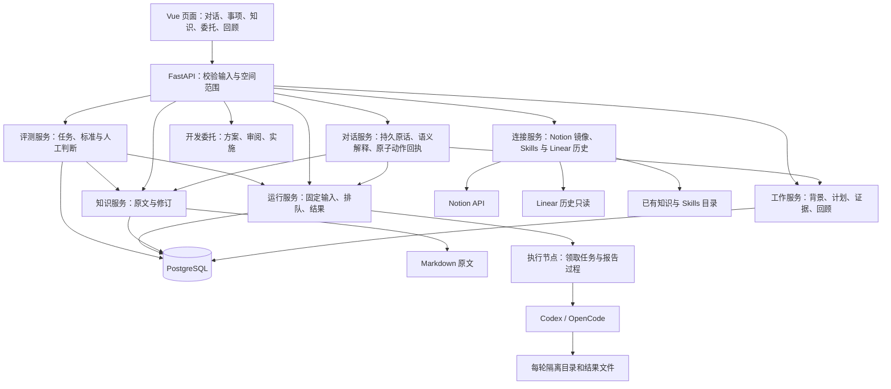
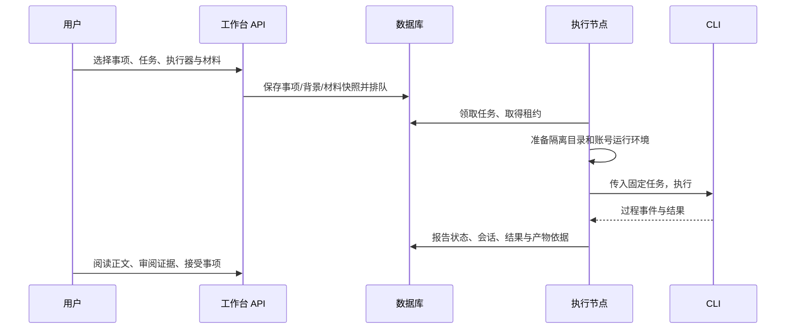

<a id="complete-guide"></a>
# LifeWeave：完整项目说明

这是当前产品、状态、架构、路线和使用维护说明的连续阅读版；每篇仍在原位置维护，本文件从固定规范清单重建。

本次收录 10 份当前来源，正文完整保留。原始讨论、旧规格、验证和失败记录见[历史完整汇编](history/complete-guide-20260926.md)及各当前文档中的证据链接，不与当前结论混排。

维护时先更新分篇，再执行 `python scripts/build_complete_guide.py`；`python scripts/build_complete_guide.py --check` 会逐篇检查整合版是否与当前来源一致。

## 阅读目录与来源覆盖

| 部分 | 章节 | 来源 | 原文 SHA-256 |
| --- | --- | --- | --- |
| 当前说明 | [LifeWeave](#doc-01) | `README.md` | `6509d5c9b670e70de3af1cdfa78364e8e94c4da126d4b56f9cf45f9b7a02adbe` |
| 当前说明 | [LifeWeave 项目文档](#doc-02) | `docs/README.md` | `42aa3af950c45bfc64b698281b62b22be248c0311723bffd68bc1f326a163e0d` |
| 当前说明 | [产品设计：让分散的事情接得上、推得动](#doc-03) | `docs/product.md` | `afacca1738d92bd7e94efe5075b1d76f615ca35ecf4d379022bd60038381f789` |
| 当前说明 | [架构与关键实现](#doc-04) | `docs/architecture.md` | `ba008a360c31c8a7e914e3fe20d77cc26a230ef74e27859532b67ed673ea4e38` |
| 当前说明 | [插件目录与开发过程：首个可运行切片](#doc-05) | `docs/plugin-system.md` | `80e15a511db4fbaf6cce8daead7aaa67129a8a676e6adbd58c2d29a5d9b47f2a` |
| 当前说明 | [当前完成情况](#doc-06) | `docs/status.md` | `8bef3ca2fe00735e4344d2639b16208ebd4b244c41c244513142450eda4347b8` |
| 当前说明 | [当前建设路线](#doc-07) | `docs/roadmap.md` | `563c1874c1a6e154c9a16063ea91feec947c489f180ce519ce4bb473f40ddadb` |
| 当前说明 | [开发与运行维护](#doc-08) | `docs/development.md` | `695564a8c2b7eb9ccc855fc2d0eb7ed8764cf54d8e8871830c911b67d28737e5` |
| 当前说明 | [LifeWeave：名称与适配](#doc-09) | `docs/naming.md` | `c9af16fac248971f1bd99b4a0893a3bf6d44fc9889da2b0aa96630abf0f5117c` |
| 当前说明 | [研究成果归档、离线阅读与跨文章讨论](#doc-10) | `docs/research-archive.md` | `e3d4980ab611ac1c975ce3122f27f6ceb53c57756716fc7003396e52aa77d3f7` |

---

<a id="doc-01"></a>
<!-- source-begin: README.md -->
<a id="doc-01-line-1"></a>

## LifeWeave

**工作与生活，有序展开。**

LifeWeave 希望把工作、学习、爱好和生活中的想法、计划、行动与积累连接起来。当前以 LifeWeave 为暂用英文产品名，不再使用中文产品名；工程标识仍为 `lifeweave`。当前可用的是本机 AI 工作台：管理事项与背景、阅读和修订知识、委托 AI、审阅成果及回顾进展。

这是独立的本机应用与 Git 仓库。数据、依赖和进程都由本目录管理，不启动 Omni-Brain 或质检平台。部分工作模型与执行代码来自 Omni-Brain，来源和本轮交付范围见 [交付记录](delivery.md)。

<a id="doc-01-line-9"></a>

### 理解项目

想连续阅读全文，可直接阅读 [当前项目说明（整合版）](#complete-guide)：只汇编当前规范说明；2026-09-26 以前的 46 份全文和验证记录保留在[历史完整汇编](history/complete-guide-20260926.md)。

第一次接触项目，按下面顺序阅读：

1. [产品设计](#doc-03)：为谁解决什么问题、日常怎样使用、为什么这样组织。
2. [架构与关键实现](#doc-04)：数据由谁维护，用户动作怎样穿过前后端，代码从哪里读起。
3. [当前完成情况](#doc-06)：已经能用、实现但未实测、尚未实现的能力及证据。
4. [建设路线](#doc-07)：下一阶段按用户结果交付什么。
5. [开发与运行维护](#doc-08)：本地启动、配置、验证、改名兼容和排障。

[文档导航](#doc-02) 区分当前说明与历史证据；[命名说明](#doc-09) 解释名称与适配边界。

[个人管理平台优化讨论与演进方案](../workspaces/reviews/personal-platform-evolution/review.md) 完整追踪本轮原始讨论、设计取舍和已实现范围。

<a id="doc-01-line-25"></a>

### 开始使用

需要 Linux / WSL、Python 3.10+、Node.js 22+、npm，以及 PostgreSQL 16 的服务端命令。默认 PostgreSQL 命令目录为 `/usr/lib/postgresql/16/bin`，可用 `LIFEWEAVE_PG_BIN` 指定。AI 功能需要已安装并登录的 Codex 或 OpenCode CLI。

```bash
cd /home/yyh/project/lifeweave
python scripts/workbench.py setup
python scripts/workbench.py start
```

打开 **http://127.0.0.1:8010**。在 WSL 中可使用 Windows 浏览器访问该地址。默认进入个人空间；左上角可以切换团队空间。

1. 默认打开“对话”。直接提问、说出研究委托，或选“只记录”保存想法；历史对话可刷新后继续。左侧可保存明确的方向与偏好。
2. 在“计划”中安排优先级、日期和阶段。事项详情保存背景、讨论、关联材料与修改提案。
   “我的日常”可点“调整首页”，通过勾选、位置和上下移动配置卡片；个人与团队分别保存。
3. 点“委托 AI”，写清这次希望得到什么。可选择执行器、项目目录、工作方法与知识。不选项目时使用空白任务目录；选 Git 项目时使用固定提交的独立 worktree，未提交修改不会自动带入。
4. 在对话和事项页阅读完整成果，查看公式与本轮图片，选择历史版本、下载纯正文，或点“下载完整包（含图片）”取得可离线阅读的 ZIP。选中段落可保存定位反馈，再让对话继续修订。运行成功不会自动完成事项。
5. 从成果提出知识候选，或在“知识与材料”写笔记。阅读差异后接受或拒绝；当前原文变化会阻止覆盖。已接受知识可供后续对话和研究读取。
   打开一篇知识后，可在正文下查看它引用的同源 Markdown 和反向引用；断链会提示，不能误当成已有材料。
   “知识范围”选 **LifeWeave 项目**，可直接阅读当前产品、架构、状态与建设路线；这些原文只读引用本仓，不与历史汇编混排。
6. 在“周回顾 / 组会”配置关注内容、冻结当次内容、记录讨论并导出 Markdown。
7. 在“维护中心 → 能力与成长”可直接创建 Skill/Agent 候选，或从工作中的改进建议接续；创建不会自动安装或发布。在“评测任务”选择已有事项，写本次任务和通过标准；开始时可选 Git 仓库、方法与知识，所选输入固定到实际 Run。不选仓库时在空隔离目录运行。结束后查看过程、接受证据并记录判断，或把问题关联成改进建议。打开候选可看它及明确前任的工作样例、失败历史和关联委托。评测候选通过后进入已验证状态；当前候选及明确记录的前任候选若有失败，须沿原标准再评通过，才能显式发布。

“能力与评测 → 插件目录”展示当前受管开发能力、方法、执行器和脚本的身份、依赖与空间启停。需求/修复事项的“开发 Agent”可对照固定插件计划与实际调用；原方案、Run 事件和代码差异继续保留。具体观测范围及未接入能力见[插件目录与开发过程](#doc-05)。

“就地讨论”会打开关联当前事项的 AI 对话；展开“附带其他研究成果”，可明确选入其他论文。已有知识另按问题匹配读取，实际来源及版本显示在回复下方。

在“设置与连接 → 研究成果自动归档”启用后，新成功报告会自动写入 GitHub 的 `research-archive` 分支；配置 Notion 后，正文也会进入单向镜像。两个目标分别显示回读状态，失败保留本地并重试；以前的成果可点“立即归档 / 重试”。[当前两篇 GitHub 归档](https://github.com/pokemonAndCodeMaster/Life-Weave/tree/research-archive)在本机关机后仍能访问。原有 Linear 文档仅作历史只读，不再接收新报告。代码在同仓 `main`；归档范围是成果与引用材料，不是整套运行数据库或自动采纳正式知识。详见 [归档与跨文章讨论](#doc-10)。

本机 Codex 已在正式 LifeWeave 仓的网页开发委托中跑通。OpenCode 指定模型曾完成一次三阶段小仓任务，但后续浏览器委托发现其只读方案可通过子代理写入隔离树；该委托已取消，网页 OpenCode 开发选项暂时关闭，直到权限与阶段检查通过真实回归。见[第二执行器实测与反例](evidence/development-agent/opencode-chain.md)。重试是关联到原委托的新尝试，不是恢复原生 CLI 会话。

本轮已通过工作台完成 [Qwen-Drive 第一轮研究](http://127.0.0.1:8010/lifeweave/personal/items/item-810217743bbb4be2/outputs)。该入口属于当前本机安装；新安装不会预置这份个人事项。研究可用版的证据、明确边界和后续日常 Alpha 计划见 [当前完成情况](#doc-06)。

<a id="doc-01-line-58"></a>

### 连接已有积累

“设置与连接”可以添加已有 Markdown 知识目录、包含各个 `SKILL.md` 子目录的 Skills 根目录，以及 Notion 镜像连接。Linear 仅保留既有历史读取。

- 外部知识只读；修订可下载，交回原仓库处理。工作台管理的知识默认写入 `.runtime/knowledge/{personal,team}`。
- 委托时按需选择一套 Skill 和最多 10 篇知识，固定正文与方法支持文件。重试保留已选择资料的快照；要使用更新后的资料，创建新委托。Skills 需要适用于目标工程；引用原仓库专有脚本的方法仍可能需要调整。
- Notion 后台镜像使用单独的集成令牌文件和根页面授权。本机 Codex 的 Notion OAuth 只供交互式读取，不能替代后台令牌；未配置时页面如实显示“未启用”。原文留在 Git 仓或本机知识库。
- 旧 Linear 连接可读取历史事项和已归档文档；新评论、发布及研究自动归档已停止。

<a id="doc-01-line-67"></a>

### 数据与运行

```bash
python scripts/workbench.py status
python scripts/workbench.py stop
python scripts/workbench.py backup
python scripts/workbench.py start
```

备份位于 `.runtime/backups/`，包括 PostgreSQL dump 和工作台知识压缩包。外部知识、CLI 账号凭证、方法连接配置和运行目录需按需另行备份。不要把包含个人数据或凭证的 `.runtime/` 提交到仓库。

恢复时先停止应用，将 dump 用 `pg_restore` 恢复到一个**新的数据库**，将知识包解压到新的知识目录，再用 `LIFEWEAVE_DB_NAME` 和 `LIFEWEAVE_PERSONAL_KNOWLEDGE_ROOT` / `LIFEWEAVE_TEAM_KNOWLEDGE_ROOT` 指向它们。先检查恢复结果，再切换日常使用环境；不覆盖现用数据库。

数据库仅监听本项目私有 Unix socket，目录 `.runtime/postgres/`，端口参数 `55440`，默认数据库和角色均为 `lifeweave`。服务日志为 `.runtime/server.log`；AI 的隔离目录、私有账号副本与产物位于 `.runtime/executions/`，运行记录保存在数据库。不要在 AI 正在执行时停止服务。

本机服务只监听 `127.0.0.1:8010`。当前身份是本机单用户，个人/团队是内容空间，**没有多人登录与成员权限系统**。不应直接暴露到公网。团队执行机和 Docker 协议保留，但默认启动个人空间的本机 worker；团队空间可以在设置中明确选择使用本机账号启用执行。远程执行需要另行部署与验证。

<a id="doc-01-line-84"></a>

### 开发与验证

后端 FastAPI + PostgreSQL，前端 Vue 3 + TypeScript。前端开发服务器为 `127.0.0.1:5180`，代理到 `8010`。

```bash
.venv/bin/pytest
LIFEWEAVE_TEST_DB=1 .venv/bin/pytest tests/test_live_database.py
cd web
npm run type-check
npm test
npm run build
```

数据库集成测试在本项目 PostgreSQL 中创建随机命名的临时数据库，完成后删除；不会清空使用中的工作台数据库。实际浏览器与 AI 验证记录见 [交付记录](delivery.md)。

API 文档：<http://127.0.0.1:8010/docs>，当前接口前缀 `/api/lifeweave/`，页面前缀 `/lifeweave/`。旧页面仍会跳转；旧 API 客户端须跟随 308，或改用新前缀。配置读取范围见 [运行维护](#doc-08-line-29)。数据库变更新增到 `migrations/`，启动时按摘要校验并只应用新版本。

<a id="doc-01-line-101"></a>

### 在新的本机 Agent 会话接续

当前支持本机 Codex/OpenCode 等可运行命令的会话，使用同一工作台 API；不依赖开发者聊天记录。先让 Agent 阅读本节或运行帮助：

```bash
python scripts/lifeweave.py --help
python scripts/lifeweave.py discover '想继续的目标'
python scripts/lifeweave.py continue item-实际编号
python scripts/lifeweave.py development-choices item-实际编号
python scripts/lifeweave.py recommend item-实际编号
python scripts/lifeweave.py read-knowledge 'local:知识路径.md'
python scripts/lifeweave.py knowledge --source lifeweave-project
python scripts/lifeweave.py read-knowledge 'lifeweave-project:docs/status.md'
python scripts/lifeweave.py read-method method-实际编号
python scripts/lifeweave.py runs
python scripts/lifeweave.py capture '先记一个生活想法，暂时不推进'
python scripts/lifeweave.py feedback item-实际编号 '重点理解错了，先讨论适用范围'
```

`development-choices` 只读查询开发选项并打印 JSON，不启动执行。

`capture`、`create`、`discuss`、`feedback` 只保存，不启动 AI。`run` 是显式委托，会采用文本匹配推荐的输入；先查看 `recommend` 的依据，无匹配时不捏造方法，复杂适用性仍由 Agent 判断。网页的“委托 AI”也会预选推荐，可手动调整。推荐、实际输入快照与执行步骤是不同证据。

事项概览的“接着推进”可查看当前记录、下载接续 JSON、保存针对事项或具体运行的纠偏。新的运行/重试会自动固定这些反馈，已有运行保持原输入；反馈不会自动改变已接受目标。重复发送相同反馈可使用同一 `--request-id`；其他创建动作遇到超时须先读取确认，不自动重发。

命令读取本机服务，失败返回非零；`--workspace team` 切换空间。ChatGPT 远程连接、自然语言自动排程、自动发布方法改进尚未完成。完整研发方案见 [下一阶段产品方案](../workspaces/reviews/lifeweave-next-stage/review.md)。

在已经打开的 Codex 会话开发代码时，可按[开发与维护说明](#doc-08-line-102)把实际阶段与 Git 状态写回同一事项。明确绑定且 Codex 信任本机 Hook 后，受支持的工具和生命周期元数据也会自动出现在推进记录；它不上传原始命令/输出，且不能保证捕获所有步骤。受管网页委托另有完整 Run 记录。
<!-- source-end: README.md -->

---

<a id="doc-02"></a>
<!-- source-begin: docs/README.md -->
<a id="doc-02-line-1"></a>

## LifeWeave 项目文档

LifeWeave 希望帮助个人与协作中的人，把工作、学习、爱好和生活中的事情有序推进。当前提供本机工作台；愿景中的所有生活管理和多人能力尚未完成。

**一次读懂当前项目：[当前项目说明（整合版）](#complete-guide)。** 整合版只收录[当前规范清单](current-sources.json)内的原文，不拼入历史聊天和旧验收；原分篇仍是维护入口。原来 46 份来源无删节的版本保留在[历史完整汇编](history/complete-guide-20260926.md)。更新分篇后运行 `python scripts/build_complete_guide.py`，用 `python scripts/build_complete_guide.py --check` 检查当前版是否同步。

| 读者想知道什么 | 阅读入口 |
| --- | --- |
| 为什么做、准备怎样解决问题 | [产品设计](#doc-03) |
| 下一阶段怎样交付 | [建设路线](#doc-07) |
| 本轮批准的行为与首版验收 | [产品定义与首版迭代计划 v1.0](../LifeWeave_产品定义与首版迭代计划_v1.0_2026-09-19.md) |
| 完整产品能力如何分批建设 | [下一阶段产品方案](../workspaces/reviews/lifeweave-next-stage/review.md) |
| 个人管理平台新讨论如何进入产品 | [原始讨论与演进方案](../workspaces/reviews/personal-platform-evolution/review.md) |
| 本轮评测、知识关联与首页实际验证 | [平台演进证据](evidence/personal-platform-evolution/README.md) |
| 用户动作如何实现、数据放在哪里 | [架构与关键实现](#doc-04) |
| 插件目录、固定计划与受管调用怎样使用 | [插件目录与开发过程](#doc-05) |
| 现在能做什么、哪些还不能依赖 | [当前完成情况](#doc-06) |
| 怎样启动、修改、验证和维护 | [开发与运行维护](#doc-08) |
| 怎样用当前项目知识发起开发、核对固定版本与 Notion 镜像 | [网页开发操作步骤](#doc-08-line-162) |
| 为什么叫 LifeWeave、哪些名称已适配 | [命名与兼容](#doc-09) |
| 亲自打开应用并完成第一项工作 | [项目首页与使用步骤](#doc-01) |

当前说明以本仓源码、迁移和运行结果为依据。修改功能时，应同步受影响的产品说明、实现说明或状态；精确字段仍以源码和运行中的 [API 文档](http://127.0.0.1:8010/docs) 为准，不在文档里维护逐函数副本。

历史材料单独保留：[初始授权](brief.md)、[首次交付](delivery.md)、[首轮证据](evidence/README.md)、[此次改名要求](rename-request.md)。其中旧名称、旧路径、截图、运行 ID 和原始输入应按当时事实理解，不能因为改名而重写成新的验证证据。

[研究归档与跨文章讨论](#doc-10)：云端入口、ZIP 使用、自动触发及恢复范围。
<!-- source-end: docs/README.md -->

---

<a id="doc-03"></a>
<!-- source-begin: docs/product.md -->
<a id="doc-03-line-1"></a>

## 产品设计：让分散的事情接得上、推得动

<a id="doc-03-line-3"></a>

### 我们要解决的问题

一个人可能同时在推进工作项目、学习一门技术、研究游戏、安排旅行和照顾生活。信息分散在聊天、文档、待办和代码中；每次回来都要重新找资料、解释背景、判断做到哪里。加入 AI 之后，问题并没有自动消失：一次回答有帮助，但任务背景、执行过程和最后采纳的结果仍容易断开。

LifeWeave 的愿景，是让这些事情有清楚的入口、持续的背景、可推进的行动和能够复用的积累。AI 是其中一种执行方式，人工完成、讨论决定和暂时搁置也都是正常路径。

**当前实现重点是从网页自然交代事情，持续研究、反馈和积累知识。** 它已有个人和团队内容空间；还没有多人身份权限，也没有专门的习惯打卡、家庭账本、健康记录或日历同步。这些不能从“管理生活”的愿景推断为现成功能。完整目标与首版范围由 [产品定义 v1.0](../LifeWeave_产品定义与首版迭代计划_v1.0_2026-09-19.md) 维护，本页说明实际产品行为。

<a id="doc-03-line-11"></a>

### 用户怎样使用

例如准备一次旅行，可以先记下“秋天想去徒步”的想法；确定要推进时创建个人事项，写清时间、预算和限制，关联资料。之后自己整理清单，或选择材料让 AI 给出候选路线。读完结果、补充实际核验，再保存成果。下次打开事项，不必从聊天历史重建目的与约束。

这个例子说明现有通用对象如何承载生活事务，并非已经完成旅行业务验证。首轮实际验证用的是工作台交付检查、知识笔记和团队会议议程，详见 [状态与证据](#doc-06)。

当前页面按用户动作组织：

| 入口 | 用户做什么、拿到什么 |
| --- | --- |
| 对话（默认首页） | 直接提问、只记录想法，或委托研究；查看真实动作回执，沿同一事项继续，编辑明确的方向和偏好 |
| 我的日常 / 团队工作 | 记录灵感，查看需要判断的事、正在推进的事项和 AI 委托；按空间调整首页卡片的显示、顺序与主栏/侧栏位置 |
| 工作事项 | 创建不同类型的事项，阅读目标、范围、讨论、材料与成果；可关联子事项 |
| 计划 | 安排优先级、日期和阶段；与事项详情操作同一条工作记录 |
| 灵感与讨论 | 留下尚未形成任务的想法，逐步与具体事项建立联系 |
| 知识 | 阅读和搜索 Markdown；查看同一来源内的出链、反向引用和断链；本机知识修改先比较差异再接受，外部资料保持来源 |
| AI 委托 | 查看排队、执行、失败与结果；取消或建立下一次尝试 |
| 能力与评测 | 看已登记方法；直接创建 Skill/Agent/Harness 试验候选或从改进建议接续；为现有事项写任务与通过标准，启动时选择仓库、方法和知识；依据成果、过程和已接受证据判断，沿同一标准再评或形成改进建议；从候选详情回看工作样例、关联委托与评测历史 |
| 周回顾 / 组会 | 选择关注内容，阅读实时进展，冻结当时内容并导出纪要 |
| 来源连接、设置 | 配置知识与 Skills 来源、Notion 镜像和本机执行；旧 Linear 事项仅历史只读 |

<a id="doc-03-line-32"></a>

### 为什么以“事项”连接工作

事项代表一件需要持续推进和判断结果的事。它可以是需求、修复、学习、个人安排、爱好或研究；类型不代表已经为每个领域构建了专用系统。

一个事项围绕以下内容展开：

- **背景**：当前目标、范围、共识、已知事实和未决问题。它帮助人和 AI 知道“为什么做、做到哪里”。
- **安排**：阶段、优先级和日期。它回答“什么时候继续、当前是否受阻”。
- **材料与讨论**：来源、参考和决策过程。资料可以被多个事项引用，不要求复制一套正文。
- **执行与成果**：人工记录或 AI 尝试及其输出。执行结束之后，仍需判断成果是否符合目的。

想法不必立即变成事项；正文阅读不必先启动 AI；人工提交成果不依赖执行器。这样工作台才可以用于学习和生活，而不把所有活动塞进软件开发流程。

<a id="doc-03-line-45"></a>

### 从对话到可继续使用的研究

例如在对话中交代“帮我研究这篇论文”，工作台保存原话，建立或关联持续事项，按目标推荐已有方法和知识，再启动真实执行。它会展示实际排队、执行、失败与成果状态。普通提问只回答；明确选择“只记录”时不调用模型、不启动委托；“仅讨论”不启动业务执行。

研究结束后，正文、公式、本轮图片与引用在网页阅读。可以选中一段留下具体反馈，再要求沿同一目标修订；新尝试固定前轮成果、反馈与明确偏好，保留旧版本。目标变化先形成提案，采纳后才成为当前目标。个人偏好由用户明确编辑，一次临时要求不会自动变成永久画像。

有价值的成果可整理为知识候选，比较差异后再接受。后续对话和研究读取已接受的知识，并标明来源；候选与模型自述不能替代接受动作。请求失败保留原话，结果不确定时按原请求身份核查；业务运行的重试是有历史关联的新尝试。

上述路径已有真实模型、数据库和网页验证，具体成功、失败与修复记录见 [当前状态](#doc-06)；它不保证模型对每篇论文的解释正确，也不代表用户已经学会论文。论文质量、用户理解和产品可接续性分别判断。

<a id="doc-03-line-55"></a>

### 三个影响可靠性的设计选择

<a id="doc-03-line-57"></a>

#### 背景变化有来路

已采纳背景是当前共同依据。改动先作为提案保存，保留原版本和来源；接受后生成下一版本。提交时检查版本，避免两个编辑动作悄悄覆盖彼此。

事项速览、详情和实时回顾读取当前已接受背景。历史运行和冻结回顾保留当时内容，所以“现在认为怎样”和“当时依据什么”可以同时解释。

<a id="doc-03-line-63"></a>

#### 运行成功与事情完成分开

AI 返回文字、命令成功退出，只能证明执行完成。用户还需要阅读结果、核对材料，审阅证据，再决定是否接受事项。人工成果使用同一审阅入口。平台不能替用户宣称“这份攻略一定正确”或“这个需求已经满足”。

<a id="doc-03-line-67"></a>

#### 知识原文有明确归属

工作台管理的知识写在本地 Markdown 文件中。数据库记录修改候选、版本指纹和审阅过程；它不维护第二套独立的“正式正文”。外部知识目录按原位置只读引用，修改候选可以下载后交回来源处理。

阅读 Markdown 时，工作台从当前可读文件整理同一来源目录内的知识链接，显示“本文引用”和“引用本文”。目标文件不存在或越过目录边界会明确标出，不假装已经纳入知识。它是可重建的阅读索引；跨来源关系、自动事实本体和大规模检索仍待真实材料验证。

Notion 当前承担在线阅读镜像，原文仍由 Git 仓或本机知识目录维护。镜像必须保留来源版本并回读确认；尚未配置后台授权的内容不能显示为已同步。Linear 旧关联与链接只供历史读取，不再作为新事项、评论或报告的写入目的地。

<a id="doc-03-line-75"></a>

### 个人和团队的边界

当前同一个应用中存在 personal 与 team 两个内容空间，数据查询、知识目录和执行记录按空间区分。团队使用本机账号执行需要在设置中明确启用。

首页提供不同的个人/团队卡片预设。打开“调整首页”可以点击隐藏、移动或更换主栏/侧栏，保存后只改变本空间的呈现偏好；事项、知识和运行本身不变。自然语言重排页面、任意组件画布和团队成员各自的个性化布局尚未实现。

这解决的是本机内容分区与执行选择。它不等于多人登录、组织成员管理、角色权限或可公开部署的团队 SaaS。后续团队建设应从真实共享与权限场景出发，再决定哪些数据共同维护、哪些账号和知识必须隔离。

<a id="doc-03-line-83"></a>

### 后续怎样判断产品在进步

有价值的改进应让真实使用者更容易找到背景、继续行动、读懂成果和保留积累。观察重点包括：回来后是否需要重新解释、当前依据是否一致、失败是否可以处理、知识修改是否可追溯，以及计划是否真正帮助推进。

“能力与评测”把一次工作作为可检查的案例：用户先写要做什么、怎样算通过；开始时可以选择只读 Git 仓库、工作方法和知识，系统固定本轮实际输入并创建真实委托。不选仓库时执行器处于空隔离目录，无法核验项目源码。普通事项委托也可从当前空间的可试验候选中直接选择。结果出来后可以打开运行过程、在事项中接受证据，再记录通过、失败或无法判断。候选详情直接列出关联事项、标准、判断和运行；通过的评测可作为有来源的工作样例，失败也保留在历史中。候选能力通过后进入已验证状态，但是否发布仍需用户决定；发布要求本版本至少一次显式评测通过，且不能有未完成的评测。当前候选及明确记录的前任候选若有失败或无法判断，须沿原任务与标准建立再评并通过；另外新建一个更容易的任务，即使通过，也不能覆盖原问题。没有明确前任关系的同名候选不会被系统擅自合并。评测后可把发现的问题、目标行为和下次验证方法关联成改进建议，之后仍需另行建立、验证并发布候选。这个入口管理人工判断与版本证据，不自动证明 AI 答案正确。

研究可用版已用两篇真实论文验证过局部路径。当前优先让 LifeWeave 的项目知识进入工作台，并让一次真实开发的事项、材料、执行、验证和知识变化可以接续；随后扩展日常时间安排、多入口和团队能力。未实现范围与每阶段验收见[当前状态](#doc-06)和[建设路线](#doc-07)。原有方案与讨论仍在[历史说明](../workspaces/reviews/lifeweave-next-stage/review.md)中保留。
<!-- source-end: docs/product.md -->

---

<a id="doc-04"></a>
<!-- source-begin: docs/architecture.md -->
<a id="doc-04-line-1"></a>

## 架构与关键实现

<a id="doc-04-line-3"></a>

### 系统怎样分工

LifeWeave 是一个独立的模块化单体：Vue 页面处理交互，FastAPI 接收操作并协调业务模块，PostgreSQL 保存工作事实，Markdown 保存知识正文，本机执行节点调用已经安装的 CLI。启动应用不需要运行 Omni-Brain 或连接质检数据库。



程序集成入口在 [src/api/app.py](../src/api/app.py)。它创建数据库连接、工作服务、知识服务、执行器和外部连接；启动时恢复过期租约并启动已启用的本机节点，退出时关闭节点和连接池。生产构建的 Vue 静态文件也由这个进程提供。

当前 Python、Vue、数据库与执行材料统一使用 LifeWeave 命名；历史入口兼容见 [命名说明](#doc-09)。

| 职责 | 主要代码入口 |
| --- | --- |
| 页面路由与整体导航 | [router/index.ts](../web/src/app/router/index.ts)、[LifeWeaveShell.vue](../web/src/features/lifeweave/components/LifeWeaveShell.vue) |
| 自然入口与持久对话 | [conversations.py](../src/lifeweave/conversations.py)、[conversation_interpreter.py](../src/lifeweave/conversation_interpreter.py)、[ConversationPage.vue](../web/src/features/lifeweave/pages/ConversationPage.vue) |
| 成果、定位反馈与知识来源 | [research_outputs.py](../src/lifeweave/research_outputs.py)、[research_references.py](../src/lifeweave/research_references.py)、[ResearchOutputPanel.vue](../web/src/features/lifeweave/components/ResearchOutputPanel.vue) |
| 跨页面工作状态和操作 | [useLifeWeaveWorkspace.ts](../web/src/features/lifeweave/composables/useLifeWeaveWorkspace.ts)、[API 客户端](../web/src/features/lifeweave/api/lifeweave.ts) |
| 工作规则与数据库读写 | [工作服务](../src/lifeweave/service.py)、[工作 Repository](../src/lifeweave/repository.py)、[请求模型](../src/lifeweave/models.py) |
| 知识全文与候选修改 | [library.py](../src/lifeweave_knowledge/library.py)、[KnowledgePage.vue](../web/src/features/lifeweave/pages/KnowledgePage.vue) |
| LifeWeave 项目当前规范入口 | [当前来源清单](current-sources.json)、[library.py](../src/lifeweave_knowledge/library.py)、[KnowledgePage.vue](../web/src/features/lifeweave/pages/KnowledgePage.vue) |
| Markdown 引用与反向发现 | [links.py](../src/lifeweave_knowledge/links.py)、[KnowledgeRelations.vue](../web/src/features/lifeweave/components/KnowledgeRelations.vue) |
| 委托创建、重试和记录 | [运行服务](../src/lifeweave_runtime/service.py)、[运行 Repository](../src/lifeweave_runtime/repository.py) |
| 本机节点与 CLI 执行 | [local_workers.py](../src/lifeweave_runtime/local_workers.py)、[worker.py](../src/lifeweave_runtime/worker.py)、[执行器接口](../src/agent_runtime/executor.py) |
| 方法材料与 Linear | [task_sources.py](../src/integrations/task_sources.py)、[linear.py](../src/integrations/linear.py) |
| 评测任务、能力历史与发布门槛 | [evaluations.py](../src/lifeweave/evaluations.py)、[evaluation_repository.py](../src/lifeweave/evaluation_repository.py)、[EvaluationBoard.vue](../web/src/features/lifeweave/components/evaluations/EvaluationBoard.vue)、[CapabilityHistory.vue](../web/src/features/lifeweave/components/evaluations/CapabilityHistory.vue) |
| 首页预设与用户调整 | [homeLayout.ts](../web/src/features/lifeweave/utils/homeLayout.ts)、[HomePage.vue](../web/src/features/lifeweave/pages/HomePage.vue)、[HomeDashboardCard.vue](../web/src/features/lifeweave/components/HomeDashboardCard.vue) |
| 外部 Codex 开发阶段与 Git 观测 | [external_development.py](../src/lifeweave/external_development.py)、[正式 CLI](../scripts/lifeweave.py)、[ItemActivityTab.vue](../web/src/features/lifeweave/components/ItemActivityTab.vue) |
| 网页开发委托与隔离差异 | [development.py](../src/lifeweave/development.py)、[development_router.py](../src/lifeweave/development_router.py)、[DevelopmentPanel.vue](../web/src/features/lifeweave/components/DevelopmentPanel.vue) |
| 插件目录、固定计划与调用对照 | [插件内核](../src/lifeweave_plugins/core.py)、[插件服务](../src/lifeweave_plugins/service.py)、[PluginCatalog.vue](../web/src/features/lifeweave/components/PluginCatalog.vue)、[PluginProcess.vue](../web/src/features/lifeweave/components/PluginProcess.vue)；范围与边界见[插件说明](#doc-05) |
| Notion 单向镜像 | [notion_mirror.py](../src/integrations/notion_mirror.py)、[NotionMirrorSettings.vue](../web/src/features/lifeweave/components/NotionMirrorSettings.vue) |

<a id="doc-04-line-59"></a>

### 数据分别保存在哪里

PostgreSQL 的 `workbench` schema 保存以下对象。完整字段以 [migrations](../migrations) 为准；此表解释职责，不复制所有列。

| 数据组 | 保存内容 | 事实边界 |
| --- | --- | --- |
| item / entity / relation | 事项、想法、专题、资源、成果及关联 | 事项保存执行安排；资料可以被引用，不必变成事项 |
| conversation / conversation_turn / personal_model | 对话、原话、解释状态、动作回执、明确方向与偏好 | 同一请求去重；对话不自动变成事项，偏好不自动推断 |
| research_knowledge_candidate | 研究运行与知识修订、运行内容版本及请求身份 | 关联现有修订，不复制第二份正式知识 |
| context / context_version / context_proposal | 当前背景指针、背景版本、修改提案 | 当前指针指向已接受版本；候选不是当前事实 |
| evidence / discussion / activity | 核验依据、讨论、进展记录 | 证据接受与事项完成分开，保留原因和来源 |
| meeting / snapshot / note / preference | 回顾配置、冻结内容、会议记录、事项视图和首页布局偏好 | 冻结内容用于解释历史；布局只保存卡片键、顺序、位置和可见性，不复制工作数据 |
| machine / run / run_event | 执行节点、输入快照、尝试、事件、结果 | 运行状态是技术事实，不自动替代业务接受 |
| document_revision / library_source | Markdown 候选、源指纹、外部目录登记 | 正式知识原文仍在文件中 |
| linear_binding / linear_publication | 来源关联、远端快照、发送预览和核对状态 | 本地事项和 Linear 状态不做自动覆盖 |
| lifeweave_development_assignment | 同一事项的开发目标、固定提交/背景/材料版本与各阶段 Run | 审阅明确通过且版本未变才启动可写实施；终态仍待用户接受 |
| capability / capability_verification | 已复用的能力候选与验证记录；候选可显式记录前任 ID | 不凭名称推断能力血缘；旧候选失败在前任链内参与新候选发布判断 |
| evaluation | 目标事项、评测对象与候选版本、指令、通过标准、实际 Run、人工结论和证据；同标准再评引用前一条，改进建议反链 | 评测不复制事项正文或运行事件；发布要求显式通过评测，未完成者阻断，当前及前任未通过者须在同一标准的再评链中得到通过 |

`.runtime/knowledge/{personal,team}` 保存本机知识原文；外部资料仍留在登记目录。`.runtime/executions/{space}/{run}/` 保存该轮工作目录、账号运行副本和产物。方法连接配置、本机节点设置、旧 Linear 连接及 Notion 镜像状态也在 `.runtime/`，不会提交到 Git。

结构化业务对象常用 JSONB 保存有差异的内容，避免为每种学习或生活事项提前设计独立表。代价是字段语义主要由 Service 和页面适配器约束；扩展公共字段时需要同时检查输入校验、持久化与多个页面，不能只改显示名称。

<a id="doc-04-line-82"></a>

### 一次事项修改怎样生效

页面通过共享 API 客户端发送明确空间和对象 ID。Router 用 Pydantic 校验请求，Service 检查业务规则，Repository 执行 SQL。普通编辑带当前版本，数据库更新使用期望版本条件；版本过时返回冲突，而不是覆盖新内容。

背景修订另有提案流程。接受提案时更新版本和当前指针，之后列表、详情及实时回顾加载已接受内容。列表不能只读取事项初始 `payload`，否则新目标只在详情显示；这曾是实际发现并修复的问题。回顾会把当前目标、范围等放入阅读投影，冻结则保存当次投影。

子事项的委托背景从 [current_context_snapshot](../src/lifeweave/service.py) 组装，包含共享背景与本次局部目标。修改这个方法时，必须检查根事项和子事项，防止 AI 只得到父目标或只得到孤立的子标题。

<a id="doc-04-line-90"></a>

### 一次 AI 委托怎样完成



创建委托时，[运行服务](../src/lifeweave_runtime/service.py) 读取事项的当前背景，把输入固定到运行记录。不指定工程时使用空白任务目录；指定工程时读取 Git 提交身份，执行节点创建独立 worktree，未提交修改不会自动进入。改动产物也不会自动合并回原仓。

一次可显式选择一项 Skill 和最多 10 篇知识。`TaskSources` 固定正文、来源指纹和方法支持文件；重试时保留这些已选输入。方法及支持文件合计最多 100 个文件、1 MB，选定材料主正文（含 Skill 主文件）合计最多 2 MB；具体限制和失败提示见 [snapshot 实现](../src/integrations/task_sources.py)。这与维护中心的能力发布机制是两个来源入口，运行时共同形成材料快照。

评测启动复用同一个 `create_run`，允许明确选择 Git 仓库、方法和知识。仓库提交、选中材料和实际版本随 Run 保存；评测只保存 Run 引用，不维护第二份材料快照。人工完成评测后，可以建立关联到评测、Run 和原事项的 `improvement` 实体；在维护中心它仍是原始建议，是否整理为 Skill/Agent/Harness 候选须另行决定。评测任务、判断和建议分别归属 `008_evaluations.sql` 与 `009_evaluation_improvements.sql` 的数据结构。

执行节点按租约领取任务，记录心跳、事件序号和报告。执行器适配层把统一请求转为 Codex/OpenCode CLI 参数，解析过程与结果。本机两空间各有可选节点；团队使用当前本机账号必须显式启用。远程/Docker 协议存在，但本机部署没有提供已经验收的远程集群。

失败、取消和不可用状态保存到同一运行记录。界面的“按当前背景再试”建立关联的新尝试，并取当前背景；它不是恢复原生 CLI 会话。运行的原生会话 ID 用于追溯。源码链接只读取该轮受控目录内允许类型的文本文件，不把任意路径开放给浏览器。

<a id="doc-04-line-119"></a>

### 知识修改为什么不会静默替换正文

[Library](../src/lifeweave_knowledge/library.py) 每次读取实际文件并计算指纹。提出修改时保存基准指纹、原文、候选正文和原因，页面显示差异；接受时锁定修订记录，重新核对文件指纹，再替换文件并更新状态。若用户已在编辑器里修改了源文件，接受会报冲突。

本机受管原文使用临时文件和原子替换；数据库操作发生 Python 异常时尝试恢复原文。文件系统与数据库不是同一个事务，进程或机器恰在两者之间崩溃的恢复仍有限，不能宣称分布式原子提交。外部来源的修订可以下载，但不能通过该入口覆盖原仓。

路径读取会核验所属空间、登记来源和根目录，拒绝越界及不允许的隐藏/raw 路径。页面用 Marked 渲染、DOMPurify 清理 HTML，并对中文相对 Markdown 链接做一次解码和根范围校验；源码行号链接先转换成受控读取地址，再清理 HTML。

LifeWeave 项目本身作为只读内置来源出现在个人和团队知识页。它从[固定清单](current-sources.json)逐篇读取当前 Git 工作树的 Markdown 原文；目录扫描、直接读取与链接关系均遵守同一清单。历史汇编和验证原料不会因为同在仓库内就成为当前规范。知识目录可按来源筛选；正式 CLI 也能用 `knowledge --source lifeweave-project` 搜索，再以 `read-knowledge` 读取全文和指纹。被选入 Run 时复用 `TaskSources.snapshot` 固定正文版本；这不证明执行模型遵循了材料。

引用关系由 `links.py` 使用 Mistune AST 从当前 Markdown 编译。它只识别同一来源内指向 `.md` 的相对链接，忽略代码块和图片；解码、规范化后再走 Library 路径边界。文件元数据相同的正文解析结果在本进程复用，出链是否存在及反向引用每次按当前可读目录重算。索引不是新的正式正文；外部文件变化通常由修改时间/大小触发重读，尚未完成海量目录容量验证。知识页读到的正文版本与关系响应一同返回，便于识别页面期间的变更。

<a id="doc-04-line-131"></a>

### Linear 的历史读取边界

首次引入用空间与远端 ID 计算稳定本地 ID，在事务内创建事项、初始背景和来源关联。重复引入只更新远端快照，保留本地编辑与安排。

原有评论预览和发布记录为历史数据。新写入端点返回只读提示；新研究成果不再排队到 Linear。原关联与已确认归档链接保持可读，但不能据此推定 Notion 已完成迁移。

<a id="doc-04-line-137"></a>

### 当前架构的适用范围

接口按空间检查数据，应用校验本机 Host 和写入 Origin，凭证不回传到页面；这不构成多人身份认证。默认只监听本机。CLI 的权限模式与隔离目录也不等于已经验证的多租户安全沙箱。

这种结构优先让单机使用和调试简单，并保留未来拆出执行节点的接口。真正引入多用户、远程访问或高并发前，需要增加相应身份、权限、调度、存储和故障验证，不能仅把监听地址改成公网。

<a id="doc-04-line-143"></a>

### 新会话接续、材料推荐与纠偏

`src/lifeweave/continuation.py` 从事项、已接受背景、待审提案、讨论、证据、所有分页运行及外部开发活动生成当前接续输出；不把输出保存成另一份规范正文。网页对话准备阶段也取得当前事项最近十条外部开发报告并注明观测边界。`scripts/lifeweave.py` 是正式本机客户端，网页与它共用业务 API；宿主 Agent 理解自然表达，产品保存和读取事实。

已有 Codex 会话直接开发时，`external-start` 与 `external-report` 经 [外部开发接口](../src/lifeweave/external_development.py)写入原事项的 activity。开始动作核对所选 Git 仓库，并把当前提交、已修改和未跟踪文件作为服务实际观测保存；方法和知识按当前原文固定版本引用。后续设计、实施、验证和知识变化由外部会话主动上报，服务在报告时再次观察 Git 状态。请求身份使超时重试不重复写入；空间、事项和会话身份不符则拒绝。详情的“推进记录”明确标示哪些是上报、哪些是 Git 观测。外部会话不建立虚构的平台 Run；受支持的自动元数据由下述 Hook 另行标注来源。

本机 [Codex Hook 桥接](../scripts/lifeweave_hook.py)只处理 CLI 已显式绑定到事项且 Git 根目录一致的原生会话。`PostToolUse`、`Stop`、`Interrupt` 记录原生 ID、模型、工具名和输入哈希；服务另读当前 Git 状态。原始工具输入与输出不进入工作台，Hook 事件按 ID 去重，页面与人工阶段报告分开标示。用户级 Hook 配置位于 `/home/yyh/.codex/hooks.json`，需要 Codex 自身信任；沙箱、本机服务或 Hook 覆盖范围会影响实际采集。外部会话的 Git 补丁只证明当前仓库相对起始提交的变化，不归因于某条工具事件。[真实烟测](evidence/development-agent/hook-smoke.md)记录了成功绑定与网络被沙箱阻断的反例。

`TaskSources.recommend` 使用可解释文本匹配返回候选、命中理由和版本。网页预选最多一个方法、十篇知识并允许调整；CLI 提供推荐、全文阅读与显式委托。创建运行时再次计算当前推荐，记录在 `environment_snapshot.inputRecommendations`，实际选择保存在 `selectedInputs`，实际内容以 `capability_snapshot` 为准。重试固定原材料和原推荐，并标明来自旧运行；不把来源更新后的推荐版本冒充原材料版本。worker 的 `materializedCapabilities` 证明材料写入，实际步骤仍需执行事件支持。

纠偏复用 discussion，明确保存类型、原文、上下文版本与可选 run/内容位置。请求身份去重，错用同一身份提交不同内容报 409。新建或重试从同一事项读取纠偏，并固定到 prompt 与 `environment_snapshot.feedbackSnapshot`；已有输入不变。普通讨论不自动成为纠偏，纠偏也不自动采纳为新目标；旧历史讨论保持原分类。

源码与默认数据库都已使用 LifeWeave 命名。SQL 005 只原位改标识，外键和数据身份保持；迁移总账在应用迁移前由 `src.cli` 改名。安装级数据库/角色通过私有集群专用脚本原位迁移，命令与回退边界见开发说明。

<a id="doc-04-line-157"></a>

### 网页自然对话与研究成果

网页 `/lifeweave/{space}/conversation` 是新的默认入口。`conversation_repository.py` 保存原话、每轮状态、引用位置和请求身份；`conversation_interpreter.py` 调用一次输出结构化决定的 Codex；`conversations.py` 校验决定并调用原有业务服务。普通回答不建事项；只记录模式直接保存想法，不调用模型。讨论与执行可以沿当前目标继续，也可以明确进入新主题。目标改动形成待审提案，知识改动形成待审修订。

解释器使用隔离账号运行副本，只保留模型与 provider 配置，禁用继承的连接器、工具、规则和 Skills；它不负责实施动作。研究委托仍走原有执行节点和受控目录。团队解释沿用显式启用本机账号的门槛。这里没有新建通用 Agent 编排器，也不声称 CLI 隔离已经达到多租户安全边界。

SQL 006 增加对话、消息与明确方向/偏好；SQL 007 增加成果来源与知识候选关联。所有已有表和原始产物保留。对话动作与本轮回执在同一 PostgreSQL 事务提交；请求身份复用不会重复建事项或委托。每个对话只允许一轮未完成处理。停止解释、解释失败和启动后发现中断都会保留原话及状态，不自动重放动作；网络结果不确定时页面使用同一请求身份核对。

语义解释读取当前事项、最多20个相关候选、最近20轮历史、5次运行摘要、最多10篇知识（共40000字符，单篇20000字符）及当前偏好；记录实际版本与截断情况。这是有界上下文，不是全量记忆或语义检索。解释器另外读取当前成果及最多5篇显式选择的研究：当前最多60000字符，其他每篇最多20000字符，总预算120000字符，并为每篇选择保留额度、记录截断。运行摘要每条2000字符，对话最近20轮的提问/回复各1500字符；解释器最终还有240000字符输入上限，过量报错并保留原话。研究运行额外固定完整的前轮当前成果、明确方向/偏好和反馈，以及本轮选入的其他研究快照；worker 后续报告不能改写这些输入。模型解释期间当前背景版本变更会拒绝旧的执行/目标/知识建议。

`ResearchOutputs` 把所有运行版本及人工成果作为阅读投影，不复制一份独立可编辑报告正文。当前成果优先取最新成功运行；失败的部分结果保留在版本列表。后续修订产生新成功运行，旧版本不变。阅读组件使用 Marked、DOMPurify 和 KaTeX；本轮 PNG/JPEG/GIF/WebP 通过限定运行目录的资产接口读取并校验内容与大小。外部图保留原图入口，失效图片明确显示缺口。纯文本下载保存完整 Markdown；`research_bundle.py` 通过 Markdown AST 收集本轮安全路径下的图片与引用，生成含原文、便携正文、资产及哈希清单的 ZIP。

选段反馈保存成果运行、内容位置、原话与当前背景版本；下一轮沿同一事项读取。`ResearchOutputs.propose_from_run` 校验成功成果与事项归属，在同一事务保存知识修订及来源关联；接受、拒绝和版本冲突仍由现有 Library 负责。候选不是当前知识，后续消费者只读取已接受文件。内置 `methods/paper-research/SKILL.md` 是一套可独立加载的研究方法，和用户登记的方法一起参加现有文本匹配推荐；它要求核对论文身份、保存一手来源、解释数据与实验、交付完整正文并按反馈修订。

这里尚没有完成可用时间和休息的时间块编排、持续后台机会发现、方法版本对照回归、远程 ChatGPT 接入或双向 Linear 同步。网页研究的证据与边界由当前状态及本轮验证记录维护。

知识内的成果来源由 `research_references.py` 用 Mistune 的 Markdown AST 识别，再由既有候选关联中的运行与版本派生 `references` 阅读映射。Library 的原文与哈希不变；同一个映射供待审全文、已接受知识、解释器、研究输入和 worker 材料清单使用。普通相对知识链接、代码块字面内容和外链不改写。不同运行使用相同相对目标时不默认采用最新运行，页面提示歧义并保留各来源成果入口。知识可下载原始 Markdown，或下载使用解析后来源的 HTML 阅读版；后者的图片、来源及样式仍依赖原工作台可访问，不是完整离线资产包。


执行输出可能含 PDF 提取产生的 NUL，而 PostgreSQL 的 text/JSONB 无法保存这种字符。Runtime 的 `storage_text.py` 只在出现 NUL 时生成可读投影（显示为 `␀`），在事件 payload 或运行环境的 `_lifeweaveTextStorage` 中保留完整原始 JSON 的 base64。原始材料和执行器产物保持原样；该元数据属于技术来源证据，不是用户知识或自动接受结论。

受影响成果页解释字符替换，并提供原始执行文本入口。`/artifacts/result` 从经过当前投影一致性校验的原始记录还原正文，与执行器产物哈希相符；`/research-output/download` 返回当前阅读正文，使用该投影自己的哈希。知识候选、正式知识及其 HTML 阅读版通过同一来源映射保留提示，不将阅读投影冒充原始产物。


论文还可能用普通 Markdown 文字链接引用本轮图片。`/source` 对 PNG/JPEG/GIF/WebP 委托既有 `ResearchOutputs.asset` 校验并返回正确媒体类型，因此报告、知识映射与 HTML 阅读版共享同一读取行为；不为修链接改写原成果，也不扩大到任意二进制文件。

<a id="doc-04-line-183"></a>

### 成果的异地归档

`research_archive.py` 复用同一个便携包。每空间设置及逐运行归档状态保存在 `.runtime/research-archives`，进程间文件锁串行保护归档 checkout；后台每20秒扫描已启用空间，新成功正文进入归档，失败5分钟后重试。GitHub 用独立 checkout 写 `research-archive`；配置 Notion 后，报告正文作为带源版本的子页镜像。每目标独立确认与重试，固定运行和正文身份避免重复创建，远端冲突不覆盖。

GitHub 以分支提交回读确认；Notion 以 Markdown 全文回读、来源版本及截断/未知块检查确认，图片目前引用 GitHub Raw 文件，未逐张完成页面显示验收。项目当前文档从固定清单扫描，每60秒尝试单向镜像；研究报告启用后约每5分钟复核已确认镜像。单篇失败单独记录并继续，既有人工 Notion 页面不覆盖。相同源版本再次扫描时也回读远端，发现被改动即显示失败；两次扫描之间不持续监测远端。细节、设置和恢复边界见 [归档与跨文章讨论](#doc-10)。
<!-- source-end: docs/architecture.md -->

---

<a id="doc-05"></a>
<!-- source-begin: docs/plugin-system.md -->
<a id="doc-05-line-1"></a>

## 插件目录与开发过程：首个可运行切片

日期：2026-09-27。设计依据是 [Notion 阶段计划](https://app.notion.com/p/3e7af682864481d6a5f3c7f7b8542bc0)与[阶段 1 施工方案](../workspaces/reviews/plugin-foundation-stage1/review.md)。本文只描述当前代码已经接入的边界；后续阶段仍按该方案推进。

<a id="doc-05-line-5"></a>

### 使用者怎样看

打开“能力与评测 → 插件目录”，可见每项能力的身份、版本、依赖、可运行原因和本空间启停状态。点“查看近期使用”能从插件回到实际事项。停用阻止该空间的新调用，不删除历史；已在执行中的外部进程不会被强行中止。Codex 可用性首先取决于本机 CLI，真正账号和模型仍以运行结果为证。OpenCode 在开发委托中继续暂停。

事项的每次实际调用可展开固定插件版本、实现摘要、开始结束时间和受限的输入输出引用。能定位到 Run 的调用可继续看同一事项的阶段与原生事件；插件调用 API 只返回受限结构字段、知识数量和来源版本，不传提示词、命令、路径、未知引用字段和自由文本错误，页面再做一次白名单显示，不把原始事件摘要直接显示出来。嵌套调用的后续记录使用实际时钟，早期同事务记录的时间粒度不足，不能据其计算耗时。Worker 已报告 Run 终态但缺少执行器结束事件时，调用标为“中断／结束未观测”，不从 Run 成功反推插件成功。

已结束的调用可从事项打开“评价这次调用”，填写本次任务与通过标准，再由人判断。开发主调用在阶段 Run 结束且通过该阶段检查后才从“已受理”变为成功；未通过检查则记录失败。评测固定插件 ID、版本、实现摘要、调用和可选 Run；一个 Run 可分别评价组合插件和执行器插件，失败和改进建议保留。带 Run 的“通过”仍须同一次 Run 的人工接受证据；无 Run 的脚本调用须真实成功结束并由人说明通过理由。目录详情可反查该插件的显式评测和改进；调用成功本身不构成评测通过。

在需求或修复事项的“开发 Agent”页发起委托后，展开“插件计划与实际调用”。计划与绑定在委托创建时固定，实际调用只由服务端真正进入对应操作或受信任执行机进入 `executor.run` 边界时记下。一个条目有计划但没有调用，页面显示“尚无实际调用”，不推断执行器内部发生了什么。旧委托没有插件计划，会明确显示历史边界。开发页继续使用原 Run 和原生事件；插件过程接口故障时不遮断原有记录。

目前可见的组合是 `lifeweave.development` → `lifeweave.context` → `lifeweave.knowledge` 的推荐和选定正文读取、`lifeweave.method.<原方法ID>` 的版本固定，以及 `lifeweave.execution.codex` 和 `lifeweave.checks.repository`。方法的“已绑定”仅证明材料被选入快照，不证明模型遵循全部步骤。Run 环境中的 `contextPack` 含编译器版本、背景版本、来源版本和最终提示词 SHA-256；提示词正文仍由原 Run 快照保存。推荐会扫描受管来源并记录候选引用；选中的正文另存于原能力快照。

<a id="doc-05-line-17"></a>

### 实现与数据归属

- [core.py](../src/lifeweave_plugins/core.py) 管内置描述、依赖校验、实现摘要与调用边界；[service.py](../src/lifeweave_plugins/service.py) 管空间状态、固定计划、绑定核验和计划／实际投影。
- [013_plugin_foundation.sql](../migrations/013_plugin_foundation.sql) 新增固定计划、调用与空间启停三张表；[014_plugin_evaluations.sql](../migrations/014_plugin_evaluations.sql) 让原评测表按真实插件调用记录判断，并允许同一 Run 有多个评测目标；[015_development_call_completion.sql](../migrations/015_development_call_completion.sql) 用旧委托的终态与实际阶段进展保守补齐组合调用结果。既有事项、开发委托、Run、事件和知识正文仍由原模块负责。项目知识原文继续在 Git，本地知识原文继续在 Markdown，Notion 仍是镜像。
- [development.py](../src/lifeweave/development.py) 仍决定方案、审阅、自检、实施与只读检查何时推进；插件绑定不接管业务状态机。[Runtime](../src/lifeweave_runtime/service.py) 在创建 Run 时固定上下文和真实所选材料；[Worker](../src/lifeweave_runtime/worker.py) 紧贴执行器调用上报开始／结束事件。受信任租约、Run 事件和插件调用记录共同构成受管边界证据。
- `GET /api/lifeweave/{space}/plugins`、`GET /plugins/{id}`、`PUT /plugins/{id}/enabled`、`GET /plugins/{id}/calls` 与 `GET /items/{itemId}/plugin-process` 是读取和控制入口。插件评测沿用 `POST /evaluations`、`POST /evaluations/{id}/assess`，并由 `GET /plugins/{id}/evaluations` 反查。启停请求带期望配置版本；版本冲突返回 409。没有任意插件代码安装或通用执行 POST。

<a id="doc-05-line-24"></a>

### 当前边界与后续验收

开发主链、调用阅读与插件级显式评测已接通。项目知识页可展示人工登记且固定源文、代码版本的“由什么实现／验证”关系；版本变化会标为待复核，普通 Markdown 链接不会被当成语义断言。关系只在本地版本匹配时标已核对；只有 GitHub main 确认同一提交才给不可变远端链接。受管项目文档可逐篇请求 Notion 发布，要求当前原文版本匹配、正文已提交并推到 GitHub main，再以不可变提交链接标明来源，发布后完整回读；未配置后台授权时明确显示未发布。知识修订、Markdown 链接和 Notion 发布仍在原入口运行，尚未全部成为统一插件操作。`lifeweave.evaluation` 在目录中仍标“不可运行”，因为评测自身尚未被统一 Host 包装成可调用插件。后台 Notion 镜像令牌仍未配置；本机 Codex 的交互式 Notion 授权不能替代它。

受管 Worker 的开始／结束事件证明它跨过执行适配器调用边界，不证明模型内部每条工具命令都被完整观察。外部本机 Codex 会话、未绑定 Hook 和第三方内部行为维持原有限定。执行结果和检查通过不等于用户已经接受工作。计划绑定的版本或实现摘要漂移会拒绝新调用；原计划和已发生的调用保留，需重新委托。单次页面调用最多返回 200 条，达到上限时未匹配步骤标为“无法判定”。

回归使用一次性 PostgreSQL 测试库检查旧入口、空间隔离、停用、固定绑定和插件评测；Vue 类型检查、组件测试和构建检查目录、开发与评价页面。真实委托 `dev-ac40c6a24079a273e873eede1d84e5a6` 已沿同一事项完成方案、独立审阅、隔离实施及页面核对，固定了方法与两篇项目知识，并产生真实 Codex 调用；主仓集成另以 Git 提交为准。第二个不同任务的复用与真实用户判断仍需继续验证，不能由测试库代替。
<!-- source-end: docs/plugin-system.md -->

---

<a id="doc-06"></a>
<!-- source-begin: docs/status.md -->
<a id="doc-06-line-1"></a>

## 当前完成情况

核对日期：2026-09-27。本页描述当前可用范围。历史阶段的测试数量、失败与修复记录保留在[历史状态](history/status-through-20260926.md)和[证据目录](evidence/README.md)，不作为当前能力的累计完成率。

LifeWeave 是一套本机单用户工作台。个人和团队是隔离的内容空间，不是多人账号。已有真实研究、持续事项、人工主导的能力试验；开发自用、自动进化和远程团队使用尚未形成完整体验。

| 用户现在能做什么 | 证据与适用范围 | 仍不能依赖什么 |
| --- | --- | --- |
| 在网页记录、讨论、安排和继续事项，保存背景、反馈与成果 | 两篇论文研究经过真实网页与 Codex 运行；[研究证据](evidence/web-research/README.md) | 自主多 Agent 编排、可靠长期排程与自动提醒 |
| 阅读研究正文、公式、图片和引用；下载含资产的 ZIP；继续讨论两篇研究 | [归档与跨文章证据](evidence/research-archive/README.md) | 报告成功不等于论文结论正确或用户已接受；所有事项与知识并未同步到远端 |
| 只读阅读项目当前文档，按来源筛选、阅读全文并在委托中固定实际选用版本 | 项目规范清单见 [当前来源](current-sources.json)；历史引用可跳转 GitHub 仓库档案；[候选环境实际阅读](evidence/project-development/README.md) | 历史正文不作为当前知识搜索结果；没有自动事实本体、跨来源知识图或大规模语义索引 |
| 管理本地 Markdown、提交修订、比较和接受；查看同源 Markdown 引用 | [知识关系证据](evidence/personal-platform-evolution/README.md) | 外部来源的修订不能直接在产品里覆盖原仓正文 |
| 创建 Skill/Agent/Harness 候选，围绕事项运行评测、看轨迹和工作样例，并按同标准再评 | 两次内部窄任务真实 Codex 运行；临时数据库和页面验证见[评测证据](evidence/personal-platform-evolution/README.md) | 不能自动创建、优化、合并能力；实施者判定通过不等于用户验收或跨领域有效 |
| 在个人、团队空间调整首页五张卡片 | [桌面与手机页面证据](evidence/personal-platform-evolution/README.md) | 任意组件、拖拽或自然语言改布局 |
| 使用正式 CLI 查找、接续、反馈事项；已有本机 Codex 会话可主动关联并上报阶段，明确绑定且 Hook 受信任后可记录部分原生工具/生命周期元数据 | [真实 Hook 烟测](evidence/development-agent/hook-smoke.md)、[使用步骤](#doc-01-line-101) | 原始命令和输出不上传；只读沙箱可能阻断本机 HTTP，Hook 可能被跳过，未绑定会话不追踪；人工上报不能冒充原生事件 |
| 在需求/修复事项中提交开发委托，分开查看只读方案、独立审阅或自检、可写实施的 Run 和隔离工作树差异 | [正式 LifeWeave 仓网页委托](evidence/development-agent/live-project-run.md)、[Codex 小仓执行](evidence/development-agent/README.md)、[OpenCode 小仓成功及后续反例](evidence/development-agent/opencode-chain.md)及数据库/HTTP 回归；前端类型检查和构建通过 | 正式仓只核验有界 CLI 增量；OpenCode 后续只读阶段被发现写入隔离树，现已从开发页暂停，待修复回归；复杂工程质量、外部会话自动逐工具采集仍未验证，结果不会自动合入原仓 |
| 查看开发插件目录、按空间停用新调用，在事项展开实际调用和同事项 Run，并对真实插件调用作显式评测 | [插件实现说明](#doc-05)；正式 Codex 自用委托经过方案、独立审阅、隔离实施与页面核查；数据库和 Vue 回归覆盖空间隔离、版本、异常事件和评价 | 第二任务复用与用户业务验收尚未完成；人工评价不能由技术执行成功自动代替 |
| 在项目知识页查看带来源版本的实现／验证关系，逐篇请求 Notion 镜像并查看上次回读状态 | `docs/knowledge-relations.json` 的显式关系及版本核对；单篇发布沿用原镜像器的版本冲突、远端冲突与全文回读检查 | 当前仅登记了插件说明的两条关系，其他文档无断言；产品后端 Notion 凭据未配置，不能报告线上自动发布成功 |

Codex 已有正式仓的真实成功记录。OpenCode 曾用 `--model opencode/mimo-v2.5-free` 和本机账号副本完成小仓三阶段及 7 项 unittest，但下一次只读方案的子代理写入了隔离树，故该开发选项当前暂停；成功一次不代表权限边界可靠。执行快照记录的是传给 CLI 的模型参数，尚无来自上游提供方的模型身份回执。运行事件可查看，但不等于 Agent 内部每步工具调用均可观察。选 Git 仓库时固定提交并在独立目录运行，未提交改动不会自动带入，代码产物也不会自动合回原仓。

启用后的新研究报告继续自动归档到 GitHub；Linear 仅保留历史只读。Notion 单向镜像已实现配置、项目文档逐篇扫描、报告投递与 Markdown 回读；同版本复查也读取远端并检查冲突。但后台令牌及根页面尚未配置，故没有真实 Notion 自动镜像完成证据。用户完成浏览器授权后，本机 Codex 新会话通过直接的 `mcp__notion__notion_fetch` 读出项目入口标题；[读取记录](evidence/development-agent/notion-mcp-smoke.md)证明交互式 Notion MCP 可用，与后台镜像授权不同。本机停机时不能生成或上传新报告。飞书入口、远程 ChatGPT、多成员身份、各自模型连接、时间容量与日历、周期评测及正式自动知识回写均未实现。[归档维护说明](#doc-10)区分远端已确认版本与本地待传状态。

当前服务已让项目知识可找、可读，原文变更后的新版本能被下一次读取；外部开发报告也能通过同一事项接续。[正式服务的桌面与手机核查](evidence/project-development/README.md)覆盖这两条阅读路径。正式事项 `item-58363ef3851142d8` 已记录 GitHub 提交、测试、页面证据和后续档案导航修复，目前待用户使用验收。本轮以后绑定的 Codex 会话可以用受信任 Hook 记录支持的事件；更早的代码改动只有 Git 差异与主动上报，无法补造实时 trace。后续重点是在真实复杂开发中从任务起点绑定、核对工具覆盖和验证反馈怎样改善下一轮。阶段和验收条件见[建设路线](#doc-07)。
<!-- source-end: docs/status.md -->

---

<a id="doc-07"></a>
<!-- source-begin: docs/roadmap.md -->
<a id="doc-07-line-1"></a>

## 当前建设路线

核对日期：2026-09-26。LifeWeave 面向工作、学习、生活和爱好，开发工作是近期验证共用底座的一类真实事项，并非产品唯一用途。目标和当前范围分别见[产品设计](#doc-03)与[当前状态](#doc-06)。各阶段按用户能完成的事验收，不按页面数或测试数计算百分比。

<a id="doc-07-line-5"></a>

### 先让项目知识与开发工作接得上

用户在知识页选择“LifeWeave 项目”，能读当前产品、架构、状态、路线和开发说明的原文；新 Codex 会话也能通过正式 CLI 找到同一来源并读取版本。项目知识只从[当前规范清单](current-sources.json)读取，不把旧对话、全文历史汇编、截图、测试样本当成同等权威正文。原文继续在 Git 仓维护，产品只读引用；有修订建议时回原仓修改，合入后下一次读取反映新版本。

接着用一个真实 LifeWeave 改进事项检验：原始目标、所读文档与代码、实施方案、执行动作、代码差异、验证结果和知识变化都能从同一事项找回。平台发起的工作可以记录 Run；直接在已有 Codex 会话开发时，只有通过正式入口实际提交的阶段与产物才可见，不能事后伪造完整实时 trace。普通咨询、只记录以及非开发事项仍走轻路径。

已用 Codex 在[临时小仓](evidence/development-agent/README.md)和[正式 LifeWeave 仓的有界任务](evidence/development-agent/live-project-run.md)跑通三阶段开发；OpenCode 指定模型曾完成小仓任务，但后续[只读越权反例](evidence/development-agent/opencode-chain.md)要求先修复并真实复测，再开放网页开发入口。然后用真实 LifeWeave 复杂事项核对方案质量、背景冲突、过程事件、测试证据和反馈接续，并继续验证本机 Codex Hook 在受信任会话中的覆盖率。Notion 后台凭据和根页面授权就绪后，先对一篇当前文档及一篇带图报告做上传、回读和实际页面显示验收，再批量镜像。

验收包括：从全新页面和新会话查找并打开正确规范；所选方法和最多十篇知识的版本随运行固定；修改后再次读取看到新正文；同一事项能定位可复查的代码与测试结果；无仓库时明确无法核验源码。日常服务保持稳定，候选在隔离环境验证。[开发与运维](#doc-08)说明正式命令和环境。

<a id="doc-07-line-15"></a>

### 然后让反馈确实改善下一次

在真实任务的可观察步骤上定位反馈，区分输入问题、知识问题、方法问题和代码问题。以同一标准重跑旧失败，同时检查原有成功、新任务及相邻反例；有可靠证据才发布新能力。当前只有人工评测、运行事件和显式前任的发布门槛，自动判定、定期回归、自动优化及回退仍待实现。[能力审查](../workspaces/reviews/personal-platform-evolution/review.md)记录当前边界。

<a id="doc-07-line-19"></a>

### 扩展到不同入口和领域

让手机消息与网页接续同一事项，让 Notion 读取同源全文；扩大知识关系、模型连接和运行组件。以论文、攻略、日常安排及开发等不同工作检验同一底座，不把研发流程套给所有事情。同步要能显示冲突和失败；远端回读全文与资产后才算成功。

<a id="doc-07-line-23"></a>

### 支持个人和团队长期使用

补真实可用时间、休息、时间块和日历；让个人与团队从同一数据机制形成不同视图和方法。多人结对、责任和授权按真实团队场景做简单实现。当前只有两个本机内容空间，不把它写成已完成多人产品。

以上是建设顺序，不是已承诺的工期。每次交付同时说明代码版本、实际运行版本、用户操作结果、剩余边界与可回退方式。完整历史汇编保留在[2026-09-26 档案](history/complete-guide-20260926.md)。
<!-- source-end: docs/roadmap.md -->

---

<a id="doc-08"></a>
<!-- source-begin: docs/development.md -->
<a id="doc-08-line-1"></a>

## 开发与运行维护

<a id="doc-08-line-3"></a>

### 先把项目跑起来

实际工程：`/home/yyh/project/lifeweave`。Linux/WSL 环境需要 Python 3.10+、Node.js 22+、npm 和 PostgreSQL 16 服务端命令。

```bash
cd /home/yyh/project/lifeweave
python scripts/workbench.py setup
python scripts/workbench.py start
python scripts/workbench.py status
```

`setup` 安装本目录 Python 与前端依赖、构建页面、初始化本项目 PostgreSQL 并应用迁移。已有安装无需每次 setup。应用地址为 **http://127.0.0.1:8010**，API 文档在 `/docs`。前端单独开发可运行 `npm --prefix web run dev`，地址 `127.0.0.1:5180`，API 仍由 8010 提供。

不要在正式日常数据库运行清空或示例重建脚本。应用与 PostgreSQL 都由本目录负责，旧工程兼容链接不表示另一个安装。

<a id="doc-08-line-18"></a>

### 读代码的顺序

先读 [产品设计](#doc-03) 与 [架构](#doc-04)，再从一个操作开始：

1. 事项编辑：`ItemDetailPage.vue` / `WorkPlanEditor.vue` → API 客户端 → `src/lifeweave/router.py` → Service / Repository。
2. 委托：`LifeWeaveModalHost.vue` → `src/lifeweave_runtime/service.py` → `worker.py` → `src/agent_runtime/`。
3. 知识修订：`KnowledgePage.vue` → `library_router.py` → `library.py` → 文件与修订记录。
4. 回顾：`MeetingPage.vue` → 工作服务的投影/冻结/导出方法。

Vue 使用 TypeScript 和 Composition API；前后端输入字段主要通过模型别名转换，不能在新页面自行猜测 snake_case/camelCase。后端业务字段变化要检查多个页面和冻结快照语义；数据库迁移只能新增，不能改已应用文件。

<a id="doc-08-line-29"></a>

### 配置和凭证

数据库和日志配置由 ConfigManager 读取 [config/base.yaml](../config/base.yaml)、根目录可选 `.env` 和进程环境，进程环境优先。**知识根、执行器、节点启用选项和 `scripts/postgres.sh` 只读取进程环境，不自动加载 `.env`。** 涉及它们的配置请先 `export` 再运行启动命令；修改 PostgreSQL 参数也应使用进程环境，让数据库脚本与后端取得相同配置。

`.env` 应保持本机私有。`LIFEWEAVE_*` 是新前缀，旧 `GONGZUO_*` 仍兼容；在同一配置来源中新变量优先。`LIFEWEAVE_PG_BIN` 仅用于数据库生命周期脚本，后端不会据此启动其他数据库程序。

| 变量 | 默认 / 作用 |
| --- | --- |
| `LIFEWEAVE_DB_HOST` | `.runtime/postgres/socket`，相对工程根解析 |
| `LIFEWEAVE_DB_PORT` | `55440` |
| `LIFEWEAVE_DB_NAME` / `LIFEWEAVE_DB_USER` | 都为 `lifeweave`；本机既有数据库与角色已原位迁移 |
| `LIFEWEAVE_DB_PASSWORD` | 默认空；本机 socket 受私有目录约束 |
| `LIFEWEAVE_PG_BIN` | `/usr/lib/postgresql/16/bin` |
| `LIFEWEAVE_LOG_LEVEL` | `INFO` |
| `LIFEWEAVE_PERSONAL_KNOWLEDGE_ROOT` / `LIFEWEAVE_TEAM_KNOWLEDGE_ROOT` | `.runtime/knowledge/personal` 与 `team` |
| `LIFEWEAVE_LOCAL_WORKER` | `1`；设 `0` 使应用启动时不自动启动本机节点，用于受控测试 |
| `CODEX_COMMAND` / `OPENCODE_COMMAND` | 本机 CLI 命令，可指定路径 |
| `LINEAR_API_KEY` / `LINEAR_API_KEY_FILE` | 可选；也可在页面登记权限为 600 的凭证文件 |

远程执行节点另外支持 `LIFEWEAVE_WORKER_TOKEN`、`LIFEWEAVE_TEAM_ENV_ALLOWLIST`、`LIFEWEAVE_TEAM_CODEX_HOME` 和 `LIFEWEAVE_TEAM_OPENCODE_*`。精确参数见 `python -m src.lifeweave_runtime.worker --help`；存在这些参数不代表已经完成远程部署测试。普通本机使用应通过设置启用节点，不需要手工抄令牌。

`.runtime/` 为私有运行目录：Linear 配置、本机节点身份和 CLI 账号副本不得入 Git。原有 Skills 目录和外部知识登记是来源引用，不能假定换一台电脑仍存在这些绝对路径。

<a id="doc-08-line-52"></a>

### 运行验证

```bash
LIFEWEAVE_TEST_DB=1 .venv/bin/python -m pytest -q
npm --prefix web run type-check
npm --prefix web test
npm --prefix web run build
```

未设置 `LIFEWEAVE_TEST_DB=1` 时，真实 PostgreSQL 集成测试跳过。启用后创建随机临时数据库，测试完成删除，不使用日常数据库；测试依赖本项目默认 socket、端口和管理员角色。非默认 PostgreSQL 配置需要对应调整测试连接。

涉及页面时，用真实浏览器从新页面进入，检查请求、错误和业务结果。比如背景修订要看列表、详情、回顾与导出；改路由要同时看直接进入、刷新、旧链接和团队空间。测试 AI 调度可用合成执行器，真实账号调用应明确记录，不能混称为同一证据。

<a id="doc-08-line-65"></a>

### 备份与恢复

先等待或取消正在执行的工作，再操作：

```bash
python scripts/workbench.py stop
python scripts/workbench.py backup
python scripts/workbench.py start
```

备份生成 `.runtime/backups/lifeweave-时间.dump` 和 `knowledge-时间.tar.gz`。旧备份仍用当时文件名。备份要求应用停止，使默认数据库和默认知识目录处于静止状态。

恢复时把 dump 用 PostgreSQL `pg_restore` 导入**新的数据库**，知识包解压到另一个目录，再通过配置指向它们。验证数据后再切换，不直接覆盖现用库。首轮已实际恢复并核对正文，见 [恢复证据](evidence/backup-restore.json)。

该脚本只打包默认 `.runtime/knowledge`；自定义知识根、外部知识、连接配置、CLI 账号和运行产物目录需要另行备份。仅有数据库 dump 不能恢复所有原文和 AI worktree。

<a id="doc-08-line-81"></a>

### 常见问题从哪里查

| 现象 | 首先检查 |
| --- | --- |
| 页面打不开 | `status`、`.runtime/server.log`、8010 是否被占用；确认从本工程启动 |
| 页面接口不存在，或旧客户端报 308 | 新接口 `/api/lifeweave/…`；检查前端构建。旧 API 使用 308，客户端需跟随重定向，或直接改为新前缀；Python 3.10 urllib 默认不跟随 |
| 委托一直排队 | 设置页是否启用本空间节点、执行器是否已安装、维护中心节点状态 |
| CLI 已安装但运行失败 | 该轮错误和过程；安装检测不等于账号、模型和上游服务可用 |
| 知识修改冲突 | 源文件是否在提交候选之后被编辑；重新读取并比较，不强制覆盖 |
| 改名后旧结果文件打不开 | 检查旧目录符号链接与该轮 worktree；不要删除兼容链接 |

当前命令只停止本项目 PID，不使用按名称批量杀进程。`stop` 保留数据库进程，数据库本身的管理脚本是 `scripts/postgres.sh`。

<a id="doc-08-line-94"></a>

### 改名后的维护原则

当前目录、包名、对外路由和文案统一为 LifeWeave。当前数据库、内部模块和组件已使用新名。只有历史记录、旧路由/环境变量/请求头以及旧迁移是兼容层，不对用户原文与不可变运行输入做全仓替换。旧路径符号链接承接已有 venv、Git worktree 与运行记录，删除它之前必须逐类迁移和验证。

本轮迁移前创建了数据库/知识备份与内容指纹。产品代码可按 Git 版本回退；若要把目录退回旧名，必须先停应用和 PostgreSQL，确认新路径无占用，移除兼容链接后再移动同一目录。不要运行 `git reset --hard` 或覆盖用户数据来完成回退。

文档维护分工：行为与理由进入 `product.md` / `architecture.md`；新结果和未完成项进入 `status.md`；命令配置进入本页；真实日志和截图进入证据目录。历史证据保留版本，不在旧截图说明中伪造新的验证时间。

<a id="doc-08-line-102"></a>

### 让当前 Codex 会话接续开发事项

项目规范在“知识与材料”选择 **LifeWeave 项目** 即可阅读，来源是[当前文档清单](current-sources.json)，外部原仓只读。正式 CLI 也能无须已有聊天记录查找和读取：

```bash
python scripts/lifeweave.py knowledge --source lifeweave-project
python scripts/lifeweave.py read-knowledge lifeweave-project:docs/status.md
python scripts/lifeweave.py discover '要继续的开发目标'
python scripts/lifeweave.py continue item-实际编号
```

已经在 Codex 会话中直接开发时，可在同一事项中主动登记当前 Git 状态和阶段；先看[开发方法](../methods/lifeweave-development/SKILL.md)。服务会返回 `sessionId`。同一 `--request-id` 仅用于网络不确定时重试同一请求，不得拿它提交另一份内容：

```bash
python scripts/lifeweave.py external-start item-实际编号 --repo /path/to/git/repository --summary '本次要改什么' --knowledge lifeweave-project:docs/architecture.md
python scripts/lifeweave.py external-report item-实际编号 external-返回编号 verification '检查了实际用户路径' --check '实际命令与观察结果'
python scripts/lifeweave.py external-list item-实际编号
```

阶段只记录真正发生的动作。Git 提交和差异由服务读取；检查文字与选择的材料由当前会话主动上报。若本机 Codex 对 `/home/yyh/.codex/hooks.json` 完成信任审查，`external-start` 会利用 `CODEX_SESSION_ID` 将当前原生会话与事项绑定，之后支持的 `PostToolUse`、`Stop`、`Interrupt` 元数据自动进入同一推进记录。已有外部记录可在**同一个** Codex 会话内运行 `external-bind item-编号 external-编号 --repo /path/to/repository` 后开始采集。Hook 不保存原始命令、工具参数/输出；未绑定或未受信任、沙箱阻断本机 HTTP、Hook 被跳过时都不能宣称捕获完整过程。[真实烟测](evidence/development-agent/hook-smoke.md)记录成功与失败边界。

事项页“推进记录”和 `continue item-实际编号` 都可回读阶段；页面将原生 Hook 与主动上报分别标明。原始 Git 差异可从外部会话的“查看当前 Git 差异”读取，它反映当前仓库相对起始提交的所有变化，可能包含其他会话的改动，不能自动归功于该 Agent。服务不可用时，先保留真实代码和测试结果，恢复后再标明观测缺口。项目文档在原仓修改后，知识页和新 CLI 读取会取得新指纹，不需要复制第二份正式正文。

<a id="doc-08-line-125"></a>

### 从首版安装迁移内部名称

本机已完成迁移。另一个仍使用默认旧数据库的安装，应先在旧代码版本停止应用、备份数据库与知识，再更新代码，运行：

```bash
.venv/bin/python scripts/migrate_storage_names.py --apply
.venv/bin/python -m src.cli
python scripts/workbench.py start
```

脚本只处理本工程私有 socket 上默认旧数据库/角色，检查没有业务连接后原位重命名；重复运行无变化。自定义数据库继续由环境配置指定，SQL 005 仍迁移其内部表名。旧 `.env` 中若显式指定默认旧数据库或角色，需更新为 `LIFEWEAVE_DB_NAME=lifeweave`、`LIFEWEAVE_DB_USER=lifeweave`。回退时先停服务，将备份恢复到独立数据库，用迁移前代码验证后再切换；不能仅回退代码连接已改名的表。

<a id="doc-08-line-137"></a>

### 网页研究入口的维护

新增对话入口从 `ConversationPage.vue` → `useConversation.ts` → `conversation_router.py` → `Conversations` 读取和实施。语义解释依赖本机已登录的 Codex，使用与研究运行相同的账号来源但独立运行目录；`tomli` / `tomli-w` 用于解析并生成仅包含模型/provider设置的配置。每轮解释超时240秒，失败时原话保留；重新发送属于新的解释，不自动恢复原生会话。

成果阅读与知识关联从 `ResearchOutputPanel.vue` / `ResearchKnowledgeReview.vue` → `research_outputs.py` → 现有 Runtime / Library。公式使用 KaTeX；新增依赖需要重新安装并构建前端。服务启动会应用006/007追加迁移；升级前等待活动运行结束，停止、备份后再启动。当前部署仍是单进程本机模式，不能同时用两个应用进程指向同一日常库来做升级验证，因为启动恢复会改变未完成消息状态。

完整回归使用 `LIFEWEAVE_TEST_DB=1 .venv/bin/pytest -q`，不能仅执行旧 `test_live_database.py` 就声称新对话和成果已验证。`test_conversations.py` 使用真实数据库/HTTP但控制模型的语义决定；真正的模型和网页证据单独记录，测试数量不能代替自然交互结果。


若 PDF 工具输出触发 `\u0000 cannot be converted to text`，旧失败尝试会保留。升级到带 `storage_text.py` 的版本后，从运行页“按当前背景再试”建立新尝试。事件或运行环境中的 `_lifeweaveTextStorage.originalJsonBase64` 可按 base64 → JSON 还原受影响原数据；页面中的 `␀` 是存储投影。不要用批量删除源文控制字符或手改运行状态掩盖失败。

<a id="doc-08-line-148"></a>

### 自动归档维护

在设置页配置 GitHub HTTPS 仓地址并启用；实际 Git 传输使用本机已有 SSH 认证，须事先能非交互访问对应仓。若要自动镜像至 Notion，还需在“Notion 知识镜像”填写已授权的根页面和仅本机可读、权限为 `600` 的集成令牌文件。Codex 中的 Notion OAuth 与该后台令牌是两条连接。状态、上传断点与归档 checkout 在 `.runtime/research-archives/{space}`；Notion 配置与回读状态在 `.runtime/notion-mirror/{space}`，均应随私有运行配置备份，不提交凭证。`LIFEWEAVE_ARCHIVE_WORKER=0` 可关闭报告后台扫描；默认跟随本机 worker 启用。停止服务会等待当前归档请求结束，先看归档状态再维护。

失败在成果页按目标显示，5分钟后自动重试或点立即归档。更换 GitHub 目标后，已有 checkout 不会自动改 remote，页面明确报错；停止服务并将该空间的 `git/` 目录移到备份位置，再启服务重试，服务会为新目标建立 checkout。不要删除逐运行的 `bundle/` 与 `state.json`。首次启用前的旧成果不批量回填，用户逐项触发；曾失败的记录启动后恢复扫描。详见 [归档与跨文章讨论](#doc-10)。

<a id="doc-08-line-154"></a>

### 开发 Agent 的受管委托

在需求或修复事项中打开“开发 Agent”，写明交付目标并选择 Git 目录。先检查当前仓库提交；未提交内容不会进入隔离工作树，必须显式勾选确认才能在脏工作树上委托。平台固定事项背景、所选方法与知识版本，依次执行只读方案、独立只读审阅（或小改动自检）和可写实施。只有审阅明确通过且原提交、背景及知识版本未改变时才进入实施。各阶段有独立 Run、真实事件和错误；结果页可读隔离工作树的 Git 差异，但不会自动合入原仓。

网页对话中的明确开发委托若提供项目目录，会自动建立同样的方案 Run；没提供目录时只登记事项并提示到“开发 Agent”补齐目录。单纯讨论、记录和研究保持原路径。本机 Codex 直接开发时，使用上述 `external-start` / `external-report` 关联同一事项；当前只能主动上报阶段和服务观测 Git，尚不能自动捕获该会话每条工具命令。

开发页当前默认且只开放 Codex。OpenCode 曾在当前空间完成一次指定模型小仓开发，但随后发现只读方案中的子代理能修改隔离工作树，故开发入口临时关闭；修正后的权限与阶段 Git 检查正在回归。通用 AI 委托的执行器设置与开发链开放状态分别判断，不能用一次成功证明模型长期可用。这不是 API Key 配置、团队空间或复杂项目质量的验收。全过程见[OpenCode 成功记录与反例](evidence/development-agent/opencode-chain.md)。

<a id="doc-08-line-162"></a>

### 在网页中使用当前项目知识开发

接手开发时，沿同一需求事项核对输入、调用与结果；插件记录的详细边界见[插件目录与开发过程](#doc-05)。以下步骤对应当前网页入口。

1. **找到事项与当前知识。** 在对应的个人或团队空间打开需求事项，进入“开发 Agent”。需要了解项目时，先到“知识与材料”，在“知识范围”选择“LifeWeave 项目”，阅读相关正文，核对正文下方的路径与版本。这里打开文章只用于阅读，不会改变开发委托输入；读完回到原事项。
2. **核对默认材料并发起委托。** 填写“这次要交付什么”，检查“项目 Git 目录”、表单下方的“固定方法”和“本轮默认项目知识”数量。当前开发页没有逐篇知识选择框：保持推荐目录时，默认带入 `docs/product.md`、`docs/architecture.md`、`docs/status.md`、`docs/development.md` 四篇；改成其他目录后默认零篇，不能把在知识页读过的文章当作已选入。核对仓库当前提交及未提交改动排除提示，确认复选框所述边界，选择“方案检查”中的“独立审阅（复杂改动）”或“方案自检（小改动）”，再点“开始开发委托”。运行从当前提交创建隔离工作树，未提交正文不会作为代码改动带入。
3. **核对本轮固定版本。** 在“本事项的开发委托”找到刚创建的记录，查看 `Git` 提交、上下文版本及审阅方式；展开“固定输入与版本”，逐项核对方法、知识来源路径与版本。此处 Git 和材料版本显示哈希前 12 位。需要完整值时，可在浏览器开发者工具的网络响应中查看 `GET /api/lifeweave/{space}/items/{itemId}/development` 返回的 `repositoryRevision`、`contextVersionId` 和 `inputVersions`（`space` 为 `personal` 或 `team`）。项目提交和知识正文版本分别固定，不能假定知识一定来自该提交；后续修改原文也不会改写已创建 Run 的输入。
4. **对照计划与实际调用。** 展开“插件计划与实际调用”，再展开相应阶段的调用，查看状态、输入／输出引用、固定插件版本、实现摘要和“绑定核对”。计划列出预期步骤；调用记录说明实际进入过操作，单凭记录出现不能认定操作完成。按下表判断材料到了哪一步。

| 调用或记录 | 可以确认的事实 |
| --- | --- |
| `lifeweave.knowledge / recommend` 成功 | 服务执行了候选推荐；候选不等于全部选入，实际材料以固定输入为准。 |
| `lifeweave.knowledge / read` 成功，且输出引用有对应来源版本 | 服务读取正文并形成输入快照；可与“固定输入与版本”对照。调用详情会隐藏路径，来源路径仍在固定输入中查看。 |
| 方法插件 `lifeweave.method.… / bind` 成功，且输出引用有方法与版本 | 方法版本已固定到材料快照；不证明模型遵循了全部步骤。 |
| Run 环境中的 `materializedCapabilities` | 执行节点报告材料已写入执行目录。必要时查看 Run 接口返回的 `environmentSnapshot`；这与服务读取正文是不同证据。 |
| `lifeweave.execution.codex / run` 及执行器开始事件 | 执行节点进入执行适配器调用边界；仍需结束事件与结果判断本次调用是否成功。 |

页面没有独立的“已发送”确认状态。材料固定、写入执行目录、进入执行器调用分别证明不同阶段，均不能证明模型完整阅读或遵循材料。“尚无实际调用”不能当作已执行；条件步骤是否执行取决于所选材料和审阅方式；记录达到返回上限时，“无法判定”也不等于未执行。缺少结束事件的“中断／结束未观测”不能用 Run 成功反推调用成功。绑定核对只比较该调用与固定计划，不检查当前安装版本。

5. **查看运行、检查与实际差异。** 在调用中点“查看 Run”，核对关联开发阶段、运行状态、原生会话 ID 和事件；事件未读完时点“加载后续事件”。这里仅展示受限结构信息，需要结果正文及原始事件内容时，展开同一委托的“方案”“独立审阅”“实施与验证”。自检模式没有独立审阅 Run，对应栏显示“尚未开始”不表示漏跑。`lifeweave.checks.repository / verify_readonly` 检查只读阶段工作树，`verify_inputs` 检查进入实施前的输入未变化；调用成功并输出“只读检查通过”或“输入未变化”，都不等于业务测试通过。实施结束后点“查看实际 Git 差异”，结合结果正文中的实际命令、检查结果、错误和未完成范围判断是否满足验收。`awaiting_acceptance` 表示仍待核对与接受，受管运行不会自动合并代码，技术执行结束也不代表事项已被业务接受。
6. **按来源路径核对 Notion 镜像。** 记下本次固定知识的路径与版本，在同一空间的“知识与材料 → LifeWeave 项目”重新打开对应文章，查看正文下方“Notion 镜像”。当前开发事项页没有内嵌镜像状态，需以路径关联到同一篇知识。配置与汇总入口是“设置与连接 → Notion 知识镜像”。

| 镜像情况 | 怎样理解与核对 |
| --- | --- |
| 未配置 | 页面提示“产品后端未配置 Notion 镜像”，“发布并核对此篇”不可用。Codex 的交互式 Notion 授权不能替代后台集成凭据与根页面授权。若状态读取报错，先处理错误，不能据此断定未配置。 |
| 已配置 | 表示本空间已启用并登记了凭据文件、根页面；保存时会验证访问。这不代表每篇发布成功，也不保证凭据始终有效，仍需看单篇结果。 |
| 已确认 | 查看“上次回读确认”的源版本及“与当前原文相同／当前原文已变化”，同时检查“上次尝试失败”。须比较**委托固定版本、当前原文版本、上次确认版本**三者：镜像与当前正文相同，也可能不同于历史委托输入。旧确认不能代表新版本已同步，最近回读失败时远端当前状态仍未确认。 |

已配置且确需发布时，点“发布并核对此篇”。服务会核对当前正文与页面读取的版本一致、正文与本地 Git `HEAD` 一致，且 GitHub `main` 指向同一 `HEAD`；仅历史上推送过该文件不满足检查。通过后以不可变提交链接标明来源，发布并完整回读确认。失败保留本地原文，按提示处理后重新读取与核对，不把失败当作同步成功；Notion 始终是镜像，正式原文仍在项目仓库。单纯查看状态不需要配置或发布，也不会使已有委托改用新版本。
<!-- source-end: docs/development.md -->

---

<a id="doc-09"></a>
<!-- source-begin: docs/naming.md -->
<a id="doc-09-line-1"></a>

## LifeWeave：名称与适配

<a id="doc-09-line-3"></a>

### 名称表达什么

用户希望管理的不是一种工作，而是人长期面对的工作、爱好和生活。**LifeWeave** 由 Life（生活整体）和 Weave（编织）组成：把分散的事情、资料、人与行动连接成自己能够掌握的整体。用户在后续命名讨论中明确决定不再使用中文产品名；LifeWeave 是尚可继续讨论的英文名称，当前界面只展示它。

相比以“工作”为范围的旧名，它可以容纳学习、游戏研究、家庭安排、个人创作和团队交付。它也没有预设所有事情都必须变成项目、审批或 AI 任务。

命名取舍：只用 Order 容易把产品理解为排程工具；只用 Work 会缩窄生活与爱好；使用 LifeWeave 保留了关联和长期积累的含义。英文新名尚未定稿；没有进行商标、域名或应用商店名称排他性认定。

<a id="doc-09-line-11"></a>

### 统一约定

| 场合 | 使用名称 |
| --- | --- |
| 当前产品显示名 | LifeWeave（英文新名待定） |
| 中文产品名 | 不使用 |
| 当前英文名与工程标识 | LifeWeave |
| 项目目录与 Python 包分发名 | `lifeweave` |
| 前端包名 | `lifeweave-web` |
| 页面、API | `/lifeweave/…`、`/api/lifeweave/…` |
| 应用环境变量 | `LIFEWEAVE_*`；CLI 自身的 `CODEX_*`、`OPENCODE_*`、`LINEAR_*` 保持其原有含义 |

图标沿用两组相互穿插的线，源文件为 [favicon.svg](../web/public/favicon.svg)。页面标题、导航、API 标题、错误提示和新生成文案使用 LifeWeave；历史成果不改写。

<a id="doc-09-line-25"></a>

### 为什么仍能看到旧名称

改名需要保持已有工作可接续。当前实际目录是 `/home/yyh/project/lifeweave`；旧 `/home/yyh/project/gongzuo-workbench` 是指向它的符号链接，服务、数据和 Git 均只有一份。历史 AI worktree、Python 虚拟环境入口以及已保存的运行目录含旧绝对路径，兼容链接让这些记录仍可读取。

旧页面自动跳到新页面并保留查询参数与片段；旧 API 使用 HTTP 308 跳转，保留方法、请求体和查询参数。**客户端必须支持并跟随 308，或者直接改用 `/api/lifeweave/`**；例如本机 Python 3.10 的 urllib 默认会将 308 当作异常，旧 SDK 不能一概视为透明兼容。新页面和执行节点只生成新接口地址。

`GONGZUO_*` 环境变量作为安装兼容别名仍可读取；同一来源同时提供新旧变量时，新变量优先。数据库与日志的 ConfigManager 支持 `.env`，且进程环境优先；知识根、执行器与生命周期脚本只读取进程环境，详见 [配置说明](#doc-08-line-29)。

现行 Python 模块为 `src/lifeweave`、`src/lifeweave_runtime`、`src/lifeweave_knowledge`；Vue 位于 `features/lifeweave`，组件和类型使用 `LifeWeave`，CSS 使用 `lw-`。数据库和角色均为 `lifeweave`，业务表为 `t_lifeweave_*`，迁移总账为 `lifeweave_migrations`；新运行材料写入 `.lifeweave`，执行节点使用 `X-LifeWeave-*` 请求头。旧请求头仍作为兼容输入接受。

本机 23 张表通过原位重命名迁移，逐行内容哈希与迁移前一致，2 篇知识原文字节未变；见 [内部命名迁移证据](evidence/internal-rename/README.md)。既有 `gzrun-*` 等稳定 ID 和旧运行的 `.gongzuo` 路径仍指向原成果，不修改不可变运行输入。已应用 SQL 迁移 001–004 保留原内容，005 承担新名称迁移。

用户已保存的事项标题、Markdown、导出快照、AI 结果、首次交付文档和截图保留原文。搜索这些内容看到“共作”是历史来源，不应批量替换。新开发的目录、符号和存储标识都使用 LifeWeave；旧名称只用于历史材料及明确的迁移/兼容入口。
<!-- source-end: docs/naming.md -->

---

<a id="doc-10"></a>
<!-- source-begin: docs/research-archive.md -->
<a id="doc-10-line-1"></a>

## 研究成果归档、离线阅读与跨文章讨论

本轮解决的是：报告只留在家中电脑时无法随时找回，单独下载 Markdown 会丢本机图片，以及讨论另一篇文章时需要明确带入已有成果。用户已明确选择“每次成功生成报告后自动归档”，目标仓为 `pokemonAndCodeMaster/Life-Weave`。

<a id="doc-10-line-5"></a>

### 现在从哪里找两篇论文

| 内容 | GitHub（现行归档） | Linear（历史只读） |
| --- | --- | --- |
| 所有研究版本 | [归档首页](https://github.com/pokemonAndCodeMaster/Life-Weave/tree/research-archive) | [原工作台项目](https://linear.app/yyhpokemonmaster/project/个人工作台日常使用与持续推进-a2184ae8c325)的文档资源 |
| Qwen-Drive 1.0 首轮 | [正文与同目录 ZIP](https://github.com/pokemonAndCodeMaster/Life-Weave/blob/research-archive/research/personal/item-810217743bbb4be2/gzrun-20260919-095844-49f47906/report.md) | [完整报告及 ZIP](https://linear.app/yyhpokemonmaster/document/e904a16678bf) |
| GSSM v5 首轮 | [正文与同目录 ZIP](https://github.com/pokemonAndCodeMaster/Life-Weave/blob/research-archive/research/personal/item-de7785d0790445d8/gzrun-20260919-130600-2cabbf3e/report.md) | [完整报告及 ZIP](https://linear.app/yyhpokemonmaster/document/3815a1caa1d2) |
| 产品代码与说明 | [main 分支](https://github.com/pokemonAndCodeMaster/Life-Weave) | 项目 Overview 提供入口 |

本机事项仍是工作事实的维护位置；归档保存成功运行的版本快照，包含事项身份、标题、正文版本、图片和引用文件，不等于整个事项数据库的镜像，也不替代“接受知识”。两篇报告没有因归档而成为已接受的正式知识。

远端已上传的版本在本机关机后仍可访问；新的研究、讨论和自动上传需要工作台服务运行。仓库或历史 Linear 工作区若限制访问，另一台设备仍须登录有权访问的账号。此前验证过 GitHub 重新 clone 后的完整文件，以及历史 Linear 正文和附件回读；未完成已登录 Linear 页面实际显示验收。旧 Linear 公式显示为 LaTeX 代码原文；ZIP 内原 Markdown 与工作台的公式版本保持一致。Notion 镜像尚需单独配置后台集成令牌及页面授权，不能因本机 Codex 的 OAuth 已授权就视为报告已镜像。

<a id="doc-10-line-18"></a>

### 自动和手动怎样配合

进入“设置与连接 → 研究成果自动归档”，保存仓地址并勾选自动归档。当前个人空间的 GitHub 归档已配置并开启，团队空间保持单独设置。需要 Notion 镜像时在同页另行配置根页面与后台集成令牌文件。后台约20秒检查一次成功成果；归档耗时取决于文件数量与网络，报告显示成功不表示远端已经完成上传。

成果下方显示本机完整包、GitHub、Notion 各自的状态和远端链接，旧 Linear 状态仅标历史。一处成功、另一处失败时分别显示；失败约5分钟后重试，也可点“立即归档 / 重试”。GitHub 已确认版本不会重复上传；启用 Notion 时，已确认镜像约每5分钟重新回读一次，发现远端被修改或删失就标失败并保留原链接。配置关闭会暂停后台处理，手动按钮仍可使用。首次开启前的旧成果需逐项点击归档；两篇已有 GitHub 与历史 Linear 归档，尚未声称 Notion 补归档完成。开启后遗漏的成功运行会在服务恢复时重新扫描。

每次成功运行产生独立版本文档和 Git 路径。正文或引用文件若在同一运行身份下被修改，归档拒绝覆盖原版本；应通过新运行修订。Git 分支发生不能快进的冲突会显示失败；Notion 已有镜像页若被人在远端编辑，相同源版本再次核对或后续写入都会停在冲突状态。已经确认的状态是最近一次回读证据，不是两次核对之间的持续监控，也不会把用户在远端的修改自动反写进本机。

Git 使用本机 SSH 认证，归档在私有独立 checkout 中提交 `research-archive` 分支。自动归档不提交开发者当前工作区里的代码、账号文件或数据库。Notion 镜像从已确认的 GitHub 报告正文创建子页，将图片链接改为 GitHub Raw 地址并回读 Markdown、来源版本和完整性标记；当前还没有对 Notion 图片实际显示逐张验收，离线图片以 ZIP 为准。旧 Linear 已停止新增发布和报告重试，既有归档保留。

<a id="doc-10-line-28"></a>

### 下载后怎样保留图片

在任一运行成果处点击“下载完整包（含图片）”。解压后保持文件结构，用支持 Markdown 的阅读器打开 `report.md`：

- `report.md`：相对链接已改写，图片与引用指向包内文件。
- `original.md`：没有改动的成果原文。
- `files/`：正文引用的本轮图片、文本及嵌套 Markdown 材料。
- `manifest.json`：本轮事项、运行、正文版本、各文件哈希和未收录清单。
- `README.md`：阅读说明。远端归档目录还包含同内容的 `research.zip`。

“仅下载 Markdown”仍提供原正文，适合只要文本时使用。外部网页、外部远程图片不自动抓取，仍可能需要网络。当前支持本轮目录内的 PNG/JPEG/GIF/WebP 和有限文本格式；嵌入的本地图片取不到时下载失败，普通缺失引用进入清单并在归档状态显示提醒。每包最多128个引用文件、总引用内容64 MB，单图片受既有10 MB接口限制、单文本1 MB，越界、隐藏文件和越界软链接拒绝。

实际两篇包没有缺失警告。Qwen 收录11个引用文件，GSSM 收录28个；断网打开解压正文时，Qwen 的两张内嵌图与 GSSM 的一张内嵌图均实际解码显示。被文字链接引用的其他图片也在包内。

<a id="doc-10-line-42"></a>

### 怎样讨论当前文章并引用另一篇

在 GSSM 成果页点“就地讨论”，进入关联该事项、范围为“仅讨论”的 AI 对话。当前成果自动作为材料，选段时还会保留原运行与定位。展开“附带其他研究成果”，选择 Qwen-Drive，然后直接问两者的关系。最多另外选5篇；按事项去重，不跨个人/团队空间读材料。

已有知识仍通过现有文本匹配推荐读取，最多10篇、总40000字符；并非自动搜索所有未登记资料。报告与正式知识分开显示，回复下方“本次参考来源”记录实际版本。当前报告最多60000字符、其他每篇最多20000字符，总预算120000字符；长报告均保留有标记的摘录，不能把摘录当作全文已读。已成功运行的两篇现有论文小于上限，实际讨论用了完整正文。

所选文章和模式保存在当前浏览器的该对话草稿中，发送后切换到新对话地址及刷新仍保留；服务器每轮也保存实际引用。换浏览器能读历史来源，但下一轮需重新选择附带文章。“就地讨论”的明确入口优先于旧草稿的委托模式；只有用户主动改变范围才会发起新委托。旧的“记录讨论笔记”仍是手工记录入口，和 AI 对话有明确区分。

[本轮真实跨文章讨论](http://127.0.0.1:8010/lifeweave/personal/conversation/conversation-6214d5172fb425f7ce4e34642a954be9?itemId=item-de7785d0790445d8)比较两篇的学习目标、训练信号与风险含义，并区分报告事实和组合建议。该轮只保存讨论，没有新执行、知识接受或目标采纳。

<a id="doc-10-line-52"></a>

### 后续维护责任

源码入口是 `research_bundle.py`、`research_archive.py`、`Conversations.prepare` 与对应 Vue 组件；运行配置见[维护文档](#doc-08)。本次新事实的长期维护位置是本仓 [架构](#doc-04)、本页与[当前状态](#doc-06)。Omni-Brain 的知识体系和本产品并非同一个来源身份，本轮没有把这里的实现直接写成其正式知识；未来如需登记，建议新增 `knowledge/lifeweave/research-archive.md` 来源页并经原库治理接受。

自动成果归档没有完成已接受知识的单独自动发布、全库备份或完整个人日常 Alpha。Notion 后台令牌未配置前，新增报告只会继续归档至 GitHub；既有两篇的 Notion 镜像仍待真实上传和回读。[验证记录](evidence/research-archive/README.md)区分了历史远端、本机网页和受控回归的覆盖范围。
<!-- source-end: docs/research-archive.md -->
