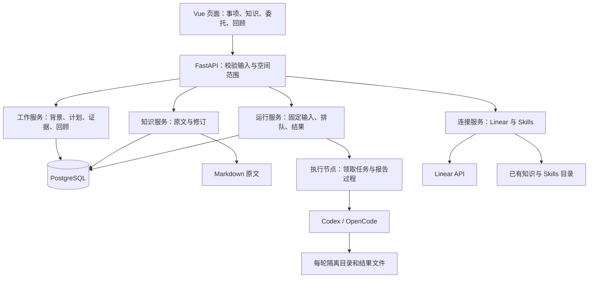
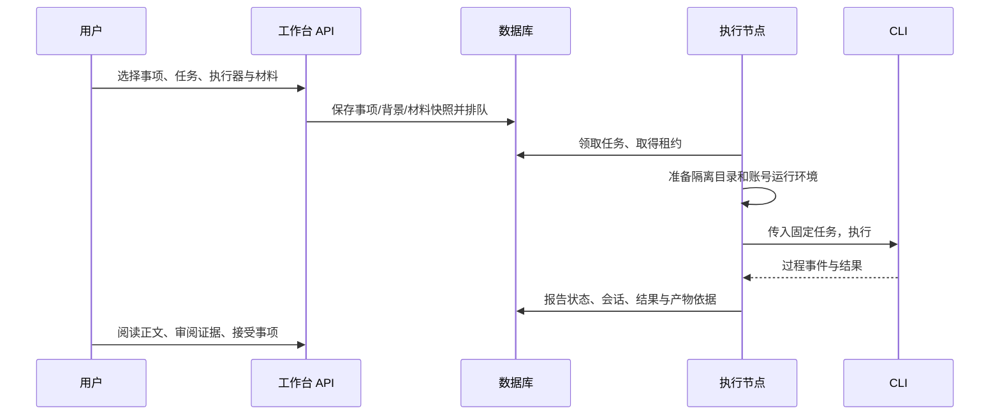
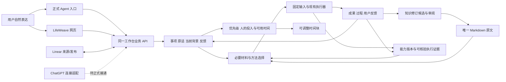

<a id="complete-guide"></a>
# LifeWeave · 经纬：完整项目说明

这是一份可连续阅读的完整汇编：前半部分是当前产品、架构、状态和使用维护说明，后半部分是历史授权、交付与验证文字附录。

范围为项目根 README、docs/ 下全部 Markdown（不含本汇编自身），以及当前建设方案，共 16 份来源。所有来源正文、表格、代码块、Mermaid 图及历史说明完整保留；重复内容也保留，不做摘要或删节。只调整标题层级、链接位置和文内导航。

源码、截图、JSON 运行记录和 API 文档保留可访问的引用，不把它们误作本次需要合并的说明正文。历史附录中的旧名称、当时状态和旧测试数量按原文保留；当前能力请以“当前完成情况”为准。

维护时先更新分篇，再执行 `python scripts/build_complete_guide.py`；`python scripts/build_complete_guide.py --check` 会逐篇检查整合版是否与当前来源一致。

## 阅读目录与来源覆盖

| 部分 | 章节 | 来源 | 原文 SHA-256 |
| --- | --- | --- | --- |
| 当前说明 | [LifeWeave · 经纬](#doc-01) | `README.md` | `25df3d4656aa41bcaea134fed6dd20ad5d25112dbeb6a6133a14e5a47ee0a358` |
| 当前说明 | [LifeWeave 项目文档](#doc-02) | `docs/README.md` | `40118e16638a05ce5beec3989379320befd735cea4abe4104e88a7067f165ee0` |
| 当前说明 | [LifeWeave · 经纬：名称与适配](#doc-03) | `docs/naming.md` | `99c6b7caa819790699b1debf2ce9ccdad0d797728941f96a380a4571d8b4612d` |
| 当前说明 | [产品设计：让分散的事情接得上、推得动](#doc-04) | `docs/product.md` | `d434d91ad9b890849a467d0b2467829a1249774191abbec9f3968b2128a28dab` |
| 当前说明 | [架构与关键实现](#doc-05) | `docs/architecture.md` | `1a018b8d67e6b76f3e15d026bcaf9e7f2fe8606d4629220a070580ce5cb62bee` |
| 当前说明 | [当前完成情况](#doc-06) | `docs/status.md` | `ff74c752c5d1712ad7a0b9484410f418c65adc90ac7e5beb580488424fa2b5ba` |
| 当前说明 | [开发与运行维护](#doc-07) | `docs/development.md` | `f915f2307f3caa171133ca289b3f7d4364173b40106b3d8b532874b6f48f50eb` |
| 建设方案（含未实现范围） | [LifeWeave：可以跨任务持续使用的工作台](#doc-08) | `workspaces/reviews/lifeweave-next-stage/review.md` | `b2b2048b61efd926fc846a8c8d94cb0be6d47962661db5d907afac8f527e7923` |
| 历史与验证附录 | [原始任务与实施授权](#doc-09) | `docs/brief.md` | `b80241cd5fa2db062b7c79c6d8a7594869d89abb6d9034f3a69803984922406f` |
| 历史与验证附录 | [名称与项目文档：任务依据](#doc-10) | `docs/rename-request.md` | `7296b62ad25bd47110f9b2ce99ef799e4b67f5a5c7e383ff5308c894971849bc` |
| 历史与验证附录 | [共作独立工作台：实施与交付](#doc-11) | `docs/delivery.md` | `829e39f4cd1a2fef73fdb99801be0e91221f4477b762f954bc2cd4f8dd3af967` |
| 历史与验证附录 | [本机工作台交付证据](#doc-12) | `docs/evidence/README.md` | `55c01f63440165b78c60ab4811d14734b5694362514f13f2ba8ea02e82ff90e8` |
| 历史与验证附录 | [内部命名与工作接续验证](#doc-13) | `docs/evidence/internal-rename/README.md` | `8e6e4ad8eb1bb2fe651af3fa578f4e9ef2cca8cd59468b08f20b22919370c1a7` |
| 历史与验证附录 | [LifeWeave 改名与文档验证](#doc-14) | `docs/evidence/rename/README.md` | `5f1179f23e012ab60dae12c3aee02ea50d37849b0c0a7b83aa22bd69fac343a9` |
| 历史与验证附录 | [LifeWeave 改名独立复核](#doc-15) | `docs/evidence/rename/independent-review.md` | `aa4d1cecb3ba48d6f36d027e26bde5dc0ee085be9278cfec209c1140dfa9977c` |
| 历史与验证附录 | [我的周回顾](#doc-16) | `docs/evidence/weekly-review.md` | `b44e1b34eef120a755815ec38869ca16fb235a1f8d03832d3e108488b50aaf7b` |

---

<a id="doc-01"></a>
<!-- source-begin: README.md -->
<a id="doc-01-line-1"></a>

## LifeWeave · 经纬

**工作与生活，有序展开。**

LifeWeave 希望把工作、学习、爱好和生活中的想法、计划、行动与积累连接起来。中文名“经纬”取交织成整体之意；英文工程名统一为 `lifeweave`。当前可用的是本机 AI 工作台：管理事项与背景、阅读和修订知识、委托 AI、审阅成果及回顾进展。

这是独立的本机应用与 Git 仓库。数据、依赖和进程都由本目录管理，不启动 Omni-Brain 或质检平台。部分工作模型与执行代码来自 Omni-Brain，来源和本轮交付范围见 [交付记录](#doc-11)。

<a id="doc-01-line-9"></a>

### 理解项目

想连续阅读全文，可直接阅读 [完整项目说明（整合版）](#complete-guide)：包含下列说明全文及历史交付、验证文字附录。

第一次接触项目，按下面顺序阅读：

1. [产品设计](#doc-04)：为谁解决什么问题、日常怎样使用、为什么这样组织。
2. [架构与关键实现](#doc-05)：数据由谁维护，用户动作怎样穿过前后端，代码从哪里读起。
3. [当前完成情况](#doc-06)：已经能用、实现但未实测、尚未实现的能力及证据。
4. [开发与运行维护](#doc-07)：本地启动、配置、验证、改名兼容和排障。

[文档导航](#doc-02) 区分当前说明与历史证据；[命名说明](#doc-03) 解释名称与适配边界。

<a id="doc-01-line-22"></a>

### 开始使用

需要 Linux / WSL、Python 3.10+、Node.js 22+、npm，以及 PostgreSQL 16 的服务端命令。默认 PostgreSQL 命令目录为 `/usr/lib/postgresql/16/bin`，可用 `LIFEWEAVE_PG_BIN` 指定。AI 功能需要已安装并登录的 Codex 或 OpenCode CLI。

```bash
cd /home/yyh/project/lifeweave
python scripts/workbench.py setup
python scripts/workbench.py start
```

打开 **http://127.0.0.1:8010**。在 WSL 中可使用 Windows 浏览器访问该地址。默认进入个人空间；左上角可以切换团队空间。

1. 在首页记下一个想法，或在“工作事项”中新建工作，填写目标与范围。
2. 在“计划”中安排优先级、日期和阶段。事项详情保存背景、讨论、关联材料与修改提案。
3. 点“委托 AI”，写清这次希望得到什么。可选择执行器、项目目录、工作方法与知识。不选项目时使用空白任务目录；选 Git 项目时使用固定提交的独立 worktree，未提交修改不会自动带入。
4. 在“AI 委托”查看过程、失败原因与实际结果。在“成果与验证”审阅证据，然后接受事项结果。运行成功不会自动完成事项。
5. 在“知识与材料”写笔记或提出修订，阅读差异后接受。知识正文是 Markdown 文件，直接在本地修改会被版本检查识别。
6. 在“周回顾 / 组会”配置关注内容、冻结当次内容、记录讨论并导出 Markdown。

本机首次交付已实际跑通 Codex。OpenCode 可建立会话，但当前配置下的真实调用连续返回执行器内部错误，暂建议选 Codex；具体记录见交付说明。重试是关联到原委托的新尝试，不是恢复原生 CLI 会话。

<a id="doc-01-line-43"></a>

### 连接已有积累

“设置与连接”可以添加已有 Markdown 知识目录、包含各个 `SKILL.md` 子目录的 Skills 根目录，以及 Linear 连接。

- 外部知识只读；修订可下载，交回原仓库处理。工作台管理的知识默认写入 `.runtime/knowledge/{personal,team}`。
- 委托时按需选择一套 Skill 和最多 10 篇知识，固定正文与方法支持文件。重试保留已选择资料的快照；要使用更新后的资料，创建新委托。Skills 需要适用于目标工程；引用原仓库专有脚本的方法仍可能需要调整。
- Linear 使用个人 API Key 或本机权限为 `600` 的凭证文件。凭证保存在 `.runtime/linear.json`，不进入 Git，也不回传到页面。
- Linear 页面分页读取分配给当前账号的事项。导入创建本地工作；再次导入更新远端快照，保留本地标题、目标、安排和进展。
- 向 Linear 发成果前先准备固定正文预览，再点发送。系统回读评论核对；网络结果不确定时优先核对已有评论，不自动重复发送。本地事项与 Linear 状态独立维护。

<a id="doc-01-line-53"></a>

### 数据与运行

```bash
python scripts/workbench.py status
python scripts/workbench.py stop
python scripts/workbench.py backup
python scripts/workbench.py start
```

备份位于 `.runtime/backups/`，包括 PostgreSQL dump 和工作台知识压缩包。外部知识、CLI 账号凭证、方法连接配置和运行目录需按需另行备份。不要把包含个人数据或凭证的 `.runtime/` 提交到仓库。

恢复时先停止应用，将 dump 用 `pg_restore` 恢复到一个**新的数据库**，将知识包解压到新的知识目录，再用 `LIFEWEAVE_DB_NAME` 和 `LIFEWEAVE_PERSONAL_KNOWLEDGE_ROOT` / `LIFEWEAVE_TEAM_KNOWLEDGE_ROOT` 指向它们。先检查恢复结果，再切换日常使用环境；不覆盖现用数据库。

数据库仅监听本项目私有 Unix socket，目录 `.runtime/postgres/`，端口参数 `55440`，默认数据库和角色均为 `lifeweave`。服务日志为 `.runtime/server.log`；AI 的隔离目录、私有账号副本与产物位于 `.runtime/executions/`，运行记录保存在数据库。不要在 AI 正在执行时停止服务。

本机服务只监听 `127.0.0.1:8010`。当前身份是本机单用户，个人/团队是内容空间，**没有多人登录与成员权限系统**。不应直接暴露到公网。团队执行机和 Docker 协议保留，但默认启动个人空间的本机 worker；团队空间可以在设置中明确选择使用本机账号启用执行。远程执行需要另行部署与验证。

<a id="doc-01-line-70"></a>

### 开发与验证

后端 FastAPI + PostgreSQL，前端 Vue 3 + TypeScript。前端开发服务器为 `127.0.0.1:5180`，代理到 `8010`。

```bash
.venv/bin/pytest
LIFEWEAVE_TEST_DB=1 .venv/bin/pytest tests/test_live_database.py
cd web
npm run type-check
npm test
npm run build
```

数据库集成测试在本项目 PostgreSQL 中创建随机命名的临时数据库，完成后删除；不会清空使用中的工作台数据库。实际浏览器与 AI 验证记录见 [交付记录](#doc-11)。

API 文档：<http://127.0.0.1:8010/docs>，当前接口前缀 `/api/lifeweave/`，页面前缀 `/lifeweave/`。旧页面仍会跳转；旧 API 客户端须跟随 308，或改用新前缀。配置读取范围见 [运行维护](#doc-07-line-29)。数据库变更新增到 `migrations/`，启动时按摘要校验并只应用新版本。

<a id="doc-01-line-87"></a>

### 在新的本机 Agent 会话接续

当前支持本机 Codex/OpenCode 等可运行命令的会话，使用同一工作台 API；不依赖开发者聊天记录。先让 Agent 阅读本节或运行帮助：

```bash
python scripts/lifeweave.py --help
python scripts/lifeweave.py discover '想继续的目标'
python scripts/lifeweave.py continue item-实际编号
python scripts/lifeweave.py recommend item-实际编号
python scripts/lifeweave.py read-knowledge 'local:知识路径.md'
python scripts/lifeweave.py read-method method-实际编号
python scripts/lifeweave.py runs
python scripts/lifeweave.py capture '先记一个生活想法，暂时不推进'
python scripts/lifeweave.py feedback item-实际编号 '重点理解错了，先讨论适用范围'
```

`capture`、`create`、`discuss`、`feedback` 只保存，不启动 AI。`run` 是显式委托，会采用文本匹配推荐的输入；先查看 `recommend` 的依据，无匹配时不捏造方法，复杂适用性仍由 Agent 判断。网页的“委托 AI”也会预选推荐，可手动调整。推荐、实际输入快照与执行步骤是不同证据。

事项概览的“接着推进”可查看当前记录、下载接续 JSON、保存针对事项或具体运行的纠偏。新的运行/重试会自动固定这些反馈，已有运行保持原输入；反馈不会自动改变已接受目标。重复发送相同反馈可使用同一 `--request-id`；其他创建动作遇到超时须先读取确认，不自动重发。

命令读取本机服务，失败返回非零；`--workspace team` 切换空间。ChatGPT 远程连接、自然语言自动排程、自动发布方法改进尚未完成。完整研发方案见 [下一阶段产品方案](#doc-08)。
<!-- source-end: README.md -->

---

<a id="doc-02"></a>
<!-- source-begin: docs/README.md -->
<a id="doc-02-line-1"></a>

## LifeWeave 项目文档

LifeWeave（经纬）希望帮助个人与协作中的人，把工作、学习、爱好和生活中的事情有序推进。当前提供本机工作台；愿景中的所有生活管理和多人能力尚未完成。

**一次读完整个项目：[完整项目说明（整合版）](#complete-guide)。** 整合版收录当前分篇说明全文，当前建设方案全文，以及本目录下的历史交付和验证文字；原分篇仍是维护入口。更新分篇后运行 `python scripts/build_complete_guide.py`，用 `python scripts/build_complete_guide.py --check` 检查整合版是否同步。

| 读者想知道什么 | 阅读入口 |
| --- | --- |
| 为什么做、准备怎样解决问题 | [产品设计](#doc-04) |
| 完整产品能力如何分批建设 | [下一阶段产品方案](#doc-08) |
| 用户动作如何实现、数据放在哪里 | [架构与关键实现](#doc-05) |
| 现在能做什么、哪些还不能依赖 | [当前完成情况](#doc-06) |
| 怎样启动、修改、验证和维护 | [开发与运行维护](#doc-07) |
| 为什么叫 LifeWeave、哪些名称已适配 | [命名与兼容](#doc-03) |
| 亲自打开应用并完成第一项工作 | [项目首页与使用步骤](#doc-01) |

当前说明以本仓源码、迁移和运行结果为依据。修改功能时，应同步受影响的产品说明、实现说明或状态；精确字段仍以源码和运行中的 [API 文档](http://127.0.0.1:8010/docs) 为准，不在文档里维护逐函数副本。

历史材料单独保留：[初始授权](#doc-09)、[首次交付](#doc-11)、[首轮证据](#doc-12)、[此次改名要求](#doc-10)。其中旧名称、旧路径、截图、运行 ID 和原始输入应按当时事实理解，不能因为改名而重写成新的验证证据。
<!-- source-end: docs/README.md -->

---

<a id="doc-03"></a>
<!-- source-begin: docs/naming.md -->
<a id="doc-03-line-1"></a>

## LifeWeave · 经纬：名称与适配

<a id="doc-03-line-3"></a>

### 名称表达什么

用户希望管理的不是一种工作，而是人长期面对的工作、爱好和生活。**LifeWeave** 由 Life（生活整体）和 Weave（编织）组成：把分散的事情、资料、人与行动连接成自己能够掌握的整体。中文名 **经纬** 对应交织、联系与秩序；表达方式是“工作与生活，有序展开”。

相比以“工作”为范围的旧名，它可以容纳学习、游戏研究、家庭安排、个人创作和团队交付。它也没有预设所有事情都必须变成项目、审批或 AI 任务。

命名取舍：只用 Order 容易把产品理解为排程工具；只用 Work 会缩窄生活与爱好；使用 LifeWeave 保留了关联和长期积累的含义。此处是产品命名决定，没有进行商标、域名或应用商店名称排他性认定。

<a id="doc-03-line-11"></a>

### 统一约定

| 场合 | 使用名称 |
| --- | --- |
| 产品全名 | LifeWeave · 经纬 |
| 中文界面简称 | 经纬 |
| 英文名 | LifeWeave |
| 项目目录与 Python 包分发名 | `lifeweave` |
| 前端包名 | `lifeweave-web` |
| 页面、API | `/lifeweave/…`、`/api/lifeweave/…` |
| 应用环境变量 | `LIFEWEAVE_*`；CLI 自身的 `CODEX_*`、`OPENCODE_*`、`LINEAR_*` 保持其原有含义 |

图标用两组相互穿插的线表达经纬，源文件为 [favicon.svg](../web/public/favicon.svg)。页面标题、应用导航、API 标题、错误提示、新生成的委托说明和导出默认文案均使用新名。

<a id="doc-03-line-25"></a>

### 为什么仍能看到旧名称

改名需要保持已有工作可接续。当前实际目录是 `/home/yyh/project/lifeweave`；旧 `/home/yyh/project/gongzuo-workbench` 是指向它的符号链接，服务、数据和 Git 均只有一份。历史 AI worktree、Python 虚拟环境入口以及已保存的运行目录含旧绝对路径，兼容链接让这些记录仍可读取。

旧页面自动跳到新页面并保留查询参数与片段；旧 API 使用 HTTP 308 跳转，保留方法、请求体和查询参数。**客户端必须支持并跟随 308，或者直接改用 `/api/lifeweave/`**；例如本机 Python 3.10 的 urllib 默认会将 308 当作异常，旧 SDK 不能一概视为透明兼容。新页面和执行节点只生成新接口地址。

`GONGZUO_*` 环境变量作为安装兼容别名仍可读取；同一来源同时提供新旧变量时，新变量优先。数据库与日志的 ConfigManager 支持 `.env`，且进程环境优先；知识根、执行器与生命周期脚本只读取进程环境，详见 [配置说明](#doc-07-line-29)。

现行 Python 模块为 `src/lifeweave`、`src/lifeweave_runtime`、`src/lifeweave_knowledge`；Vue 位于 `features/lifeweave`，组件和类型使用 `LifeWeave`，CSS 使用 `lw-`。数据库和角色均为 `lifeweave`，业务表为 `t_lifeweave_*`，迁移总账为 `lifeweave_migrations`；新运行材料写入 `.lifeweave`，执行节点使用 `X-LifeWeave-*` 请求头。旧请求头仍作为兼容输入接受。

本机 23 张表通过原位重命名迁移，逐行内容哈希与迁移前一致，2 篇知识原文字节未变；见 [内部命名迁移证据](#doc-13)。既有 `gzrun-*` 等稳定 ID 和旧运行的 `.gongzuo` 路径仍指向原成果，不修改不可变运行输入。已应用 SQL 迁移 001–004 保留原内容，005 承担新名称迁移。

用户已保存的事项标题、Markdown、导出快照、AI 结果、首次交付文档和截图保留原文。搜索这些内容看到“共作”是历史来源，不应批量替换。新开发的目录、符号和存储标识都使用 LifeWeave；旧名称只用于历史材料及明确的迁移/兼容入口。
<!-- source-end: docs/naming.md -->

---

<a id="doc-04"></a>
<!-- source-begin: docs/product.md -->
<a id="doc-04-line-1"></a>

## 产品设计：让分散的事情接得上、推得动

<a id="doc-04-line-3"></a>

### 我们要解决的问题

一个人可能同时在推进工作项目、学习一门技术、研究游戏、安排旅行和照顾生活。信息分散在聊天、文档、待办和代码中；每次回来都要重新找资料、解释背景、判断做到哪里。加入 AI 之后，问题并没有自动消失：一次回答有帮助，但任务背景、执行过程和最后采纳的结果仍容易断开。

LifeWeave 的愿景，是让这些事情有清楚的入口、持续的背景、可推进的行动和能够复用的积累。AI 是其中一种执行方式，人工完成、讨论决定和暂时搁置也都是正常路径。

**当前实现重点是事项、知识与 AI 委托的连续使用。** 它已有个人和团队内容空间；还没有多人身份权限，也没有专门的习惯打卡、家庭账本、健康记录或日历同步。这些不能从“管理生活”的愿景推断为现成功能。

<a id="doc-04-line-11"></a>

### 用户怎样使用

例如准备一次旅行，可以先记下“秋天想去徒步”的想法；确定要推进时创建个人事项，写清时间、预算和限制，关联资料。之后自己整理清单，或选择材料让 AI 给出候选路线。读完结果、补充实际核验，再保存成果。下次打开事项，不必从聊天历史重建目的与约束。

这个例子说明现有通用对象如何承载生活事务，并非已经完成旅行业务验证。首轮实际验证用的是工作台交付检查、知识笔记和团队会议议程，详见 [状态与证据](#doc-06)。

当前页面按用户动作组织：

| 入口 | 用户做什么、拿到什么 |
| --- | --- |
| 我的日常 | 记录灵感，查看需要判断的事、正在推进的事项和 AI 委托 |
| 工作事项 | 创建不同类型的事项，阅读目标、范围、讨论、材料与成果；可关联子事项 |
| 计划 | 安排优先级、日期和阶段；与事项详情操作同一条工作记录 |
| 灵感与讨论 | 留下尚未形成任务的想法，逐步与具体事项建立联系 |
| 知识 | 阅读和搜索 Markdown；本机知识修改先比较差异再接受，外部资料保持来源 |
| AI 委托 | 查看排队、执行、失败与结果；取消或建立下一次尝试 |
| 周回顾 / 组会 | 选择关注内容，阅读实时进展，冻结当时内容并导出纪要 |
| 来源连接、设置 | 读取 Linear 事项，配置知识与 Skills 来源，启用本机执行 |

<a id="doc-04-line-30"></a>

### 为什么以“事项”连接工作

事项代表一件需要持续推进和判断结果的事。它可以是需求、修复、学习、个人安排、爱好或研究；类型不代表已经为每个领域构建了专用系统。

一个事项围绕以下内容展开：

- **背景**：当前目标、范围、共识、已知事实和未决问题。它帮助人和 AI 知道“为什么做、做到哪里”。
- **安排**：阶段、优先级和日期。它回答“什么时候继续、当前是否受阻”。
- **材料与讨论**：来源、参考和决策过程。资料可以被多个事项引用，不要求复制一套正文。
- **执行与成果**：人工记录或 AI 尝试及其输出。执行结束之后，仍需判断成果是否符合目的。

想法不必立即变成事项；正文阅读不必先启动 AI；人工提交成果不依赖执行器。这样工作台才可以用于学习和生活，而不把所有活动塞进软件开发流程。

<a id="doc-04-line-43"></a>

### 三个影响可靠性的设计选择

<a id="doc-04-line-45"></a>

#### 背景变化有来路

已采纳背景是当前共同依据。改动先作为提案保存，保留原版本和来源；接受后生成下一版本。提交时检查版本，避免两个编辑动作悄悄覆盖彼此。

事项速览、详情和实时回顾读取当前已接受背景。历史运行和冻结回顾保留当时内容，所以“现在认为怎样”和“当时依据什么”可以同时解释。

<a id="doc-04-line-51"></a>

#### 运行成功与事情完成分开

AI 返回文字、命令成功退出，只能证明执行完成。用户还需要阅读结果、核对材料，审阅证据，再决定是否接受事项。人工成果使用同一审阅入口。平台不能替用户宣称“这份攻略一定正确”或“这个需求已经满足”。

<a id="doc-04-line-55"></a>

#### 知识原文有明确归属

工作台管理的知识写在本地 Markdown 文件中。数据库记录修改候选、版本指纹和审阅过程；它不维护第二套独立的“正式正文”。外部知识目录按原位置只读引用，修改候选可以下载后交回来源处理。

Linear 也是独立来源：首次引入建立本地事项和关联，再次读取更新远端快照。当前本地安排与 Linear 状态各自维护，页面明确提示这点，不使用自动双向覆盖。

<a id="doc-04-line-61"></a>

### 个人和团队的边界

当前同一个应用中存在 personal 与 team 两个内容空间，数据查询、知识目录和执行记录按空间区分。团队使用本机账号执行需要在设置中明确启用。

这解决的是本机内容分区与执行选择。它不等于多人登录、组织成员管理、角色权限或可公开部署的团队 SaaS。后续团队建设应从真实共享与权限场景出发，再决定哪些数据共同维护、哪些账号和知识必须隔离。

<a id="doc-04-line-67"></a>

### 后续怎样判断产品在进步

有价值的改进应让真实使用者更容易找到背景、继续行动、读懂成果和保留积累。观察重点包括：回来后是否需要重新解释、当前依据是否一致、失败是否可以处理、知识修改是否可追溯，以及计划是否真正帮助推进。

近期优先让现有功能在连续日常使用中暴露问题，补齐 OpenCode 实际调用与团队身份边界。日历、习惯和生活领域专用能力仍是待场景验证的方向，不是已批准的详细路线。
<!-- source-end: docs/product.md -->

---

<a id="doc-05"></a>
<!-- source-begin: docs/architecture.md -->
<a id="doc-05-line-1"></a>

## 架构与关键实现

<a id="doc-05-line-3"></a>

### 系统怎样分工

LifeWeave 是一个独立的模块化单体：Vue 页面处理交互，FastAPI 接收操作并协调业务模块，PostgreSQL 保存工作事实，Markdown 保存知识正文，本机执行节点调用已经安装的 CLI。启动应用不需要运行 Omni-Brain 或连接质检数据库。



程序集成入口在 [src/api/app.py](../src/api/app.py)。它创建数据库连接、工作服务、知识服务、执行器和外部连接；启动时恢复过期租约并启动已启用的本机节点，退出时关闭节点和连接池。生产构建的 Vue 静态文件也由这个进程提供。

当前 Python、Vue、数据库与执行材料统一使用 LifeWeave 命名；历史入口兼容见 [命名说明](#doc-03)。

| 职责 | 主要代码入口 |
| --- | --- |
| 页面路由与整体导航 | [router/index.ts](../web/src/app/router/index.ts)、[LifeWeaveShell.vue](../web/src/features/lifeweave/components/LifeWeaveShell.vue) |
| 跨页面工作状态和操作 | [useLifeWeaveWorkspace.ts](../web/src/features/lifeweave/composables/useLifeWeaveWorkspace.ts)、[API 客户端](../web/src/features/lifeweave/api/lifeweave.ts) |
| 工作规则与数据库读写 | [工作服务](../src/lifeweave/service.py)、[工作 Repository](../src/lifeweave/repository.py)、[请求模型](../src/lifeweave/models.py) |
| 知识全文与候选修改 | [library.py](../src/lifeweave_knowledge/library.py)、[KnowledgePage.vue](../web/src/features/lifeweave/pages/KnowledgePage.vue) |
| 委托创建、重试和记录 | [运行服务](../src/lifeweave_runtime/service.py)、[运行 Repository](../src/lifeweave_runtime/repository.py) |
| 本机节点与 CLI 执行 | [local_workers.py](../src/lifeweave_runtime/local_workers.py)、[worker.py](../src/lifeweave_runtime/worker.py)、[执行器接口](../src/agent_runtime/executor.py) |
| 方法材料与 Linear | [task_sources.py](../src/integrations/task_sources.py)、[linear.py](../src/integrations/linear.py) |

<a id="doc-05-line-39"></a>

### 数据分别保存在哪里

PostgreSQL 的 `workbench` schema 保存以下对象。完整字段以 [migrations](../migrations) 为准；此表解释职责，不复制所有列。

| 数据组 | 保存内容 | 事实边界 |
| --- | --- | --- |
| item / entity / relation | 事项、想法、专题、资源、成果及关联 | 事项保存执行安排；资料可以被引用，不必变成事项 |
| context / context_version / context_proposal | 当前背景指针、背景版本、修改提案 | 当前指针指向已接受版本；候选不是当前事实 |
| evidence / discussion / activity | 核验依据、讨论、进展记录 | 证据接受与事项完成分开，保留原因和来源 |
| meeting / snapshot / note / preference | 回顾配置、冻结内容、会议记录、偏好 | 冻结内容用于解释历史，不随当前背景更新 |
| machine / run / run_event | 执行节点、输入快照、尝试、事件、结果 | 运行状态是技术事实，不自动替代业务接受 |
| document_revision / library_source | Markdown 候选、源指纹、外部目录登记 | 正式知识原文仍在文件中 |
| linear_binding / linear_publication | 来源关联、远端快照、发送预览和核对状态 | 本地事项和 Linear 状态不做自动覆盖 |
| capability / capability_verification | 已复用的能力候选与验证记录 | 属于维护中心的能力治理入口，不代表所有 Skills 已验证 |

`.runtime/knowledge/{personal,team}` 保存本机知识原文；外部资料仍留在登记目录。`.runtime/executions/{space}/{run}/` 保存该轮工作目录、账号运行副本和产物。方法连接配置、本机节点设置、Linear 连接配置也在 `.runtime/`，不会提交到 Git。

结构化业务对象常用 JSONB 保存有差异的内容，避免为每种学习或生活事项提前设计独立表。代价是字段语义主要由 Service 和页面适配器约束；扩展公共字段时需要同时检查输入校验、持久化与多个页面，不能只改显示名称。

<a id="doc-05-line-58"></a>

### 一次事项修改怎样生效

页面通过共享 API 客户端发送明确空间和对象 ID。Router 用 Pydantic 校验请求，Service 检查业务规则，Repository 执行 SQL。普通编辑带当前版本，数据库更新使用期望版本条件；版本过时返回冲突，而不是覆盖新内容。

背景修订另有提案流程。接受提案时更新版本和当前指针，之后列表、详情及实时回顾加载已接受内容。列表不能只读取事项初始 `payload`，否则新目标只在详情显示；这曾是实际发现并修复的问题。回顾会把当前目标、范围等放入阅读投影，冻结则保存当次投影。

子事项的委托背景从 [current_context_snapshot](../src/lifeweave/service.py) 组装，包含共享背景与本次局部目标。修改这个方法时，必须检查根事项和子事项，防止 AI 只得到父目标或只得到孤立的子标题。

<a id="doc-05-line-66"></a>

### 一次 AI 委托怎样完成



创建委托时，[运行服务](../src/lifeweave_runtime/service.py) 读取事项的当前背景，把输入固定到运行记录。不指定工程时使用空白任务目录；指定工程时读取 Git 提交身份，执行节点创建独立 worktree，未提交修改不会自动进入。改动产物也不会自动合并回原仓。

一次可显式选择一项 Skill 和最多 10 篇知识。`TaskSources` 固定正文、来源指纹和方法支持文件；重试时保留这些已选输入。方法及支持文件合计最多 100 个文件、1 MB，选定材料主正文（含 Skill 主文件）合计最多 2 MB；具体限制和失败提示见 [snapshot 实现](../src/integrations/task_sources.py)。这与维护中心的能力发布机制是两个来源入口，运行时共同形成材料快照。

执行节点按租约领取任务，记录心跳、事件序号和报告。执行器适配层把统一请求转为 Codex/OpenCode CLI 参数，解析过程与结果。本机两空间各有可选节点；团队使用当前本机账号必须显式启用。远程/Docker 协议存在，但本机部署没有提供已经验收的远程集群。

失败、取消和不可用状态保存到同一运行记录。界面的“按当前背景再试”建立关联的新尝试，并取当前背景；它不是恢复原生 CLI 会话。运行的原生会话 ID 用于追溯。源码链接只读取该轮受控目录内允许类型的文本文件，不把任意路径开放给浏览器。

<a id="doc-05-line-93"></a>

### 知识修改为什么不会静默替换正文

[Library](../src/lifeweave_knowledge/library.py) 每次读取实际文件并计算指纹。提出修改时保存基准指纹、原文、候选正文和原因，页面显示差异；接受时锁定修订记录，重新核对文件指纹，再替换文件并更新状态。若用户已在编辑器里修改了源文件，接受会报冲突。

本机受管原文使用临时文件和原子替换；数据库操作发生 Python 异常时尝试恢复原文。文件系统与数据库不是同一个事务，进程或机器恰在两者之间崩溃的恢复仍有限，不能宣称分布式原子提交。外部来源的修订可以下载，但不能通过该入口覆盖原仓。

路径读取会核验所属空间、登记来源和根目录，拒绝越界及不允许的隐藏/raw 路径。页面用 Marked 渲染、DOMPurify 清理 HTML，并对中文相对 Markdown 链接做一次解码和根范围校验；源码行号链接先转换成受控读取地址，再清理 HTML。

<a id="doc-05-line-101"></a>

### Linear 的读写怎样保持可解释

首次引入用空间与远端 ID 计算稳定本地 ID，在事务内创建事项、初始背景和来源关联。重复引入只更新远端快照，保留本地编辑与安排。

发送结果先保存固定正文预览，真正发送时使用固定评论 ID。成功后回读正文比对；若网络返回不确定，下一次先核对同一评论，不盲目再发一条。不能确认时保留不确定状态并让用户核查。此发送路径有模拟远端测试，尚没有真实发送证据。

<a id="doc-05-line-107"></a>

### 当前架构的适用范围

接口按空间检查数据，应用校验本机 Host 和写入 Origin，凭证不回传到页面；这不构成多人身份认证。默认只监听本机。CLI 的权限模式与隔离目录也不等于已经验证的多租户安全沙箱。

这种结构优先让单机使用和调试简单，并保留未来拆出执行节点的接口。真正引入多用户、远程访问或高并发前，需要增加相应身份、权限、调度、存储和故障验证，不能仅把监听地址改成公网。

<a id="doc-05-line-113"></a>

### 新会话接续、材料推荐与纠偏

`src/lifeweave/continuation.py` 从事项、已接受背景、待审提案、讨论、证据和所有分页运行记录生成当前接续输出；不把输出保存成另一份规范正文。`scripts/lifeweave.py` 是正式本机客户端，网页与它共用业务 API；宿主 Agent 理解自然表达，产品保存和读取事实。

`TaskSources.recommend` 使用可解释文本匹配返回候选、命中理由和版本。网页预选最多一个方法、十篇知识并允许调整；CLI 提供推荐、全文阅读与显式委托。创建运行时再次计算当前推荐，记录在 `environment_snapshot.inputRecommendations`，实际选择保存在 `selectedInputs`，实际内容以 `capability_snapshot` 为准。重试固定原材料和原推荐，并标明来自旧运行；不把来源更新后的推荐版本冒充原材料版本。worker 的 `materializedCapabilities` 证明材料写入，实际步骤仍需执行事件支持。

纠偏复用 discussion，明确保存类型、原文、上下文版本与可选 run/内容位置。请求身份去重，错用同一身份提交不同内容报 409。新建或重试从同一事项读取纠偏，并固定到 prompt 与 `environment_snapshot.feedbackSnapshot`；已有输入不变。普通讨论不自动成为纠偏，纠偏也不自动采纳为新目标；旧历史讨论保持原分类。

源码与默认数据库都已使用 LifeWeave 命名。SQL 005 只原位改标识，外键和数据身份保持；迁移总账在应用迁移前由 `src.cli` 改名。安装级数据库/角色通过私有集群专用脚本原位迁移，命令与回退边界见开发说明。
<!-- source-end: docs/architecture.md -->

---

<a id="doc-06"></a>
<!-- source-begin: docs/status.md -->
<a id="doc-06-line-1"></a>

## 当前完成情况

更新：2026-09-19。LifeWeave 已有可运行的本机版本，能够持续记录事项、阅读和修订知识、委托 Codex、审阅成果并导出回顾。它仍处于日常使用验证阶段，不是完整生活管理套件或多人生产系统。

<a id="doc-06-line-5"></a>

### 已经可以使用

| 能力 | 当前完成内容 | 验证依据 |
| --- | --- | --- |
| 事项与计划 | 创建事项、类型、阶段、日期、优先级、背景、讨论、关联和子事项入口 | 首轮实际页面创建、保存、刷新、提交人工证据并完成验证事项；临时库回归覆盖持久化和版本冲突 |
| 当前背景与历史 | 提案、采纳、拒绝、版本历史；当前目标进入速览、详情及回顾 | 独立浏览器操作采纳后核对各入口，冻结版本保留旧目标 |
| 人工与 AI 成果 | 正文可读、下载、证据审阅及事项接受分开 | 实际人工记录与 Codex 结果留在工作台；接受操作由实施者在验证中执行，不代表用户验收整个产品 |
| Codex | 本机个人与团队委托，过程、会话、结果保存；源码引用可打开 | 两次真实 Codex 成功，分别在个人和团队空间；见 [首次交付](#doc-11) |
| 知识 | 全文阅读/搜索、本机 Markdown 候选与差异、接受更新；外部来源只读 | 两篇本机笔记实际创建和采纳；中文链接、来源冲突、拒绝、越界有独立页面或接口检查 |
| 材料选择 | 登记 Skills 目录，按当前目标文本匹配预选一项方法和最多 10 篇知识，可调整并保存输入快照 | 7 项方法已登记；一次真实运行附带知识；临时库测试覆盖最大知识数量与支持文件快照 |
| 回顾 | 实时内容、关注配置、冻结当次、讨论和 Markdown 导出 | 实际导出包含目标、完成状态与快照身份；独立复核当前与冻结内容 |
| Linear 读取 | 配置连接、读取分配给当前账号的事项、引入及刷新来源快照 | 真实账号读取和 YYH-11 本地引入、重复刷新；没有远端写入 |
| 本机运维 | 独立安装、启动、停止、数据库与知识备份 | 已恢复到新临时数据库，检查表和实际正文；迁移只应用新文件 |
| LifeWeave 名称 | 新目录、包名、界面、图标、页面/API 和配置前缀；旧入口兼容 | 本轮类型检查、构建、路由兼容和真实数据库测试；迁移记录见 [本轮验证](#doc-14) |

首轮真实场景和截图在 [证据索引](#doc-12)。该批截图仍显示当时的旧名；本轮改名截图与指纹记录另存，不改写旧证据。

<a id="doc-06-line-22"></a>

### 已有实现，但使用时要知道边界

- **OpenCode**：CLI 能建立会话，真实模型调用连续返回内部错误，尚未取得成功结果。暂用 Codex；错误原因未确认为平台、CLI 或上游服务中的哪一层。
- **取消、重试、租约恢复**：有实现及受控测试；重试是新尝试，不是原生会话续跑。长时间断电、网络分区和跨机器恢复尚未验证。
- **远程节点与 Docker**：保留协议和适配代码，没有完成真实远程部署验收。
- **Linear 发送**：预览、固定评论身份、回读与不确定状态处理经过模拟测试；真实发送未执行，双向状态同步未实现。
- **知识与方法治理**：维护中心保留候选、验证与发布入口；尚未证明所有旧 Skills 在新工程可直接执行，也没有完成整个知识库的自动摄入与发布。
- **搜索与目录规模**：当前适合本机有限规模资料；没有语义搜索或海量目录容量验证。事项详情的运行列表当前取该事项最多 100 条，完整运行页提供分页。

<a id="doc-06-line-31"></a>

### 尚未实现

多人登录、成员与角色权限、多人实时协作、公网部署、日历同步、周期任务/提醒、习惯打卡、财务与健康专用模块、移动端原生应用，以及 AI 代码产物自动合并回目标仓库。

这些缺口区分于“配置后可能可用”的能力，不能通过改名或把页面做成团队样式来宣称完成。

<a id="doc-06-line-37"></a>

### 验证如何解释

首轮产品有 45 项 Python 测试、12 项前端测试，并完成真实浏览器、Codex、恢复检查和两次独立审查。首轮审查发现的背景不一致、团队执行入口缺失、中文资料和源码链接问题已修复并复核。

本轮在其基础上新增旧入口保留方法/请求体/参数，以及环境变量别名、页面深链接兼容回归，当前 52 项 Python 测试与 13 项前端测试通过。测试总数不是功能完整度百分比；每次结果只支持实际被验证的行为。新命名不增加业务功能，也不把先前的成功调用算作本轮重新调用。

<a id="doc-06-line-43"></a>

### 本轮新增与后续建设

本轮内部命名统一到 Python、Vue、CSS、默认数据库/角色、表/索引和新运行材料。数据库 23 张表在静止状态逐行内容哈希一致，2 篇知识字节一致；历史迁移、旧入口兼容和已有运行原文保留。见 [内部迁移与接续证据](#doc-13)。

本机新会话可通过正式 CLI 查找事项、读取当前背景/候选/讨论/成果，查看推荐并读取知识与方法全文，保存记录和纠偏。事项页新增“接着推进”；委托按目标预选材料，两个反馈入口保存的纠偏自动进入新建/重试的固定输入。推荐是文本匹配初筛，没有语义理解或方法适用性保证；正式 Agent 负责自然语言理解，网页不是已经完成的聊天助手。反馈固定输入不证明模型实际按反馈正确改进。

本轮只验证本机使用、临时真实数据库与浏览器入队，未新增真实模型执行成功证据。ChatGPT 远程连接仍未接通，知识候选自动生成、跨领域时间块安排、能力改进对照仍未完成。

建设顺序在 [同一产品方案](#doc-08) 维护：

1. 完善正式自然入口与知识候选关联，用不同任务验证知识再次使用。
2. 在现有计划页加入人的投入、真实空闲、休息与可调整时间块；AI 时间单独表达。
3. 把反馈与实际加载/执行证据关联，形成有对照的能力改进、发布和回退。
4. 远程 ChatGPT 和多人使用按实际身份、共享范围与部署授权接入；不把本机 CLI 冒充云端已连接。

这些是同一完整工作台的后续建设，当前第一批能力不代表原始完整愿景已交付。
<!-- source-end: docs/status.md -->

---

<a id="doc-07"></a>
<!-- source-begin: docs/development.md -->
<a id="doc-07-line-1"></a>

## 开发与运行维护

<a id="doc-07-line-3"></a>

### 先把项目跑起来

实际工程：`/home/yyh/project/lifeweave`。Linux/WSL 环境需要 Python 3.10+、Node.js 22+、npm 和 PostgreSQL 16 服务端命令。

```bash
cd /home/yyh/project/lifeweave
python scripts/workbench.py setup
python scripts/workbench.py start
python scripts/workbench.py status
```

`setup` 安装本目录 Python 与前端依赖、构建页面、初始化本项目 PostgreSQL 并应用迁移。已有安装无需每次 setup。应用地址为 **http://127.0.0.1:8010**，API 文档在 `/docs`。前端单独开发可运行 `npm --prefix web run dev`，地址 `127.0.0.1:5180`，API 仍由 8010 提供。

不要在正式日常数据库运行清空或示例重建脚本。应用与 PostgreSQL 都由本目录负责，旧工程兼容链接不表示另一个安装。

<a id="doc-07-line-18"></a>

### 读代码的顺序

先读 [产品设计](#doc-04) 与 [架构](#doc-05)，再从一个操作开始：

1. 事项编辑：`ItemDetailPage.vue` / `WorkPlanEditor.vue` → API 客户端 → `src/lifeweave/router.py` → Service / Repository。
2. 委托：`LifeWeaveModalHost.vue` → `src/lifeweave_runtime/service.py` → `worker.py` → `src/agent_runtime/`。
3. 知识修订：`KnowledgePage.vue` → `library_router.py` → `library.py` → 文件与修订记录。
4. 回顾：`MeetingPage.vue` → 工作服务的投影/冻结/导出方法。

Vue 使用 TypeScript 和 Composition API；前后端输入字段主要通过模型别名转换，不能在新页面自行猜测 snake_case/camelCase。后端业务字段变化要检查多个页面和冻结快照语义；数据库迁移只能新增，不能改已应用文件。

<a id="doc-07-line-29"></a>

### 配置和凭证

数据库和日志配置由 ConfigManager 读取 [config/base.yaml](../config/base.yaml)、根目录可选 `.env` 和进程环境，进程环境优先。**知识根、执行器、节点启用选项和 `scripts/postgres.sh` 只读取进程环境，不自动加载 `.env`。** 涉及它们的配置请先 `export` 再运行启动命令；修改 PostgreSQL 参数也应使用进程环境，让数据库脚本与后端取得相同配置。

`.env` 应保持本机私有。`LIFEWEAVE_*` 是新前缀，旧 `GONGZUO_*` 仍兼容；在同一配置来源中新变量优先。`LIFEWEAVE_PG_BIN` 仅用于数据库生命周期脚本，后端不会据此启动其他数据库程序。

| 变量 | 默认 / 作用 |
| --- | --- |
| `LIFEWEAVE_DB_HOST` | `.runtime/postgres/socket`，相对工程根解析 |
| `LIFEWEAVE_DB_PORT` | `55440` |
| `LIFEWEAVE_DB_NAME` / `LIFEWEAVE_DB_USER` | 都为 `lifeweave`；本机既有数据库与角色已原位迁移 |
| `LIFEWEAVE_DB_PASSWORD` | 默认空；本机 socket 受私有目录约束 |
| `LIFEWEAVE_PG_BIN` | `/usr/lib/postgresql/16/bin` |
| `LIFEWEAVE_LOG_LEVEL` | `INFO` |
| `LIFEWEAVE_PERSONAL_KNOWLEDGE_ROOT` / `LIFEWEAVE_TEAM_KNOWLEDGE_ROOT` | `.runtime/knowledge/personal` 与 `team` |
| `LIFEWEAVE_LOCAL_WORKER` | `1`；设 `0` 使应用启动时不自动启动本机节点，用于受控测试 |
| `CODEX_COMMAND` / `OPENCODE_COMMAND` | 本机 CLI 命令，可指定路径 |
| `LINEAR_API_KEY` / `LINEAR_API_KEY_FILE` | 可选；也可在页面登记权限为 600 的凭证文件 |

远程执行节点另外支持 `LIFEWEAVE_WORKER_TOKEN`、`LIFEWEAVE_TEAM_ENV_ALLOWLIST`、`LIFEWEAVE_TEAM_CODEX_HOME` 和 `LIFEWEAVE_TEAM_OPENCODE_*`。精确参数见 `python -m src.lifeweave_runtime.worker --help`；存在这些参数不代表已经完成远程部署测试。普通本机使用应通过设置启用节点，不需要手工抄令牌。

`.runtime/` 为私有运行目录：Linear 配置、本机节点身份和 CLI 账号副本不得入 Git。原有 Skills 目录和外部知识登记是来源引用，不能假定换一台电脑仍存在这些绝对路径。

<a id="doc-07-line-52"></a>

### 运行验证

```bash
LIFEWEAVE_TEST_DB=1 .venv/bin/python -m pytest -q
npm --prefix web run type-check
npm --prefix web test
npm --prefix web run build
```

未设置 `LIFEWEAVE_TEST_DB=1` 时，真实 PostgreSQL 集成测试跳过。启用后创建随机临时数据库，测试完成删除，不使用日常数据库；测试依赖本项目默认 socket、端口和管理员角色。非默认 PostgreSQL 配置需要对应调整测试连接。

涉及页面时，用真实浏览器从新页面进入，检查请求、错误和业务结果。比如背景修订要看列表、详情、回顾与导出；改路由要同时看直接进入、刷新、旧链接和团队空间。测试 AI 调度可用合成执行器，真实账号调用应明确记录，不能混称为同一证据。

<a id="doc-07-line-65"></a>

### 备份与恢复

先等待或取消正在执行的工作，再操作：

```bash
python scripts/workbench.py stop
python scripts/workbench.py backup
python scripts/workbench.py start
```

备份生成 `.runtime/backups/lifeweave-时间.dump` 和 `knowledge-时间.tar.gz`。旧备份仍用当时文件名。备份要求应用停止，使默认数据库和默认知识目录处于静止状态。

恢复时把 dump 用 PostgreSQL `pg_restore` 导入**新的数据库**，知识包解压到另一个目录，再通过配置指向它们。验证数据后再切换，不直接覆盖现用库。首轮已实际恢复并核对正文，见 [恢复证据](evidence/backup-restore.json)。

该脚本只打包默认 `.runtime/knowledge`；自定义知识根、外部知识、连接配置、CLI 账号和运行产物目录需要另行备份。仅有数据库 dump 不能恢复所有原文和 AI worktree。

<a id="doc-07-line-81"></a>

### 常见问题从哪里查

| 现象 | 首先检查 |
| --- | --- |
| 页面打不开 | `status`、`.runtime/server.log`、8010 是否被占用；确认从本工程启动 |
| 页面接口不存在，或旧客户端报 308 | 新接口 `/api/lifeweave/…`；检查前端构建。旧 API 使用 308，客户端需跟随重定向，或直接改为新前缀；Python 3.10 urllib 默认不跟随 |
| 委托一直排队 | 设置页是否启用本空间节点、执行器是否已安装、维护中心节点状态 |
| CLI 已安装但运行失败 | 该轮错误和过程；安装检测不等于账号、模型和上游服务可用 |
| 知识修改冲突 | 源文件是否在提交候选之后被编辑；重新读取并比较，不强制覆盖 |
| 改名后旧结果文件打不开 | 检查旧目录符号链接与该轮 worktree；不要删除兼容链接 |

当前命令只停止本项目 PID，不使用按名称批量杀进程。`stop` 保留数据库进程，数据库本身的管理脚本是 `scripts/postgres.sh`。

<a id="doc-07-line-94"></a>

### 改名后的维护原则

当前目录、包名、对外路由和文案统一为 LifeWeave。当前数据库、内部模块和组件已使用新名。只有历史记录、旧路由/环境变量/请求头以及旧迁移是兼容层，不对用户原文与不可变运行输入做全仓替换。旧路径符号链接承接已有 venv、Git worktree 与运行记录，删除它之前必须逐类迁移和验证。

本轮迁移前创建了数据库/知识备份与内容指纹。产品代码可按 Git 版本回退；若要把目录退回旧名，必须先停应用和 PostgreSQL，确认新路径无占用，移除兼容链接后再移动同一目录。不要运行 `git reset --hard` 或覆盖用户数据来完成回退。

文档维护分工：行为与理由进入 `product.md` / `architecture.md`；新结果和未完成项进入 `status.md`；命令配置进入本页；真实日志和截图进入证据目录。历史证据保留版本，不在旧截图说明中伪造新的验证时间。

<a id="doc-07-line-102"></a>

### 从首版安装迁移内部名称

本机已完成迁移。另一个仍使用默认旧数据库的安装，应先在旧代码版本停止应用、备份数据库与知识，再更新代码，运行：

```bash
.venv/bin/python scripts/migrate_storage_names.py --apply
.venv/bin/python -m src.cli
python scripts/workbench.py start
```

脚本只处理本工程私有 socket 上默认旧数据库/角色，检查没有业务连接后原位重命名；重复运行无变化。自定义数据库继续由环境配置指定，SQL 005 仍迁移其内部表名。旧 `.env` 中若显式指定默认旧数据库或角色，需更新为 `LIFEWEAVE_DB_NAME=lifeweave`、`LIFEWEAVE_DB_USER=lifeweave`。回退时先停服务，将备份恢复到独立数据库，用迁移前代码验证后再切换；不能仅回退代码连接已改名的表。
<!-- source-end: docs/development.md -->

---

<a id="doc-08"></a>
<!-- source-begin: workspaces/reviews/lifeweave-next-stage/review.md -->
<a id="doc-08-line-1"></a>

## LifeWeave：可以跨任务持续使用的工作台

LifeWeave 要让用户从一句想法开始，在不同会话和入口继续同一件事，找到必要背景与方法，让 AI 承担可以独立执行的工作，并把人的讨论、专注与审阅安排进实际生活。研发交付是已接入产品、可再次调用的能力；论文报告等业务成果只作验收证据。

用户已明确继续设计开发并授权自主工程取舍。本轮按 2026-09-19 的纠偏修订原方案，继续本地研发，不再等待用户重新选择“写文档、做方案还是开发”。以下技术方案是工程分析形成的实施选择，不冒称用户逐项批准；不包含公网发布、新的敏感数据共享或外部写入授权。

<a id="doc-08-line-7"></a>

### 依据与纠偏

- [本轮原始要求](/home/yyh/.codex/attachments/f2006536-e3fb-40d6-a9b4-1141b4183532/pasted-text.txt)，以及先前建设独立项目、持续自主实现和完整工作台的授权。
- [前轮差距材料](/home/yyh/.codex/attachments/3a06f231-ca9f-4033-9dd1-ae25326fb3f1/pasted-text.txt)。其中完成度百分比已由材料作者撤回，无验收分母，不再沿用。
- 2026-09-19 回读 [Linear 项目](https://linear.app/yyhpokemonmaster/project/a2184ae8c325)：Overview 于 `2026-09-19T05:38:30.665Z` 更新，明确交付 LifeWeave、论文仅作案例。前轮“Overview 仍为旧版”已不适用。本轮没有修改线上内容。
- 回读 [日常入口](https://linear.app/yyhpokemonmaster/document/abed03cc1da2)，保留按自然意图工作和已有授权、不强迫所有想法走固定层级的规则。
- 源码基线 `7fa5d5b`，目标仓 `/home/yyh/project/lifeweave`；当前事实以本仓源码和 [架构](#doc-05)、[状态](#doc-06) 为准，不混入 Omni-Brain 原型实现。

本次原位删除“报告＋重新操作过程”为主交付、按论文阶段组织研发、等待用户重申产品目标三处偏移。既有用户反馈、知识冲突、版本和新会话接续要求保留并落实到产品责任。

<a id="doc-08-line-17"></a>

### 用户结果与完整范围

产品服务工作、生活、学习、爱好，不以论文题目决定信息结构。记录、讨论、执行、查看进度是不同意图：记录不启动执行，讨论不隐含代码修改授权，执行也不表示用户已经接受成果。表达不清楚时保留原话，澄清会改变行动的问题。

| 产品能力 | 用户怎样用、得到什么 | 必须保持的行为 |
| --- | --- | --- |
| 自然表达与事项接续 | 说出想法或要继续的目标，找到相关旧记录，保留原话与当前理解 | 多个匹配展示依据，不误合并；生活想法不被强制放入研究流程 |
| 跨入口共同记录 | 网页与正式 Agent 入口读写同一事项；ChatGPT、Linear 的连接状态可解释 | 当前目标唯一维护，候选与已接受分开；离线不虚报同步 |
| 材料选择与持续执行 | 按事项推荐必要知识、方法与可用执行器；反馈影响下一轮 | 输入固定、可追溯；找不到方法如实说明；暂停与重试不是原生会话续跑 |
| 知识沉淀与再次使用 | 在工作过程中提出有来源的修订，审阅后更新原文；别的任务可以找到 | 保留版本、接受/拒绝与冲突；不把一篇孤立报告当知识复用 |
| 跨领域优先级与时间安排 | 比较事项，按真实可用时间安排讨论、专注和审阅；调整后重排 | 领域、类别、状态、重要性、紧急性独立；AI 运行不全部占用人的日历 |
| 能力接入、追溯与改进 | 查一轮推荐、加载和实际过程；反馈形成改进候选，回归后发布或回退 | 推荐不等于加载，加载不等于执行；不能由模型自评证明能力改进 |

主验收是开发者长会话退出后，经已交付入口处理一个未写死的新任务并再次接续。正常用户讨论、授权、审阅可以保留；临时选材料、改数据库、未交付脚本、开发者补提示词都记为开发介入，不能计作产品能力。移除论文样例后能力仍须存在。

<a id="doc-08-line-32"></a>

### 定向源码核对

本仓没有已登记的独立规范知识包，本次降级为产品文档与当前源码直接查证，不调用 Omni-Brain 占位检索器。

| 当前入口与责任 | 源码事实 | 复用与缺口 |
| --- | --- | --- |
| 首页记录、灵感页 | `HomePage.vue`、`IdeasPage.vue`；想法为 entity，事项为 item | 记录不启动 AI 已有；目前主要靠人工形成、关联和查找事项 |
| 事项、背景、讨论 | `lifeweave/router.py`、`service.py`、`repository.py` | 当前背景和历史、继承关系、提案/接受、乐观版本检查可复用；缺少面向新会话的工作接续摘要与统一发现入口 |
| AI 委托 | `lifeweave_runtime/service.py:create_run/retry_run` | 冻结事项、背景与能力，执行/暂停/重试可复用；讨论反馈目前没有自动进入下一轮输入 |
| 材料 | `integrations/task_sources.py`、`lifeweave_knowledge/library.py` | 已登记方法目录、Markdown 全文与版本、快照可复用；目前手选材料，无匹配理由；目录扫描存在文件不可读跳过的边界 |
| 计划 | `PlanPage.vue`、`WorkPlanEditor.vue` | 阶段/优先级/日期已有；无真实空闲、人的投入类型、时间块与排程冲突模型 |
| 外部入口 | `integrations/linear.py`、`api/app.py` | Linear 来源快照与发布预览已有；本机服务只监听本地，没有已接通的 ChatGPT 连接 |
| 能力维护 | `lifeweave_knowledge/service.py`、运行事件与输入快照 | 已有候选、验证与发布结构；不证明推荐方法确实执行，也没有真实反馈驱动的改进回归 |

<a id="doc-08-line-46"></a>

### 总体方案与维护责任



继续使用一个应用和现有领域模块。网页与本机 Agent 通过同一 API 访问数据；Agent 负责理解自然语言，产品负责发现记录、读取当前版本、保存变更、选择材料、执行与反馈。不会在后端用少量关键词规则假装理解任意自然语言。

LifeWeave 维护本地事项、背景、讨论、计划和运行。Markdown 原文件维护知识正文，数据库只维护修订/来源历史。Linear 维护远端事项，导入后其快照与本地正文分开，刷新不覆盖本地修改。ChatGPT 未来读取同一 API，不另存第三份当前目标。连接失败显示读取时间与未同步内容。

本机先采用有帮助说明的正式 CLI 调用同一 API，供新 Agent 会话发现和使用；HTTP 接口也供网页使用。选择它是为了无需对外开放本机服务即可验证新会话接续，不宣称本机 CLI 等于 ChatGPT 已接通。远程 ChatGPT 接入必须在明确部署、身份验证和共享范围后实现；不以临时隧道跳过这些责任。

<a id="doc-08-line-77"></a>

#### 通用能力如何落到实现

| 能力与 owner | 复用、修改与入口 | 持久状态 | 反馈、失败与验收 |
| --- | --- | --- | --- |
| 自然表达/接续：`lifeweave` | 复用 item/entity/discussion/context；新增工作发现与接续读取；CLI 与事项页消费。Agent 依据完整描述决定记录/讨论/执行，写入仍走现有动作 | 原话保留在想法/讨论；事项和已接受背景为当前事实；接续输出按需生成，不复制成第二正文 | 多匹配由用户/Agent 基于依据定位；无结果可记录想法。新会话找到旧目标；另一个生活任务只记录且 run 数不变 |
| 共同记录：`lifeweave` + `integrations` | 统一版本 API；CLI 与页面同读；Linear 保留远端快照与本地差异，后续按已知远端版本做冲突预览 | 本地版本、远端 ID/读取时间/快照、固定发布内容和回读状态 | 409 重新读取合并；网络超时先查固定身份。ChatGPT 未连接明确列缺口 |
| 材料/持续执行：`integrations/task_sources` + `lifeweave_runtime` | 新增按目标匹配知识与方法的只读推荐；委托预览可采用推荐，继续使用现有快照/执行器。自动把相关反馈固定进新一轮输入 | 选择理由/算法版本、输入内容哈希、反馈 ID/版本、运行关联；推荐本身不写正式知识 | 无匹配给缺口；选中来源变化重新读取；失败保存既有产物。可用执行器与已成功执行分别标注 |
| 知识复用：`lifeweave_knowledge` | 复用 Library 原文/修订/差异；增强候选与事项、run、证据引用的关联，Agent 通过正式接口提出候选，网页接受 | 候选关联来源与 base_version，正式正文仍是原文件 | 拒绝不写文件、版本变化冲突、外部只读。另一种任务通过推荐找到已接受知识，不能手工指定答案 |
| 时间安排：`lifeweave` 的计划用例 | 在现有计划页增强，不另建并列计划页。区分 domain、category、stage、importance、urgency；新增人的投入片段和可用时间，复用依赖与截止日 | 任务投入段（讨论/专注/审阅/AI）、估计与实际耗时；有时区的空闲窗口、忙碌来源版本；草案时间块及用户锁定/排除 | 只读忙碌日历或用户填写空闲；无空闲不猜。先扣忙碌/休息/锁定块，检查依赖，解释无法排入原因。用户调整保留，AI 执行仅形成等待/提醒，不自动占人时 |
| 能力迭代：`lifeweave_knowledge` + runtime | 复用能力候选/验证/发布；增强与反馈、真实步骤事件的关联；原方法可回退 | 推荐身份、加载快照、执行证据是独立状态；评测任务、旧/新版本结果与人工决定 | 缺执行证据标“未证明”；相同反馈不直接判定方法原因。候选回放同一输入并比较结果、成本与失败，再发布；可切回原版本 |

<a id="doc-08-line-88"></a>

#### 推荐、加载与执行分别记录

第一版材料推荐使用可解释的文本匹配，覆盖英文词和中文相邻双字，给出命中词与来源。它是初筛，不是语义检索或适用性认证；无命中不强配方法。推荐结果与方法目录全文可由正式 Agent 判断、纠正。原文读取失败必须随结果显示，不能静默声称已检索全部。

推荐数据由 TaskSources 负责；真正入队时重新由快照读取器载入原文与支持文件，固定哈希。worker 写入文件/发送给执行器的事实与工具事件另行追溯。只能据日志证明实际步骤，不能把方法标题出现在提示词中计为“已遵循所有步骤”。

现有输入限制：每次最多 1 个显式方法、10 个知识引用；方法目录最多 100 个文本文件/1 MB，主体正文总计 2 MB。当前新增推荐必须明确展示筛选总数与选用范围，超过限制由既有校验报错，不能隐藏截断后说“全部采用”。这些是当前执行边界，未来多方法组合需要按真实组合实验调整，不成为产品永久规格。

<a id="doc-08-line-96"></a>

#### 时间安排的算法与业务边界

人的投入与 AI 执行分开计量。一个研究事项可同时包含 AI 资料整理、人的阅读、讨论和最终审阅；人的片段带时长、是否可切分、精力要求、前置条件。优先级建议综合重要性、截止风险、依赖、可执行条件，保留逐项解释；不使用未经用户认可的固定乘积伪装客观价值。

初版排程采用确定性约束检查与可解释排序：从用户明确提交的空闲窗口扣除忙碌、休息、锁定时间块，再安排可执行的人类投入段。连续段放不下列为未排入，不强行切分；不同领域都可参与，不把爱好和休息固定为最低优先级。日历适配器只提供标准 busy intervals 和来源版本，Google/Outlook 是来源变体，不进入计划核心。日历写回作为独立明确操作，不随生成草案执行。

<a id="doc-08-line-102"></a>

### 接口与研发分解

所有路径在 `/api/lifeweave/{workspace}` 下。以下是同一产品的实现顺序；“计划”行不代表已经存在端点，完成前不能从当前使用说明中承诺。首次实现先交付工作发现/接续、材料建议与反馈进入运行三个相互配合的能力，再扩展自然入口、知识关联、计划和能力评测。

| 用例/接口 | owner、输入 | 成功输出与消费者 | 失败方式/阶段 |
| --- | --- | --- | --- |
| `GET /work-discovery?query=` | 工作接续；当前空间与自然表达中的主题 | 相关事项/想法及命中理由；CLI/网页 | 空结果非错误，非法空间 400；本轮实现 |
| `GET /items/{id}/continuation` | 工作接续；稳定事项 ID | 当前背景、待审修改、讨论/反馈、成果、运行摘要、下一步依据与边界；CLI/事项页 | 缺事项 404、非法继承 400；本轮实现 |
| `GET /items/{id}/input-recommendations?query=` | TaskSources；当前事项与本轮补充意图 | 有版本的知识/方法候选、命中理由、不可用来源、边界；CLI/事项页 | 失效来源显示缺口；本轮实现 |
| `GET /methods/{id}` | TaskSources；登记的方法 ID | 当前正文、支持文件和版本；CLI/推荐面板 | 方法失效或超限明确失败；独立使用验收发现缺口后补齐 |
| `POST /items/{id}/feedback` | 工作接续；原文、关联 run（可选）、客户端请求 ID | 持久化反馈 discussion，关联上下文版本；CLI/事项页 | 空正文/跨空间或错误 run 拒绝；本轮实现 |
| `POST /entities`、`POST /items`、`POST /items/{id}/discussions` | 既有工作服务；记录/事项/讨论参数 | 原话和目标持久化；正式 CLI 复用 | 沿用现有校验；本轮接入 CLI，不新增旁路写库 |
| `POST /items/{id}/context/proposals`、提案 accept/reject | 既有背景服务；版本及候选正文 | 候选与当前已接受正文；网页/正式 Agent | 409，读取后合并；既有复用 |
| `POST /runs`、`POST /runs/{id}/retry` | runtime；任务指令与选择的输入 | 固定输入的新运行，新增相关反馈快照；网页/正式入口 | 来源失效/超限/未结束重试拒绝；本轮增强 |
| `GET /runs`、run snapshot/events | 既有 runtime；事项/run、分页游标 | 状态、不可变输入、事件与结果；接续服务与运行页 | 分页取齐；缺 run 拒绝；本轮复用 |
| Library document/catalog/revisions/decision | 既有 Library；来源/路径/原文版本/候选 | 原文/差异/决定；知识页与 TaskSources | 只读源拒绝接受，源版本变化冲突；既有复用；候选来源关联后续增强 |
| `POST /items/{id}/knowledge-candidates`（计划） | 知识候选；run、引用证据、目标正文/版本 | 关联现有修订；知识页、接续读取 | 不属于事项的 run、不存在证据拒绝；不得自动接受 |
| `GET/PUT /planning/availability`（计划） | 计划；时区、明确空闲、来源版本 | 持久可用窗口；现有计划页 | 缺时区/重叠/过时版本拒绝 |
| `PUT /items/{id}/effort`（计划） | 计划；人的投入段、AI 时长、前置/切分规则 | 可排程片段；计划页与事项详情 | 负值/依赖循环/版本冲突拒绝 |
| `POST /planning/drafts`（计划） | 计划；范围、事项版本、约束/锁定块 | 有理由的顺序、时间块、未排入项；计划页 | 缺真实空闲不生成虚构计划；不存在已读版本报冲突 |
| `PATCH /planning/drafts/{id}`、accept（计划） | 计划；调整/锁定/版本 | 调整后重检冲突的草案/已接受时间块 | 忙碌来源变化要求重新检查；不隐含日历写回 |
| `GET /integrations/calendar/busy`（计划） | 日历连接；已授权来源、时段 | 带版本的 busy intervals；计划服务 | 未连接明确返回缺口；不影响本地事项 |
| Linear 现有 import/prepare/publish | 外部连接；远端 ID/固定内容 | 来源快照、预览和回读结果；连接页 | 本轮不扩张外部写入范围；双向正文同步仍未实现 |
| 能力 candidate/verification/publish 既有用例及后续证据关联 | 能力维护；版本、反馈、对照任务/结果 | 候选、可检查回归与已发布版本；维护中心 | 未证明加载/执行不能归因为方法失败；发布/回退保留历史 |
| 远程 ChatGPT 工具连接（计划） | 外部入口；身份、共享范围与业务 API | 与网页同源的操作；ChatGPT | 未连接不得报已同步；公开部署与敏感共享另按实际授权 |

CLI 是正式产品客户端，提供 discover、continue、recommend、read-knowledge、read-method、read-idea、runs、capture、create、discuss、feedback、run 等有明确帮助说明的操作，输出 JSON，失败非零；不接受任意 SQL 或任意文件读写。它只能访问本机工作台，服务器不可用时报错而不保存假同步记录。自然语言解释由已经具备模型能力的宿主承担，命令解析不冒充 AI。

页面沿现有事项详情增加“接着推进”面板，读取当前记录和材料建议、保存反馈；复用现有委托入口。组件边界：事项页只提供 workspace/itemId；独立面板负责显示与用户动作；API 模块定义返回类型；请求状态及过时响应处理在面板内管理，不复制工作事实到全局状态。

<a id="doc-08-line-132"></a>

#### 存储、迁移与退出

本轮接续是动态读取，材料建议是派生数据，不新增另一份当前背景或通用控制面。反馈复用 discussion，payload 明确 `kind=execution_feedback`、runId、contextVersionId、请求身份，原话在 body；下一轮将反馈内容复制到不可变运行输入，不回写旧输入。若后续需要独立按反馈状态检索和管理，再以真实查询需要迁移成专用记录。

不修改已应用迁移、不重建旧库、不覆盖历史上下文。接续 API 按同一空间读取并遵循继承规则。现有手动材料选择继续是显式覆盖入口，默认推荐逐步接入后仍可纠正；它不是第二份方法目录。正式 CLI 取代复制旧聊天来接续的临时步骤；未正式交付的脚本不能进入用户流程。

<a id="doc-08-line-138"></a>

#### 分批实施的完成条件

1. **工作接续与反馈**：新的本机 Agent 会话通过正式 CLI 找到事项、读背景/候选/运行/反馈；页面与 CLI 一致；记录想法不运行；下一轮自动包含反馈；任意论文名字不写入算法。
2. **自然入口与知识复用**：正式宿主连接发现这些工具；任务运行产生有来源的知识候选，受审后另一个不同任务找到并使用；自动材料选择可纠正且被快照证明。远程 ChatGPT 连接单列实际部署边界。
3. **生活与工作计划**：现有计划页可保存真实空闲与人的投入片段，生成/调整/接受时间块；AI 时间与人时区分，休息排除生效；未排入和日历失败可解释。
4. **能力可评测改进**：新旧方法在固定输入上取得可比结果，反馈能回到真实加载/执行证据；候选发布/回退可验证。

上述顺序不是缩小原目标。本轮第一批通过不代表完整工作台完成。第二批及以后的精确数据字段与接口实现须在相应施工前用实际消费者复核；已有整体责任和验收约束不能被丢弃。

<a id="doc-08-line-147"></a>

### 验收方法与开发介入记录

| 场景 | 入口和操作 | 必须观察到的业务结果 |
| --- | --- | --- |
| 新会话、新目标 | 无开发对话上下文，使用 README 指向的正式入口；研究未预置文章对质检的意义，先讨论不写代码 | 能发现知识/方法范围，记录原话与下一步，不擅自执行 |
| 新会话接旧事 | 只提供目标描述，经发现再读取 | 当前已接受背景、候选、反馈和已有成果一致，无临时补提示词 |
| 换生活类型 | “记一个生活想法，暂时不推进” | 保留原话，不强制论文阶段、不产生 run |
| 反馈继续 | 页面或 CLI 给事项/run 留纠偏，之后新建或重试 | 反馈自动出现在新运行固定输入，旧运行快照不变化 |
| 同源与冲突 | 页面修改背景、CLI 重读；用旧版本提交 | 读到新版本，旧提交 409，不偷偷覆盖 |
| 资料变化 | 推荐后修改/删除来源再入队 | 快照使用实际版本或明确失败，不能伪称使用推荐时版本 |
| 知识复用 | 正式提交/接受候选，另一个任务检索 | 找到正确原文与来源；拒绝不生效、源改变冲突 |
| 周末安排 | 给不同领域事项、真实空闲、周六下午休息 | 时间块避开休息、锁定和忙碌；AI 时长不吞占人时 |
| 连接与执行失败 | 停连接、拒绝无效引用、执行器失败 | 已保存工作仍在，失败与未完成清楚，刷新可读 |
| 方法改进 | 固定旧输入，对照新旧版本与步骤证据 | 未加载/未执行与方法质量区别，发布可回退 |

真实验证使用独立临时数据库和知识根，保持日常数据不变；不以 mock 代替真实数据库/浏览器。自动化用固定材料检验边界并明确是测试输入。独立新上下文只能取得产品入口、任务和操作权限，不给开发者的推荐答案或实现总结。需要救场时保存操作与原因并判该项未通过。

<a id="doc-08-line-164"></a>

### 实施与证据

已实现工作发现/接续 API、正式本机 CLI、知识与方法全文读取、可解释材料推荐、委托预选、事项/成果反馈两入口，以及新建/重试的纠偏输入快照。源码位于 `src/lifeweave/continuation*`、`src/integrations/task_sources.py`、`src/lifeweave_runtime/service.py` 和 `web/src/features/lifeweave`。记录与讨论不自动启动执行，已接受目标与纠偏仍分开。

真实临时数据库测试和浏览器验证覆盖材料来源变化、反馈重复/越界、两个页面消费者与重试不改旧输入；独立新会话发现的正文读取缺口与默认运行列表错误已经修复并分别重新核验。独立交付复核另发现 worker 环境回报覆盖输入依据，修复后经新的独立上下文验证运行、结束和两种背景同步重试均保留正确输入。详见 [本轮证据](#doc-13)。独立反馈不是用户正式接受整个产品。

自然语言理解目前依赖可调用正式 CLI 的本机 Agent，未交付网页内对话模型循环或远程 ChatGPT 连接。推荐仍为文本匹配初筛，未验证语义召回与方法适用性；反馈进入固定输入不证明模型正确遵循。自动知识候选关联/跨任务实际采用、时间块排程、能力改进对照仍属后续建设。第一批实现不等于原始完整工作台完成。

本轮用户追加要求：现行内部命名也应统一为 LifeWeave。已增加原位数据库迁移与代码符号迁移，保持用户原文、旧运行快照、历史迁移不变；数据验证见命名迁移证据。
<!-- source-end: workspaces/reviews/lifeweave-next-stage/review.md -->

---

<a id="doc-09"></a>
<!-- source-begin: docs/brief.md -->
<a id="doc-09-line-1"></a>

## 原始任务与实施授权

2026-09-18 会话中用户的原话：

> 我觉得要新开一个项目目录来了，然后新建一个代码仓来做我们的工作台。然后你直接推进一晚上，看能做成什么样的完成度和东西出来吧，我希望是功能完整的工作台

此前讨论涉及个人/团队工作台独立工程、选择性复用代码、知识与 Skills。用户这条决定明确授权新目录、新仓与自主实施；没有授权对外发送消息或发布到公网。

没有预先批准的详细功能清单。开发者据此选择可日常使用的本机版本：记录想法、事项与计划、上下文、知识、AI 委托、成果审阅、周回顾和已有 Linear 事项连接。它是实施范围判断，不等于用户批准缩小“功能完整”的目标。多人权限、远程运行等缺口必须在交付时如实说明。
<!-- source-end: docs/brief.md -->

---

<a id="doc-10"></a>
<!-- source-begin: docs/rename-request.md -->
<a id="doc-10-line-1"></a>

## 名称与项目文档：任务依据

2026-09-19 用户要求：

> 1. 项目名称改一下，起个好点的名字啊，拼音算什么，我们的愿景肯定是希望能把大家的人工、工作、爱好、生活都有条不紊地管理起来，看看这样起个什么项目名比较合理，然后统一适配一下；2. 把当前项目怎么设计、怎么实现、都完成了什么整理成文档，以便其他人能理解

用户授权选择名称并实施适配，不需要另行批准命名方案。修改前产品版本为 `89df2cf`。实施者选择 **LifeWeave · 经纬**，英文工程标识 `lifeweave`，表达工作、学习、爱好和生活相互交织、有序推进的愿景；这一命名不是商标或域名唯一性结论。

本轮交付条件：新名称进入当前项目目录、安装包、界面、页面/API 入口和运行说明；已有数据、历史来源记录和旧入口可接续；形成从产品设计到架构、关键实现、运行维护、完成情况的阅读入口，明确愿景与现状，不虚构已经实现的生活管理或多人能力。

数据处理：不改写历史事项、知识和结果正文，不改已有迁移文件；旧工程路径允许作为同一目录的兼容符号链接，历史数据库标识和内部模块名允许保留并说明原因。验证不发送外部消息、不启动真实 AI 工作。
<!-- source-end: docs/rename-request.md -->

---

<a id="doc-11"></a>
<!-- source-begin: docs/delivery.md -->
<a id="doc-11-line-1"></a>

## 共作独立工作台：实施与交付

> 本文保留 2026-09-19 首轮交付的名称、路径和证据，供追溯。当前产品名为 **LifeWeave · 经纬**，工程目录为 `/home/yyh/project/lifeweave`；当前阅读入口见 [文档导航](#doc-02)，完成范围见 [当前状态](#doc-06)。历史正文及截图中的“共作”不是第二个产品。

<a id="doc-11-line-5"></a>

### 用户决定与本轮目标

2026-09-18 用户在工程落点评估后决定新建项目目录和代码仓，并授权“直接推进一晚上”，希望得到功能完整的工作台。本仓据此创建。用户明确改变了此前留在 Omni-Brain 单仓演进的建议。

本轮实施范围：独立启动和数据；事项/想法/专题与计划；上下文版本、讨论及成果；Markdown 全文阅读与受审修订；本机 Codex/OpenCode 执行、状态和结果；周回顾；Linear 连接与配置。实际完成程度以本文件后续运行证据为准，不预先宣称完整完成。

复用来源：Omni-Brain `2aff2035fa604fb4c644d3a4c8a01ba0c6da5d50` 的 `apps/quality-platform` 中共作业务、执行器、数据库适配及 Vue 功能。源应用无未提交代码差异；未复制旧数据库、运行产物、凭证、质检业务或旧协作模块。

<a id="doc-11-line-13"></a>

### 实施选择

采用独立 Vue/FastAPI/PostgreSQL 单体，沿用已验证业务代码，去除旧启动与迁移依赖。前端外壳负责导航，事项页面负责工作操作，阅读组件负责正文与修订，设置页负责连接配置；后端分别维护工作、运行、知识和外部来源。运行是可追溯记录，不等于业务接受。

事项默认由本地工作台维护，可关联 Linear；远端导入去重，再次导入仅更新来源快照，不自动覆盖本地正文或状态。这是本轮实施选择，尚未证明适合所有团队。

第一条真实路径：记录工作 → 保存背景与材料 → 发起委托 → 阅读实际结果 → 接受成果 → 回顾/导出。知识路径：阅读原文 → 修改候选 → 看差异 → 检查来源版本 → 接受到受管理知识原文。外部来源保留原位只读和明确来源身份。

验收同时覆盖新库启动、刷新持久化、错误/空状态、取消与重试、知识冲突、个人/团队数据范围、桌面和窄屏页面。外部账号、另一台工作站和真实团队权限未经验证不得称完成。

<a id="doc-11-line-23"></a>

### 视觉与交互

以每天工作的安静桌面为方向：浅冷灰背景 #f5f7fb、白色正文 #ffffff、墨蓝文字 #18263d、行动蓝 #315ccf、青绿完成色 #257b70。中文系统黑体用于正文，品牌使用紧凑黑体，时间/版本使用等宽字体。保留已经形成的左导航与事项空间；用实际工作内容和明显的下一步操作替换口号、原始 JSON 和长编号。所有新增按钮有明确动作、失败提示与键盘焦点。

<a id="doc-11-line-27"></a>

### 可以直接使用的结果

2026-09-19，本机版本已经运行在 **http://127.0.0.1:8010**，项目位于 `/home/yyh/project/gongzuo-workbench`，拥有独立本地 Git、数据库、依赖、启动与备份入口。没有创建远端代码仓或修改旧项目的产品路线。

| 日常工作 | 当前结果与证据 |
| --- | --- |
| 记录并推进工作 | 想法、事项、子事项、背景、讨论、资料与成果入口；计划可保存日期、优先级和阶段。通过浏览器创建“共作首次交付检查”，录入人工验证成果、接受证据并完成事项；刷新后保留。 |
| 修改背景后继续工作 | 修订有版本与冲突检查；接受后的目标和范围进入列表速览、详情、实时回顾及导出。历史冻结内容保持原值；独立复核实际点击、下载并核对。 |
| 用 AI 完成一次委托 | 个人与团队空间分别完成一次真实 Codex 调用，保留输入、模型、会话、固定代码版本、过程、正文与证据。可读取和下载结果，源码引用可打开该轮隔离目录里的原文。 |
| 阅读和修改知识 | 两篇本机 Markdown 笔记通过页面创建并接受，中文相对链接与搜索定位实测可用。修订展示差异，接受时检查原文版本；外部目录只读。 |
| 复用知识与方法 | 已登记来源仓 7 项 Skills；委托可固定一项方法与最多 10 篇知识。输入材料及支持文件复制到单轮隔离目录，重试保留已选材料快照。真实 Codex 委托附带了本机使用笔记。 |
| 做周回顾或组会 | 实时关注内容、冻结快照、讨论、Markdown 导出；下载内容包含实际目标、中文完成状态与快照身份。 |
| 连接 Linear | 使用已有本机凭证成功读取当前账号事项；实际引入 YYH-11，再刷新来源并打开关联工作。未向 Linear 写入任何内容。发送预览、固定评论身份和回读去重通过模拟远端测试。 |
| 备份与恢复 | 停止应用后同时备份数据库与知识文件；恢复到新建临时库，核对 23 张表、完成事项、AI 正文、知识修订与原文内容后销毁临时库。 |

实际 Codex 运行：

- 个人：`gzrun-20260918-160526-18eb2f21`，只读检查本仓固定提交，返回使用说明与风险；原生会话 `01a0b544-07ea-7e51-8118-8d3fb67a8008`。
- 团队：`gzrun-20260918-161832-69ce27e9`，在设置中明确启用本机账号后返回会议议程；个人空间看不到团队运行。

OpenCode 失败记录：`gzrun-20260918-162949-b1048d55`，以及从页面重试建立的 `gzrun-20260918-163106-819d8bb5`；两轮均取得原生会话后返回内部错误。页面正确呈现失败和两轮关联，未将其算作成功交付。

这些验证工作保留在实际应用里；完成一条验证事项不代表整个平台或 AI 产物全部验收。

<a id="doc-11-line-51"></a>

### 验证与独立复核

产品候选提交：`84327980e7cff650cc51c0033d48f81296e37b09`。后续交付记录提交仅封存文档和证据。

执行结果：

```bash
GONGZUO_TEST_DB=1 .venv/bin/pytest -q   # 45 passed
npm --prefix web run type-check       # passed
npm --prefix web test                 # 12 passed，6 个文件
npm --prefix web run build            # passed
npm --prefix web audit                # 0 vulnerabilities
```

数据库测试创建随机临时库，覆盖持久化、背景冲突、空间隔离、修订采纳/拒绝/源版本冲突、只读与路径边界、材料快照、人工成果、Linear 去重与不确定发送回读。浏览器还检查了 390px 窄屏、弹窗键盘焦点、深链接刷新、资料跳转与导出。测试不覆盖所有可能的业务输入。

首次独立审查发现背景接受后的下游读取不一致、团队空间缺少本机执行入口、中文知识链接和源码行号链接不可用，已逐项修复。第二位独立审查者从最初授权和候选源码出发，使用独立临时数据库，亲自操作五条相关页面路径，结论为 **这些修复通过**；未把原始“功能完整工作台”的宽泛目标评为完整通过。审查者未执行真实 AI 调用，真实 Codex 证据来自实施者实际运行，两类证据分别保留。

封存材料见 [证据索引](#doc-12)。完整运行记录、截图和脚本保存在本机 `.runtime/verification/`、`.runtime/recheck/`，不含入库凭证。凭证与执行器账号副本只留在不受 Git 跟踪的私有运行目录。

<a id="doc-11-line-71"></a>

### 尚未完成或未证明的范围

- 当前是本机单用户应用。个人/团队为内容空间；多人登录、成员权限、多人并发使用和公网部署尚未实现验收。
- Codex 个人/团队真实执行已跑通；OpenCode CLI 能启动并取得原生会话，但本次真实模型调用返回 `Unexpected server error`，不能称为已跑通第二执行器。
- 重试建立新的尝试并保留关联，不等于恢复原生 CLI 会话；跨机器或 Docker 执行、长时间故障恢复尚未实测。
- Linear 实际读取与本地引入已验证；真实远端发送尚未执行。当前不提供双向状态自动同步。
- 已有知识可按目录只读接入，本机知识可受审修改；尚未把旧知识库全部迁入，也未实现全自动摄入/发布。来源仓专有 Skills 可能依赖原仓脚本，登记成功不代表每项方法都可直接运行。
- AI 代码修改留在隔离目录，没有自动合并回目标仓库。备份不包含外部知识、连接配置、CLI 账号和全部执行目录；这些边界在 README 中明确说明。
- 未做长时间负载、海量目录检索与多人容量测试，不能用当前单机证据推断生产规模能力。

下一步可直接在运行中的工作台记录真实工作、选择 Codex 委托并审阅成果；不需要先重新安装。后续建设优先围绕日常使用暴露的问题，再补团队身份权限和 OpenCode 实际调用。此次没有把这些后续工作伪装成已完成项。

<a id="doc-11-line-83"></a>

### 可回写的项目知识候选

事实候选：共作已有独立代码仓、启动/数据边界与真实 Codex 验证，Omni-Brain 保留为代码和方法来源；来源知识默认不迁移、不复制维护。依据为本交付记录、固定提交与运行证据，成熟度为“本机切片已验证”。拟关联工作台产品记录，并在原仓相关系统知识页复核后登记；本轮未修改原仓 Blueprint、正式知识或线上文档。
<!-- source-end: docs/delivery.md -->

---

<a id="doc-12"></a>
<!-- source-begin: docs/evidence/README.md -->
<a id="doc-12-line-1"></a>

## 本机工作台交付证据

验证日期：2026-09-19；产品候选：`84327980e7cff650cc51c0033d48f81296e37b09`。

- [个人真实 Codex 结果](evidence/personal-ai-result.png)：委托完成后的可读正文。
- [团队真实 Codex 结果](evidence/team-ai-result.png)：团队空间内的独立结果。
- [知识正文与审阅入口](evidence/knowledge.png)。
- [实际冻结回顾](evidence/weekly-review.png) 与 [导出 Markdown](#doc-16)。
- [390px 页面](evidence/mobile-home.png)：窄屏实际浏览器截图。
- [独立复核记录](evidence/independent-recheck.json)：真实临时数据库、浏览器操作；团队调用使用合成执行器，不冒充真实模型验证。
- [日常服务只读复核](evidence/live-readonly.json)。
- [备份恢复记录](evidence/backup-restore.json)：新数据库恢复与实际内容核对。
- [依赖审计](evidence/npm-audit.json)。

截图和机器记录证明特定执行结果，不代表所有产品范围都完成。具体范围、发现和限制见 [交付说明](#doc-11)。本目录不封存 Linear 正文、账号凭证或完整执行器私有目录。
<!-- source-end: docs/evidence/README.md -->

---

<a id="doc-13"></a>
<!-- source-begin: docs/evidence/internal-rename/README.md -->
<a id="doc-13-line-1"></a>

## 内部命名与工作接续验证

2026-09-19。本轮继续建设可复用产品能力，并按用户追加反馈统一内部命名。

<a id="doc-13-line-5"></a>

### 数据迁移

实际工程 `/home/yyh/project/lifeweave`。确认两个空间没有活动委托，停止本工程服务，使用正式备份命令保存数据库和默认知识。数据库/角色从旧名原位改为 `lifeweave`，角色 OID 与所有权保持；SQL 005 原位改业务表、约束、索引和序列；迁移总账改为 `lifeweave_migrations`，旧 SQL 摘要不变。

[数据指纹](evidence/internal-rename/data-preservation.json) 包含迁移前后 23 张表的行数和逐行 JSON 内容哈希，全部相等；2 篇知识原文件字节一致。比对发生在服务停止时，启动后的机器心跳属于正常变化。本机数据库对象名已无旧拼音，旧迁移正文仍保留历史。

代码同时统一 Python 包/类、Vue 功能目录/组件/类型/导入、CSS 前缀、新材料目录和 worker 请求头。旧路由、旧环境变量、旧请求头仍可兼容；用户原文、稳定 ID、旧运行路径与历史证据不重写。

<a id="doc-13-line-13"></a>

### 当前验证

- `LIFEWEAVE_TEST_DB=1 .venv/bin/python -m pytest -q`：52 项通过，使用随机临时真实数据库；覆盖旧入口、空间边界、材料上限、原文冲突、反馈去重/错误运行引用、固定输入和新材料版本；新增真实 worker HTTP 注册、领取、运行、结束和重试的输入留存回归。
- 前端类型检查、13 项既有测试和构建通过。
- 正式默认数据库迁移后再次运行迁移器无新迁移；安装级改名重复运行无变化。
- 浏览器使用独立服务 `127.0.0.1:8011`、临时数据库/知识与方法目录，初始资料明确标为验收测试材料，不写日常数据库。没有使用真实执行器或外部写入。
- [浏览器记录](evidence/internal-rename/browser.json)、[委托预选截图](evidence/internal-rename/delegate.png)、[事项接续截图](evidence/internal-rename/continuation.png)：纠偏保存后刷新可读，委托预选方法/知识，排队运行的固定输入包含反馈。截图内容是测试事项，不表示用户真实事项完成。

<a id="doc-13-line-21"></a>

### 独立新会话验收

新会话只读取 README/CLI 帮助，通过正式 `scripts/lifeweave.py --url http://127.0.0.1:8011` 操作，没有读取实现源码/数据库/运行文件或使用临时补救接口。

第一次发现：能记录生活想法、找回旧事项、创建不同目标、保存讨论和反馈，但推荐只有元数据，CLI 缺少正文读取，判为 fail。随后补齐 read-knowledge/read-method/read-idea/runs，页面推荐增加正文入口。第二次新会话成功阅读全文并区分夜间资料与白天逆光适用性；同时发现默认 runs 的空参数错误，修复并新增回归。第三个独立上下文复验默认 runs 与方法非空支持文件读取，两项 pass。

实际对象：生活想法 `idea-3c38b3c9b7644ac2`、`idea-29b2704700064280`；新事项 `item-9bb14109ec914ed4`；讨论 `discussion-9c85a17f5a3048f9`；读回纠偏 `feedback-ffa01c6a2d77aa1a7db7ca9f66b0c5798fab6130`。这些只存在于一次性验收数据库，不转入用户工作台。

[最终浏览器验证](evidence/internal-rename/browser-final.json) 覆盖成果反馈与接续面板两入口、刷新后读取、方法正文/知识页跳转，以及新建/重试都固定反馈。[历史读取核对](evidence/internal-rename/historical-readback.json) 记录迁移后 4 份旧成果、旧 API 和历史源码入口可读。

“方法加载”和“模型按方法正确执行”仍分开。以上新会话未调用 run，浏览器运行仅入队；支持文件验收使用后来新增的测试文件，版本随之变化，不能与先前测试版本混称同一版。独立交付审查发现执行节点回报会覆盖固定输入记录，已在 `4c58afd` 修复为合并实际环境并保护固定字段；增加单元与真实数据库 HTTP 回归。新的独立上下文对修复候选 `4c58afd` 复核为 pass：实际执行 32 次记录的 API 请求、19 项结果断言，覆盖伪造固定字段、错误凭证/租约、迟到报告、部分环境、背景同步两种重试和原材料保持。见 [独立结果](evidence/internal-rename/worker-provenance-recheck.json) 与 [复核脚本](evidence/internal-rename/worker-provenance-recheck.py)。协议验证使用真实 PostgreSQL/FastAPI，未启动真实 AI 或远程执行器。

当前证据只支持本机接续和输入链路，不证明 ChatGPT 已连接、模型实际遵循方法/反馈、自动排程或完整产品已完成。

<a id="doc-13-line-35"></a>

### 收尾状态

日常服务 `127.0.0.1:8010` 已在确认无活动运行后重启，健康检查返回 LifeWeave 与数据库 lifeweave。主验收服务 `8011`、一次性验收数据库与材料，以及独立复核临时数据库均已回收；以上测试对象仅保留证据，不进入日常数据。
<!-- source-end: docs/evidence/internal-rename/README.md -->

---

<a id="doc-14"></a>
<!-- source-begin: docs/evidence/rename/README.md -->
<a id="doc-14-line-1"></a>

## LifeWeave 改名与文档验证

日期：2026-09-19。原始要求见 [修改前任务记录](#doc-10)，基线 `a119cba`；本目录只记录此次适配，不把首轮真实 AI 调用当成本轮执行。

- 项目目录为 `/home/yyh/project/lifeweave`；旧目录是同一仓库的兼容符号链接。
- Python 分发包已改名并重新安装为 `lifeweave 0.1.0`，前端包为 `lifeweave-web`。
- `LIFEWEAVE_TEST_DB=1 .venv/bin/python -m pytest -q`：47 项通过。新增旧 API 方法/正文/参数及变量别名兼容检查。
- `npm --prefix web run type-check`、`npm --prefix web test`、`npm --prefix web run build`：通过，前端 13 项测试。
- [实际浏览器记录](evidence/rename/browser.json)：新首页、旧事项深链接参数/片段、历史 AI 源码原文、中文知识链接、团队设置与页面异常检查。
- [数据保留记录](evidence/rename/data-preservation.json)：22 张业务表的整行内容指纹一致，2 篇知识正文指纹一致；执行节点表发生预期心跳更新。没有改写历史事项、原文、结果或迁移。
- [桌面](evidence/rename/desktop.png)、[390px 首页](evidence/rename/mobile.png)、[窄屏导航](evidence/rename/mobile-navigation.png)：实际页面截图。
- [独立复核](#doc-15)：实际新旧页面、历史结果和源码读取；发现并修正 `.env` 范围与 308 客户端说明。报告中的原始探针和截图位于本机 `.runtime/rename-independent/`，不把其中的私人工作正文复制到文档仓。

当前文档中的相对文件链接经过检查；产品设计与源码职责定向核对。开发说明明确保留内部旧标识，首次交付文档保留历史名称并增加当前入口。

实施者取得了改名前后的数据库内容指纹，独立复核者只检查代表历史记录和已保存的成果指纹，没有独立取得改名前全库快照；这两类证据范围分别保留。

修订后的两处说明另由一个全新上下文独立复核 `79dc573`：对照配置加载、知识根、节点和数据库脚本；实际 GET 旧配置接口返回 308，Python 3.10 urllib 不自动跟随，新地址返回 200。结论为两处文档修订通过，未扩展为完整业务验证；过程仅使用本机 GET，没有修改日常数据。

迁移前备份位于本机 `.runtime/backups/gongzuo-20260919-100353.dump` 与对应知识包。应用已从新目录重新启动，服务地址仍为 `http://127.0.0.1:8010`。此次没有执行真实 AI 调用或 Linear 外部写入。
<!-- source-end: docs/evidence/rename/README.md -->

---

<a id="doc-15"></a>
<!-- source-begin: docs/evidence/rename/independent-review.md -->
<a id="doc-15-line-1"></a>

## LifeWeave 改名独立复核

审查对象：`d70552afa275a72c3bddd4124896bbfaa16ed25a`，基线 `a119cba`。实际服务 `http://127.0.0.1:8010`。先独立读取 `git show a119cba:docs/rename-request.md`；未读取开发者 `docs/evidence/rename/` 作为通过依据。

<a id="doc-15-line-5"></a>

### 初始裁决

产品改名与旧页面/历史结果读取：pass。当前文档关闭条件：fail，需澄清下列两项，不需要改业务实现。

1. `docs/naming.md` 的 API 兼容说明未写客户端需要支持 308。真实 Python 3.10 urllib GET/POST 都直接返回 HTTPError 308；需写明不跟随 308 的客户端改用 `/api/lifeweave/`，并避免承诺所有旧 SDK 无感兼容。
2. `docs/development.md` 的配置来源总述把 `.env` 与下表所有变量连在一起。实际 ConfigManager 读取 `.env` 中数据库/日志配置；知识根和节点通过 `get_env` 只读进程环境，生命周期脚本也不加载 `.env`。需说明差异，避免读者配置了 `.env` 却仍使用默认目录/节点。

<a id="doc-15-line-12"></a>

### 实际动作与通过证据

- 在全新 Chromium context 从 `/` 打开，进入 `/lifeweave/personal/home`；页面、标题、图标为新名。导航与网络请求均使用新前缀，没有 pageerror。见 `fresh-home.json`、`fresh-home.png`。
- 独立打开并刷新 `/gongzuo`、个人事项 outputs 深链接、团队事项 context 深链接、旧 runs、新团队首页、新知识页面。6 项均成功，个人/团队深链接 query/hash 保留，实际内容可读。见 `probe.json`、`page-*.png`。
- 在旧个人 outputs 链接点击“阅读结果”，历史 Codex 正文显示，源码引用生成新的 `/api/lifeweave/.../source` 地址。见 `historical-result-open.json/png`。
- 个人/团队 state 与带 limit/offset 的 runs 新旧 API 内容相等。4 条历史运行的旧成果地址跟随 308 后均得到 200，正文 SHA256 与原保存 artifact version 一致；4 个旧工作目录路径仍存在。
- 历史 Codex README 源码旧 API 读取结果与该轮 worktree 原文件字节一致；没有用当前 README 代替历史文件。
- POST/PATCH/DELETE 对不存在的旧 API 路径返回 308 并保留编码查询参数；未跟随后续业务写入。这里证明重定向响应，不冒充已验证任意客户端的请求体重放。
- 实际工程为 `/home/yyh/project/lifeweave`；旧目录是指向同一工程的 symlink；已安装 Python distribution 为 `lifeweave`，前端包为 `lifeweave-web`，OpenAPI 和健康接口为 LifeWeave · 经纬。
- 7 份当前入口说明的本地 Markdown 链接全部存在。产品理由、架构、存储、执行、知识修订、完成状态与维护入口可读；明确多人权限、专门生活模块、OpenCode 成功和真实 Linear 写入尚未验证/完成。抽查快照数量与大小、版本冲突、原文指纹和启动代码符合核心说明。
- `git diff a119cba d70552a -- migrations` 为空；已有历史标题、来源和结果保留旧名，与原始要求一致。

<a id="doc-15-line-24"></a>

### 证据边界

本次是只读命名与文档复核，未启动真实 AI，未向 Linear 发请求，未改日常业务数据，也未停止主 Agent 服务。未重跑与改名无关的完整业务测试。已证明代表历史记录读取与成果指纹一致；没有独立的改名前全库快照，因此不宣称已独立证明全库每行均无变化（not_proven）。

<a id="doc-15-line-28"></a>

### 修订后的最终裁决

最终候选 `79dc573582319309ca81cfeffa622f6ef14e98b4`：**pass（本轮命名与文档适配范围）**。

已亲自读取 `git diff d70552a 79dc573 -- README.md docs/naming.md docs/development.md`；两项问题均已修复：README 与命名页明确 308 跟随要求，维护页说明 urllib 例外及新前缀；配置说明明确 ConfigManager 与进程环境的不同消费范围，并要求 export。新修订未改变产品执行代码，因此上述真实服务证据继续适用于最终版本。

无剩余必修问题。全库逐行改名前后不变仍为本独立检查的 not_proven 边界，不应被本裁决扩大；代表旧数据、全部当前 4 条历史运行成果、旧目录和历史源码读取已经实际通过。
<!-- source-end: docs/evidence/rename/independent-review.md -->

---

<a id="doc-16"></a>
<!-- source-begin: docs/evidence/weekly-review.md -->
<a id="doc-16-line-1"></a>

## 我的周回顾

> 导出时间：2026-09-19T00:25:53.137642+08:00

> 冻结快照：meeting-snapshot-9a757b378f504e75

<a id="doc-16-line-7"></a>

### 需要决定的事

<a id="doc-16-line-9"></a>

### 专题目标与缺口

<a id="doc-16-line-11"></a>

### 近期交付与变化

<a id="doc-16-line-13"></a>

#### 共作首次交付检查

来源：item-85b6472a17f64292

状态：已完成

目标日期：2026-09-19

目标：确认独立工作台能够保存计划、阅读知识、发起 AI 委托和审阅成果；找出影响实际使用的问题。

责任人：我

范围：范围待继续澄清。

最新变化：已建立独立应用，正在检查真实工作链。
<!-- source-end: docs/evidence/weekly-review.md -->
