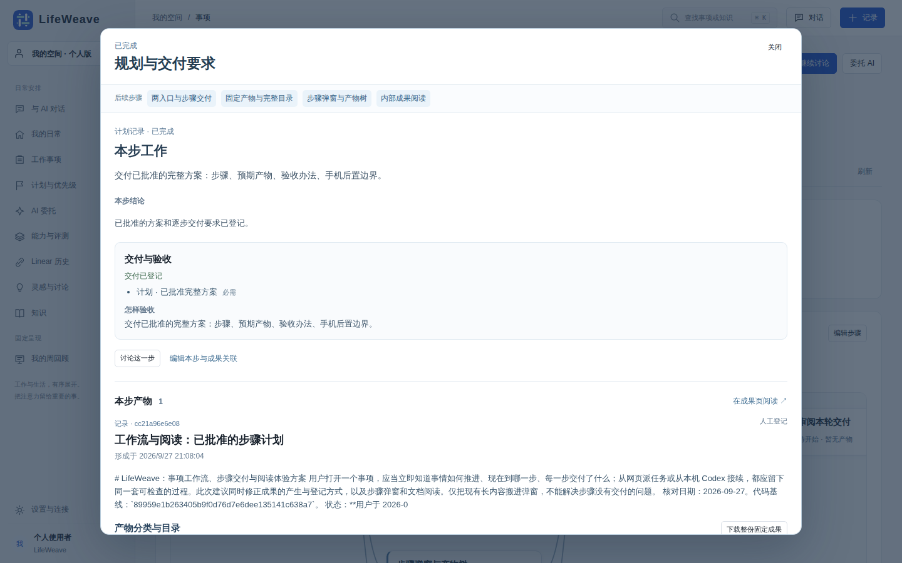

# 事项工作区：能力定义计划，统一交付与阅读

日期：2026-09-27。实施依据：本轮用户确认事项组织可以参考讨论方案，明确要求不同能力定义各自步骤、共用图节点与交付呈现；随后授权沉淀方案并直接实现一版。具体工程选择由本轮实施验证，不冒称用户逐项批准。

## 用户结果

打开工作事项，能通过范围、筛选、分组和父子关系找到要看的事。打开一件事，先看到当前局面、实际工作图和主要成果。点击步骤查看本步目标、结果、可用操作；背景与执行历史按需展开。研究、开发和人工事项共用同一套结构。

本次演进依据[已批准的工作流与阅读方案](../workspaces/reviews/task-workflow-and-reading/review.md)。用户反馈的主要问题是步骤缺少明确产物、内联展开使页面不断变长、开发记录与图分离；当前实现用共同步骤报告、大型弹窗和固定版本阅读处理这些问题。技术验证与用户接受仍分别记录。

## 产品边界

- 事项是一件持续的工作；步骤是该工作实际采用的计划；子事项具有独立跟踪意义。不会为每次工具调用生成一个业务步骤或子事项。
- 能力可以由 Agent、工具、脚本、人工组成。能力定义步骤、依赖、输入和输出；底座负责统一工作图、状态、节点阅读、成果入口与历史。
- 声明计划与观察记录区分来源；历史记录不足时不补造完整研究流程，不从 AI 成功推断用户已接受。
- 首版支持声明并保存有依赖的步骤图，已有开发和研究通过适配器接入。它是工作呈现与计划登记合同，不是新建通用流程执行引擎；执行复用当前受管开发、研究委托和人工路径。
- 研究、开发、人工输出使用统一成果目录；具体正文沿用 Markdown/HTML、代码交付等已有阅读器。最新完整成果优先，方案或审查输出不冒充最终代码交付。研究历史目录在用户展开时读取，单份正文在选择时读取；其他记录默认收起。

## 交互

### 列表

默认关注未完成事项，可切换全部、待处理和已完成。搜索与状态、类型、负责人、领域、专题筛选独立；分组和排序独立；优先级、标签和日期范围也可组合；列可配置，偏好按空间保存。父项原地展开，搜索命中子项保留父路径。专题管理为低频入口，会议作为呈现入口，不再与事项本体混淆。

显示真实创建/更新时间，完成日期只用完成记录；不存在不猜。标题优先，技术 ID 降级，类型与领域分列。不按标题关键词批量改动或删除验证事项。

### 详情

默认页签命名为“概览”，由“当前局面 + 步骤图 + 当前成果入口”组成。图负责看清工作路径，步骤弹窗负责读懂某一步；研究和开发共用底座。旧 `overview` URL 保留。

点击节点打开大型弹窗，标题与相邻步骤固定，正文在弹窗内部滚动，概览不被撑长。关闭或 Escape 返回原节点；焦点不逃入背景。`step`、`output`、`file` 参数定位所选步骤、产物和文件，目录展开及筛选在同一交付版本下恢复。窄屏使用全视口弹窗；这里只说明布局适配，手机网络访问仍未提供。

弹窗依次回答：

1. **这一步做什么、做到哪里**：名称、真实状态、已登记说明和结论。说明与结论相同只显示一次；不以空模板填版面。来源区分计划记录与实际执行记录。
2. **与哪些步骤有关**：前置及后续步骤显示状态并可点击切换，支持并行分支，不把整个图强行解释为上一步/下一步。
3. **预期与实际交付是什么**：显示预期产物、必需性与验收要求；只读本步 `outputIds`。默认按文档、代码变更、验证材料、附件、决策与操作分类，目录折叠；搜索、状态筛选和增删行数来自完整固定清单。选代码后按需读取单文件 diff，文档进入内部知识阅读页的指定交付版本，返回恢复原步骤。研究 ZIP、代码 ZIP 和历史正文入口保留，默认不展开长报告。
4. **可以接着做什么**：“讨论这一步”把步骤名称、状态、说明、当前记录、前置名称和成果引用送入同一事项的讨论草稿；当前阅读的产物引用排在最前；最多带 8 个前置名称和 8 份产物引用，更多项显式提示数量，给提问保留空间，不把整图塞进对话输入。用户发送前不执行。编辑入口定位本步以补充说明或关联已有成果；观察记录需显式另存计划。
5. **依据是什么**：步骤引用、事项共享背景和本步运行记录位于默认收起的区域，不铺开历史全文或内部委托 ID。

没有产物与成果暂不可读取分开提示；完成但无产物明确说明记录缺口，不把整件事项的报告自动当成本步产物。没有独立步骤背景时不声称已取得运行时上下文。一个报告可以是某一步的输出，也可以供后续步骤引用，但是否关联以已登记关系为准。

没有声明步骤且无可观察记录时，显示真实空态并允许登记步骤。打开页面、节点或编辑计划不触发执行；受管开发启动才绑定所选业务步骤，无计划时先登记方案、审查及实施要求。事项验收仍使用正式接受机制，阅读和步骤完成都不等于用户接受。通用图调度与无人值守重跑不在本轮范围。

### 状态责任

事项是否完成沿用正式状态与接受机制。新计划的步骤完成由共同报告规则检查固定产物类型、所属事项、版本与实际检查；不能靠编辑计划直接报成功。旧记录保留并标明未按新规则核验。一次执行只是某步骤的尝试，不覆盖整项业务计划；方案修订保留旧版与旧报告。步骤默认打开最近一次有效成功交付；迟到或被拒绝的报告不会抢占默认，用户仍可选择旧产物。

## 公共合同与责任

`GET /api/lifeweave/{workspace}/items/{itemId}/work-view` 返回当前局面、计划节点与成果引用。`PUT .../work-plan` 用事项版本保存能力声明的计划，合并保留其他 payload，并留下修改记录；冲突返回 409。

工作图节点包含稳定 id、名称、描述、状态、依赖、结论、运行/委托引用、成果引用、`expectedOutputs` 和 `acceptance`。一个计划最多 80 节点，每节点最多 79 个依赖；排除自身、重复、缺失引用及环路。共同报告按计划版本更新单个节点，幂等请求去重，并发报告合并；过期、缺交付或检查失败的报告可追溯但不把节点标为成功。

计划本身不复制提示词、完整运行正文或凭据。关联 Run、委托及成果必须属于同一事项与空间；链接按现有安全规则处理。无实际记录不会显示已完成。

后端 `work_view.py` 负责把声明计划与现有能力记录转换为共同合同；Router 只接入依赖和输入验证。前端 `api/workView.ts` 保存公共类型；图、节点详情、成果目录与公共正文阅读器各自独立。页面负责组合，不以事项类型条件分支拼出多套主界面。

`work_binding.py` 提供网页与本机共用的归属规则，`work_step_reports.py` 提供逐步交付检查。受管开发与外部报告均使用它们；未接入的任意 Agent 不会自动受管。Hook 仍只补充受支持的工具元数据，不能替代计划和产物。

`output_files.py` 为人工文档、成功运行、固定代码包提供完整目录和版本阅读；`development_delivery.py` 保存 Git 身份、前后文件快照、改动统计和引用媒体；`external_delivery.py` 只捕获绑定会话明确选择的范围，初始用户改动需明确确认。旧包优先读取其固定 Git 对象，缺失则提示限制，不读当前同名文件冒充旧版本。

内部知识页区分当前知识与工作产物；阅读工作产物不自动发布正式知识。`MarkdownBody` 复用 KaTeX，并增加受控 Mermaid 图、图片放大、章节目录和宽表；Library 按已登记文档解析相对图片，固定成果从本次快照读取。正文清理、来源校验、越界与符号链接限制保留。

## 实现分工与顺序

1. 集成负责人固定合同、沉淀本方案、登记本次事项和真实阶段。
2. 列表实现独立推进；后端实现计划登记与真实记录适配；详情实现公共图、节点与成果阅读。
3. 集成负责人接入 CLI、补齐真实字段、审查组合和边界，处理跨模块回归。
4. 使用真实 GSSM、开发事项及隔离数据库中的人工/自定义分支计划验收；构建后部署本机入口。
5. 写回已实现、未实现及证据，并回读项目知识。Notion 只镜像本文及交付，原文留在仓库。

## 验证与回退

- 从全新页面直接打开列表和研究/开发详情；不需要预热 API 或刷新。
- 列表核对多筛选组合、父子路径、全部列、持久化、空间切换、空结果、窄屏和键盘。
- 自定义计划验证并行依赖、更新冲突、80 节点上限、81 节点拒绝、循环及跨事项引用拒绝。
- 真实开发呈现方案/审查/实施的实际状态，研究呈现已有实际研究运行，缺失细粒度记录明确说明。
- 同一成果只在选中的阅读区域渲染；版本、反馈、图片和完整包下载保留。
- 验证切换事项/空间的迟到请求、失败空态、历史来源与纯人工路径。
- 运行前后端聚焦测试、类型检查、生产构建及真实浏览器。仅启动/停止本轮拥有的测试进程。
- 新数据使用现有事项 JSONB 和活动记录，无破坏迁移；旧页面与已有执行能力保留，Git 可回退代码，已登记计划不影响旧客户端。

## 尚未承诺的范围

任意第三方自动规划与执行、所有工具内部细节自动映射、通用拖拽流程编辑器、自动整理全部历史事项、完整团队权限不在首版承诺内。首版必须证明第三种自定义步骤无需新增页面也能持久化并展示，而不只给研究和开发各写一套静态图。

## 首版历史交付（本轮改进前）

2026-09-27 首版使用反馈修订：当时实现概览命名、步骤内实际产物阅读、依赖切换、链接恢复、编辑定位与带引用讨论；公共阅读器用于节点和成果页。归档默认折叠，历史只在成果页切换。修复窄屏长文本和轮询收起差异。验证与边界见[本次节点迭代](../workspaces/reviews/item-workspace-v1/step-detail/README.md)。

已实现：事项组织与真实完成日期；共同工作图、节点展开、计划编辑和版本冲突处理；研究/受管开发的真实状态适配；统一成果目录、人工正文与开发交付阅读、研究单份正文与历史目录按需加载；CLI 读写同一计划。新会话的 `continue` 也包含事项 payload 中的声明计划，精确当前投影可用 `work-view` 取得。

首版交付时本机入口已构建并重启。当时实际事项是 `item-7547b65b4f704829`，登记了六个真实交付阶段；前端/后端/列表的实现与检查通过主动外部会话阶段报告关联到同一事项，不冒充原生工具 trace。方案镜像位于 [Notion](https://app.notion.com/p/3e8af68286448159aa7ac5acdb1acb6a)，由本次交互式 MCP 发布并回读，与产品后台自动镜像配置分开。

验证包括：隔离 PostgreSQL 的图保存/冲突/归属/回滚；浏览器真实保存两个并行步骤再汇合的第三种个人事项，刷新回读、关联人工成果、创建新成果、编辑期间冲突、个人/团队隔离和 390px 窄屏；真实 GSSM/Qwen-Drive 单份正文、历史选择、图片及含资产 ZIP；真实开发方案与固定代码包。完整命令、截图和观察结果见[交付证据](../workspaces/reviews/item-workspace-v1/README.md)。

交叉审查和浏览器反馈已修复：长原始需求与重复摘要占据默认页；旧成果引用随新运行丢失；观察计划另存后未开始阶段被整体委托状态覆盖；交付封装失败被成功 Run 覆盖；代码交付 ID 误作实体读取；旧草稿借轮询取得新版本；失败刷新清空草稿；人工正文切换的迟到响应；有证据但无目录成果时丢失验收入口。上述证据覆盖首版技术路径；随后用户实际使用反馈指出命名和节点内容不足，详见“详情”的修订交互。这不构成跨领域或完整平台验收。

首版当时留下的事项：能力默认自动登记业务步骤、任意图调度及节点级执行入口；开发历史与共享背景进一步结构化；大量事项的查询分页和更完整的字段维护；旧事项关系清理；工作区随长期真实使用的交互迭代。旧研究仅能显示实际已记录的粗粒度运行。本轮没有替用户接受事项或知识，也没有宣称完整自主平台已经建成。

## 本轮工作流与阅读交付

2026-09-27 用户批准方案后，主 Codex 接续原工作区事项，分别登记计划、两入口与交付检查、固定产物、步骤弹窗、阅读、集成验证、用户接受七步。四个实现步骤的固定代码包已关联，可在本机概览点击阅读；集成验证作为网页建立的独立子事项，由 CLI 接续到同一目标。技术审查和用户接受分开，不代替用户验收。

后端全量 151 项、前端 143 项回归通过；真实步骤弹窗、代码目录、GSSM 公式图片与资源 ZIP、项目 Mermaid 和相对图片已核查。当前原文只在交付来源仓与已登记知识来源能明确对应时提供；默认始终阅读固定交付。完整验证与独立审查的最新结论见[本轮交付说明](../workspaces/reviews/task-workflow-and-reading/review.md)，历史测试数量不合并成完成率。

旧计划的版本快照保存在活动记录，尚无专用历史版本浏览器；历史论文图片从首次阅读快照起固定，不能追溯证明原运行结束时图片字节；未接入 LifeWeave 的 Agent 不会自动登记。服务仍仅监听本机，手机远程访问后置。Notion 镜像由交互式 MCP 更新，后台自动镜像凭据仍需独立配置。

## 当前交互截图

步骤在独立弹窗中展开，页面保持原位置；产物按类别和目录逐层展开。

