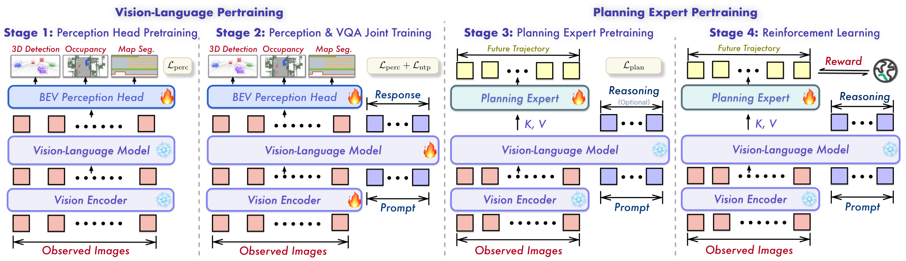

**Qwen-Drive-1.0 原文核验与研究报告 · 第一轮**

候选链接正确，已取得对应全文。本轮完成论文身份核验、方法与实验阅读，以及关键推理代码核对。**下文实验数字均为作者报告，未做独立复现。**

核心判断是：这项工作的价值在于让同一个视觉语言主干支持几何感知、问答和轨迹生成。现有结果支持这条路线的可行性，但不足以证明可靠的因果推理、全面领先或实车可部署性。

**研究对象与实际阅读范围**

| 核验项 | 本轮查证结果 |
| --- | --- |
| 标题 | *Qwen-Drive-1.0: An Initial Step towards a Vision-Language Foundation Model for Autonomous Driving*，与候选一致 |
| 编号与版本 | arXiv:2609.00111v1；2026-09-19 查证时，提交历史仅列 v1，时间为 2026-08-31 17:59:54 UTC |
| 作者 | Xin Zhou、Zongchuang Zhao、Zhibo Yang、Mingsheng Li、Humen Zhong、Shuai Bai、Du Chu、Ruizhe Chen、Zhaohai Li、Jun Tang、Qiuyue Wang、Mingkun Yang、Jiazhao Zhang、Dayiheng Liu、Dingkang Liang、Xiang Bai |
| 署名核对 | PDF 首页署名 Qwen Team、Huazhong University of Science and Technology；第 25 页按贡献角色列出作者，人员名单与 arXiv 相符，排列方式不同 |
| 日期差异 | PDF 页眉为 2026-09-02，侧边水印和 arXiv 历史为 2026-08-31。原因未确认，不能据此推断存在 v2 |
| 官方入口 | arXiv 与 PDF 均指向 QwenLM/Qwen-Drive-1.0；官方模型为 Qwen/Qwen-Drive-1.0-4B |

依据：[arXiv 元数据](https://arxiv.org/abs/2609.00111)、[固定版本 PDF](https://arxiv.org/pdf/2609.00111v1)、[官方仓库](https://github.com/QwenLM/Qwen-Drive-1.0)、[官方模型卡](https://huggingface.co/Qwen/Qwen-Drive-1.0-4B)。本地保留了[元数据文本](files/d8ca532ecb33953f-identity.txt)、[PDF 首页](files/9838f7acf715cf33-pdf-page-01.png)和[作者页](files/5ff212ed1f777239-pdf-page-25.png)。

全文共 40 页。我以 HTML 阅读正文第 1—5 节、附录 A 的奖励定义、附录 B.1—B.5 和 C.1—C.4 的文字与案例输出，并用 PDF 核对首页、作者页和闭环实验表。参考文献仅用于定位，未逐篇阅读。图 2、3、4、6 已下载并逐一查看；其余图未全部进行视觉核验。附录案例属于作者选例，本轮没有重新标注或运行验证。

代码固定到提交 `28091c1532e869bc7aee91fc0aef6b3e6fd0b2e0`，读取了 README、五份使用文档及规划、感知、评分相关源码。以下明确区分作者报告、源码核对和我的分析。

**问题与动机：语言理解如何变成可检验的驾驶能力**

作者希望在保留通用视觉语言能力的同时，补足驾驶需要的显式三维感知与动作输出。其方案以 Qwen3.5-4B 为共享主干，外接 BEV 感知头和规划专家，并用驾驶与通用数据共同适配。[官方模型说明](https://huggingface.co/Qwen/Qwen-Drive-1.0-4B)

我的理解是，这里有两个不同的检验问题：“能否描述场景”和“能否输出符合空间约束的动作”。例如，正确说出前方有车，仍没有给出可用于制动的距离、车道关系和未来运动。研究的意义在于增加可评分的输出接口，使文字回答之外的能力也能接受检验。

图源：论文 v1 图 3，已从[原文图片](https://arxiv.org/html/2609.00111v1/head.png)下载并实际查看。左侧融合视觉与语言主干特征；右侧规划模块读取 VLM 的 K/V 缓存。完整架构另见[已核验图 2](files/0d59dba4918feebf-qwendrive_overview.png)。

**方法：共享表示，两种外接输出**

感知模块使用环视图像和标定信息，输出三维框、语义占用和 BEV 地图。源码可见，它分别提取视觉编码器与 VLM 图像位置的特征，再交给 BEV 模块，通过检测、占用、地图分支解码。这使几何结果具有独立的预测接口。[感知实现](https://github.com/QwenLM/Qwen-Drive-1.0/blob/28091c1532e869bc7aee91fc0aef6b3e6fd0b2e0/src/qwen_drive_perception/modeling_perception.py)

工程上必须留意坐标：官方接口返回的检测框在 LiDAR 坐标系，占用和地图在 ego 坐标系。把这些数组直接叠画，会制造看似模型错误的坐标错误。官方文档还明确感知为单帧推理，输出包含 7 类检测、10 类占用、6 类地图。[感知文档](https://github.com/QwenLM/Qwen-Drive-1.0/blob/28091c1532e869bc7aee91fc0aef6b3e6fd0b2e0/docs/perception.md)

规划专家读取共享主干的注意力缓存。32 层专家每四层使用一组缓存，共对应八组。每个未来路点是一个 token，输出 50 个 $(x,y,\theta)$，覆盖未来 5 秒、10 Hz；$x$ 向前、$y$ 向左、$\theta$ 为相对航向。VLM 架构得以保持，但外部模块增加了参数与计算。[模型文档](https://github.com/QwenLM/Qwen-Drive-1.0/blob/28091c1532e869bc7aee91fc0aef6b3e6fd0b2e0/docs/model.md)

“统一”在这里主要是共享表示。已核对的规划调用链没有把感知头的三维框或占用栅格作为必经输入。因此，可视化出一个正确检测框，不能直接证明该框就是某次规划的决策依据。[规划调用链](https://github.com/QwenLM/Qwen-Drive-1.0/blob/28091c1532e869bc7aee91fc0aef6b3e6fd0b2e0/src/qwen_drive/modeling_qwen_drive.py)

**必要公式：从噪声逐步生成整条轨迹**

规划采用预测干净终点的 flow matching。把归一化真值轨迹记作 $\tau_1$，同形状高斯噪声记作 $\tau_0$，$t\in[0,1]$ 是生成过程的时间，而非车辆行驶时间。线性路径为：

$$
\tau_t=(1-t)\tau_0+t\tau_1.
$$

由此求导，目标速度为 $u=\tau_1-\tau_0$。若网络预测干净轨迹 $\hat\tau_1=f_\theta(\tau_t,t,c)$，其中 $c$ 包含图像、历史运动、导航、当前状态与可选文字推理，则在 $t<1$ 时：

$$
v_\theta=\frac{\hat\tau_1-\tau_t}{1-t},
\qquad
v_\theta-u=\frac{\hat\tau_1-\tau_1}{1-t}.
$$

后一个等式是我的代数展开：终点误差会被剩余时间放大，越靠近生成终点，数值处理越重要。已核对的 `PlanningExpert.sample` 使用 Euler 更新：

$$
\tau_{t+\Delta t}
=\tau_t+
\Delta t\frac{\hat\tau_1-\tau_t}{\max(1-t,0.1)},
\qquad \Delta t=0.1.
$$

默认十步迭代。轨迹坐标先归一化再恢复物理尺度，因此纵向、横向、航向的同等数值误差，并不意味着同等物理误差。[模型与采样说明](https://github.com/QwenLM/Qwen-Drive-1.0/blob/28091c1532e869bc7aee91fc0aef6b3e6fd0b2e0/docs/model.md)、[实际采样实现](https://github.com/QwenLM/Qwen-Drive-1.0/blob/28091c1532e869bc7aee91fc0aef6b3e6fd0b2e0/src/qwen_drive/planning_expert.py)

**训练阶段与数据**

图源：论文 v1 图 4，[原图](https://arxiv.org/html/2609.00111v1/training_recipe.png)，已实际查看；火焰表示更新，雪花表示冻结。

| 阶段 | 更新对象 | 监督作用 |
| --- | --- | --- |
| 1 | BEV 感知头 | 固定主干，初始化几何输出 |
| 2 | 视觉编码器、VLM、感知头 | 感知损失与驾驶／通用问答共同适配 |
| 3 | 规划专家 | 固定主干，学习轨迹；文字推理可作条件，此阶段不训练文本生成 |
| 4 | 规划专家 | 固定主干，用轨迹奖励优化，得到 RL 版本 |

原文报告的数据规模如下：

- 感知来自 nuScenes、OpenScene。
- 公共驾驶问答由 553 万过滤为 309 万。
- 第二阶段重复采样前为 154 万例；有效配比为感知 12.7%、通用视觉语言 31.0%、驾驶视觉语言 56.3%。
- 规划阶段约 283 万例，来自 NAVSIM、OpenScene、WOD-E2E、PAI-AV，其中 68.5 万带推理条件。
- RL 使用 NAVSIM 1.5 万、PAI-AV 1.5 万以及 479 个带偏好标注的 WOD 场景。[原文 §2.2—2.3](https://arxiv.org/html/2609.00111v1#S2)

这些数字对应不同数据池和采样阶段，不能相加当作去重场景数；[已查看的图 6](files/2392474204428bf5-data_analysis.png)展示的是重复采样前配比，也不能代替有效训练比例。

可复现的数据接口同样重要：规划使用三路摄像头、四个时刻；不同来源统一到 ego 坐标和 10 Hz 轨迹，Waymo 的原始未来位置需要重采样。官方数据文档说明，完整 benchmark 场景文件并未随仓库提供，需要从源数据构建。[数据文档](https://github.com/QwenLM/Qwen-Drive-1.0/blob/28091c1532e869bc7aee91fc0aef6b3e6fd0b2e0/docs/data.md)

我的判断是，复现应先检查视角顺序、时间网格、尺度和标定，再讨论模型能力。否则，即使训练配方一致，输入表达仍可能不同。

强化学习的理解重点是：**它利用外部奖励改变规划专家生成轨迹的分布，不代表语言主干也在学习新的推理。**原文在生成后段引入平滑随机扰动，以组内相对奖励优化规划；附录 A 给出 NAVSIM 的 PDMS、WOD 的 RFS 与位移项，PAI-AV 则使用多时间范围位移奖励。[原文 §2.2、附录 A](https://arxiv.org/html/2609.00111v1#A1)

发布接口进一步限定：`planner-sft` 支持直接规划和带推理规划，`planner-rl` 按带推理模式使用。源码中，带推理模式先生成文本，再把包含这些 token 的缓存交给专家。[使用文档](https://github.com/QwenLM/Qwen-Drive-1.0/blob/28091c1532e869bc7aee91fc0aef6b3e6fd0b2e0/docs/cookbook.md)、[实现](https://github.com/QwenLM/Qwen-Drive-1.0/blob/28091c1532e869bc7aee91fc0aef6b3e6fd0b2e0/src/qwen_drive/modeling_qwen_drive.py)

**实验：哪些结论有支持，哪些还不能成立**

下表均为作者结果，没有本轮实测项。

| 评估 | 关键结果 | 应如何理解 |
| --- | --- | --- |
| 驾驶理解 | LingoQA：基座 70.4 → SFT 77.8 | 支持驾驶问答增强；此数使用 Qwen-Plus 裁判，不能直接与不同裁判成绩拼榜 |
| 通用理解 | MMBench：87.1 → 85.5；RealWorldQA：76.3 → 79.0 | 有升有降，支持“大体保留”，不支持“所有能力均提升” |
| WOD-E2E 测试集 | 带推理 SFT → RL：RFS 7.78 → 7.91；5 秒 ADE 2.65 → 2.67 米 | 偏好评分改善，位移误差没有同步下降 |
| NAVSIM | 带推理 SFT 88.2 → RL 90.7；RL best-of-6 为 91.4 | 单轨迹与借助评分器选出的多轨迹上界须分列 |
| PAI-AV 700 帧留出子集 | 5 秒平均 ADE：SFT 1.23 → RL 1.27 米 | RL 并非对每个指标都有收益 |

来源：[官方仓库的视觉语言结果及裁判说明](https://github.com/QwenLM/Qwen-Drive-1.0)、[官方评测文档](https://github.com/QwenLM/Qwen-Drive-1.0/blob/28091c1532e869bc7aee91fc0aef6b3e6fd0b2e0/docs/evaluation.md)。

感知表也有边界：nuScenes 检测 mAP 为 43.95，地图 mIoU 为 60.99，但占用 mIoU 为 19.82，低于表内多任务 BEVFormerV2 的 25.72。这里使用统一重映射类别和修改后的 NDS，应按该协议解释，不能直接当作标准 nuScenes 榜单排名。[原文表 1](https://arxiv.org/html/2609.00111v1#S3.T1)

闭环尤其值得单独看。PDF 第 20 页表 7 覆盖 916 个 AlpaSim 场景：SFT → RL 的越界率为 24% → 12%，但进度为 54% → 48%，所有事件近距离遭遇率为 38% → 41%，有责 AlpaSim 分数为 0.27 → 0.37。我将其解释为不同目标间的权衡，不能仅据越界率减半写成整体驾驶能力翻倍。[表 7 原文](https://arxiv.org/html/2609.00111v1#S3.T7)、[已实际查看的表格页面](files/a82bb0c0207a384a-pdf-page-20.png)

还有三项协议限制直接影响判断：

1. **WOD 验证集参与奖励训练。** 验证 RFS 8.45 是样本内结果；评估泛化应优先看测试集 7.91。[评测文档](https://github.com/QwenLM/Qwen-Drive-1.0/blob/28091c1532e869bc7aee91fc0aef6b3e6fd0b2e0/docs/evaluation.md)
2. **best-of-6 包含理想选择器。** 我核对到 NAVSIM 脚本对候选逐条评分后取最大值；`minADE` 实现也直接利用真值取最小误差。它们衡量候选集合的潜力，不能替代实际部署选择策略的成绩。[NAVSIM 评分代码](https://github.com/QwenLM/Qwen-Drive-1.0/blob/28091c1532e869bc7aee91fc0aef6b3e6fd0b2e0/scripts/eval_navsim.py)、[位移指标代码](https://github.com/QwenLM/Qwen-Drive-1.0/blob/28091c1532e869bc7aee91fc0aef6b3e6fd0b2e0/src/qwen_drive/metrics.py)
3. **开环、伪闭环和闭环回答不同问题。** ADE 衡量与记录轨迹的距离；NAVSIM 的单次规划评分不能覆盖持续纠错；AlpaSim 的重复规划更接近这一问题，但仍是仿真。我的研究判断是，三种结果应相互补充，不能用一个高分替代全部驾驶能力证据。

**局限与对自动驾驶研究的启发**

作者承认，多时间尺度的因果判断不稳定，文字理由与实际轨迹也不总一致。因此，读到“推理帮助规划”时，还不能将它升级为“解释忠实反映决策原因”。[原文 §5](https://arxiv.org/html/2609.00111v1#S5)

感知与规划之间的因果证据也有限：表 8 中加入三维监督后的 WOD 验证 RFS 从 7.91 到 7.96，作者明确没有据此认定提升来自三维监督。我的判断是，这个消融支持兼容性，但不足以确定增益机制。[原文表 8 及分析](https://arxiv.org/html/2609.00111v1#S3.T8)

以下是我的研究建议，尚未被本轮实验验证：

- **检验几何监督是否真正改善控制。** 固定数据、训练预算与规划模块，只改变感知监督，同时测几何质量和闭环行为。共享主干和共同提升本身不足以确立因果关系。
- **把理由与动作一致性变成单独指标。** 对声称停车、让行、绕障的案例，检查未来短时轨迹是否执行；再做理由替换或关键信息移除，观察动作是否合理改变。
- **单独评估轨迹选择器。** 报告单样本、实际选择策略、真值最优候选三组结果，区分生成能力与选择能力。
- **迁移到目标车辆时先核查输入。** 时间采样、摄像头标定、坐标转换和图像分辨率应成为实验记录的一部分；通用视觉问答成绩不能直接证明目标车平台的驾驶泛化。

这些方向针对自动驾驶研究的一般需求。当前快照没有你的具体模型、数据或硬件项目，因此没有虚构与某个既有工程的匹配关系。

**材料缺口、后续步骤与反馈**

本轮已取得 PDF、HTML、官方文档和关键源码，但没有下载权重、数据集，没有执行推理、训练或评分。固定提交的完整文件树未见完整 SFT/RL 训练入口或 AlpaSim 评估入口，因此不能确认端到端训练和闭环复现的完备性。PDF 页眉日期差异也仍待解释。

下一轮最有价值的工作是：先补训练配置、数据筛选和划分清单，再围绕“理由是否控制动作”或“几何监督是否改善闭环”固定一个问题。若转入实测，需要明确数据、算力和执行范围，并从官方演示与输入校验开始。

本轮固定反馈为空，且没有前轮正文，因此这是第一版完整报告。后续可按段落指出需加强的论点或证据，再围绕同一目标修订全文。

可复核材料：[来源、时间与 SHA-256 清单](files/e186239f7db7d25f-sources.json)、[阅读与视觉核验记录](files/e612227a6d3420bf-verification.md)、[原文提取文本](files/d3fe76311af51007-pdf-fulltext.txt)。材料均在本轮 `research/`，引用路径已回读核对。没有发送外部消息、改动外部系统或自动接受知识；事项是否被业务接受仍由应用和你的审阅决定。
