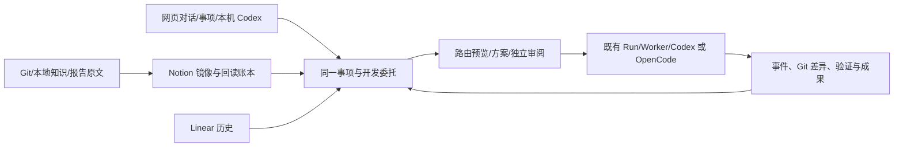

# LifeWeave：开发 Agent、知识入口与产品对标

状态：需求与实施方向已确认（R1/R2），正在实施首条开发 Agent 工作链。核对日期：2026-09-26。批准范围来自用户持续要求“设计方案并实施”及随后提供的[优先交付说明](/home/yyh/.codex/attachments/632a17c9-99ec-4aa2-851a-0382a11d0f56/已粘贴的文本.txt)：先用已成功的 Codex 连通网页与本机 Codex、方案/审查/实施/验证和 Notion 知识；OpenCode、其他 API 与高级路由按同一接口后续补齐。未验证功能不得写成已实现。

## 为什么要改

用户现在既会在 LifeWeave 网页中交代工作，也会直接在 Codex 对话中开发。现有网页能委托一次 Run，外部 Codex 会话能主动登记阶段，但两条路径尚未形成同一种可理解的开发体验：一句话可能直接触发工作；用户难以在动手前看清由谁执行、将读取什么、有没有形成和审视方案；运行中看不见足够的实际步骤；结束后也难以从事项还原代码、验证、知识变化和下一步。

知识目前散在本地 Markdown、GitHub、Linear 和其他位置。用户决定全面转向 Notion，Linear 仅留历史只读；本地 Codex 与 LifeWeave 网页应使用同一批可追溯材料。迁移期间不能丢失两篇论文等既有归档，Notion 回读核验前也不能把旧链接当成已迁移。

用户还希望核对 WorkBuddy、所称“qwenpawhub／千问 Polar Hub”及千问办公等产品，比较个人中心到团队中枢、快速捕捉灵感、交互、能力、实现边界和产品理念，找到 LifeWeave 应吸收与超越的部分。产品名称和现时能力必须先用官方材料核准。

## 希望得到的使用结果

用户从网页说“继续改这个功能”时，系统先关联或建立可持续事项，展示建议执行的 Agent、实际可用的 Codex／OpenCode／其他模型连接、计划读取的项目与知识版本，以及本次会做什么。用户可改选合适的 Agent 或执行环境；只是提问、讨论或记录灵感时不自动开始开发。用户已明确委托实施时，这句话本身就是授权，系统先留下背景、方案与相称审查，再连续实施，不加一次无意义的批准按钮。网页能看到真实运行阶段、采用的上下文、关键命令或工具结果、错误、代码差异、验证及成果；方案是否经过审视应可辨，不靠 Agent 自称“已审查”。

用户直接在本机 Codex 对话中处理同一任务时，也能调用同一套开发方法，关联同一事项。网页可及时看见通过正式入口上报或运行时实际捕获的过程，并标明各自的观测来源；中断后可从事项继续。两种入口得到的是同一份工作事实，不要求为一次开发再无意义地启动另一个 Codex。

用户在设置里能看清可用执行器、模型和连接的状态，配置必要的 API 地址与凭证，测试连接是否可用，并知道本次运行实际采用了哪一项。已有 CLI 登录与新填的 API Key 是不同凭证来源；失败应明确显示，不能静默换用别的账号或模型。

用户能在 Notion 找到和阅读知识镜像，并在 LifeWeave／本地 Codex 中引用其原文及版本；镜像延迟、冲突、同步失败与远端回读有明确状态。现阶段所有正式原文仍在原位置维护，Notion 不抢先成为新的唯一写入点；项目源码和项目规范继续回到 Git 仓核对。旧 Linear 内容只读保留，在 Notion 正式入口验证前保持可找、可恢复。

对标结果是一份可核对的现状比较和具体产品机会：相同任务在竞品怎样进入、推进、接续、协作，哪些行为有官方证据，哪些只是推断；最终转化为 LifeWeave 的交互与能力取舍，而不是模仿宣传词。

## 本次范围与保持的行为

本轮需求覆盖：开发 Agent 的职责与选择／推荐，网页与 Codex 双入口，执行器和凭证管理，可见的开发方案、上下文、过程与成果；Notion 知识连接及 Linear 角色迁移；三个竞品方向的核验和比较。现有研究事项、报告图片和 ZIP、GitHub 归档、知识版本、个人／团队空间都必须保持可用。个人生活、研究与灵感不因开发 Agent 上线被强制套入软件开发流程。

“自动推荐 Agent”和“自动执行”分开：推荐可以默认发生；用户明确说要实施或选了执行模式就构成委托，不能在此之外反复索取授权。普通提问/讨论/记录不自动修改代码。网页上看到的计划、实际命令、运行结果、人工验收分别有不同来源和状态。完整自动路由、自主改进和多人权限是否在本轮形成可靠体验，要依据当前代码与真实任务核对，不预先当作已完成。

## 如何验收

1. 用同一真实开发任务分别走网页委托和本机 Codex 直接对话：两边关联同一事项，用户能看清选择的 Agent／执行器、项目与知识版本、方案、执行记录、代码差异、验证和下一步；失败与未采集步骤如实显示。
2. 在设置中配置或选择至少两种确实可用的执行路径，分别检查连接成功、错误和凭证隔离；不能把“CLI 已安装”当成模型调用成功。
3. 普通提问、只记录灵感与一个非开发任务不触发开发运行；用户改选 Agent 或执行器后，记录实际使用项，而不是只保存推荐值。
4. 从 Notion 镜像入口找到并读回一篇完整知识，LifeWeave 与 Codex 能确认它对应的原文版本；原文修改、镜像延迟或远端失败时不误报同步。既有论文与 Linear 归档仍可追溯。
5. 对标材料能打开官方来源，并把至少一个真实交互差距和一个后端／知识差距转成可检验的 LifeWeave 决策。

## 需要确认的产品语义

- 已决定：知识与新工作全面转向 Notion／LifeWeave，Linear 只作历史只读；新归档不再以 Linear 为目标。旧内容迁移和停写需有完整性与回读证据，不能只改一个默认配置就宣称完成。
- 已决定：Notion 先承担同源镜像和随时阅读，所有正式原文暂留原处；必须显示原文身份、版本和镜像状态，不让两边自由修改造成两份“最新”。何时把某类原文改为 Notion 维护，留待真实使用后另行决定。

## 实施方案：在现有事项中形成同一条可观察的开发工作

原有事项、对话、Run、运行事件、知识源与归档继续作为产品底座。新增的不是第二个“开发平台”，而是事项中的**开发委托**：先预览路由与上下文，明确启动后以只读环境形成方案、由独立审阅回合核对，再进入可写实施；本机已有 Codex 会话则通过关联入口和受支持的运行事件接入同一事项。网页展示每条证据究竟来自运行时、Git 检查、人工上报还是模型陈述。Notion 是原文的可回读镜像，Linear 转为只读历史来源。

图中网页和 CLI 写入同一事项 ID；网页发起的运行沿用现有 Run 与 Worker，事件按现有事件 API 回读。镜像从登记的原文单向投影，Notion 页面保留原文身份和版本。Linear 只提供原有链接、已绑定事项和历史阅读，不接受新的发布。

### 日常使用与状态

1. 用户在对话中问问题、记录灵感或讨论时，维持轻路径。当前 `Conversations.apply()` 在模型判定 `execute` 后直接创建 `engine='codex'` 的可写 Run；目标行为是明确实施时自动建立开发委托，先返回可审的准备卡，包含关联事项、目标、开发 Agent 版本、推荐理由、候选执行器/模型/凭证来源、项目提交、知识与方法版本、权限和预计阶段，然后进入只读方案阶段，不直接改代码。原始表达保存；明确选择“只讨论/记录”继续沿原路径。
2. 用户可接受推荐或改选 Agent、执行器、模型、项目和知识。第一版目录至少有“开发 Agent”和沿用当前轻路径的“通用助理”；后续已发布 Agent 进入适用候选，Skill 是方法而非假冒独立 Agent。选择顺序为“本次明确指定 → 同一事项已有且仍适用 → 根据任务推荐 → 报告缺口”，再过滤实际健康的执行器，显示推荐理由、版本和不可用原因；用户覆盖选择写入委托快照，不静默换 Agent、模型或连接。第一版只由一个开发 Agent 编排单次开发，不建立多 Agent 自治网络。
3. 明确委托后固定上述输入，创建开发委托并先发一个只读方案 Run。小改动允许短方案和轻量自检；跨模块、数据结构或外部写入需要完整方案及独立只读审阅 Run。审阅使用固定方案正文与哈希、原始任务和仓库版本核对遗漏、权限和可测性，返回 `pass/needs_revision/blocked` 和逐条理由，留下独立 session/Run ID；自检与独立审阅的来源不能混淆。有效审查通过后自动开启同一委托的可写实施 Run；若计划扩大权限、改变既定目标或原始提交已变，则停在待用户调整状态。用户已授权的范围内无需再次点批准；最终成果仍由用户决定业务接受。
4. 网页通过现有事件分页查看各阶段实际 Run 事件，显示时间、工具类型、关键输入/输出摘要、错误及来源。运行结束后还读取工作树 diff/提交、测试命令及退出码、固定产物和未完成项；敏感输出需要过滤，原始详细日志仅留受限运行目录。事件缺失明确标“未采集”，不从模型最终回答反推执行过程。结果经反馈后继续同一事项，方案/审阅/实施的版本引用始终不漂移。
5. 用户直接在本机 Codex 对话时，从 LifeWeave CLI/Skill 查找事项并登记当前会话与任务；Codex hook 在用户信任后将会话/工具生命周期事件上报，应用端记录原生 event 的 session、sequence、来源和时间；服务端同时观测 Git 修订与变更。未安装/未信任 hook 时仍可用既有显式阶段上报，但页面必须标“人工上报、非内部 trace”。外部会话不伪装成平台 Worker Run，也不为同一工作重复拉起 Codex。若官方 hook 无法提供完整 item 内容，诚实显示其粒度，后续以 App Server 的 `thread/read`/通知核对可行性，不读取不稳定的 transcript 私有格式作为事实源。
6. 本机或网页端查看同一事项时，知识卡同时显示原文链接、原文版本、Notion 镜像 URL、镜像版本/时间/结果。原文变更进入待同步队列；上传成功后读取 Notion 全文，识别截断、未知块、图片和链接状态，再确认镜像。失败保留原文与上次已确认镜像，并显示“已过期/失败”。只镜像已登记的 Git 文档、本地知识、研究报告及明确选中的历史材料，不抓取整台电脑。新知识修订仍在原文责任处审批和写回。

### 模块责任与变更

| 位置 | 现状与继续复用 | 本次改变与改变后的作用 | 上下游 |
|---|---|---|---|
| 网页对话、事项详情、Run 页 | 对话可持续；事项、成果和 Run 可查看；现有委托表单可选 Codex/OpenCode、模型和方法 | 把“执行”改为预览后显式启动；在现有事项内显示方案/审阅/实施和外部会话的同一时间线，展示上下文与证据来源；保留研究/生活的轻路径 | 调用开发委托、Run、知识镜像 API |
| 设置/连接页 | 只看 CLI 安装、本机 Worker 和 Linear 凭证 | 显示执行器、可用模型、登录来源与连接测试；接入 Notion 镜像配置；Linear 调整为历史只读入口 | 调用连接检查、Notion 状态；秘密不返给页面 |
| 对话与开发委托 owner | `conversations.py` 会自动创建可写 Run；`external_development.py` 仅接主动阶段报告 | 对话只产生准备卡；开发委托独立管理版本、路由、方案、审阅、实施状态；外部 Codex 事件与其绑定，但不混为 Run | 事项、Run、能力候选、事件、Git |
| 执行 Runtime/Worker | 有队列、机器、隔离 worktree、Codex JSON 事件与固定快照；OpenCode 已接线但真实模型调用失败 | 保留执行器架构；扩展阶段关联、方案只读与审阅只读、实施可写，固定实际模型/凭证身份；通过事件清洗和 Git 证据收集提供可核对轨迹 | 开发委托调用 Run；Run 事件供页面读取 |
| Agent/方法来源 | 已发布 Skill/能力候选与词面推荐；单次委托可固定版本 | 开发 Agent 作为可版本化配置，定义适用任务、阶段、输出与停止条件；候选只有实际可用且已发布才被自动路由；人工可覆盖并记录原因 | 开发委托选择、运行快照 |
| 知识与 Notion 镜像 | 本地 Markdown 库、项目清单、研究 ZIP/GitHub、Linear 归档 | 建立原文登记、单向镜像账本、Notion API 上传与全文回读；文章正文和图片需同版，ZIP/GitHub 作为完整附件或回退入口；原文仍在原位 | 知识源与报告事件触发；页面和 Codex 消费 |
| Linear 适配 | 仍可新建发布和报告自动归档 | 关闭新增写入 API/后台目标，保留旧绑定、旧链接和只读读取；历史数据清点并镜像后逐条确认 | 旧内容可读，不能产生新写入 |

现有 `/api/lifeweave/.../runs` 和事件接口保持兼容。`/linear/publications` 的旧写入调用方从页面移除，服务端返回明确“已转历史只读”；研究归档设置中旧 Linear 目标不再作为新报告目的地，既有确认记录不可删除。现有 `workspaces` 字面上仍是单用户的个人/团队内容隔离；本轮不把它宣称为多人权限。

### 本轮接口清单

以下是业务用例接口；`{workspace}` 和 `{itemId}` 都按现有空间/事项验证，写入请求带幂等 requestId。详细字段落地时保持 camelCase 与现有前端一致。

| 用例 | owner | 输入 | 成功输出 | 失败方式 | 消费者 |
|---|---|---|---|---|---|
| 对话准备委托 | 对话服务，复用现有 turn 提交/读取 | 原话、mode、itemId、研究引用 | 保存的 turn、准备卡 ID 和推荐快照；明确委托时建只读方案 Run | 不明确关联则保留原话并要求澄清 | 对话页 |
| 读取 Agent/执行环境候选 | 开发委托 | 事项、项目目录、任务文本 | 可选 Agent 版本、执行器/模型、权限和健康/推荐理由 | 健康未知标未知，不能当可用 | 委托卡与设置页 |
| 连接状态与测试 | 执行环境设置 | 执行器、模型、凭证来源/可选的测试动作 | CLI 版本、账号来源标识、真实最小调用结果；不含密钥 | 401/额度/CLI 错误分开显示 | 设置与委托卡 |
| 保存执行连接 | 执行环境设置 | provider、模型、受限密钥或文件路径、空间 | 连接 ID 与掩码元数据 | 权限过宽/不可读/不支持拒绝 | 设置页；Worker 只读引用 |
| 创建/启动开发委托 | 开发委托 | itemId、准备卡版本、Agent 版本、engine/model、目录/提交、知识选择、权限、requestId | 委托 ID、状态、第一只读 Run ID；明确委托不再需要第二次批准 | 版本改变/不可用/重复活动委托拒绝 | 对话/事项页 |
| 读取委托列表/详情 | 开发委托 | itemId 或委托 ID | 路由快照、方案/审阅/实施 Run 引用、状态及失败 | 不属当前空间返回 404 | 事项页与 CLI |
| 继续/停止委托 | 开发委托 | 委托 ID、期望版本、用户调整或取消 | 新状态/对应 Run | 版本冲突或终态拒绝 | 事项页；只在需人工调整时使用 |
| 读取运行/事件/结果 | 既有 Runtime API | Run ID、事件游标 | 固定 Run 与分页事件/成果 | Run 不存在或未产出明确状态 | 委托时间线与 Run 页 |
| 绑定已有 Codex 会话 | 外部开发 | itemId、session/thread ID、repo 路径、requestId | 绑定 ID、Git 基线与事件来源 | 会话不匹配、目录不可读拒绝 | 本机 CLI/Skill |
| 写入/读取外部事件 | 外部开发 | 绑定 ID、事件 ID/序号、受支持 hook payload；或手工阶段报告 | 幂等收据、来源标记、事件列表 | 丢包/序号缺口显式标记；不伪造 | hook 与事项页 |
| 登记/查看镜像源 | 知识镜像 | source URI、类型、权威地址、空间 | 源 ID、当前版本、镜像状态 | 非允许目录/权限/重复冲突拒绝 | 设置与知识页 |
| 配置/测试 Notion 镜像 | 知识镜像 | 根页面 ID、私有 token 文件/环境引用 | 掩码连接状态、根页面读写能力结果 | OAuth 与 API 凭证不能混用，缺权限显示失败 | 设置页/后台任务 |
| 同步/重试/查看镜像 | 知识镜像 | source ID 或已登记批次、目标版本、requestId | 每条源的 page URL、回读状态、失败与版本 | 单条失败保留其他成功；远端改动冲突停止覆盖 | 原文事件、知识页、设置页 |
| 历史 Linear 读取 | 旧适配/既有 API | 旧绑定/远端 issue ID | 历史快照与原 URL | 无凭证时仍显示本地快照/链接 | 连接页、事项页 |

Notion Codex MCP 是 **Codex 的知识工具连接**，[官方接入说明](https://developers.notion.com/guides/mcp/get-started-with-mcp)给出地址 `https://mcp.notion.com/mcp` 及 `codex mcp login notion` 交互式 OAuth；它不承担 LifeWeave 后台自动镜像。后台自动镜像使用 [Notion 正式 Markdown REST API](https://developers.notion.com/guides/data-apis/working-with-markdown-content) 的私有连接令牌或可续期授权，权限限定到目标根页面。设置页分别显示这两条连接的状态，不因本轮 ChatGPT 可以打开四张 Notion 页面就报告本机 Codex 已连接。每次研究报告成功形成固定版本后，既有 GitHub ZIP 归档和新的 Notion 镜像自动分别排队、独立回读确认；Notion 失败不撤销已确认 GitHub 归档，也不显示“全部已同步”。

### 数据、事务与冲突

开发委托（同一 item 可有多次）保存：状态、准备快照哈希、Agent 版本、用户选择与推荐、repo URL/基线提交、权限、方案/审阅/实施 Run ID、方案正文哈希、审阅方式/判定与版本、失败原因及时间。每个 Run 仍是完整独立执行记录；阶段链接不能重写已完成 Run。方案与审阅使用同一 Git 基线，进入实施前再次校验；不同则重新准备，不把旧方案套到新代码上。委托状态按 `prepared → planning → [reviewing] → implementing → awaiting_acceptance` 前进，另有 `blocked/failed/cancelled`；小改动的方括号阶段用带来源的自检记录替代，不虚构独立审阅。状态和 Run 引用在同一数据库事务中更新，后台恢复通过幂等阶段 ID 避免重复运行。

外部会话绑定保存 workspace/item/session/repo 和观测范围；事件逐条保存唯一 session+sequence/eventId、kind、source、时间、脱敏摘要、可用 payload 与缺口。现有活动表继续容纳人工阶段报告；原生高频事件使用独立关联记录，避免每次读取整份事项活动。Git 差异摘要、测试退出码与模型自述分别标 provenance。令牌和 API Key 只在 owner-only 的本机文件/部署环境中；数据库只保存引用与掩码。运行环境不得把个人凭证复制进团队空间；所有日志、提示快照和 API 回包清除凭证值。

镜像源保存 `workspace + sourceType + canonicalUri` 唯一键、原文修订/内容 SHA-256、Notion page ID、上次确认版本和回读结果；每次尝试另存状态、错误与远端 URL。镜像页顶部写原文链接、版本、更新时间与“镜像，原文在原处维护”。同一原文版本重复触发只得到同一确认结果；上传前若 Notion 页面已被人在远端修改，标冲突而不覆盖。Notion `GET /v1/pages/{id}/markdown` 若 `truncated=true`、存在未知块或附件/图片未能读回，不算全文确认。Markdown 的标准化只容忍无害序列化差异，不能把截断算一致。历史 Linear 文档逐条建立来源映射，不删除任何旧链接；迁移未确认时显示历史入口与镜像待完成。

本次只读清点的迁移起点：Qwen-Drive 与 GSSM 两份固定研究版在本地、GitHub、Linear 三处均标 `confirmed`；2026-09-26 的两份内部验证报告在本地和 GitHub 已确认，Linear 标 `failed`。这四份状态都不能凭旧设置推定 Notion 已有镜像。切换时停止后两份的 Linear 重试，保留失败记录；历史两篇从已确认 GitHub/本地固定包镜像，不重新生成研究正文。现有项目规范来源清单为 `docs/current-sources.json`，作为首批 Git 文档登记入口。

当前 Notion 会话已能读到 [LifeWeave｜项目与知识入口](https://app.notion.com/p/3e7af682864481769d2decf36863c820) 及开发 Agent、Notion 接入、竞品对标三张草稿页；它们是线上方案材料，不是镜像成功证据。建议把该入口页作为镜像根目录，但新建的后台连接必须对该页面拥有真实读写权限，否则设置页显示“缺少共享/授权”，不得另建一个同名孤岛。既有四页的人工正文不被同步程序覆盖，自动镜像只管理其下新建、带源标识的子页。

### 技术选择及退出条件

网页受控运行继续使用现有 `codex exec --json` 与 Worker 事件流；这是当前已有的、可固定输入和输出的路径。Codex App Server 官方有 `thread/start`、`turn/start`、通知和 `thread/read`，适合后续需要多轮实时 steer 时使用，但本轮不能把它作为所有 CLI 会话自动接管的依据。本机既有会话采用官方 Hook 的 `SessionStart/PostToolUse/Stop/Interrupt` 等受支持事件及显式登记；Hook 需用户信任且可能跳过，不能承诺 100% 捕获。Hook 事件与 App Server 通知不混写成无来源的统一日志。OpenCode 保留可选项，但当前真实调用失败；修复并完成一次端到端成功前只标“不可用”，不能在自动推荐里作为首选。

Notion 镜像首版用 REST Markdown API（创建、读取、更新）及文件上传处理图片；源文件来自已登记清单和固定研究版本。MCP OAuth 用于本机 Codex 交互式查读，不用它充当无人值守同步凭证。GitHub 是代码/研究包的正式原文或备份位置，Notion 是可随时阅读的镜像；当前单机服务关机时新的任务/同步不会继续执行，已确认的 GitHub/Notion 内容仍可访问。要获得关机后持续处理，需要单独部署远端 Worker/服务，不能由这次镜像配置暗示已有此能力。

### 竞品事实与 LifeWeave 的具体取舍

| 产品方向与一手依据 | 核准到的能力 | 本方案吸收/超越点；尚未验证的边界 |
|---|---|---|
| [QwenPaw Hub 官方文档](https://github.com/agentscope-ai/QwenPaw/blob/main/website/public/docs/hub.en.md) | 共享服务地址，每人独立 workspace、设置、凭证、会话；可选择 Local/Docker 运行。官方说 2.2.0 Hub 面向互信内部团队，不宜当公共多租户。 | 借鉴运行与账号隔离；LifeWeave 当前个人/团队只是单用户空间，不能宣称已有 Hub 级权限。先把单用户开发流程和证据做好，再设计真正成员身份。用户所称“Polar Hub”按 QwenPaw Hub 理解；未找到独立“千问 Polar Hub”官方产品。 |
| [WorkBuddy 产品指南](https://www.workbuddy.cn/docs/workbuddy/From-Beginner-to-Expert-Guide/Product-Guide) | 官方列出灵感、项目、专家、技能、连接器、资料库、Git 并行、模型切换与高危指令拦截。 | 借鉴低成本捕捉与可选专家，保留 LifeWeave 轻路径；差异化放在同一事项跨网页/本机 Codex 的版本化方案、独立审阅和可追溯 Git/知识证据。尚未登录产品实测流畅度，不能宣称交互已超越。 |
| [千问办公官方简介](https://docs.qwenwork.cn/product-introduction)、[专家套件](https://help.aliyun.com/zh/qwenwork/expert-kit) | 官方称网页/桌面/钉钉多端、连接器、云任务；专家套件组合 Skill、数据连接、工作流和交付标准。 | 借鉴“一入口交付”和方法包治理；LifeWeave 不复制全场景入口，只把当前开发、研究、灵感按不同轻重路径接进同一事项。官方介绍是产品声明，具体稳定性和流程细节仍须实测。 |

对标验收选相同的三件小事：10 秒记录灵感后找回；把一个真实代码改动从计划推进到可审结果；在别的设备找到一篇带图研究并继续讨论。记录点击数、上下文重输、计划/过程可见度、成果可回读与失败提示；只有对方可操作且同条件实测的维度才做优劣判断。上述官方资料支持能力存在，不支持声称 LifeWeave 已胜过竞品。

### 交付顺序与真实验收

1. **先修“突然干活”**：明确实施委托自动关联事项并启动只读方案，正式写代码前在事项中留下背景/方案/相称审查；讨论/记录/研究任务不误触发可写开发 Run。以真实开发请求验证：方案审查前工作树无改动；已授权的正常任务无需第二个按钮。
2. **再连开发闭环**：方案只读 Run → 独立审阅 → 可写实施 → diff/测试/结果；在已有 LifeWeave 改进事项上从网页完成一次，审阅失败/上下文变化/执行失败时能看到原因并安全恢复。检查 Run、事件、Git 产物和成果与同一 item 对得上。
3. **再接本机 Codex**：配置受支持 hook，经过用户的 Codex hook 信任步骤后用一次真实 CLI 会话产生原生事件；网页按来源显示，故意禁用 hook 再验证降级为显式上报且缺口可见。直接在 Codex 做的代码不自动合并到平台 Worker 的隔离工作树。
4. **并行完成知识迁移**：先清点既有项目规范、两篇论文及其他已登记原文，禁止新的 Linear 写入，配置 Notion API 和本机 Codex MCP；先镜像一份带图报告和一份 Git 文档，逐项回读正文、图、链接、版本，再对已登记来源批量同步。关机后从另一设备打开已确认 Notion/GitHub 归档核对；同步失败不能显示已完成。没有后台凭证时可以完成 Codex OAuth 接入，但自动镜像明确保持“待配置”，不假报成功。
5. **验收配置与路由**：分别测试 Codex CLI 登录路径和 API Key 路径的实际最小调用、失败隔离与当前运行所用来源；OpenCode 只有真实成功才进入可用路由。用论文研究及灵感场景回归不被开发 Agent 改写。

按已确认的优先级实施：先用已可用 Codex 完成网页与本机 Codex 的共同开发链，Notion 项目知识同轮接入；OpenCode 与其他 API 沿相同接口补齐，不作为首条可用链的前置条件。Notion OAuth、后台连接的授权步骤由 Notion 要求用户在实际连接时完成；没有授权不假报已连。竞品细节与远端多人运行仍列为后续实测/阶段，不伪装为这轮已交付。工作台暂不可用时允许明确记录的本机救援开发路径，恢复后补录真实 Git/测试证据，不伪造缺失的运行轨迹。

## 2026-09-26 实施核对

网页需求/修复事项已接入固定提交和方法/知识/背景版本的开发委托。一个临时小仓真实走完只读方案、独立审阅、隔离实施，得到可读补丁和待接受状态；[原始运行身份与边界](../../../docs/evidence/development-agent/README.md)及[当前状态](../../../docs/status.md)记录证据。对话中的明确开发委托会关联同一事项并在有仓库路径时启动方案；没有路径只登记并引导补齐。普通讨论、只记录、研究继续保留原路径。

Notion 项目文档单向镜像与报告正文镜像已接上后台扫描和状态回读，Linear 新发布及新报告投递已停用，旧链接保留。用户已完成本机 Codex 的 Notion 交互式授权，实际通过现有 Notion 连接器读取了入口页；后台自动镜像还缺单独的 Notion 集成令牌及根页面共享，未取得真实上传/图片显示证据。两个连接不能混称。GitHub 归档继续沿现有已验证路径。

本机 Codex Hook 已在一次新会话中真实回传两条工具事件和一条停止事件；[烟测证据](../../../docs/evidence/development-agent/hook-smoke.md)也显示只读沙箱阻断本机 HTTP 的失败路径。它只对显式绑定、已受信任的会话记录受支持的元数据，不等于自动捕获所有会话或完整内部命令。

仍未关闭的批准项：第二条可用执行/模型连接、API Key 配置和连接测试；Notion 已登记旧内容的真实批量迁移与图像验收；复杂真实项目全链验收及跨设备打开；竞品同条件交互实测。当前页面把 OpenCode 标为不可用，不把安装检测称为可调用。上述缺口不应从本轮测试数推断为已完成。

独立交付复核按原批准验收 1—5 条给出整体 **FAIL**：首条 Codex 受管开发纵切、部分本机 Hook 事件、讨论隔离、Linear 停写与竞品官方资料已有证据；第二执行路径、API Key、真实 Notion 镜像与跨设备回读、同一真实任务双入口完整方法/审查/验证、同条件竞品实测仍未取得证据。生产正式事项的网页开发委托当时为空；后续真实仓委托须另行记录实际结果，不以临时小仓替代。
