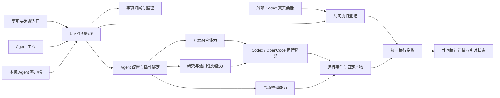
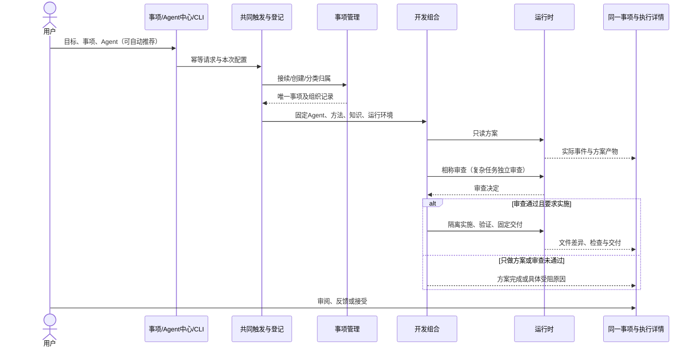
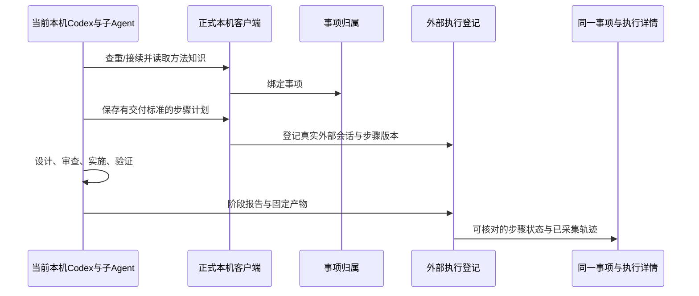

# 事项管理与 Agent 中心：方案与实施计划

本轮解决两个日常困难：打开事项看不懂为什么做、做到哪里；不同入口叫来的 Agent 没有共同目录与执行视图。用户应能先在整理好的事项树中找到工作，在概览读懂背景和结果，再从事项或 Agent 中心选择同一能力执行，并在同一详情里跟踪实际输入、步骤、工具事件、输出和失败。

来源：2026-09-28 用户六项要求及“你来规划设计，sol 来实施”的直接授权。目标仓为 LifeWeave；基线 `ccd4c1b`。本轮事项 `item-c0f13d85b5c145fd`，接续“开发 Agent 双入口与 Notion 知识联动”，同时覆盖已有事项工作区反馈。方案由主 Agent 负责；实现由 GPT-6 Sol 极高思考负责。当前协作接口没有独立 1.5 倍速度参数，不把模型名称冒充速度保证。

## 需求与实际使用

| 用户要求 | 使用后得到什么 | 验收 |
|---|---|---|
| 概览首卡有内容 | 背景、要做什么、预期结果、当前进展、实际产出聚在一处；下方保留步骤图，去掉第三张重复成果卡 | 开发、研究、无历史记录三类事项都可读；没有事实时明确缺什么；成果在站内阅读 |
| 当前事项真正整理 | 个人及团队空间的现有事项都有明确的专题/领域或待整理原因；相关工作挂到合理父项，列表默认按专题分组并折叠子项 | 核对整理前后全部 ID、目标、成果和状态；不得丢失历史或把待验收变成完成 |
| 所有 Agent 可调用事项管理 | 创建前复用/子项/新建判断，创建后继承与适用分类；支持分类、移组和聚合的有理由变更，并能撤销 | 网页、CLI、开发委托和其他 Agent 走同一 owner；并发冲突、跨空间、循环父级被拒绝 |
| 开发 Agent 流程可理解 | 明确开发能力、模型运行时、外部会话的区别，完整说明网页与当前 Codex 两条时序及证据 | 文档能回到当前实现和真实运行，不能声称上一轮平台调度了主 Agent |
| 选择和配置可找到 | Agent 中心管理 Agent 默认能力/方法/运行时/模型；派任务时允许覆盖；连接页提供运行环境就绪信息 | 修改配置保存刷新仍在；明确显示不可用原因；秘密不进入普通配置、trace 或版本库 |
| 统一 Agent 管理与追踪 | “Agents / 执行记录”两个视图，注册、触发、按 Agent/状态/事项查执行，点入共用详情；事项入口与总览复用 | 新旧受管运行、开发组合、外部会话全部可定位，去重；进行中自动更新，错误可见；完整展示已采集事件并说明采集缺口 |

手机联网部署仍按上一轮选择延后。保留窄屏适配。Notion 是镜像，代码与设计原文仍在仓库，Linear 不写入。

## 已核查现状

- 正式服务个人空间 15 项、团队空间 1 项；两个空间均无专题、无领域。个人空间仅有一条真实父子关系。不是筛选器失效，而是数据没有整理。
- 事项详情首卡主要展示计划数量、版本和状态，第三卡再次摆主要成果；目标另藏在折叠说明中。
- `WorkBindingService` 已支持精确绑定、同名候选、子项和幂等请求，但不负责分类治理；旧直接创建 API 也没有统一分类。
- `lifeweave.development` 已是组合插件；受管开发有方案、审查、隔离实施与固定交付。Agent 中心应当是其上可触发工作配置的目录，不另造一套插件框架。
- 上一轮 `item-7547b65b4f704829` 当前读取没有平台 Run；有三个外部开发 start 和阶段报告。它由本机当前 Codex 会话及子 Agent 完成，记录关联 development 方法，并不证明受管开发 Agent 调度了该工作。此前双入口事项存在受管开发实测，二者不能混称。
- Codex 当前可用；OpenCode 开发执行仍被只读阶段边界问题禁用。保留选择项与原因，不绕过现有边界。
- 外部 Hook 只记录受支持的元事件，没有完整命令和工具输出；不能补造历史 trace。

## 总体结构

事项回答目标和归属；Agent 配置回答采用什么可执行能力、方法和默认运行环境；执行回答某一次实际调用发生了什么。底层插件继续负责真实业务行为。注册 Agent 是绑定现有可执行能力和版本化方法，不把任意上传的名字当作已经可运行的 Agent。

## 事项概述

增加结构化概述投影，保留事实来源。背景和预期结果优先使用明确维护的内容；要做什么来自事项意图与已登记背景。当前进展取有效步骤报告、实际委托/运行状态及最近事实，不能简单把状态码改成一段模板。实际产出用当前有效交付集合引用，默认只展示少数摘要，可展开并进入既有站内阅读器；历史继续在成果目录中选择。

允许编辑背景、工作目标与预期结果，携带事项版本。人工说明不覆盖步骤报告、运行结果或正式上下文候选。旧事项在有事实的范围补齐简短说明；没有事实就提示尚未记录，不生成假的内容。展示组件只管阅读和交互，投影由后端 work-view 负责。

## 事项整理公共能力

领域表示稳定生活/工作范围，专题表示这批工作共同服务的主题，父子关系表示目标拆分。这三者独立，不用事项类型或随手标签互相替代。

使用现有 entity、relation 和 item 作为规范数据，建立一个明确的整理服务，供所有入口复用：

1. 建项前沿用共同 work-binding 判定继续、子项或新项。
2. 子项继承父项已有领域/专题；显式人工分类优先，不能被后续自动整理覆盖。
3. 新根项可按已维护的专题适用规则得到分类。规则给出命中依据，多个冲突目标或不能确定父子时保留候选。文本命中不能等同语义理解。
4. 任意有理解能力的 Agent 可提交分类/聚合建议及理由；整理服务负责同空间、实体类型、重复/循环父级、版本、完整事务、追溯与撤销。Agent 的判断和确定性执行分工明确。
5. 归并默认是聚合到一个一级事项，原事项、编号、讨论、状态与成果保留；不做删除式去重合并。已有父级改挂必须有显式变更，不因标题相似偷偷迁移。
6. 整理建议先保存完整前后差异；已授权的当前批次经主 Agent 核对后直接实施。日常页面提供预览、应用、撤销；明确、安全的创建时继承可自动应用。撤销校验组织关系未被他人修改，仅还原本批组织关系，不回滚新的运行或成果。

存量整理方案：个人空间以“LifeWeave 平台建设”和“自动驾驶论文研究”为主要专题；真实验证项聚合到平台验证事项，已有双入口、工作区和知识接续按目标关联，保留原有有效父子关系；历史 Linear 接续归入平台历史专题，不篡改其历史状态。团队空间独立建立团队协作验证专题。具体映射与理由保存在证据中，应用前重新读取版本。默认专题分组、子项折叠；用户已保存的视图不强制覆盖。

## Agent 中心与执行底座

Agent 配置保存稳定 ID、名称、描述、能力插件、默认方法、默认运行时/模型和启用状态。内置开发、研究/通用工作、事项整理；允许按可用能力注册新配置。运行前解析配置并固化快照，后续改默认值不改历史执行身份。运行环境就绪状态从真实执行器读取；API Key 仍归属运行环境的受保护配置边界，不放在 Agent JSON 中。

统一触发负责：验证配置与适用范围、解析事项归属、固定本次覆盖参数、幂等调用正确能力、返回统一执行引用。原开发/研究接口保留兼容响应，内部汇入共同触发责任或共同登记，不能只是新中心走新路而旧入口继续不可见。外部会话登记明确 source=external，登记不是拉起进程，不自动获得受管 Run 的控制能力。

执行目录把受管开发的阶段 Run 作为组合的一部分，避免重复主行；独立研究/通用 Run、外部会话、整理操作分别保留真实来源。列表可按 Agent、事项、状态筛选。详情复用一套容器，呈现本次配置和固定输入、步骤/事件、工具调用、结果与错误，跳转同一事项和固定成果。运行事件通过现有事件/查询能力进行实时刷新，停止刷新、断连和旧事件明确可见；不以无上限频繁轮询替代状态管理。

“完整 trace”在产品中指可获得的完整运行轨迹：受管运行保留其实际事件，组合调用可下钻子 Run；外部会话仅展示已经采集/主动报告的事件，显式说明命令输出未采集。没有采集的历史不能重建。秘密字段和认证片段应在输出边界脱敏；不宣称可见模型私有思维。

## 开发流程与顺序

两条路径共用业务协议和页面；外部会话遵循流程仍依赖接入和实际报告，平台不能事后伪造其自主管理权。本轮主 Agent 自身也按第二条登记，并明确 Sol 实现、主 Agent 集成和独立审查各自产物。

## 模块、数据与接口责任

| owner | 责任与调用关系 |
|---|---|
| WorkView / overview 组件 | 从事项、有效步骤、实际产物计算概述；编辑明确的介绍字段；删除重复成果卡 |
| ItemOrganizationService | 计划整理、验证、原子应用、创建继承、撤销；复用 item/entity/relation 和活动证据 |
| WorkBindingService / create_item | 全入口归属与创建接入，不在前端维护另一套分类事实 |
| AgentRegistry | 插件之上的可触发配置，版本化保存与就绪检查 |
| AgentDispatch | 幂等触发与配置快照；委派现有开发/运行/整理能力 |
| ExecutionProjection | 受管组合、独立Run、外部session与整理记录的统一列表/详情；底层事实不复制为假Run |
| AgentCenter / AgentLaunch / ExecutionDetail | 管理、触发、共同阅读组件；事项入口复用触发和详情 |
| CLI | 同一注册/触发/执行/整理接口供所有本机Agent使用 |

具体 API 契约在分工前固定于 `contracts.md`，实现以该契约联调；历史兼容 API 只保留适配职责。低频配置可沿用有版本的偏好记录；执行目录从现有事实投影，只有真实触发幂等与配置快照需要新的持久化身份。不会为每个页面复制全套运行表。

## 实施拆分和每步产物

1. **设计与现状核对**：本方案、接口契约、前后流程图、真实数据基线。验收：六项诉求有 owner、操作和验证。
2. **事项概述与整理能力**：概述投影/编辑、组织计划/应用/撤销及创建继承、CLI。验收：分类有依据、并发与循环保护、读写不丢旧数据。
3. **Agent 执行归一**：配置注册、共同派发、执行归总与轨迹、兼容旧入口。验收：实际受管/外部/整理操作可见并可追踪。
4. **共同前端**：概述首卡、组织预览、Agent 管理/执行页签、共用触发与执行详情。验收：完整浏览器旅程、实时状态与错误、固定结果可读。
5. **真实数据整理与交付验证**：备份、逐项组织及对账，真实任务烟测、独立审阅和修复。产物：差异清单、截图、运行证据与完整开发流程文档。

回滚：代码按本轮提交回退；分类由组织批次撤销，只恢复受控关系；数据库备份仅在灾难恢复时使用，不能覆盖用户后续工作。生产数据不作测试夹具，自动化测试独立数据库。

## 当前状态

已核查现状并登记本轮事项；准备进入实现。没有把方案视作已上线功能。所有完成结论后续以测试、浏览器、真实数据和独立审查证据更新本节。
