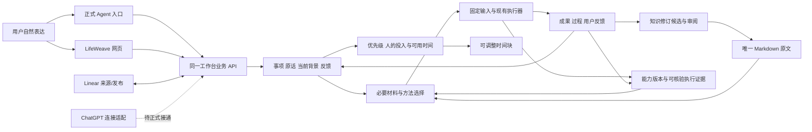

# LifeWeave：可以跨任务持续使用的工作台

LifeWeave 要让用户从一句想法开始，在不同会话和入口继续同一件事，找到必要背景与方法，让 AI 承担可以独立执行的工作，并把人的讨论、专注与审阅安排进实际生活。研发交付是已接入产品、可再次调用的能力；论文报告等业务成果只作验收证据。

用户已明确继续设计开发并授权自主工程取舍。本轮按 2026-09-19 的纠偏修订原方案，继续本地研发，不再等待用户重新选择“写文档、做方案还是开发”。以下技术方案是工程分析形成的实施选择，不冒称用户逐项批准；不包含公网发布、新的敏感数据共享或外部写入授权。

## 依据与纠偏

- [本轮原始要求](/home/yyh/.codex/attachments/f2006536-e3fb-40d6-a9b4-1141b4183532/pasted-text.txt)，以及先前建设独立项目、持续自主实现和完整工作台的授权。
- [前轮差距材料](/home/yyh/.codex/attachments/3a06f231-ca9f-4033-9dd1-ae25326fb3f1/pasted-text.txt)。其中完成度百分比已由材料作者撤回，无验收分母，不再沿用。
- 2026-09-19 回读 [Linear 项目](https://linear.app/yyhpokemonmaster/project/a2184ae8c325)：Overview 于 `2026-09-19T05:38:30.665Z` 更新，明确交付 LifeWeave、论文仅作案例。前轮“Overview 仍为旧版”已不适用。本轮没有修改线上内容。
- 回读 [日常入口](https://linear.app/yyhpokemonmaster/document/abed03cc1da2)，保留按自然意图工作和已有授权、不强迫所有想法走固定层级的规则。
- 源码基线 `7fa5d5b`，目标仓 `/home/yyh/project/lifeweave`；当前事实以本仓源码和 [架构](../../../docs/architecture.md)、[状态](../../../docs/status.md) 为准，不混入 Omni-Brain 原型实现。

本次原位删除“报告＋重新操作过程”为主交付、按论文阶段组织研发、等待用户重申产品目标三处偏移。既有用户反馈、知识冲突、版本和新会话接续要求保留并落实到产品责任。

## 用户结果与完整范围

产品服务工作、生活、学习、爱好，不以论文题目决定信息结构。记录、讨论、执行、查看进度是不同意图：记录不启动执行，讨论不隐含代码修改授权，执行也不表示用户已经接受成果。表达不清楚时保留原话，澄清会改变行动的问题。

| 产品能力 | 用户怎样用、得到什么 | 必须保持的行为 |
| --- | --- | --- |
| 自然表达与事项接续 | 说出想法或要继续的目标，找到相关旧记录，保留原话与当前理解 | 多个匹配展示依据，不误合并；生活想法不被强制放入研究流程 |
| 跨入口共同记录 | 网页与正式 Agent 入口读写同一事项；ChatGPT、Linear 的连接状态可解释 | 当前目标唯一维护，候选与已接受分开；离线不虚报同步 |
| 材料选择与持续执行 | 按事项推荐必要知识、方法与可用执行器；反馈影响下一轮 | 输入固定、可追溯；找不到方法如实说明；暂停与重试不是原生会话续跑 |
| 知识沉淀与再次使用 | 在工作过程中提出有来源的修订，审阅后更新原文；别的任务可以找到 | 保留版本、接受/拒绝与冲突；不把一篇孤立报告当知识复用 |
| 跨领域优先级与时间安排 | 比较事项，按真实可用时间安排讨论、专注和审阅；调整后重排 | 领域、类别、状态、重要性、紧急性独立；AI 运行不全部占用人的日历 |
| 能力接入、追溯与改进 | 查一轮推荐、加载和实际过程；反馈形成改进候选，回归后发布或回退 | 推荐不等于加载，加载不等于执行；不能由模型自评证明能力改进 |

主验收是开发者长会话退出后，经已交付入口处理一个未写死的新任务并再次接续。正常用户讨论、授权、审阅可以保留；临时选材料、改数据库、未交付脚本、开发者补提示词都记为开发介入，不能计作产品能力。移除论文样例后能力仍须存在。

## 定向源码核对

本仓没有已登记的独立规范知识包，本次降级为产品文档与当前源码直接查证，不调用 Omni-Brain 占位检索器。

| 当前入口与责任 | 源码事实 | 复用与缺口 |
| --- | --- | --- |
| 首页记录、灵感页 | `HomePage.vue`、`IdeasPage.vue`；想法为 entity，事项为 item | 记录不启动 AI 已有；目前主要靠人工形成、关联和查找事项 |
| 事项、背景、讨论 | `gongzuo/router.py`、`service.py`、`repository.py` | 当前背景和历史、继承关系、提案/接受、乐观版本检查可复用；缺少面向新会话的工作接续摘要与统一发现入口 |
| AI 委托 | `gongzuo_runtime/service.py:create_run/retry_run` | 冻结事项、背景与能力，执行/暂停/重试可复用；讨论反馈目前没有自动进入下一轮输入 |
| 材料 | `integrations/task_sources.py`、`gongzuo_knowledge/library.py` | 已登记方法目录、Markdown 全文与版本、快照可复用；目前手选材料，无匹配理由；目录扫描存在文件不可读跳过的边界 |
| 计划 | `PlanPage.vue`、`WorkPlanEditor.vue` | 阶段/优先级/日期已有；无真实空闲、人的投入类型、时间块与排程冲突模型 |
| 外部入口 | `integrations/linear.py`、`api/app.py` | Linear 来源快照与发布预览已有；本机服务只监听本地，没有已接通的 ChatGPT 连接 |
| 能力维护 | `gongzuo_knowledge/service.py`、运行事件与输入快照 | 已有候选、验证与发布结构；不证明推荐方法确实执行，也没有真实反馈驱动的改进回归 |

## 总体方案与维护责任

继续使用一个应用和现有领域模块。网页与本机 Agent 通过同一 API 访问数据；Agent 负责理解自然语言，产品负责发现记录、读取当前版本、保存变更、选择材料、执行与反馈。不会在后端用少量关键词规则假装理解任意自然语言。

LifeWeave 维护本地事项、背景、讨论、计划和运行。Markdown 原文件维护知识正文，数据库只维护修订/来源历史。Linear 维护远端事项，导入后其快照与本地正文分开，刷新不覆盖本地修改。ChatGPT 未来读取同一 API，不另存第三份当前目标。连接失败显示读取时间与未同步内容。

本机先采用有帮助说明的正式 CLI 调用同一 API，供新 Agent 会话发现和使用；HTTP 接口也供网页使用。选择它是为了无需对外开放本机服务即可验证新会话接续，不宣称本机 CLI 等于 ChatGPT 已接通。远程 ChatGPT 接入必须在明确部署、身份验证和共享范围后实现；不以临时隧道跳过这些责任。

### 通用能力如何落到实现

| 能力与 owner | 复用、修改与入口 | 持久状态 | 反馈、失败与验收 |
| --- | --- | --- | --- |
| 自然表达/接续：`gongzuo` | 复用 item/entity/discussion/context；新增工作发现与接续读取；CLI 与事项页消费。Agent 依据完整描述决定记录/讨论/执行，写入仍走现有动作 | 原话保留在想法/讨论；事项和已接受背景为当前事实；接续输出按需生成，不复制成第二正文 | 多匹配由用户/Agent 基于依据定位；无结果可记录想法。新会话找到旧目标；另一个生活任务只记录且 run 数不变 |
| 共同记录：`gongzuo` + `integrations` | 统一版本 API；CLI 与页面同读；Linear 保留远端快照与本地差异，后续按已知远端版本做冲突预览 | 本地版本、远端 ID/读取时间/快照、固定发布内容和回读状态 | 409 重新读取合并；网络超时先查固定身份。ChatGPT 未连接明确列缺口 |
| 材料/持续执行：`integrations/task_sources` + `gongzuo_runtime` | 新增按目标匹配知识与方法的只读推荐；委托预览可采用推荐，继续使用现有快照/执行器。自动把相关反馈固定进新一轮输入 | 选择理由/算法版本、输入内容哈希、反馈 ID/版本、运行关联；推荐本身不写正式知识 | 无匹配给缺口；选中来源变化重新读取；失败保存既有产物。可用执行器与已成功执行分别标注 |
| 知识复用：`gongzuo_knowledge` | 复用 Library 原文/修订/差异；增强候选与事项、run、证据引用的关联，Agent 通过正式接口提出候选，网页接受 | 候选关联来源与 base_version，正式正文仍是原文件 | 拒绝不写文件、版本变化冲突、外部只读。另一种任务通过推荐找到已接受知识，不能手工指定答案 |
| 时间安排：`gongzuo` 的计划用例 | 在现有计划页增强，不另建并列计划页。区分 domain、category、stage、importance、urgency；新增人的投入片段和可用时间，复用依赖与截止日 | 任务投入段（讨论/专注/审阅/AI）、估计与实际耗时；有时区的空闲窗口、忙碌来源版本；草案时间块及用户锁定/排除 | 只读忙碌日历或用户填写空闲；无空闲不猜。先扣忙碌/休息/锁定块，检查依赖，解释无法排入原因。用户调整保留，AI 执行仅形成等待/提醒，不自动占人时 |
| 能力迭代：`gongzuo_knowledge` + runtime | 复用能力候选/验证/发布；增强与反馈、真实步骤事件的关联；原方法可回退 | 推荐身份、加载快照、执行证据是独立状态；评测任务、旧/新版本结果与人工决定 | 缺执行证据标“未证明”；相同反馈不直接判定方法原因。候选回放同一输入并比较结果、成本与失败，再发布；可切回原版本 |

### 推荐、加载与执行分别记录

第一版材料推荐使用可解释的文本匹配，覆盖英文词和中文相邻双字，给出命中词与来源。它是初筛，不是语义检索或适用性认证；无命中不强配方法。推荐结果与方法目录全文可由正式 Agent 判断、纠正。原文读取失败必须随结果显示，不能静默声称已检索全部。

推荐数据由 TaskSources 负责；真正入队时重新由快照读取器载入原文与支持文件，固定哈希。worker 写入文件/发送给执行器的事实与工具事件另行追溯。只能据日志证明实际步骤，不能把方法标题出现在提示词中计为“已遵循所有步骤”。

现有输入限制：每次最多 1 个显式方法、10 个知识引用；方法目录最多 100 个文本文件/1 MB，主体正文总计 2 MB。当前新增推荐必须明确展示筛选总数与选用范围，超过限制由既有校验报错，不能隐藏截断后说“全部采用”。这些是当前执行边界，未来多方法组合需要按真实组合实验调整，不成为产品永久规格。

### 时间安排的算法与业务边界

人的投入与 AI 执行分开计量。一个研究事项可同时包含 AI 资料整理、人的阅读、讨论和最终审阅；人的片段带时长、是否可切分、精力要求、前置条件。优先级建议综合重要性、截止风险、依赖、可执行条件，保留逐项解释；不使用未经用户认可的固定乘积伪装客观价值。

初版排程采用确定性约束检查与可解释排序：从用户明确提交的空闲窗口扣除忙碌、休息、锁定时间块，再安排可执行的人类投入段。连续段放不下列为未排入，不强行切分；不同领域都可参与，不把爱好和休息固定为最低优先级。日历适配器只提供标准 busy intervals 和来源版本，Google/Outlook 是来源变体，不进入计划核心。日历写回作为独立明确操作，不随生成草案执行。

## 接口与研发分解

所有路径在 `/api/lifeweave/{workspace}` 下。以下是同一产品的实现顺序；“计划”行不代表已经存在端点，完成前不能从当前使用说明中承诺。首次实现先交付工作发现/接续、材料建议与反馈进入运行三个相互配合的能力，再扩展自然入口、知识关联、计划和能力评测。

| 用例/接口 | owner、输入 | 成功输出与消费者 | 失败方式/阶段 |
| --- | --- | --- | --- |
| `GET /work-discovery?query=` | 工作接续；当前空间与自然表达中的主题 | 相关事项/想法及命中理由；CLI/网页 | 空结果非错误，非法空间 400；本轮实现 |
| `GET /items/{id}/continuation` | 工作接续；稳定事项 ID | 当前背景、待审修改、讨论/反馈、成果、运行摘要、下一步依据与边界；CLI/事项页 | 缺事项 404、非法继承 400；本轮实现 |
| `GET /items/{id}/input-recommendations?query=` | TaskSources；当前事项与本轮补充意图 | 有版本的知识/方法候选、命中理由、不可用来源、边界；CLI/事项页 | 失效来源显示缺口；本轮实现 |
| `POST /items/{id}/feedback` | 工作接续；原文、关联 run（可选）、客户端请求 ID | 持久化反馈 discussion，关联上下文版本；CLI/事项页 | 空正文/跨空间或错误 run 拒绝；本轮实现 |
| `POST /entities`、`POST /items`、`POST /items/{id}/discussions` | 既有工作服务；记录/事项/讨论参数 | 原话和目标持久化；正式 CLI 复用 | 沿用现有校验；本轮接入 CLI，不新增旁路写库 |
| `POST /items/{id}/context/proposals`、提案 accept/reject | 既有背景服务；版本及候选正文 | 候选与当前已接受正文；网页/正式 Agent | 409，读取后合并；既有复用 |
| `POST /runs`、`POST /runs/{id}/retry` | runtime；任务指令与选择的输入 | 固定输入的新运行，新增相关反馈快照；网页/正式入口 | 来源失效/超限/未结束重试拒绝；本轮增强 |
| `GET /runs`、run snapshot/events | 既有 runtime；事项/run、分页游标 | 状态、不可变输入、事件与结果；接续服务与运行页 | 分页取齐；缺 run 拒绝；本轮复用 |
| Library document/catalog/revisions/decision | 既有 Library；来源/路径/原文版本/候选 | 原文/差异/决定；知识页与 TaskSources | 只读源拒绝接受，源版本变化冲突；既有复用；候选来源关联后续增强 |
| `POST /items/{id}/knowledge-candidates`（计划） | 知识候选；run、引用证据、目标正文/版本 | 关联现有修订；知识页、接续读取 | 不属于事项的 run、不存在证据拒绝；不得自动接受 |
| `GET/PUT /planning/availability`（计划） | 计划；时区、明确空闲、来源版本 | 持久可用窗口；现有计划页 | 缺时区/重叠/过时版本拒绝 |
| `PUT /items/{id}/effort`（计划） | 计划；人的投入段、AI 时长、前置/切分规则 | 可排程片段；计划页与事项详情 | 负值/依赖循环/版本冲突拒绝 |
| `POST /planning/drafts`（计划） | 计划；范围、事项版本、约束/锁定块 | 有理由的顺序、时间块、未排入项；计划页 | 缺真实空闲不生成虚构计划；不存在已读版本报冲突 |
| `PATCH /planning/drafts/{id}`、accept（计划） | 计划；调整/锁定/版本 | 调整后重检冲突的草案/已接受时间块 | 忙碌来源变化要求重新检查；不隐含日历写回 |
| `GET /integrations/calendar/busy`（计划） | 日历连接；已授权来源、时段 | 带版本的 busy intervals；计划服务 | 未连接明确返回缺口；不影响本地事项 |
| Linear 现有 import/prepare/publish | 外部连接；远端 ID/固定内容 | 来源快照、预览和回读结果；连接页 | 本轮不扩张外部写入范围；双向正文同步仍未实现 |
| 能力 candidate/verification/publish 既有用例及后续证据关联 | 能力维护；版本、反馈、对照任务/结果 | 候选、可检查回归与已发布版本；维护中心 | 未证明加载/执行不能归因为方法失败；发布/回退保留历史 |
| 远程 ChatGPT 工具连接（计划） | 外部入口；身份、共享范围与业务 API | 与网页同源的操作；ChatGPT | 未连接不得报已同步；公开部署与敏感共享另按实际授权 |

CLI 是正式产品客户端，提供 discover、continue、recommend、capture、create、discuss、feedback 等有明确帮助说明的操作，输出 JSON，失败非零；不接受任意 SQL 或任意文件读写。它只能访问本机工作台，服务器不可用时报错而不保存假同步记录。自然语言解释由已经具备模型能力的宿主承担，命令解析不冒充 AI。

页面沿现有事项详情增加“接着推进”面板，读取当前记录和材料建议、保存反馈；复用现有委托入口。组件边界：事项页只提供 workspace/itemId；独立面板负责显示与用户动作；API 模块定义返回类型；请求状态及过时响应处理在面板内管理，不复制工作事实到全局状态。

### 存储、迁移与退出

本轮接续是动态读取，材料建议是派生数据，不新增另一份当前背景或通用控制面。反馈复用 discussion，payload 明确 `kind=execution_feedback`、runId、contextVersionId、请求身份，原话在 body；下一轮将反馈内容复制到不可变运行输入，不回写旧输入。若后续需要独立按反馈状态检索和管理，再以真实查询需要迁移成专用记录。

不修改已应用迁移、不重建旧库、不覆盖历史上下文。接续 API 按同一空间读取并遵循继承规则。现有手动材料选择继续是显式覆盖入口，默认推荐逐步接入后仍可纠正；它不是第二份方法目录。正式 CLI 取代复制旧聊天来接续的临时步骤；未正式交付的脚本不能进入用户流程。

### 分批实施的完成条件

1. **工作接续与反馈**：新的本机 Agent 会话通过正式 CLI 找到事项、读背景/候选/运行/反馈；页面与 CLI 一致；记录想法不运行；下一轮自动包含反馈；任意论文名字不写入算法。
2. **自然入口与知识复用**：正式宿主连接发现这些工具；任务运行产生有来源的知识候选，受审后另一个不同任务找到并使用；自动材料选择可纠正且被快照证明。远程 ChatGPT 连接单列实际部署边界。
3. **生活与工作计划**：现有计划页可保存真实空闲与人的投入片段，生成/调整/接受时间块；AI 时间与人时区分，休息排除生效；未排入和日历失败可解释。
4. **能力可评测改进**：新旧方法在固定输入上取得可比结果，反馈能回到真实加载/执行证据；候选发布/回退可验证。

上述顺序不是缩小原目标。本轮第一批通过不代表完整工作台完成。第二批及以后的精确数据字段与接口实现须在相应施工前用实际消费者复核；已有整体责任和验收约束不能被丢弃。

## 验收方法与开发介入记录

| 场景 | 入口和操作 | 必须观察到的业务结果 |
| --- | --- | --- |
| 新会话、新目标 | 无开发对话上下文，使用 README 指向的正式入口；研究未预置文章对质检的意义，先讨论不写代码 | 能发现知识/方法范围，记录原话与下一步，不擅自执行 |
| 新会话接旧事 | 只提供目标描述，经发现再读取 | 当前已接受背景、候选、反馈和已有成果一致，无临时补提示词 |
| 换生活类型 | “记一个生活想法，暂时不推进” | 保留原话，不强制论文阶段、不产生 run |
| 反馈继续 | 页面或 CLI 给事项/run 留纠偏，之后新建或重试 | 反馈自动出现在新运行固定输入，旧运行快照不变化 |
| 同源与冲突 | 页面修改背景、CLI 重读；用旧版本提交 | 读到新版本，旧提交 409，不偷偷覆盖 |
| 资料变化 | 推荐后修改/删除来源再入队 | 快照使用实际版本或明确失败，不能伪称使用推荐时版本 |
| 知识复用 | 正式提交/接受候选，另一个任务检索 | 找到正确原文与来源；拒绝不生效、源改变冲突 |
| 周末安排 | 给不同领域事项、真实空闲、周六下午休息 | 时间块避开休息、锁定和忙碌；AI 时长不吞占人时 |
| 连接与执行失败 | 停连接、拒绝无效引用、执行器失败 | 已保存工作仍在，失败与未完成清楚，刷新可读 |
| 方法改进 | 固定旧输入，对照新旧版本与步骤证据 | 未加载/未执行与方法质量区别，发布可回退 |

真实验证使用独立临时数据库和知识根，保持日常数据不变；不以 mock 代替真实数据库/浏览器。自动化用固定材料检验边界并明确是测试输入。独立新上下文只能取得产品入口、任务和操作权限，不给开发者的推荐答案或实现总结。需要救场时保存操作与原因并判该项未通过。

## 实施与证据

方案和研发分解已按本轮要求修订。以下实现记录在实际完成后填写；未列证据的能力保持未实现/未验证，不计完成度。
