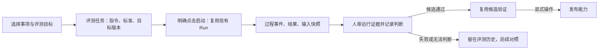

# LifeWeave 平台演进：能力可见、任务评测与持续改进

状态：需求依据已由用户在 2026-09-26 提供；用户同日明确授权自主设计并开发三小时。本页记录本轮工程选择，不将讨论中的问句或外部产品猜测写成已证实事实。

## 来源与完整吸纳

原始对话完整保存在仓库根目录 [《个人管理平台优化》](../../../个人管理平台优化.md)（8 Turn，2026-09-26）；本页保留每项主张的去向，不删去未在本轮实现的愿景。现有行为以 [产品设计](../../../docs/product.md)、[架构](../../../docs/architecture.md)、[当前状态](../../../docs/status.md) 和源码为准。

| 原文位置 | 用户提出的内容 | 当前判断与去向 |
| --- | --- | --- |
| Turn 1 | 自然入口理解“记下、讨论还是执行”，选择或组合能力、推进并守住总体目标；能力应可见、可扩充；金铲铲攻略可成为可复用 Agent，并保留样例、历史、评测与进化 | 自然意图与事项接续已有基础；本轮建立显式能力目录、任务评测和候选的工作样例/历史入口。自动识别、创建和合并 Agent 尚未实现，不自动发布或增权。 |
| Turn 3 | 对照办公 Agent 产品，强调自定义/可增加专家、共享知识记忆、能力进化、事项日程管理、个人与团队高定制；对话加可插拔能力和可配置工作台；评测既覆盖单能力，也覆盖意图、路由、组合、创建、改进及整件事的结果与过程 | 竞品能力是用户待核查问题，不在此断言差异。共同事项/运行/知识内核已有；本轮评测对象支持“单候选能力”和“整个平台”，且明确目标、通过标准、运行及人工判断。个人/团队首页已有五卡片预设与点击定制；领域预设、插件化页面和自动路由评测仍属后续。 |
| Turn 5.1、5.4 | EvoOntology 启发的统一事实/本体、按任务组织、贯穿生命周期并反向更新；领域包应是同一知识全集的有范围投影 | 作为待验证目标设计。保持 Markdown 原文、来源、版本和接受门槛；设计事实/关系/任务投影与索引前，先以论文研究和金铲铲等不同领域的真实问题验证。不将论文概念或“领域包”直接固化为数据库本体。 |
| Turn 5.2、Turn 7 | 团队子任务可配人和 AI，用户倾向简单直接授权；AI 用责任人的授权访问资源，仍需记录调用者和权限 | 个人本机与团队内容空间已有，但尚无成员身份。短期保持明确的本机启用与委托权限；多人代理身份、范围、审计要以真实团队共享场景设计。拒绝额外的繁琐身份仪式，也不能把本机单用户误报为多人授权。 |
| Turn 5.3、Turn 7 | 用户配置 Codex/OpenCode/模型 API 和 URL；按任务选模型；统一派发、状态与 trace 的运行接口，代码/工具/Agent 都有可替换边界 | 当前统一运行服务已支持 Codex/OpenCode CLI、模型字段和运行事件；不承诺已有通用模型 API 或 DeepSeek Harness。后续先列出实际执行器能力、凭证归属、授权与运行事件契约，再增新适配器。凭证只进私有配置。 |
| Turn 5.5 | 个人、团队预设共享内核；通过点击/筛选/拖拽或自然语言调视图，保存各自布局；按需临时呈现高优问题或半年计划 | 这是目标产品形态。本轮以五张已有首页卡片落地 personal/team 不同预设和点击调整、按空间保存；筛选、拖拽、自然语言重排及临时半年计划视图仍待场景验证，不预建万能画布。 |
| Turn 5.6、5.7 | 万物可形成 Agent 能力，但要抑制无限增殖；共享可观测、评测、主动/定时反馈、受控进化、合并与发布；评测覆盖平台整体、路由、工具与过程；参考 Harness 与论文 | 本轮先做统一的评测任务、真实运行和人审证据，避免用模型自评发布能力。自动定时、Agent 合并和自改、通用工具插件属于后续有对照研究；运行轨迹已有事件，页面需要把它作为判断材料。外部 Harness 名称在原文中不确定，需查证后再做技术对标。 |
| Turn 7、8 | LLM Wiki 式 Markdown 卡片、结构化索引和双向链接；原料、知识正文、编译索引分层；本地/GitHub 原文与 Notion 同文副本；工业规模与检索性能要研究 | 当前 Markdown 正文和数据库索引/候选并存；本轮实现同一来源内 `.md` 的出链、反向引用与断链提示。研究成果已有 GitHub/Linear 自动归档，但并非全知识 GitHub/Notion 实时同步。设计 Git/Notion 双端同步前必须确认正文 owner、冲突与认证；当前不声称同步。原料、已接受知识和可重建索引保持分层。 |

两次重复的 Assistant 表格是讨论归纳，不作为新的用户决定。用户关于竞品、论文和 Harness 的不确定表达保留为研究问题。

## 可用结果与第一段实施范围

用户打开“维护中心”可同时看到已登记工作方法与能力候选；可以选现有事项创建一条评测任务，写明本次指令和通过标准，选择测平台整体或某个候选版本。点击开始后才创建真实 Run，随后从运行过程和结果审阅证据，记录通过、失败或无法判断。通过候选评测须有真实成功 Run 和该 Run 的已接受证据；满足现有候选验证门槛后将该版本标记为已验证，发布仍由用户显式执行。失败与无法判断保留历史，不替换原标准。

第一段只检验两种评测对象的共用：一项候选 Skill/Agent 配置的表现，以及一次整件事的完成情况。评测记录不宣称自动判题，也不将候选自动生成或方法升级当成已完成。已有事项和运行仍是唯一真实工作载体，不另起一套任务数据库。

同一标准再评引用前一条已评估任务；目标事项、任务指令和通过标准必须保持一致，可换候选版本，前次结论和理由直接显示。发布入口要求当前版本至少一次显式评测通过、没有未结束评测；当前候选及显式前任链中每条失败或无法判断的评测，必须在同一标准的 `repeatOf` 再评链中得到当前候选通过。另一条较容易任务通过不能消除原反例。没有明确前任 ID 的同名候选不擅自合并，旧记录也不凭标题迁移。

## 模块责任与数据

- `lifeweave` 的 item 保存实际目标和上下文；评测任务以 `item_id` 关联，不复制事项正文。
- `lifeweave_runtime` 创建 Run，固定执行器、候选版本、材料和过程；评测任务只能引用自己启动且属于同空间、同事项的 Run。
- `lifeweave_knowledge` 继续拥有候选、验证和发布门槛。通过候选评测时调用现有验证，不新建绕过发布的状态。
- 新增 `evaluation` 记录评测对象、候选版本、指令、可观察通过标准、run_id、结论和评估理由。创建时是 `planned`，启动后为 `running`，结束后才可人工评估。执行失败仍可记失败，但不能记通过；无法判断不能成为发布证据。
- 已登记 Skills 是文件来源，候选是数据库中待发布或已发布版本；页面分别展示，不把“登记”“加载”“实际遵循”混写为一个状态。

接口均位于 `/api/lifeweave/{workspace}`：`GET/POST /evaluations` 列出和创建；`GET /evaluations/{id}` 回读关联 Run 状态与版本；`POST /evaluations/{id}/start` 以明确的执行器与只读/工作目录权限启动并绑定 Run；`POST /evaluations/{id}/assess` 保存结论与依据、成功时要求已接受证据并调用候选验证。现有 `GET /methods`、`GET /capabilities`、Run 与证据 API 不变。外部副作用只在用户点击“开始”时发生；候选发布仍走原按钮。

## 验证与后续顺序

本轮用独立临时库验证迁移、个人/团队隔离、创建→启动→结束→证据接受→评估、失败/跨事项/错误版本拒绝；前端验证能力目录和评测入口可用，再核对真实页面。没有真实模型成功运行时，不宣称能力效果已被证实，只证明评测机制按运行证据闭环。后续按真实使用中遇到的阻塞，依次推进：能力样例/历史与对照回归；统一 Markdown 知识的关系与编译索引；可配置个人/团队预设；执行器配置与 trace；最后再考虑自动建议、受控进化和多人授权。每步都以不同领域真实任务检验抽象。

## 本轮实现与验证（2026-09-26）

已落地上述第一段：数据库新增 `evaluation`，后端以现有 item、Run、证据和能力发布服务为 owner；页面在“能力与评测”列出已登记方法、候选和评测记录，并可复用标准、跳转运行及逐条阅读过程。旧运行输入和历史资料不改写。原有手工候选验证仍可用，但单凭它不能发布；发布还要满足上述显式评测和同标准再评门槛。创建评测与发布能力对同一候选串行化，避免发布门槛检查与写入之间插入未完成任务；显式前任链也在发布事务内加锁并核查失败记录。

独立临时 PostgreSQL 验证创建、跨空间 404、重复启动 409、未结束或无已接受证据拒绝通过、仅手工验证不能发布、失败后另一项较容易评测通过仍阻断发布、沿原标准再评通过后发布；前端组件交互、类型检查、构建通过。本机服务迁移 `008_evaluations.sql` 后，`/api/health` 与个人/团队评测目录返回 200，已登记方法可读取。随后又用内部事项 `item-36e70781e4c6449b` 启动真实评测 `eval-3f161dab71284154`：Codex Run `gzrun-20260926-052339-4fe93525` 实际成功，完整正文、22 条事件和 `evidence-587edde3b29246e4` 均可回读；实施者按这条内部任务的窄标准接受证据、评为通过。该结果只证明运行与判断链路，不代表用户验收、网页端到端业务完成或候选能力效果。浏览器后续实际打开了评测记录页，截图见 [评测页面](../../../docs/evidence/personal-platform-evolution/evaluation-board.png)。

## 第二段：Markdown 引用与反向发现

用户读一篇知识时，要看它明确引用了哪些站内知识，以及哪些知识反向引用了它；断链要可见，不能被错误计入已有知识。原文 Markdown 仍是唯一正文，链接关系从当前文件编译成可重建的阅读投影。当前先覆盖同一来源目录内指向 `.md` 的相对链接；图片、代码块、站外链接和未经约定的跨来源链接不计为知识关系。Markdown 解析复用已安装的 Mistune AST，编码路径解码一次，并用现有 Library 的目录边界校验；软链接、隐藏/raw 路径和越界不会成为可点击关系。

`GET /library/links?sourceId=&path=` 由知识模块读取当前可见的来源目录，返回本文版本、有效/失效出链、反向引用、跳过的不可用来源与文件。服务进程对每篇文件按路径、修改时间和大小缓存解析结果；它只是可重建的派生索引，文件变化后再次请求更新，不维护第二套正式正文。页面在知识全文下显示引用与反向引用，点击回到同一知识页；来源规模与性能尚未经过海量目录验证。以真实中文相对路径、引用式链接、代码中的假链接、断链、越界软链接和文件更新为验收样例。

已实现后端 AST 提取、链接边界、关系响应和知识页展示；临时库 API 用上述边界样例验证，页面类型检查通过。缓存只加速同进程重复读取，外部目录若在保持文件修改时间和大小完全不变的情况下改写，需重启或另行刷新才能发现；长期索引策略应由真实规模再决定。

之后已在实际浏览器打开个人知识“知识导航”，看到“本文引用”与有效中文链接，页面无运行时错误；[知识引用截图](../../../docs/evidence/personal-platform-evolution/knowledge-relations.png)。本轮没有验证海量目录或跨来源关系。

## 第三段：评测失败如何进入下一次改进

评测原先能留下失败判断，但无法直接把问题、目标行为和下一次验证标准送入现有能力候选流程。现在评测结束后可显式选择“形成改进建议”，确认改进层（知识、Skill、Agent 配置或 Harness）、问题、期望与验证计划。服务在同一事务中建立 `improvement` 实体、事项关系及评测反链；再次提交返回同一建议，不再堆重复条目。维护中心“能力与成长”读取同一实体，用户可审阅并决定是否创建试验候选，候选仍需真实运行、已接受证据和显式发布。数据库增量为 `009_evaluation_improvements.sql`。

上述真实评测暴露了实际输入缺口：只读 Run 的空隔离目录无法读取项目源码。由该评测创建了建议 `improvement-bbe266a293614f3c`，说明如果目标是核验实现，应明确选择仓库。评测启动因此增加 Git 仓库目录、已登记方法和最多十篇知识的选择；仍调用原 `create_run` 固定仓库提交和材料版本，评测页可见本轮究竟附带了什么。临时库用真实 Git 目录、Skill 和 Markdown 校验所选输入与运行快照一致。此改动不自动把未提交的仓库修改装入试验，也不声称下一轮模型一定遵循方法。

## 第四段：个人与团队首页预设

原文要求共享底层工作对象，而个人和团队可以有不同的呈现和用户调整。当前最小实现以已有“需要我处理、关注的结果、随手记录、最近共同理解、工作环境”五张卡片为范围：个人默认把最近共识放侧栏，团队默认放主栏；点击“调整首页”可控制显隐、顺序与主/侧栏，点击保存后按空间写入现有 `preference`，不复制事项、知识或运行数据。老配置或未知卡片由页面修复为完整预设；版本不一致时服务返回冲突，不静默覆盖。此处只是首页可配置投影，不是任意工作台组件插件、拖拽画布或自然语言改布局。

独立临时库验证保存/回读、个人与团队隔离和过期版本拒绝；桌面浏览器实测调整面板 5 张卡片，[桌面截图](../../../docs/evidence/personal-platform-evolution/home-editor.png)。390px 手机检查无横向溢出；首次发现事项标题过窄，改为分行卡片后再次查看，[手机截图](../../../docs/evidence/personal-platform-evolution/home-mobile.png)。三种新页面均无浏览器运行时错误。

## 第五段：能力工作样例与历史

原文要求能力形成后能看到做过的任务、用样例评估和继续改进。候选详情现在按候选 ID 及显式前任链读取相关评测，分页显示原任务标准、候选版本、评估理由、事项和运行入口；通过记录是有真实运行及已接受证据的工作样例，失败和未完成记录同样保留。另有当前候选的关联运行列表，涵盖专门评测和普通委托，运行成功不等于成果通过；普通事项的“委托 AI”弹窗现在能直接选择当前空间的待试验候选，不用手填 ID。它引用原有事项与 Run，不复制成果，也不把一次通过推广为能力普遍有效。跨空间读取其他候选返回 404；临时库验证历史分页、普通委托归属、前后对照和证据关联。独立复核发现原运行列表在空页会丢失总数，现已修复，并以候选过滤、同时间戳排序及末页越界回归验证；[实际页面截图](../../../docs/evidence/personal-platform-evolution/capability-history-runs.png)显示关联 Run 与入口。

从评测失败生成的改进建议保留原候选 ID。以该建议建立同类型新候选时，可显式记录前任候选；迁移 `010_capability_lineage.sql` 增加同空间外键，不以同名猜测血缘。新候选发布门槛遍历这条前任链，将已评估的失败/无法判断任务作为必须解决的反例；当前候选必须沿原任务 `repeatOf` 再评通过。临时库复现“旧候选失败 → 新候选更容易任务通过仍不得发布 → 同标准跨候选再评通过才能发布”，也验证跨空间前任和不同类型前任被拒绝。尚未实现自动识别哪些旧候选应关联；未明确关联的候选保持独立。

在本机另建立标明“内部验证”的 Agent 候选 `cap-656a624d7b904ff8` 与评测 `eval-67cf2a3a52924ce4`，实际选择 `answer-from-knowledge` 方法、`local:开始使用.md` 与候选版本，Codex Run `gzrun-20260926-055416-2343fb31` 成功。运行快照回读上述非空输入；答复准确列出原文关于登记工作、审阅成果、知识修订的三点，并标出来源。实施者只按此窄标准接受 `evidence-2659e330a7ed48f1`，把评测记为通过；未发布该候选，也不表示用户接受或跨领域效果已验证。[能力详情截图](../../../docs/evidence/personal-platform-evolution/capability-history.png)显示工作样例、评估和运行入口。

## 当前未做的关键目标

自然入口已有对话解释和文本匹配方法推荐，但尚未证明它能自主识别“应创建新 Agent”，也没有自动生成、合并、定时改进或完整 Harness 插件化。全局事实本体、跨来源知识关系、工业规模索引、GitHub/Notion 对所有知识的实时双端镜像仍未实现；现有自动 GitHub/Linear 归档只覆盖已启用的研究成果。多人身份授权与自带模型 API 配置也待真实使用情境和责任边界确定。后续应优先用两篇论文与一个非研究事项验证“现有知识/方法选择 → 真实任务 → 人审 → 再评”，再扩展自动建议和组件边界。
