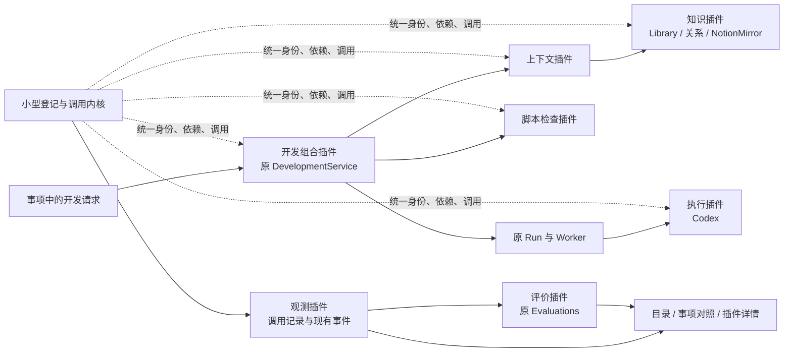

# 阶段 1：让现有开发与知识工作通过同一组插件运行

用户从事项交代一次开发，应该能看清它准备采用什么、真正读取了哪些知识、实际交给谁执行、哪些检查成功，以及结果哪里还没有证据。建设方式是把现有可用开发链、知识阅读修订、Codex 和检查接到同一插件机制，在原页面中连通目录、过程与评价。阶段 1 完成后，同一方法能够用于另一项真实工作，旧任务和知识仍可读取。

本稿是本轮唯一方案草稿；没有修改业务代码或运行数据。用户已明确指定 Notion 规划并授权自主设计、实施，不新增逐阶段人工批准要求。下列工程选择由实施者核验后执行；真实授权缺口和无法观测的行为不得用设计假设填补。

- 顶层依据：[建设计划｜阶段效果、实现拆解与验收](https://app.notion.com/p/3e7af682864481d6a5f3c7f7b8542bc0)，本轮读取的页面最后编辑时间为 2026-09-26 15:35 UTC。
- 下层依据：[开发 Agent 与双入口执行方案](https://app.notion.com/p/3e7af682864481d7b76afd527495e5df)、[Notion 知识入口与 Codex 接入](https://app.notion.com/p/3e7af6828644815ab620f20b9923ef98)。
- 工程位置：`/home/yyh/project/lifeweave`。本轮精读了原有安全修正对应的当前工作树；主任务随后整理提交，交接时重新核对当前 HEAD 为 `d9a7ab5`。实施以该提交为基线，工作树仅有本方案新增文件。
- 成熟度：需求来自已指定规划；以下方案为可实施设计，不能据此称插件和联动已经验证。代码与 API 的当前事实以本轮源码查证为准。

## 1. 用户会得到什么

日常仍然从事项和知识开始，不必先配置一组技术组件。

1. 在“能力与评测”中打开插件目录，看到开发、知识、上下文、Codex 和检查等可用能力，能够展开组成、版本和依赖。已登记、已启用、已配置、可运行和已验证分别显示。
2. 从同一事项发起开发。开始前固定目标、项目提交、所选方法和知识，以及计划中的阶段与能力；实际绑定 Codex 后可以看到其具体版本与选择理由。
3. 过程栏展示真实知识读取、上下文准备、材料发送、执行和检查，展开开发组合可看到子调用。点开知识可读当时正文和来源；刷新页面后身份与历史不变。
4. 结果出来后对照原计划，看到正常完成、条件跳过、失败、额外调用和未观测的步骤。已通过检查不等于用户接受了工作。
5. 从具体步骤反馈回插件版本；在插件详情回看关联任务、评测与改进建议。正常方法、脚本和组合均有适合其职责的检查，第一版不做统一总分。
6. 更新一篇受管知识，看到原文版本、索引与 Notion 发布状态，能在两端读到相同来源版本；后续新任务取得新版本，旧 Run 保留旧输入。

第一阶段须交付一条开发任务和一项知识维护任务的完整证据。已有网页方案、独立审查和隔离实施继续可用；只读分析是组合核验案例，不能成为新产品能力上限。OpenCode 保持当前不可用于正式开发的状态，不作为首条路径的阻塞。

## 2. 现状与复用判断

| 当前事实与源码 | 本轮决定 | 验证责任 |
| --- | --- | --- |
| `src/lifeweave/development.py` 的 `DevelopmentService` 管理方案、独立审查、自检、实施，以及基线/材料变化检查 | 保留状态机与已有 API，变为开发组合插件的业务实现；从内部真正调用共同上下文、执行和检查入口 | 一次正式开发仍通过现有状态约束；新组合不能跳过审查或改写基线 |
| `src/lifeweave_runtime/service.py:create_run` 固定事项、背景、方法、知识、反馈、提示词；`worker.py` 负责租约、隔离工作树、材料物化和执行 | 保留 Run、Worker、重试和取消；抽出独立上下文编译职责；调用实际执行适配器时进入插件边界 | 固定输入、实际发送和执行结果相互能追溯；不增加第二个任务调度器 |
| `src/integrations/task_sources.py` 扫描方法、做文本匹配、固定方法支持文件和知识正文 | 保留文件发现与校验实现；方法成为可登记的插件资产；知识读取经知识插件，上下文调用方不再直接拼装各路正文 | 同一个 Skill 的原 ID 可追到新插件身份；登记与物化不能冒充遵循方法 |
| `src/lifeweave_knowledge/library.py` 管正文、路径边界、指纹和修改候选；正式受管正文在文件中 | 保留唯一正文与修订门槛；知识插件提供这些操作 | 本机知识先看差异再接受；外部项目文件仍在 Git 原处维护 |
| `src/lifeweave_knowledge/links.py` 仅识别同一来源中的 Markdown 出链与反链 | 继续提供导航；增补有明确含义、有证据的基本关系，不把普通超链接直接叫本体 | 能查询“此规则由什么实现/验证”；链接缺失和语义断言分别显示 |
| `src/integrations/notion_mirror.py` 已有全文发布、稳定映射、源指纹、冲突和完整回读检查 | 复用同一发布器，加选定文档操作和知识调用关联；先核验实际授权 | 代码存在不证明后台已连接；交互式 MCP 成功不证明产品后端获授权 |
| `src/lifeweave/evaluations.py` 与 `evaluation_repository.py` 已维护任务、标准、真实 Run、判断、失败历史、改进关系 | 扩展评测目标为插件版本和具体调用，复用原评测事实 | 同一 Run 可分别评价整体、组合与子插件；失败不能被新容易任务覆盖 |
| `MaintenancePage.vue` 同页维护方法、能力候选、评测、执行机与运行；`DevelopmentPanel.vue` 展示开发阶段 | 原“已登记方法”区升级为插件目录，候选仍是插件的改进版本；开发区增加对照，不另建第二个工作台 | 页面和真实调用使用同一注册表和同一版本身份 |

## 3. 总体结构与技术选择

选择在现有 Python 服务内实现有限的登记、依赖验证、版本绑定、调用和生命周期机制，不引入新的常驻 Node 服务或替换 FastAPI/PostgreSQL。它不包含开发状态机、知识算法或模型循环；简单脚本仍在原进程执行。新增实际运行时将是执行插件，已有 Codex/OpenCode 内部循环不重写。

| 选择 | 本轮结论与依据 | 留给实测的边界 |
| --- | --- | --- |
| 直接采用 DeepSeek/Cordis 内核，或保留宿主语言适配共同模型 | 采用后者。DeepSeek 官方架构把服务、事件、可撤销注册交给插件，原生日志与视图共源，值得借鉴；其运行入口仍以 Node/Cordis 为主，Python SDK 包装对应运行时。当前用例没有证明替换已有 Python 业务宿主值得 | 本轮读到公开架构及仓库，未完整审查其源码、运行插件或证明性能更优。未来可以把完整 Harness 当作执行插件比较 |
| 插件发现、详情与状态参考 | 借鉴 QwenPaw 的清晰 manifest、依赖和配置归属。采用内置注册与已登记 Skill 来源，不开放任意远端代码安装和任意前端 JS 装载 | 两个不同实现的实际组合、禁用、版本变化和失败都必须验证 |
| 知识本体和检索 | 采用明确实体引用、少量有依据的关系与来源版本；保留现有可读 Markdown。EvoOntology 提供语义层/版本演进参考，GraphRAG 是后续检索实现选项 | 只对真实项目材料定义够用语义，不预建全量本体、向量数据库或图数据库 |
| 用户能力组织 | 沿用事项、目录、配置入口和实际过程。参考计划中业务预设方向；不因“专家”文案新造一套 Agent 角色体系 | 本轮 WorkBuddy 页面直接读取失败，其闭源行为不作为实施依据 |

参考原文：[DeepSeek 官方说明](https://www.deepseek.com/harness/)、[当前公开架构](https://github.com/deepseek-ai/deepseek-harness/blob/master/docs/architecture.md)、[QwenPaw 插件文档](https://github.com/agentscope-ai/QwenPaw/blob/main/website/public/docs/plugins.en.md)、[EvoOntology](https://github.com/ruc-datalab/EvoOntology)、[GraphRAG](https://microsoft.github.io/graphrag/)。这些是设计输入，不是 LifeWeave 的验收证据。

## 4. 最小插件合同

### 4.1 身份、组成与可用性

内核放在 `src/lifeweave_plugins/`，仅承担共同机制；各插件实现仍放在其当前业务领域，避免把全部代码迁入万能 `plugins/service.py`。启动装配由 `src/api/app.py` 统一完成，worker 加载同一组执行/检查描述，不各自硬编码一个目录。

`PluginDescriptor` 至少包含稳定 `id`、可读 `name/description`、`version`、`implementationDigest`、`operations`、`requires`、`composedOf`、`configurationLink`、`implementationKind`、`executionRequirements`、观测边界和适用检查。展示版本用于沟通，摘要用来识别实际实现，二者不可互相替代。

- `requires` 表示可用操作依赖；`composedOf` 表示此业务组合可能使用的组成；`parentCallId` 表示本次真实父子调用。三种关系不能从彼此自动推断。
- 描述中的 operation 有输入/输出校验、读写副作用和同步/受管执行方式；并不强迫知识读取也建立 Run。
- Skill 声明其执行条件和方法资产版本。`method.bind` 仅表示选中/固定，材料物化和传入执行器另有事件；不能生成“Skill 已正确执行”的虚假成功调用。
- 注册表拒绝重复 ID、未知依赖、循环依赖、操作不匹配和摘要冲突。未知或明确指定但不可用的插件返回可解释失败，不静默替换。
- 按空间保存启用状态；禁用阻止新调用，不删除历史、不终止正在执行的调用。已入队但尚未真正启动的调用重新检查启用与版本，失败保留计划与原因。
- 可运行检查与已验证证据分开。Codex 可执行文件存在不等于账号可调用；已验证只引用特定版本、任务和标准，显示覆盖范围。

### 4.2 调用边界

`PluginRegistry` 管 `register/resolve/describe`；`PluginHost` 管 `invoke` 与子调用上下文；`PluginCallRepository` 持久化调用；`ObservationPlugin` 读取/投影事实，`EvaluationPlugin` 消费事实。不要让 Registry 自己拥有开发或知识业务状态。

`invoke(binding, operation, input, scope)` 的 scope 包含 workspace、item、plan、step、parentCall、可选 Run/assignment，调用前校验绑定，写入真实 start，执行原 handler，写 terminal 和输出引用。错误在同一调用中保存并向原业务层传递。输入输出以必要元数据、摘要、原文/产物引用为主，不复制秘密或完整原生工具输出。

受管异步工作返回 `RunRef` 时只表示已受理；开发组合不得立即记为成功。其最终状态从原 DevelopmentService/Run 终态产生。worker 的真实 `executor.run` 外侧才打开执行插件调用，原生事件附该调用身份；排队不伪装执行已开始。

观测消费事件不再递归调用自己。事件落库所需的底层传输属于共同接入约定；“观测插件自我产生无限 span”没有用户价值。受管执行无法保存必需开始事实时不启动副作用；中途观测失败保留失败边界，不能补造成功。

### 4.3 首批能力映射

以下 ID 是本稿的拟定标识，实施中可以统一调整，但完成后目录和调用必须共用它们。

| 插件 | 操作与实现 | 依赖/消费者 | 首次评价 |
| --- | --- | --- | --- |
| `lifeweave.development` | 创建并推进现有开发组合；包含方法、上下文、运行、检查 | 事项页、CLI；依赖 context、执行能力、checks | 同一真实改进从方案到差异/验证，保持原审查门槛 |
| `lifeweave.context` | `compile` 按任务阶段固定目标、背景、材料、反馈、缺口和编译版本 | development、现有 Runtime 创建；依赖 knowledge、方法资产 | 旧包不随新知识改变；实际发送可核对 |
| `lifeweave.knowledge` | `search/read/relations/propose/decide/publish/status`；封装 Library、KnowledgeLinks、NotionMirror | 知识页、context、知识整理工作 | 全文有版本；来源与关系可追溯；冲突保留；Notion 回读一致 |
| `lifeweave.execution.codex` | 由 worker 调用现有 `CodexExecutor.run` | 需要完整工具循环的工作；由实际配置提供模型 | 真任务成功，原生事件与输出关联正确 |
| `lifeweave.execution.opencode` | 登记已有适配器及当前不可用于开发的原因 | 暂无正式开发新消费者 | 本轮不追求启用；原反例不能被抹除 |
| `lifeweave.checks.repository` | 执行已有只读工作树/基线/材料核验；返回具体检查和证据引用 | development 阶段推进；脚本型插件 | 正常基线通过，修改只读树和材料变更均失败 |
| `lifeweave.observation` | 读取真实调用和原生事件，产生计划/实际对照 | 事项过程、插件详情、evaluation | 注入缺事件时显示未观测；禁止凭计划推定调用 |
| `lifeweave.evaluation` | 扩展现有 Evaluations，定位版本/调用并连接反馈 | 目录详情、事项与维护页 | 进程成功但必要约束失败时不能判任务通过 |
| `lifeweave.method.<legacy-id>` | 原 Skill 资产的描述和绑定；保留 legacy ID、文件哈希与执行要求 | development/context；完整执行由已绑定执行器承载 | 分开判断已绑定、已物化、已发送与方法效果 |

首版不把模型 API 伪装成完整代码执行器；需要接入时作为独立执行能力登记。工作管理等未迁移领域显式标注覆盖边界，不在目录中虚称所有功能都已归一。

## 5. 真实调用如何接进已有链路

### 5.1 开发与上下文

1. 既有 `/development/assignments` 接受相同参数，先冻结适用计划与具体绑定，再由开发插件调用 `DevelopmentService.create`。只讨论/只读模式不得借此隐式进入实施。
2. `DevelopmentService._stage_run` 仍决定当前阶段；向 `Runtime.create_run` 传递明确 phase 与 plan/parent 调用身份。
3. 将 `create_run` 中背景、来源、反馈与提示词准备收敛为 `ContextCompiler.compile`；编译器经知识插件读取选定全文，使用 TaskSources 的方法文件校验。不能保留旁路直接读取正文后仅手工补一条“knowledge 已调用”。
4. `ContextPack` 包含目标、阶段、背景身份、项目基线、约束、实际正文/来源版本、选择理由、缺口/冲突、方法资产及编译器版本。首版复用 Run 现有 snapshot 列保存正文，增加不可变包身份、摘要与编译元数据；无需另建第二套正文库。
5. Worker 继续 `_materialize_capabilities`，记录 pack 摘要、材料实际路径和提示词摘要；执行器调用开始记录已发送输入。只有原生事件能支持实际补读，缺事件时不推断模型已经读完或遵循。
6. Worker 经固定执行插件调用旧 executor，provider 分支归入执行适配器选择。阶段完成时由脚本检查插件核验基线、只读树、方法和知识版本，再由原状态机决定推进。
7. 结果、Git 差异、证据与用户接受仍使用原入口。重试生成新 Run/新调用，引用前次尝试；不能覆盖原计划和失败事件。

业务检查错误可由插件分类，但是否允许实施属于 DevelopmentService，不能交给观测页面判断。

### 5.2 计划、绑定、实际与评价

计划在执行前写入，含有序阶段、每阶段目的、需要的能力/明确插件约束、必要性、条件及验收标准。具体选择另存绑定快照，记录插件版本/摘要、模型、方法、选择理由和用户是否锁定。

调整计划产生后继版本，保留 reason、前版和生效点；不能编辑旧计划来消除偏差。首版不必支持任意可视化编排器，现有开发组合模板足够表达条件：独立审阅或自检、只有审阅通过才实施。

| 对照结果 | 有效证据 | 页面含义 |
| --- | --- | --- |
| 待执行 | 计划已固定，调用尚未到启动时机 | 尚未开始，不判失败 |
| 已发生 | 存在真实 start/terminal，版本与绑定一致 | 可展开输入引用、输出和过程 |
| 条件未触发 | 原计划包含条件，实际记录条件值及跳过原因 | 合理跳过，不补成功调用 |
| 绑定偏差 | 真实调用的版本/实现不同于当次绑定 | 显示具体差异；必要约束失败 |
| 额外调用 | 有真实调用，但无计划 step 匹配 | 显示来自谁、用途及调整依据 |
| 未观测 | 覆盖不足或记录缺口，无法证明是否调用 | 不转换为“未执行”或“已完成” |
| 约束失败 | 实际检查或充分观测证明必要步骤/约束未满足 | 最终成果成功也保留失败 |

首版观测覆盖是平台受管调用边界与执行器已公开事件。第三方内部隐藏调用、未绑定本机 Codex 和任意 shell 旁路不保证自动发现；页面显示这些范围。不得依据模型总结重新生成工具事实。

## 6. 知识维护与 Notion 的最小落地

### 6.1 一份正文与基本语义

当前项目清单 `docs/current-sources.json` 和 `.runtime/knowledge/{space}` 继续决定可读正文。Git 文档仍在 Git 修订；本机受管知识沿 Library 候选、差异、接受流程。知识插件不批量迁移历史文件，不在数据库存另一份正式正文。

基本语义先覆盖本次开发有关的实际文档和组件，采用一个与项目文档同仓维护的关系清单，例如 `docs/knowledge-relations.yaml`。它只保存实体标识、类型、已有正文/源码定位，以及带 evidenceRef 的语义断言，不复制正文。至少定义以下有解释的关系：

- `describes`：文档描述某个真实组件或工作流程。
- `dependsOn`：组件完成其责任实际依赖另一组件，需有源码/设计依据。
- `verifiedBy`：一个有范围的行为由对应证据验证，不表示整篇文档永远正确。

实体类型和每种关系允许的端点在同一清单声明并校验。展示关系时同时显示证据与版本；普通 Markdown `references` 继续属于导航，不自动转为这些语义。先选项目架构、开发说明、上下文/知识组件和本轮证据完成一次真实查询；第二任务复用同一关系，不靠空图验收。索引是可重建结果，原文与显式断言是唯一来源。

若实施时选择内嵌文档元数据代替关系清单，须保持同一来源和验证语义，并统一解析/展示；不要同时维护两处重复关系事实。

### 6.2 发布和版本再用

在知识页增加“发布此文档到 Notion”和查看镜像状态，调用 `KnowledgePublisher.publish_document(sourceId, path, expectedVersion)`，内部复用 NotionMirror。当前整库同步按钮只遍历已选当前清单并调用同一发布组件。同步真实步骤为读取源版本 → 检查远端基准 → 转换完整正文/链接 → 写同一远端页 → 回读核对 → 保存确认。

特别注意现有引用有两种：Library 是 `lifeweave-project:<path>`，Mirror 状态是 `project:<path>`。首版使用显式 alias 映射保留既有 `pageId`，不能因统一命名重新创建同名 Notion 页面。修改正文后的版本复用原页；同名无映射、远端人工改动、回读截断或未知块均保留失败/冲突。

对选择的项目文档做真实双端核验，同时检查相对链接与至少一个本轮确实需要的资产。无图片的文档不需要为了凑检查制造图片；涉及真实图片则不能只证明 Markdown 字符串相等。

本轮引用的 Notion 原生规划仍由原页正式维护。可以保存带页面身份、读取时间和版本的只读采用快照供任务使用；不把其复制页变成 Git 权威，也不让 Git 发布器覆盖原页。离线快照必须标最后读取时间，不能标为实时。

后端 Notion 集成凭据与根页共享状态须用现有设置/只读探针核验，不读取或导出交互式 OAuth 凭据。若后台权限确实缺失，继续完成全部本地能力并显示“未配置”；手工 MCP 写入可以是本轮交付文档归档，不能记为产品自动同步通过。补授权是实际外部前置，不可伪装阶段 1 的这项验收已完成。

## 7. 数据、接口与页面施工清单

### 7.1 最小持久化选择

内置插件描述随代码提交；方法版本来自现有正文和支持文件摘要。启用设置按空间以受控原子文件或现有配置方式保存，不把凭据复制到 manifest。

新增两类具有独立数量与查询责任的数据：不可变 `plugin_plan` 与 `plugin_call`。前者以 workspace/item/assignment/可选 Run 定位，保存计划版本、绑定、前版与调整原因；后者有 parent/plan/step、插件身份与固定摘要、operation、Run/assignment、生命周期、输入输出引用、error 和观测来源。索引覆盖空间+插件版本+时间、事项+时间、parent 和 Run。正文仍引用已有 Run snapshot 和产物，不复制大对象。

原生工具事件继续落原 run_event；插件调用事实在 plugin_call，二者通过 callId/eventRef 关联。观测页做读取投影，不保存第二套业务 Run 状态。任务建立时的上下文调用可能早于 Run 行存在，必须能挂在同一 item/assignment/plan 下，之后只追加 run 关联，不能用不存在的 Run FK 强塞或漏掉这段真实过程。

调用 start 与 terminal 有请求/事件身份去重，完成状态不能被重复迟到事件改回运行中；进程崩溃留下未结束调用，可显示中断/未观测。plan 与业务创建须事务一致；外部执行不能塞在长期数据库事务中。

扩展现有 evaluation 目标字段为 `pluginId/pluginVersion/invocationId`，保留 system/capability 兼容行为。当前 `run_id UNIQUE` 会阻止同一 Run 对父/子插件分别评价，迁移为适合显式评测记录身份的约束；不要用伪造额外 Run 规避。插件过程检查可以没有模型 Run，使用真实 invocation 及检查结果为证据；现有“能力发布必须有人工接受的证据”仍保留，不因脚本 pass 自动发布。

### 7.2 所有被消费的接口

以下路径均相对 `/api/lifeweave/{workspace}`；标为新增的是目标方案，不声称已经存在。内部 operation 用相同插件身份，HTTP 仍按用户动作命名，不提供可执行任意插件/任意 shell 的通用 POST 入口。

| 用例 / 接口 | owner 与输入 | 输出 | 失败方式与消费者 |
| --- | --- | --- | --- |
| 新增 `GET /plugins`、`GET /plugins/{id}` | PluginRegistry；空间、过滤/分页 | 当前描述、组成、操作、状态、验证摘要和配置入口 | 未知 ID 404；单插件不可用仍返回原因；维护页 |
| 新增 `PUT /plugins/{id}/enabled` | 插件配置；目标状态、期望配置版本 | 更新状态与依赖影响 | 版本冲突 409；不得终止已运行调用；插件详情 |
| 新增 `GET /plugins/{id}/calls` | PluginCallRepository；版本、分页 | 实际使用历史、事项/Run/调用链接 | 严格空间范围；插件详情 |
| 新增 `GET /items/{itemId}/plugin-process` | ObservationPlugin；事项与可选 assignment | 原计划、调整历史、绑定、调用树、检查与观测范围 | 不存在 404；范围不足显式返回；DevelopmentPanel/事项 |
| 新增 `GET /plugin-calls/{id}` | ObservationPlugin；调用 ID | 固定输入输出引用、状态、子调用、原生事件引用 | 跨空间不可读；调用详情 |
| 既有开发 choices/list/create/get/cancel/diff | DevelopmentService；原请求，附插件绑定/计划约束 | 原 assignment 和 Run 引用，增 plan/rootCall 身份 | 保留已有授权、基线、只读与审阅检查；开发页、CLI |
| 内部 `ContextCompiler.compile` | 上下文插件；item、phase、source/method 选择、基线与父调用 | 不可变 ContextPack，与现有 snapshot 兼容 | 必要源读取失败整体失败，选用缺口明确；Runtime.create_run |
| 内部 `ExecutionPlugin.run` | worker；固定 executor 绑定、ExecutorRequest 与 event callback | 原 ExecutorResult 与调用身份 | 版本失配/不可用/进程失败可追溯；worker |
| 内部 `RepositoryChecks.verify` | 检查插件；真实目录、基线、固定材料与适用条件 | 每个检查结论与依据 | 无依据不能 pass；DevelopmentService |
| 既有 library sources/documents/document/revisions/decision/links | 知识插件；沿原请求和边界 | 同一正文、版本、候选、差异与链接；可附调用身份 | 保留外部只读、来源冲突、路径限制；知识页、CLI、context |
| 新增 `GET /library/relations` | 知识关系 owner；source/ref、relation type | 有类型实体/关系、证据和来源版本 | 非法断言和断引用显式列出，不能假造边；知识页、context |
| 新增 `POST /library/publish` | KnowledgePublisher；sourceId/path/expectedVersion | 本地源版本、稳定 pageId、发布/回读结果 | 未配置、源变化、远端冲突分开；知识页 |
| 既有 Notion settings/status/sync | NotionMirror；配置或当前清单 | 同一发布器的配置与逐篇状态 | 秘密不返回，失败保留本地文档；设置页、knowledge |
| 扩展既有 evaluations/create/get/list/assess/improvement | Evaluations；插件版本、可选 invocation、任务与固定标准 | 原评测与改进记录，反链插件/调用 | 错误空间/身份/证据拒绝；同 Run 多目标允许；评测页/详情 |
| 新增 `GET /plugins/{id}/evaluations` | Evaluations 查询；版本、分页 | 同一评测表的使用效果与失败历史 | 不维护新评分表；插件详情 |
| 既有运行详情、事件、产物读取 | Runtime/Repository；原 ID 和分页 | 原始实际运行事实，附插件 callId | 未覆盖事件保持边界；RunTrace、事项过程 |
| 前端对照呈现，无新增后端算法 | 原组件消费 plugin-process | 可展开阶段/子调用、源正文和原生事件链接 | 不依据空列表判定未调用；刷新后保持同一身份 |

评测既要支持对已经发生的调用评价，也要沿同标准启动新尝试。对既有 invocation 创建评测时，服务校验归属、固定版本与终态，绑定其真实 Run（若有）并进入可判断状态；不再调用旧 `start` 去制造一次新运行。沿同标准再评才产生新调用/Run。首版由后台校验插件版本与调用一致、检查结果来源，以及必要过程约束；人工业务质量判断不转为模型自评分。

### 7.3 页面安排

“能力与评测”保留单一入口：原方法列表升级为插件目录，插件详情显示组成、可用性、版本、使用任务、评价和改进。原候选区逐步按稳定 pluginId 归属；历史无法自动对应者标记旧候选，不凭名称强行合并。

事项开发区优先显示当前阶段与成果，其下用可折叠表格对照计划、选择、实际、验证。点击实际调用才展开元数据，用户无需先理解 span 或 schema。原 RunTrace 继续显示原生事件，计划条目不得混入原生事件列表。知识页在当前阅读文档旁显示来源版本、语义关系和发布状态，配置仍使用原设置入口。

## 8. 迁移、切换与回退

采用一次可验收的增量切换：注册已有实现 → 将开发路径实际调用切到 Host → 页面使用共同注册表/调用 → 扩展知识和评价 → 真实复用。不是只给旧入口补装饰性日志。

- 不重命名、清空或搬迁现有 item、Run、assignment、知识修订和评测主键；新增关联与字段采用向后兼容迁移。
- 历史 Run 没有插件过程的，显示“此版本尚未采集”；可以展示旧阶段证据，但不得从旧结果推导当时调用树。
- 方法旧 ID 显式映射到插件 ID；保持已有选择和历史材料可读。新目录不再另调 `listMethods` 维护一套重复列表，方法发现只作为注册表输入。
- TaskSources 中直接读取知识的目标调用者迁到知识插件；Runtime 上下文拼装收敛为 ContextCompiler；worker 直接 executor 分支归入适配器。迁移完成后删除新主链中的旁路，保留业务 API 兼容。
- Notion 状态 key 兼容旧映射；先对账 pageId 和源版本再写，不以删除状态重做同步。
- 暂停/禁用不删除历史；代码回退可以恢复旧入口，新增表和历史记录保留只读。受管同步冲突不自动覆盖远端，知识原文仍通过 Git 或 Library 回退。
- 在测试数据库验证 schema 迁移与读旧数据，完成备份后再应用产品库；本稿没有授权删除任何历史数据。

## 9. 实施顺序与验收

以下是依赖顺序，不虚构工期，也不是八个新业务系统。每步产物包括可用代码、入口和实际结果。

| 次序 | 实际交付 | 进入下一步的证据 |
| --- | --- | --- |
| A | 登记/绑定/调用合同，首批真实实现映射及持久化；目录 API | 一个 Python 脚本检查与一个真实执行适配器共用调用机制；循环依赖、禁用和版本失配可解释失败 |
| B | 已有开发链通过 context→knowledge 与 execution/checks，固定 ContextPack | 一项真实只读分析可回看正文版本、实际 Codex 调用与脚本检查；改动能力仍保留 |
| C | 目录详情、事项对照、已有评测扩展 | 页面刷新后历史一致；插件→事项→调用→评价→改进反向可达；负例不被显示成成功 |
| D | 真实基本语义关系、选定知识维护与 Notion 同源发布 | 完成维护后两端全文/版本一致；下一任务取得新版本，前次输入不变；未授权不能冒认 |
| E | 使用新组合交付一个真实产品小改进，复用到第二任务 | 方案、相称审查、代码差异、验证和知识变化可查；不同任务无需改内核 |

推荐真实开发用例：以本次插件页面/知识页面中的一个已确认小缺口作为新事项，经已接通开发组合形成方案、审查并实施，最后用浏览器核查。引导阶段代码允许由当前授权会话落地，但新链打通后必须真实自用一次；不能在最终报告只展示本机 Agent 的外部总结。

推荐真实知识任务：整理“开发任务如何取得当前项目知识并核对实际调用”的使用说明，引用当前架构与本轮运行证据；经现有知识修订或正式 Git 文档路径保存，再从目录查询、发布、回读，第二项分析显式选入它。不要用无业务含义的 hello-world 文档代替真实知识维护。

必须保留的验证反例：

1. 禁用已绑定执行插件后启动，明确失败且不改用其他执行器。
2. 编译后修改知识或方法，旧输入不变；按现有开发规则阻止旧方案继续实施。
3. 只读阶段留下忽略文件或改动工作树，脚本检查失败且原开发状态机不推进。
4. 只存在计划，没有事件，页面显示待执行或未观测；只有确认终态及覆盖才判断必要调用缺失。
5. 执行返回成功但必要检查失败，保留运行成功与工作不合格的区别。
6. 同一运行分别评价组合和子插件，失败可追到正确插件版本，不能被总体通过覆盖。
7. 知识修订发生版本冲突或 Notion 被人工改动，保留原文/远端并显示明确冲突。
8. 重新打开页面、重启服务或从 CLI 读同一事项，仍能回到同一计划和调用；本机原生会话观测只声明已支持的范围。

实施验证以独立测试库的 API、真实 Codex Run、实际 Git 差异、浏览器操作、Notion 回读为主，补合同/错误分支测试。必须记录当前提交、输入版本、实际结果和局限；单元测试通过不能替代真实连接，LLM 返回成功不能替代产品验收。

## 10. 仍需验证的事实与停止扩建条件

当前无须用户重新决定顶层方向或批准普通可逆实施。以下是实施者必须核实的事实：

- 产品后端 Notion 集成是否已有可用凭据和根页权限；若没有，联动验收保留缺口，不占用整晚去修已经可用的交互式连接。
- 当前服务与 worker 实际使用的提交、Codex 身份/模型，以及受管事件范围；不能只依据二进制 health 声明整个链可运行。
- 当前完整提示词与材料物化身份能否对应到同一包；若旧输入重复拼装，按本稿收敛后用实测核对。
- 少量项目实体及关系能否帮助第二项实际任务定位证据；若只是图形装饰，先修关系和阅读入口，不加复杂 GraphRAG。
- 评测目标迁移是否保留旧发布门槛、再评链和跨空间隔离；不可因增加插件类型削弱原验收。

阶段 1 的完成声明必须逐项对应真实目录、真实调用、真实知识复用、基本评价及同源阅读。只完成合同/页面时报告相应部分；Notion 未获产品授权时保留该项未完成。后续自动优化、任意动态安装、多运行时无损续跑、多用户权限和全量知识迁移不进入本轮实现。
